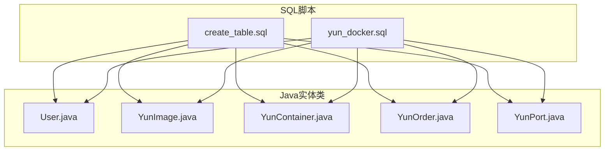
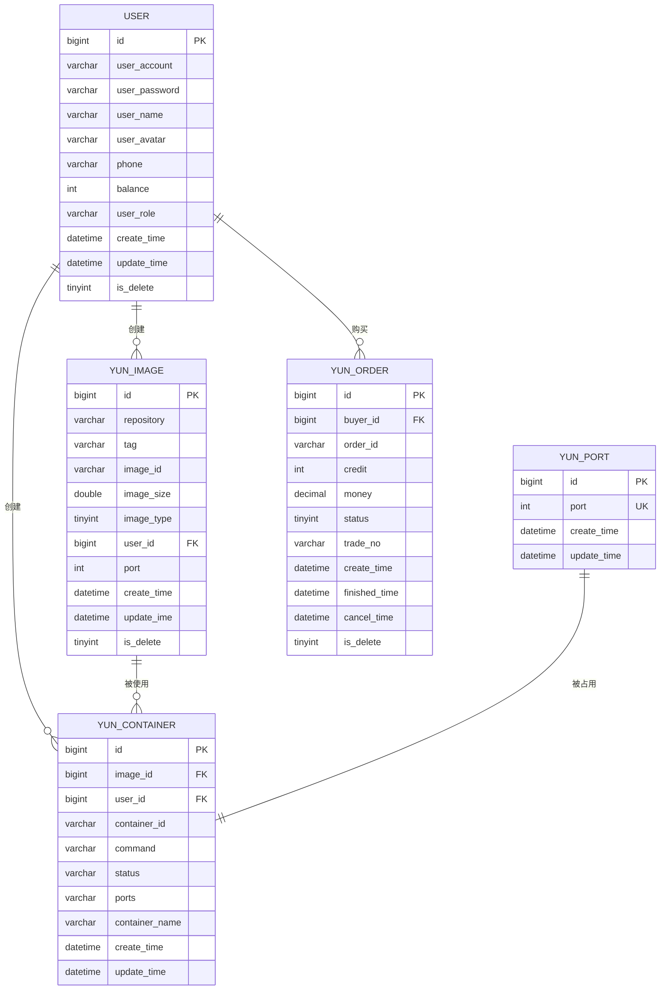
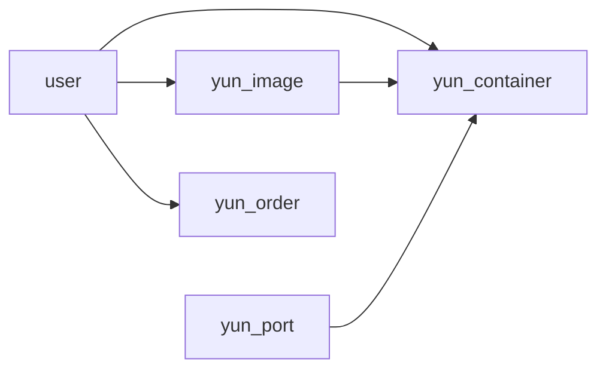

# 数据库表结构

<cite>
**本文引用的文件**
- [sql/create_table.sql](file://sql/create_table.sql)
- [sql/yun_docker.sql](file://sql/yun_docker.sql)
- [yun-docker-master/src/main/java/com/lfc/yundocker/common/model/entity/User.java](file://yun-docker-master/src/main/java/com/lfc/yundocker/common/model/entity/User.java)
- [yun-docker-master/src/main/java/com/lfc/yundocker/common/model/entity/YunImage.java](file://yun-docker-master/src/main/java/com/lfc/yundocker/common/model/entity/YunImage.java)
- [yun-docker-master/src/main/java/com/lfc/yundocker/common/model/entity/YunContainer.java](file://yun-docker-master/src/main/java/com/lfc/yundocker/common/model/entity/YunContainer.java)
- [yun-docker-master/src/main/java/com/lfc/yundocker/common/model/entity/YunOrder.java](file://yun-docker-master/src/main/java/com/lfc/yundocker/common/model/entity/YunOrder.java)
- [yun-docker-master/src/main/java/com/lfc/yundocker/common/model/entity/YunPort.java](file://yun-docker-master/src/main/java/com/lfc/yundocker/common/model/entity/YunPort.java)
- [yun-docker-common/src/main/java/com/lfc/yundocker/common/constant/CtrStatusConstant.java](file://yun-docker-common/src/main/java/com/lfc/yundocker/common/constant/CtrStatusConstant.java)
- [yun-docker-common/src/main/java/com/lfc/yundocker/common/constant/UserConstant.java](file://yun-docker-common/src/main/java/com/lfc/yundocker/common/constant/UserConstant.java)
</cite>

## 目录
1. [简介](#简介)
2. [项目结构](#项目结构)
3. [核心组件](#核心组件)
4. [架构总览](#架构总览)
5. [详细组件分析](#详细组件分析)
6. [依赖关系分析](#依赖关系分析)
7. [性能考量](#性能考量)
8. [故障排查指南](#故障排查指南)
9. [结论](#结论)

## 简介
本文件基于仓库中的 SQL 初始化脚本与实体类，系统性梳理并解读 yun-docker-backend 的五张核心表：user、yun_image、yun_container、yun_order、yun_port。内容涵盖每张表的字段定义、数据类型、默认值、约束条件（主键、唯一索引、非空等），并结合业务背景解释字段设计意图，如 user 表的余额字段用于积分余额管理；yun_container 表的 status 字段对应容器生命周期状态；yun_order 表的 status 字段表示订单支付状态机；以及 yun_port 表通过唯一索引确保端口不重复分配。同时给出各表的建表语句摘要与关键索引说明（如 idx_userId）对查询性能的优化作用。

## 项目结构
- 核心建表脚本位于 sql 目录：
  - create_table.sql：包含 user、yun_image、yun_container、yun_port、yun_order 的建表与索引定义
  - yun_docker.sql：包含更完整的表结构定义与索引声明（含唯一索引 port）
- 实体类位于 yun-docker-master 模块的 common/model/entity 下，映射上述五张表，便于后端 ORM 使用。

图表来源
- [sql/create_table.sql](file://sql/create_table.sql#L1-L87)
- [sql/yun_docker.sql](file://sql/yun_docker.sql#L1-L139)
- [yun-docker-master/src/main/java/com/lfc/yundocker/common/model/entity/User.java](file://yun-docker-master/src/main/java/com/lfc/yundocker/common/model/entity/User.java#L1-L79)
- [yun-docker-master/src/main/java/com/lfc/yundocker/common/model/entity/YunImage.java](file://yun-docker-master/src/main/java/com/lfc/yundocker/common/model/entity/YunImage.java#L1-L79)
- [yun-docker-master/src/main/java/com/lfc/yundocker/common/model/entity/YunContainer.java](file://yun-docker-master/src/main/java/com/lfc/yundocker/common/model/entity/YunContainer.java#L1-L79)
- [yun-docker-master/src/main/java/com/lfc/yundocker/common/model/entity/YunOrder.java](file://yun-docker-master/src/main/java/com/lfc/yundocker/common/model/entity/YunOrder.java#L1-L77)
- [yun-docker-master/src/main/java/com/lfc/yundocker/common/model/entity/YunPort.java](file://yun-docker-master/src/main/java/com/lfc/yundocker/common/model/entity/YunPort.java#L1-L45)

章节来源
- [sql/create_table.sql](file://sql/create_table.sql#L1-L87)
- [sql/yun_docker.sql](file://sql/yun_docker.sql#L1-L139)

## 核心组件
本节从数据库层面逐一解析五张核心表的结构与业务含义。

- user 表（用户）
  - 字段与约束
    - id：bigint，自增主键
    - user_account：varchar(50)，非空，唯一性由应用层保证
    - user_password：varchar(512)，非空
    - user_name：varchar(50)，可空
    - user_avatar：varchar(512)，可空
    - phone：varchar(20)，可空
    - balance：int，默认 1000，非空，用于积分余额管理
    - user_role：varchar(256)，默认 "user"，非空，枚举值参考 UserConstant 中的角色常量
    - create_time：datetime，默认 CURRENT_TIMESTAMP，非空
    - update_time：datetime，默认 CURRENT_TIMESTAMP，非空，自动更新
    - is_delete：tinyint，默认 0，非空，逻辑删除标记
  - 业务要点
    - balance 字段用于积分余额管理，初始值为 1000，后续充值或消费会变更
    - user_role 默认为普通用户，支持 admin、ban 等角色
    - is_delete 采用逻辑删除策略，避免物理删除造成的数据丢失
  - 关键索引
    - 未见显式唯一索引；可通过应用层保证 user_account 唯一性

- yun_image 表（镜像）
  - 字段与约束
    - id：bigint，自增主键
    - repository：varchar(256)，非空
    - tag：varchar(256)，默认 "latest"，非空
    - image_id：varchar(256)，可空
    - image_size：double，可空
    - image_type：tinyint，默认 0，非空，0 表示公开镜像，1 表示私有镜像
    - user_id：bigint，可空，关联创建用户
    - port：int，默认 0，可空，对外暴露的端口
    - create_time：datetime，默认 CURRENT_TIMESTAMP，非空
    - update_ime：datetime，默认 CURRENT_TIMESTAMP，非空，自动更新
    - is_delete：tinyint，默认 0，非空，逻辑删除
    - idx_userId：普通索引，加速按 user_id 查询
  - 业务要点
    - image_type 决定镜像可见范围；port 字段记录该镜像对外暴露的端口，便于容器启动时绑定
    - idx_userId 提升按用户维度检索镜像的效率

- yun_container 表（容器）
  - 字段与约束
    - id：bigint，自增主键
    - image_id：bigint，非空，关联镜像
    - user_id：bigint，非空，关联创建用户
    - container_id：varchar(256)，非空，容器唯一标识
    - command：varchar(256)，可空
    - status：varchar(20)，可空，容器生命周期状态（exited、running、paused、restarting）
    - ports：varchar(64)，可空，容器端口映射字符串
    - container_name：varchar(256)，可空，容器名称
    - create_time：datetime，默认 CURRENT_TIMESTAMP，非空
    - update_time：datetime，默认 CURRENT_TIMESTAMP，非空，自动更新
    - idx_postId(image_id)：普通索引
    - idx_userId(user_id)：普通索引
  - 业务要点
    - status 字段对应容器生命周期状态，具体取值参考 CtrStatusConstant 常量
    - idx_postId 和 idx_userId 分别提升按镜像与用户维度的查询性能

- yun_port 表（端口）
  - 字段与约束
    - id：bigint，自增主键
    - port：int，唯一约束，非空
    - create_time：datetime，默认 CURRENT_TIMESTAMP，非空
    - update_time：datetime，默认 CURRENT_TIMESTAMP，非空，自动更新
  - 业务要点
    - 通过唯一索引确保端口不重复分配，避免端口冲突
    - 该表通常与 yun_container 或 yun_image 的端口字段配合使用，实现端口资源的统一管理

- yun_order 表（订单）
  - 字段与约束
    - id：bigint，自增主键
    - buyer_id：bigint，非空，购买者用户 ID
    - order_id：varchar(64)，非空，订单编号
    - credit：int，非空，充值积分数量
    - money：decimal(10,2)，非空，支付金额（元）
    - status：tinyint，默认 0，非空，订单状态机：0-待支付、1-支付成功、2-支付失败、3-已取消
    - trade_no：varchar(64)，可空，支付宝交易号
    - create_time：datetime，默认 CURRENT_TIMESTAMP，非空
    - finished_time：datetime，可空，完成时间
    - cancel_time：datetime，可空，取消时间
    - is_delete：tinyint，默认 0，非空，逻辑删除
  - 业务要点
    - status 字段构成订单支付状态机，贯穿从下单到完成/取消的全生命周期
    - credit 与 money 对应充值积分与金额，用于用户余额变动与财务对账

章节来源
- [sql/create_table.sql](file://sql/create_table.sql#L10-L82)
- [sql/yun_docker.sql](file://sql/yun_docker.sql#L20-L132)
- [yun-docker-common/src/main/java/com/lfc/yundocker/common/constant/CtrStatusConstant.java](file://yun-docker-common/src/main/java/com/lfc/yundocker/common/constant/CtrStatusConstant.java#L1-L30)
- [yun-docker-common/src/main/java/com/lfc/yundocker/common/constant/UserConstant.java](file://yun-docker-common/src/main/java/com/lfc/yundocker/common/constant/UserConstant.java#L1-L34)

## 架构总览
下图展示五张核心表之间的关系与典型业务交互路径。

图表来源
- [sql/create_table.sql](file://sql/create_table.sql#L10-L82)
- [sql/yun_docker.sql](file://sql/yun_docker.sql#L20-L132)

## 详细组件分析

### user 表（用户）
- 字段设计与业务含义
  - balance：积分余额字段，初始值 1000，用于积分抵扣或充值场景
  - user_role：用户角色，参考 UserConstant 中的默认角色、管理员角色与封禁角色
  - is_delete：逻辑删除，避免物理删除带来的数据不可恢复
- 建表语句摘要
  - 包含主键 id、非空约束、默认值、时间戳自动更新、逻辑删除字段
- 关键索引
  - 未见显式唯一索引；建议在应用层保证 user_account 唯一性

章节来源
- [sql/create_table.sql](file://sql/create_table.sql#L10-L23)
- [sql/yun_docker.sql](file://sql/yun_docker.sql#L20-L38)
- [yun-docker-common/src/main/java/com/lfc/yundocker/common/constant/UserConstant.java](file://yun-docker-common/src/main/java/com/lfc/yundocker/common/constant/UserConstant.java#L1-L34)
- [yun-docker-master/src/main/java/com/lfc/yundocker/common/model/entity/User.java](file://yun-docker-master/src/main/java/com/lfc/yundocker/common/model/entity/User.java#L1-L79)

### yun_image 表（镜像）
- 字段设计与业务含义
  - image_type：0 公开、1 私有，控制镜像可见范围
  - port：对外暴露端口，便于容器启动时绑定
  - idx_userId：按用户维度检索镜像的常用索引
- 建表语句摘要
  - 主键 id，非空字段，时间戳字段，逻辑删除字段，idx_userId
- 关键索引
  - idx_userId：提升按 user_id 查询镜像的性能

章节来源
- [sql/create_table.sql](file://sql/create_table.sql#L26-L40)
- [sql/yun_docker.sql](file://sql/yun_docker.sql#L72-L90)
- [yun-docker-master/src/main/java/com/lfc/yundocker/common/model/entity/YunImage.java](file://yun-docker-master/src/main/java/com/lfc/yundocker/common/model/entity/YunImage.java#L1-L79)

### yun_container 表（容器）
- 字段设计与业务含义
  - status：容器生命周期状态，取值来自 CtrStatusConstant 常量（exited、running、paused、restarting）
  - ports：容器端口映射字符串，与 yun_port 协作避免端口冲突
  - idx_postId(image_id)、idx_userId(user_id)：分别按镜像与用户维度加速查询
- 建表语句摘要
  - 主键 id，非空字段，时间戳字段，两个普通索引
- 关键索引
  - idx_postId、idx_userId：分别提升按镜像与用户维度的查询性能

章节来源
- [sql/create_table.sql](file://sql/create_table.sql#L42-L58)
- [sql/yun_docker.sql](file://sql/yun_docker.sql#L47-L65)
- [yun-docker-common/src/main/java/com/lfc/yundocker/common/constant/CtrStatusConstant.java](file://yun-docker-common/src/main/java/com/lfc/yundocker/common/constant/CtrStatusConstant.java#L1-L30)
- [yun-docker-master/src/main/java/com/lfc/yundocker/common/model/entity/YunContainer.java](file://yun-docker-master/src/main/java/com/lfc/yundocker/common/model/entity/YunContainer.java#L1-L79)

### yun_port 表（端口）
- 字段设计与业务含义
  - port：唯一索引，确保端口不重复分配，避免容器启动时端口冲突
- 建表语句摘要
  - 主键 id，唯一索引 port，时间戳字段
- 关键索引
  - port UK：唯一索引，保障端口资源唯一性

章节来源
- [sql/create_table.sql](file://sql/create_table.sql#L60-L67)
- [sql/yun_docker.sql](file://sql/yun_docker.sql#L104-L115)
- [yun-docker-master/src/main/java/com/lfc/yundocker/common/model/entity/YunPort.java](file://yun-docker-master/src/main/java/com/lfc/yundocker/common/model/entity/YunPort.java#L1-L45)

### yun_order 表（订单）
- 字段设计与业务含义
  - status：订单支付状态机，0 待支付、1 支付成功、2 支付失败、3 已取消
  - credit 与 money：充值积分数量与金额，用于用户余额变动与财务对账
  - finished_time/cancel_time：记录完成与取消时间，便于统计与审计
- 建表语句摘要
  - 主键 id，非空字段，状态字段默认 0，时间戳字段，逻辑删除字段
- 关键索引
  - 未见显式索引；建议按 buyer_id、order_id、status 等高频查询字段建立索引

章节来源
- [sql/create_table.sql](file://sql/create_table.sql#L68-L82)
- [sql/yun_docker.sql](file://sql/yun_docker.sql#L118-L132)
- [yun-docker-master/src/main/java/com/lfc/yundocker/common/model/entity/YunOrder.java](file://yun-docker-master/src/main/java/com/lfc/yundocker/common/model/entity/YunOrder.java#L1-L77)

## 依赖关系分析
- 外键关系
  - yun_container.image_id → yun_image.id
  - yun_container.user_id → user.id
  - yun_image.user_id → user.id
  - yun_order.buyer_id → user.id
  - yun_port.port 与 yun_container.ports 协同，避免端口冲突
- 索引与查询优化
  - idx_userId 在 yun_image、yun_container 上存在，用于按用户维度快速检索
  - yun_port.port 为唯一索引，保障端口唯一性
  - yun_order 缺少常见查询索引，建议补充

图表来源
- [sql/create_table.sql](file://sql/create_table.sql#L10-L82)
- [sql/yun_docker.sql](file://sql/yun_docker.sql#L20-L132)

章节来源
- [sql/create_table.sql](file://sql/create_table.sql#L10-L82)
- [sql/yun_docker.sql](file://sql/yun_docker.sql#L20-L132)

## 性能考量
- 索引策略
  - yun_image 与 yun_container 的 idx_userId 显著提升按用户维度的查询性能
  - yun_port 的 port 唯一索引确保端口分配的唯一性，避免冲突导致的回滚与重试成本
- 建议
  - 为 yun_order 增加 buyer_id、order_id、status 等常用查询字段的索引，以优化订单查询与状态统计
  - 对 yun_container 的 status 字段建立索引，便于按状态筛选容器
- 时间字段
  - 所有表均包含 create_time 与 update_time，便于审计与排序；注意在高并发写入场景下，合理设置时钟同步与索引维护策略

[本节为通用性能建议，不直接分析具体文件，故无章节来源]

## 故障排查指南
- 端口冲突
  - 现象：容器启动时报端口已被占用
  - 排查：检查 yun_port 表中是否存在重复 port 记录；确认 yun_container.ports 与 yun_port.port 的一致性
- 订单状态异常
  - 现象：订单状态未按预期流转
  - 排查：核对 yun_order.status 的状态机定义（待支付、支付成功、支付失败、已取消），并检查 finished_time/cancel_time 是否正确更新
- 用户余额异常
  - 现象：用户余额与充值/消费记录不一致
  - 排查：核对 user.balance 的初始值与业务变更逻辑，确认充值/消费操作与 yun_order 的 credit/money 对应关系
- 容器状态不一致
  - 现象：容器实际状态与 status 不符
  - 排查：核对 CtrStatusConstant 中的状态取值，确保前端/后端状态同步机制正常

章节来源
- [sql/create_table.sql](file://sql/create_table.sql#L60-L82)
- [sql/yun_docker.sql](file://sql/yun_docker.sql#L104-L132)
- [yun-docker-common/src/main/java/com/lfc/yundocker/common/constant/CtrStatusConstant.java](file://yun-docker-common/src/main/java/com/lfc/yundocker/common/constant/CtrStatusConstant.java#L1-L30)
- [yun-docker-common/src/main/java/com/lfc/yundocker/common/constant/UserConstant.java](file://yun-docker-common/src/main/java/com/lfc/yundocker/common/constant/UserConstant.java#L1-L34)

## 结论
本文基于仓库中的 SQL 脚本与实体类，系统梳理了 user、yun_image、yun_container、yun_order、yun_port 五张核心表的字段定义、约束条件与业务含义。重点解释了：
- user 表的 balance 字段用于积分余额管理
- yun_container 表的 status 字段对应容器生命周期状态（exited、running、paused、restarting）
- yun_order 表的 status 字段表示订单支付状态机（待支付、支付成功、支付失败、已取消）
- yun_port 表通过唯一索引确保端口不重复分配

同时给出了各表的建表语句摘要与关键索引说明（如 idx_userId），并提出针对 yun_order 的索引优化建议。以上分析有助于开发与运维人员准确理解表结构与业务逻辑，提升系统稳定性与可维护性。