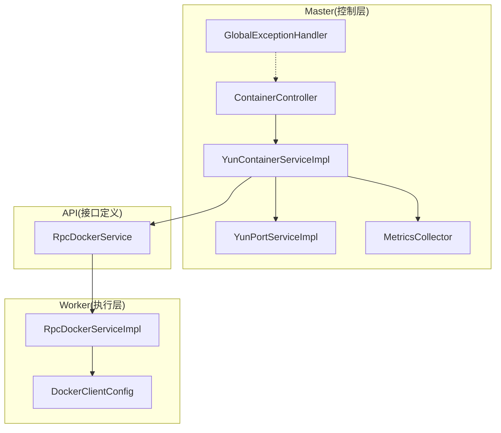
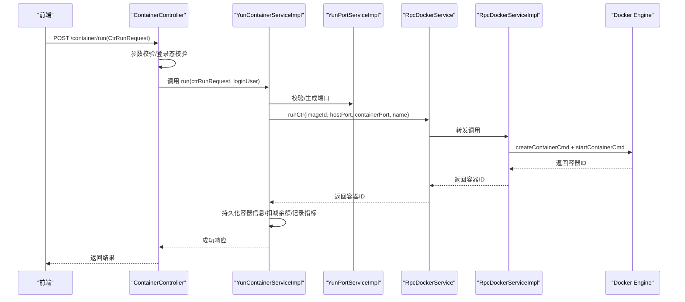
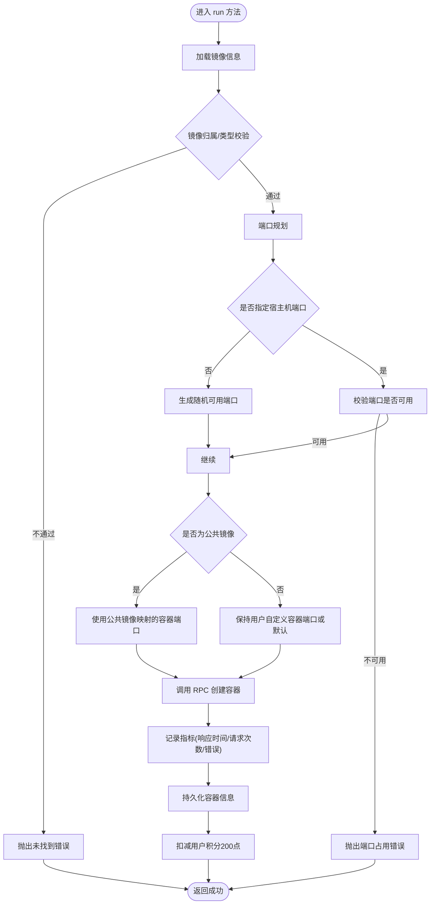
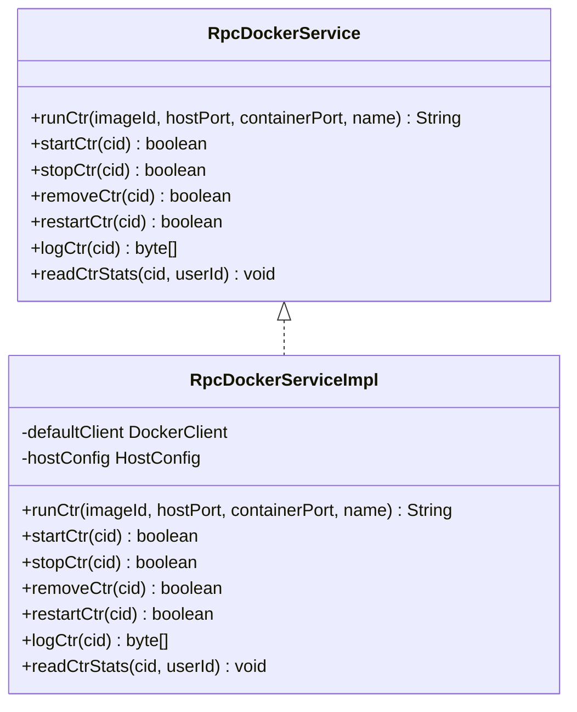
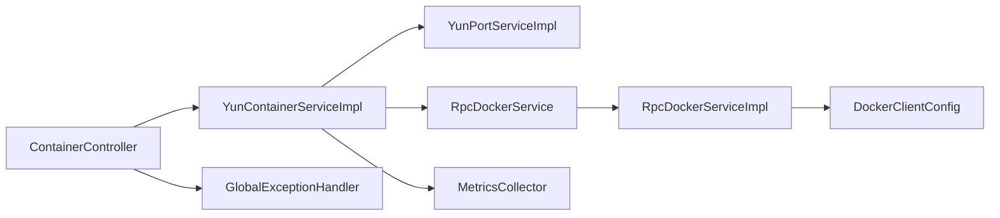

# 容器创建

<cite>
**本文引用的文件**
- [ContainerController.java](file://yun-docker-master/src/main/java/com/lfc/yundocker/controller/ContainerController.java)
- [YunContainerService.java](file://yun-docker-master/src/main/java/com/lfc/yundocker/service/YunContainerService.java)
- [YunContainerServiceImpl.java](file://yun-docker-master/src/main/java/com/lfc/yundocker/service/impl/YunContainerServiceImpl.java)
- [RpcDockerService.java](file://yun-docker-api/src/main/java/com/lfc/yundocker/service/RpcDockerService.java)
- [RpcDockerServiceImpl.java](file://yun-docker-worker/src/main/java/com/lfc/yundocker/worker/rpc/RpcDockerServiceImpl.java)
- [YunPortService.java](file://yun-docker-master/src/main/java/com/lfc/yundocker/service/YunPortService.java)
- [YunPortServiceImpl.java](file://yun-docker-master/src/main/java/com/lfc/yundocker/service/impl/YunPortServiceImpl.java)
- [MetricsCollector.java](file://yun-docker-master/src/main/java/com/lfc/yundocker/monitor/MetricsCollector.java)
- [CtrRunRequest.java](file://yun-docker-common/src/main/java/com/lfc/yundocker/common/model/dto/CtrRunRequest.java)
- [CtrStatusConstant.java](file://yun-docker-common/src/main/java/com/lfc/yundocker/common/constant/CtrStatusConstant.java)
- [GlobalExceptionHandler.java](file://yun-docker-common/src/main/java/com/lfc/yundocker/common/exception/GlobalExceptionHandler.java)
- [BusinessException.java](file://yun-docker-common/src/main/java/com/lfc/yundocker/common/exception/BusinessException.java)
- [UserService.java](file://yun-docker-master/src/main/java/com/lfc/yundocker/service/UserService.java)
- [UserServiceImpl.java](file://yun-docker-master/src/main/java/com/lfc/yundocker/service/impl/UserServiceImpl.java)
- [DockerClientConfig.java](file://yun-docker-worker/src/main/java/com/lfc/yundocker/worker/config/DockerClientConfig.java)
- [application.yml](file://yun-docker-master/src/main/resources/application.yml)
</cite>

## 目录
1. [简介](#简介)
2. [项目结构](#项目结构)
3. [核心组件](#核心组件)
4. [架构总览](#架构总览)
5. [详细组件分析](#详细组件分析)
6. [依赖关系分析](#依赖关系分析)
7. [性能考量](#性能考量)
8. [故障排查指南](#故障排查指南)
9. [结论](#结论)

## 简介
本文件围绕“容器创建”这一核心功能，系统梳理从HTTP请求到Docker执行的完整链路：前端发起REST请求→Controller参数校验与鉴权→业务层执行余额与配额校验、端口分配、数据库状态更新→通过Dubbo RPC调用Worker节点的RpcDockerService接口→Worker侧使用Docker Java API执行容器创建与启动（含端口绑定、内存限制、名称设置）。文档同时给出关键逻辑说明（唯一容器名生成、公共镜像与私有镜像的端口映射差异、扣减用户积分200点）、异常处理策略与回滚思路，并提供端到端时序图与指标采集说明。

## 项目结构
- 控制层：ContainerController 提供容器相关REST接口，包含创建容器的POST /container/run。
- 业务层：YunContainerServiceImpl 实现容器创建的业务流程，负责镜像校验、端口分配、数据库持久化、指标采集与用户余额扣减。
- RPC接口：RpcDockerService 定义Worker侧容器操作契约（runCtr、startCtr、stopCtr、removeCtr等）。
- Worker实现：RpcDockerServiceImpl 使用Docker Java API执行容器run、start、stop、remove等操作，并设置容器名称、端口绑定、内存限制等。
- 端口服务：YunPortServiceImpl 负责公共镜像容器端口映射与随机端口生成及合法性校验。
- 指标采集：MetricsCollector 通过Micrometer记录创建请求次数、响应时间与错误次数。
- 异常处理：GlobalExceptionHandler 统一捕获业务异常并返回标准响应。

图表来源
- [ContainerController.java](file://yun-docker-master/src/main/java/com/lfc/yundocker/controller/ContainerController.java#L117-L133)
- [YunContainerServiceImpl.java](file://yun-docker-master/src/main/java/com/lfc/yundocker/service/impl/YunContainerServiceImpl.java#L136-L215)
- [YunPortServiceImpl.java](file://yun-docker-master/src/main/java/com/lfc/yundocker/service/impl/YunPortServiceImpl.java#L37-L90)
- [MetricsCollector.java](file://yun-docker-master/src/main/java/com/lfc/yundocker/monitor/MetricsCollector.java#L21-L76)
- [RpcDockerService.java](file://yun-docker-api/src/main/java/com/lfc/yundocker/service/RpcDockerService.java#L1-L143)
- [RpcDockerServiceImpl.java](file://yun-docker-worker/src/main/java/com/lfc/yundocker/worker/rpc/RpcDockerServiceImpl.java#L80-L107)
- [DockerClientConfig.java](file://yun-docker-worker/src/main/java/com/lfc/yundocker/worker/config/DockerClientConfig.java#L1-L32)
- [GlobalExceptionHandler.java](file://yun-docker-common/src/main/java/com/lfc/yundocker/common/exception/GlobalExceptionHandler.java#L1-L32)

章节来源
- [application.yml](file://yun-docker-master/src/main/resources/application.yml#L1-L60)

## 核心组件
- ContainerController.run：接收创建容器请求，进行参数校验与登录态校验，检查用户余额后调用业务层执行创建。
- YunContainerServiceImpl.run：镜像合法性校验、端口分配（公共镜像固定容器端口、私有镜像可自定义或随机生成）、调用RPC创建容器、持久化容器信息、扣减用户积分、记录指标。
- RpcDockerServiceImpl.runCtr：使用Docker Java API创建容器并启动，设置容器名称、绑定宿主机与容器端口、限制内存为512MB。
- YunPortServiceImpl：维护公共镜像到容器端口的映射，生成随机端口并校验端口是否已被占用。
- MetricsCollector：基于Micrometer记录创建请求次数、响应时间与错误次数。
- GlobalExceptionHandler：统一捕获业务异常并返回标准错误响应。

章节来源
- [ContainerController.java](file://yun-docker-master/src/main/java/com/lfc/yundocker/controller/ContainerController.java#L117-L133)
- [YunContainerServiceImpl.java](file://yun-docker-master/src/main/java/com/lfc/yundocker/service/impl/YunContainerServiceImpl.java#L136-L215)
- [RpcDockerServiceImpl.java](file://yun-docker-worker/src/main/java/com/lfc/yundocker/worker/rpc/RpcDockerServiceImpl.java#L80-L107)
- [YunPortServiceImpl.java](file://yun-docker-master/src/main/java/com/lfc/yundocker/service/impl/YunPortServiceImpl.java#L37-L90)
- [MetricsCollector.java](file://yun-docker-master/src/main/java/com/lfc/yundocker/monitor/MetricsCollector.java#L21-L76)
- [GlobalExceptionHandler.java](file://yun-docker-common/src/main/java/com/lfc/yundocker/common/exception/GlobalExceptionHandler.java#L1-L32)

## 架构总览
容器创建链路由Master侧Controller→Service→RPC→Worker侧Docker API执行，贯穿鉴权、配额与端口校验、数据库持久化、指标采集与用户余额扣减。

图表来源
- [ContainerController.java](file://yun-docker-master/src/main/java/com/lfc/yundocker/controller/ContainerController.java#L117-L133)
- [YunContainerServiceImpl.java](file://yun-docker-master/src/main/java/com/lfc/yundocker/service/impl/YunContainerServiceImpl.java#L136-L215)
- [YunPortServiceImpl.java](file://yun-docker-master/src/main/java/com/lfc/yundocker/service/impl/YunPortServiceImpl.java#L37-L90)
- [RpcDockerService.java](file://yun-docker-api/src/main/java/com/lfc/yundocker/service/RpcDockerService.java#L1-L143)
- [RpcDockerServiceImpl.java](file://yun-docker-worker/src/main/java/com/lfc/yundocker/worker/rpc/RpcDockerServiceImpl.java#L80-L107)

## 详细组件分析

### 控制层：ContainerController.run
- 功能要点
  - 接收创建容器请求体，进行非空校验。
  - 获取登录用户并校验余额充足后，调用业务层执行创建。
- 关键行为
  - 参数校验与业务异常抛出。
  - 余额不足时直接返回错误响应。
  - 成功后返回“启动容器成功”。

章节来源
- [ContainerController.java](file://yun-docker-master/src/main/java/com/lfc/yundocker/controller/ContainerController.java#L117-L133)

### 业务层：YunContainerServiceImpl.run
- 功能要点
  - 镜像存在性与归属校验（仅允许用户自有镜像或公共镜像）。
  - 端口分配策略：
    - 若未指定宿主机端口，则随机生成可用端口。
    - 若为公共镜像，容器端口采用映射表中的固定值。
  - 调用RPC创建容器，记录指标（响应时间、请求次数、错误次数）。
  - 数据库持久化容器信息（镜像ID、用户ID、容器ID、状态、端口映射、容器名）。
  - 扣减用户积分200点。
- 关键逻辑说明
  - 唯一容器名生成：若未传入name，则基于镜像仓库名+UUID后缀生成短名。
  - 公共镜像与私有镜像端口映射差异：公共镜像强制使用映射表中的容器端口；私有镜像可自定义或随机生成。
  - 指标采集：记录创建请求次数、响应时间与错误次数，便于监控与分析。

图表来源
- [YunContainerServiceImpl.java](file://yun-docker-master/src/main/java/com/lfc/yundocker/service/impl/YunContainerServiceImpl.java#L136-L215)
- [YunPortServiceImpl.java](file://yun-docker-master/src/main/java/com/lfc/yundocker/service/impl/YunPortServiceImpl.java#L37-L90)

章节来源
- [YunContainerServiceImpl.java](file://yun-docker-master/src/main/java/com/lfc/yundocker/service/impl/YunContainerServiceImpl.java#L136-L215)

### 端口服务：YunPortServiceImpl
- 功能要点
  - 公共镜像容器端口映射：内置MySQL、Redis、Kafka、ZooKeeper、Nginx、示例镜像等的容器端口映射。
  - 随机端口生成：在最小最大范围内随机生成端口，循环尝试直到找到未被占用的端口。
  - 端口合法性校验：扫描现有容器的端口映射，提取宿主机端口集合，判断新端口是否冲突。
- 关键行为
  - getPublicContainerPort：根据公共镜像仓库名返回固定容器端口。
  - generatePort：随机生成可用端口。
  - isValidPort：校验端口是否已被占用。

章节来源
- [YunPortServiceImpl.java](file://yun-docker-master/src/main/java/com/lfc/yundocker/service/impl/YunPortServiceImpl.java#L37-L90)

### RPC接口与Worker实现：RpcDockerService 与 RpcDockerServiceImpl
- RpcDockerService.runCtr
  - 输入：镜像ID、宿主机端口、容器端口、容器名称。
  - 输出：容器ID。
- RpcDockerServiceImpl.runCtr
  - 使用Docker Java API创建容器并启动。
  - 设置容器名称、绑定宿主机与容器端口、限制内存为512MB。
  - 返回容器ID。

图表来源
- [RpcDockerService.java](file://yun-docker-api/src/main/java/com/lfc/yundocker/service/RpcDockerService.java#L1-L143)
- [RpcDockerServiceImpl.java](file://yun-docker-worker/src/main/java/com/lfc/yundocker/worker/rpc/RpcDockerServiceImpl.java#L80-L107)

章节来源
- [RpcDockerService.java](file://yun-docker-api/src/main/java/com/lfc/yundocker/service/RpcDockerService.java#L1-L143)
- [RpcDockerServiceImpl.java](file://yun-docker-worker/src/main/java/com/lfc/yundocker/worker/rpc/RpcDockerServiceImpl.java#L80-L107)

### 指标采集：MetricsCollector
- 功能要点
  - 记录镜像创建请求次数（带用户ID与镜像名标签）。
  - 记录镜像创建错误次数（带用户ID、镜像名与错误信息标签）。
  - 记录镜像创建响应时间（带用户ID与镜像名标签）。
- 采集维度
  - user_id、image_name、status/errorMessage。

章节来源
- [MetricsCollector.java](file://yun-docker-master/src/main/java/com/lfc/yundocker/monitor/MetricsCollector.java#L21-L76)

### 用户余额与扣减：UserService 与 UserServiceImpl
- 功能要点
  - hasBalance：校验用户余额是否充足。
  - updateBalance：原子性扣减或返还积分（创建扣200，删除返还200）。
- 关键行为
  - 扣减：updateBalance(-200.0, userId)。
  - 返还：remove/removeAllCtr时返还200点。

章节来源
- [UserService.java](file://yun-docker-master/src/main/java/com/lfc/yundocker/service/UserService.java#L100-L123)
- [UserServiceImpl.java](file://yun-docker-master/src/main/java/com/lfc/yundocker/service/impl/UserServiceImpl.java#L90-L103)

### Docker配置：DockerClientConfig
- 功能要点
  - 通过docker.server.url配置Docker Engine连接地址。
  - 注入DockerClient与HostConfig Bean，供Worker侧使用。

章节来源
- [DockerClientConfig.java](file://yun-docker-worker/src/main/java/com/lfc/yundocker/worker/config/DockerClientConfig.java#L1-L32)

## 依赖关系分析
- 控制层依赖业务层与用户服务，业务层依赖端口服务、RPC接口、指标采集与用户服务。
- RPC接口为Master侧与Worker侧的契约，Worker侧实现使用Docker Java API。
- 异常处理通过全局异常处理器统一返回。

图表来源
- [ContainerController.java](file://yun-docker-master/src/main/java/com/lfc/yundocker/controller/ContainerController.java#L117-L133)
- [YunContainerServiceImpl.java](file://yun-docker-master/src/main/java/com/lfc/yundocker/service/impl/YunContainerServiceImpl.java#L136-L215)
- [YunPortServiceImpl.java](file://yun-docker-master/src/main/java/com/lfc/yundocker/service/impl/YunPortServiceImpl.java#L37-L90)
- [RpcDockerService.java](file://yun-docker-api/src/main/java/com/lfc/yundocker/service/RpcDockerService.java#L1-L143)
- [RpcDockerServiceImpl.java](file://yun-docker-worker/src/main/java/com/lfc/yundocker/worker/rpc/RpcDockerServiceImpl.java#L80-L107)
- [DockerClientConfig.java](file://yun-docker-worker/src/main/java/com/lfc/yundocker/worker/config/DockerClientConfig.java#L1-L32)
- [GlobalExceptionHandler.java](file://yun-docker-common/src/main/java/com/lfc/yundocker/common/exception/GlobalExceptionHandler.java#L1-L32)

## 性能考量
- 端口生成与校验：随机端口生成在可用范围内循环尝试，若端口池耗尽会触发错误提示，建议合理设置端口范围与重试上限。
- 指标采集：使用Micrometer计数器与定时器，避免频繁创建指标实例，已通过缓存键避免重复注册。
- RPC超时：application.yml中consumer.timeout设置为5000ms，建议根据环境调整以平衡吞吐与稳定性。
- Docker操作：容器创建与启动在Worker侧执行，注意Docker Engine的并发能力与资源限制（如内存限制512MB）。

[本节为通用性能讨论，无需列出具体文件来源]

## 故障排查指南
- 镜像不存在或不可访问
  - 现象：业务层抛出未找到错误。
  - 排查：确认镜像ID正确且用户拥有访问权限（公共镜像或自有镜像）。
- 端口冲突
  - 现象：业务层抛出端口占用错误。
  - 排查：检查宿主机端口是否已被占用；公共镜像请使用映射表中的容器端口。
- Docker操作失败
  - 现象：业务层捕获异常并记录错误指标。
  - 排查：查看Worker侧Docker Engine日志；确认镜像拉取与容器创建命令执行情况。
- 用户余额不足
  - 现象：Controller直接拒绝请求。
  - 排查：确认用户账户余额是否足够。
- 异常统一处理
  - 全局异常处理器将BusinessException转换为标准错误响应，便于前端展示。

章节来源
- [YunContainerServiceImpl.java](file://yun-docker-master/src/main/java/com/lfc/yundocker/service/impl/YunContainerServiceImpl.java#L136-L215)
- [YunPortServiceImpl.java](file://yun-docker-master/src/main/java/com/lfc/yundocker/service/impl/YunPortServiceImpl.java#L37-L90)
- [GlobalExceptionHandler.java](file://yun-docker-common/src/main/java/com/lfc/yundocker/common/exception/GlobalExceptionHandler.java#L1-L32)
- [BusinessException.java](file://yun-docker-common/src/main/java/com/lfc/yundocker/common/exception/BusinessException.java#L1-L37)

## 结论
容器创建功能通过清晰的分层设计与契约接口，实现了从前端到Docker Engine的完整链路：Controller负责鉴权与参数校验，Service负责业务规则与指标采集，RPC桥接Master与Worker，Worker侧使用Docker Java API完成容器的实际创建与启动。公共镜像与私有镜像在端口映射上存在差异，业务层通过端口服务与镜像类型判断确保端口分配的正确性；用户余额扣减与指标采集贯穿全流程，便于运营与运维监控。异常处理与统一返回增强了系统的可观测性与用户体验。