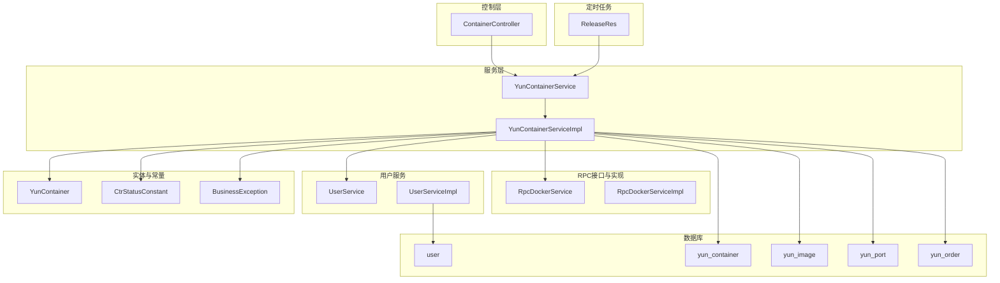
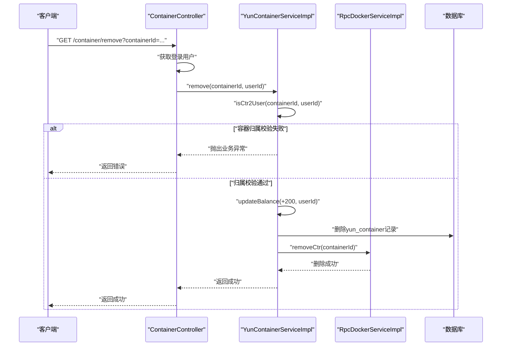
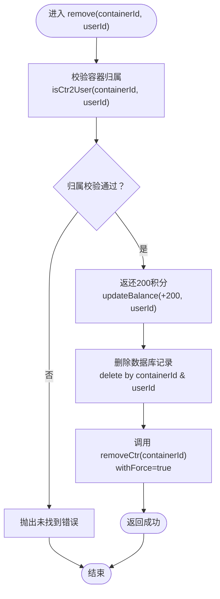
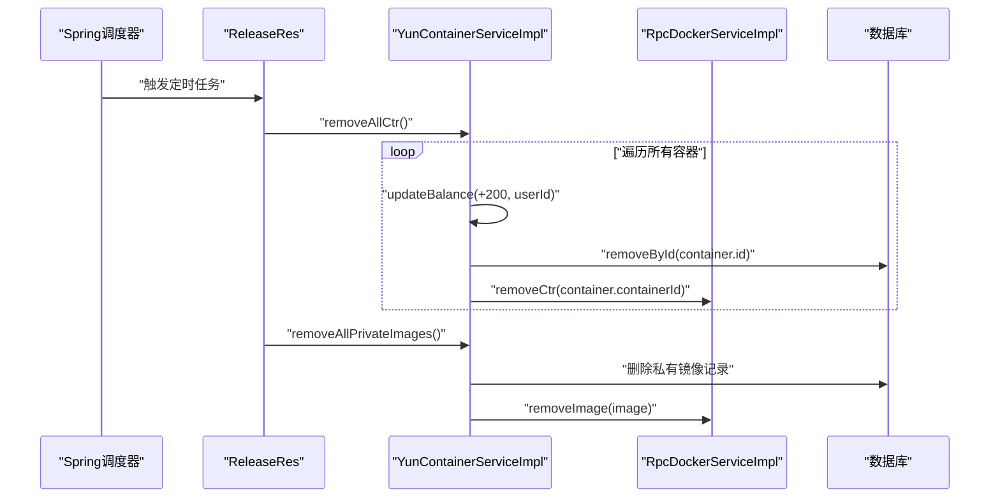
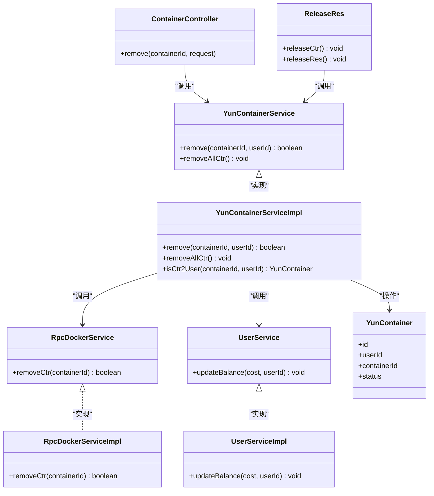
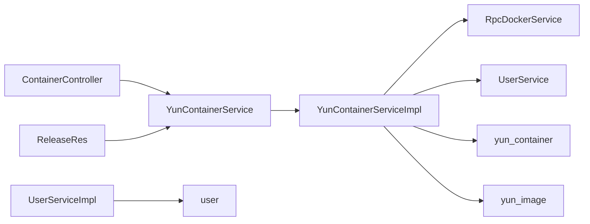
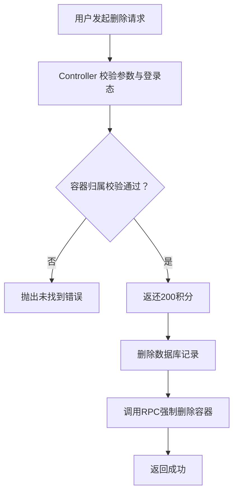

# 容器删除

<cite>
**本文引用的文件**
- [ReleaseRes.java](file://yun-docker-master/src/main/java/com/lfc/yundocker/job/cycle/ReleaseRes.java)
- [YunContainerService.java](file://yun-docker-master/src/main/java/com/lfc/yundocker/service/YunContainerService.java)
- [YunContainerServiceImpl.java](file://yun-docker-master/src/main/java/com/lfc/yundocker/service/impl/YunContainerServiceImpl.java)
- [ContainerController.java](file://yun-docker-master/src/main/java/com/lfc/yundocker/controller/ContainerController.java)
- [RpcDockerService.java](file://yun-docker-api/src/main/java/com/lfc/yundocker/service/RpcDockerService.java)
- [RpcDockerServiceImpl.java](file://yun-docker-worker/src/main/java/com/lfc/yundocker/worker/rpc/RpcDockerServiceImpl.java)
- [UserService.java](file://yun-docker-master/src/main/java/com/lfc/yundocker/service/UserService.java)
- [UserServiceImpl.java](file://yun-docker-master/src/main/java/com/lfc/yundocker/service/impl/UserServiceImpl.java)
- [YunContainer.java](file://yun-docker-master/src/main/java/com/lfc/yundocker/common/model/entity/YunContainer.java)
- [CtrStatusConstant.java](file://yun-docker-common/src/main/java/com/lfc/yundocker/common/constant/CtrStatusConstant.java)
- [BusinessException.java](file://yun-docker-common/src/main/java/com/lfc/yundocker/common/exception/BusinessException.java)
- [create_table.sql](file://sql/create_table.sql)
- [yun_docker.sql](file://sql/yun_docker.sql)
</cite>

## 目录
1. [引言](#引言)
2. [项目结构](#项目结构)
3. [核心组件](#核心组件)
4. [架构总览](#架构总览)
5. [详细组件分析](#详细组件分析)
6. [依赖关系分析](#依赖关系分析)
7. [性能考量](#性能考量)
8. [故障排查指南](#故障排查指南)
9. [结论](#结论)
10. [附录](#附录)

## 引言
本文件围绕“容器删除”功能进行全面解析，覆盖两类场景：
- 用户主动删除：通过HTTP接口触发，调用服务层删除逻辑，随后通过RPC调用Worker节点强制删除容器，并在数据库中更新记录；同时在删除时为用户返还200积分。
- 系统定时清理：通过@Scheduled定时任务在固定时间点批量删除容器与私有镜像，保障资源回收与系统整洁。

文档还梳理了异常处理策略、交互流程与时序图，并给出定时任务配置与执行周期说明。

## 项目结构
- 控制层：ContainerController 提供删除接口
- 服务层：YunContainerService 接口与其实现 YunContainerServiceImpl
- RPC接口：RpcDockerService 定义容器操作契约
- RPC实现：RpcDockerServiceImpl 在Worker侧执行Docker命令
- 用户服务：UserService/Impl 提供余额更新能力
- 定时任务：ReleaseRes 使用@Scheduled按cron表达式调度
- 实体与常量：YunContainer、CtrStatusConstant、BusinessException
- 数据库：user、yun_container、yun_image、yun_port、yun_order

图表来源
- [ContainerController.java](file://yun-docker-master/src/main/java/com/lfc/yundocker/controller/ContainerController.java#L1-L173)
- [YunContainerService.java](file://yun-docker-master/src/main/java/com/lfc/yundocker/service/YunContainerService.java#L1-L41)
- [YunContainerServiceImpl.java](file://yun-docker-master/src/main/java/com/lfc/yundocker/service/impl/YunContainerServiceImpl.java#L1-L318)
- [RpcDockerService.java](file://yun-docker-api/src/main/java/com/lfc/yundocker/service/RpcDockerService.java#L1-L143)
- [RpcDockerServiceImpl.java](file://yun-docker-worker/src/main/java/com/lfc/yundocker/worker/rpc/RpcDockerServiceImpl.java#L1-L440)
- [UserService.java](file://yun-docker-master/src/main/java/com/lfc/yundocker/service/UserService.java#L1-L124)
- [UserServiceImpl.java](file://yun-docker-master/src/main/java/com/lfc/yundocker/service/impl/UserServiceImpl.java#L1-L301)
- [ReleaseRes.java](file://yun-docker-master/src/main/java/com/lfc/yundocker/job/cycle/ReleaseRes.java#L1-L47)
- [YunContainer.java](file://yun-docker-master/src/main/java/com/lfc/yundocker/common/model/entity/YunContainer.java#L1-L79)
- [CtrStatusConstant.java](file://yun-docker-common/src/main/java/com/lfc/yundocker/common/constant/CtrStatusConstant.java#L1-L30)
- [BusinessException.java](file://yun-docker-common/src/main/java/com/lfc/yundocker/common/exception/BusinessException.java#L1-L37)
- [create_table.sql](file://sql/create_table.sql#L1-L87)
- [yun_docker.sql](file://sql/yun_docker.sql#L1-L139)

章节来源
- [ContainerController.java](file://yun-docker-master/src/main/java/com/lfc/yundocker/controller/ContainerController.java#L1-L173)
- [YunContainerServiceImpl.java](file://yun-docker-master/src/main/java/com/lfc/yundocker/service/impl/YunContainerServiceImpl.java#L1-L318)
- [ReleaseRes.java](file://yun-docker-master/src/main/java/com/lfc/yundocker/job/cycle/ReleaseRes.java#L1-L47)
- [create_table.sql](file://sql/create_table.sql#L1-L87)

## 核心组件
- 控制层接口：ContainerController 的删除接口接收容器ID与登录用户，调用服务层执行删除。
- 服务层实现：YunContainerServiceImpl 的 remove 方法先校验容器归属，再返还200积分，删除数据库记录，最后调用RPC强制删除容器。
- RPC接口与实现：RpcDockerService 定义 removeCtr 接口，RpcDockerServiceImpl 在Worker侧执行 withForce=true 的删除。
- 用户服务：UserServiceImpl.updateBalance 通过原生SQL表达式原子性地增减余额。
- 定时任务：ReleaseRes 使用@Scheduled在每日13:00与23:30分别执行容器清理与容器+私有镜像清理。

章节来源
- [ContainerController.java](file://yun-docker-master/src/main/java/com/lfc/yundocker/controller/ContainerController.java#L135-L152)
- [YunContainerServiceImpl.java](file://yun-docker-master/src/main/java/com/lfc/yundocker/service/impl/YunContainerServiceImpl.java#L229-L246)
- [RpcDockerService.java](file://yun-docker-api/src/main/java/com/lfc/yundocker/service/RpcDockerService.java#L120-L132)
- [RpcDockerServiceImpl.java](file://yun-docker-worker/src/main/java/com/lfc/yundocker/worker/rpc/RpcDockerServiceImpl.java#L415-L426)
- [UserServiceImpl.java](file://yun-docker-master/src/main/java/com/lfc/yundocker/service/impl/UserServiceImpl.java#L90-L103)
- [ReleaseRes.java](file://yun-docker-master/src/main/java/com/lfc/yundocker/job/cycle/ReleaseRes.java#L28-L45)

## 架构总览
容器删除涉及三层协作：
- 控制层负责鉴权与参数校验，转发至服务层
- 服务层负责业务规则（归属校验、积分返还、数据库更新）
- RPC层负责与Docker引擎交互，执行强制删除

图表来源
- [ContainerController.java](file://yun-docker-master/src/main/java/com/lfc/yundocker/controller/ContainerController.java#L135-L152)
- [YunContainerServiceImpl.java](file://yun-docker-master/src/main/java/com/lfc/yundocker/service/impl/YunContainerServiceImpl.java#L229-L246)
- [RpcDockerServiceImpl.java](file://yun-docker-worker/src/main/java/com/lfc/yundocker/worker/rpc/RpcDockerServiceImpl.java#L415-L426)
- [UserServiceImpl.java](file://yun-docker-master/src/main/java/com/lfc/yundocker/service/impl/UserServiceImpl.java#L90-L103)

## 详细组件分析

### 用户主动删除流程
- 参数与鉴权：Controller 从请求中提取 containerId 并获取登录用户，若缺失则抛出参数错误。
- 归属校验：Service.isCtr2User 校验容器是否属于当前用户，否则抛出未找到错误。
- 积分返还：调用 UserService.updateBalance 增加200积分，采用原生SQL表达式确保原子性。
- 数据库清理：删除对应 yun_container 记录。
- 强制删除容器：调用 RpcDockerService.removeCtr，Worker端执行 withForce=true 的删除。
- 返回结果：返回成功或失败。

图表来源
- [YunContainerServiceImpl.java](file://yun-docker-master/src/main/java/com/lfc/yundocker/service/impl/YunContainerServiceImpl.java#L229-L246)
- [UserServiceImpl.java](file://yun-docker-master/src/main/java/com/lfc/yundocker/service/impl/UserServiceImpl.java#L90-L103)
- [RpcDockerServiceImpl.java](file://yun-docker-worker/src/main/java/com/lfc/yundocker/worker/rpc/RpcDockerServiceImpl.java#L415-L426)

章节来源
- [ContainerController.java](file://yun-docker-master/src/main/java/com/lfc/yundocker/controller/ContainerController.java#L135-L152)
- [YunContainerServiceImpl.java](file://yun-docker-master/src/main/java/com/lfc/yundocker/service/impl/YunContainerServiceImpl.java#L229-L246)
- [UserServiceImpl.java](file://yun-docker-master/src/main/java/com/lfc/yundocker/service/impl/UserServiceImpl.java#L90-L103)
- [RpcDockerService.java](file://yun-docker-api/src/main/java/com/lfc/yundocker/service/RpcDockerService.java#L120-L132)
- [RpcDockerServiceImpl.java](file://yun-docker-worker/src/main/java/com/lfc/yundocker/worker/rpc/RpcDockerServiceImpl.java#L415-L426)

### 系统定时清理流程
- 定时任务类：ReleaseRes 使用 @Scheduled 注解配置两个任务：
  - 每日13:00：清理所有容器（removeAllCtr）
  - 每日23:30：清理所有容器与私有镜像（removeAllPrivateImages）
- 执行顺序：先返还积分、删除数据库记录，再调用RPC强制删除容器；私有镜像清理由对应服务实现。
- cron表达式：
  - 13:00：0 0 13 * * ?
  - 23:30：0 30 23 * * ?

图表来源
- [ReleaseRes.java](file://yun-docker-master/src/main/java/com/lfc/yundocker/job/cycle/ReleaseRes.java#L28-L45)
- [YunContainerServiceImpl.java](file://yun-docker-master/src/main/java/com/lfc/yundocker/service/impl/YunContainerServiceImpl.java#L297-L318)
- [RpcDockerServiceImpl.java](file://yun-docker-worker/src/main/java/com/lfc/yundocker/worker/rpc/RpcDockerServiceImpl.java#L74-L78)

章节来源
- [ReleaseRes.java](file://yun-docker-master/src/main/java/com/lfc/yundocker/job/cycle/ReleaseRes.java#L28-L45)
- [YunContainerServiceImpl.java](file://yun-docker-master/src/main/java/com/lfc/yundocker/service/impl/YunContainerServiceImpl.java#L297-L318)

### 类关系与职责

图表来源
- [ContainerController.java](file://yun-docker-master/src/main/java/com/lfc/yundocker/controller/ContainerController.java#L135-L152)
- [YunContainerService.java](file://yun-docker-master/src/main/java/com/lfc/yundocker/service/YunContainerService.java#L1-L41)
- [YunContainerServiceImpl.java](file://yun-docker-master/src/main/java/com/lfc/yundocker/service/impl/YunContainerServiceImpl.java#L1-L318)
- [RpcDockerService.java](file://yun-docker-api/src/main/java/com/lfc/yundocker/service/RpcDockerService.java#L1-L143)
- [RpcDockerServiceImpl.java](file://yun-docker-worker/src/main/java/com/lfc/yundocker/worker/rpc/RpcDockerServiceImpl.java#L1-L440)
- [UserService.java](file://yun-docker-master/src/main/java/com/lfc/yundocker/service/UserService.java#L1-L124)
- [UserServiceImpl.java](file://yun-docker-master/src/main/java/com/lfc/yundocker/service/impl/UserServiceImpl.java#L1-L301)
- [ReleaseRes.java](file://yun-docker-master/src/main/java/com/lfc/yundocker/job/cycle/ReleaseRes.java#L1-L47)
- [YunContainer.java](file://yun-docker-master/src/main/java/com/lfc/yundocker/common/model/entity/YunContainer.java#L1-L79)

## 依赖关系分析
- 控制层依赖服务层接口，服务层依赖RPC接口与用户服务
- 定时任务依赖服务层的批量删除方法
- 数据库层面，容器删除影响 yun_container 表；镜像删除影响 yun_image 表；用户余额变更影响 user 表

图表来源
- [ContainerController.java](file://yun-docker-master/src/main/java/com/lfc/yundocker/controller/ContainerController.java#L135-L152)
- [YunContainerServiceImpl.java](file://yun-docker-master/src/main/java/com/lfc/yundocker/service/impl/YunContainerServiceImpl.java#L1-L318)
- [ReleaseRes.java](file://yun-docker-master/src/main/java/com/lfc/yundocker/job/cycle/ReleaseRes.java#L1-L47)
- [create_table.sql](file://sql/create_table.sql#L1-L87)

章节来源
- [YunContainerServiceImpl.java](file://yun-docker-master/src/main/java/com/lfc/yundocker/service/impl/YunContainerServiceImpl.java#L1-L318)
- [create_table.sql](file://sql/create_table.sql#L1-L87)

## 性能考量
- 批量删除：removeAllCtr 对所有容器循环执行，注意在容器规模较大时的并发与延迟
- 原子性：余额更新采用原生SQL表达式，避免并发竞争导致的不一致
- RPC调用：强制删除容器时使用 withForce=true，减少等待与阻塞
- 定时任务：cron表达式选择低峰时段执行，避免对线上业务造成影响

[本节为通用建议，无需列出具体文件来源]

## 故障排查指南
- 删除不存在的容器
  - 现象：归属校验失败，抛出未找到错误
  - 处理：确认 containerId 是否正确，以及当前用户是否拥有该容器
  - 参考路径：[YunContainerServiceImpl.java](file://yun-docker-master/src/main/java/com/lfc/yundocker/service/impl/YunContainerServiceImpl.java#L229-L246)，[BusinessException.java](file://yun-docker-common/src/main/java/com/lfc/yundocker/common/exception/BusinessException.java#L1-L37)
- 数据库状态不一致
  - 现象：容器已删除但数据库记录仍存在，或反之
  - 处理：检查 remove 流程的执行顺序（先返还积分、删除数据库记录，再调用RPC删除容器），确保幂等性
  - 参考路径：[YunContainerServiceImpl.java](file://yun-docker-master/src/main/java/com/lfc/yundocker/service/impl/YunContainerServiceImpl.java#L229-L246)
- 定时任务未执行
  - 现象：未在13:00或23:30触发清理
  - 处理：确认 @EnableScheduling 开启、cron表达式正确、应用上下文加载完成
  - 参考路径：[ReleaseRes.java](file://yun-docker-master/src/main/java/com/lfc/yundocker/job/cycle/ReleaseRes.java#L28-L45)
- Docker删除失败
  - 现象：RPC层删除容器异常
  - 处理：检查Docker客户端连接、容器状态、权限与磁盘空间
  - 参考路径：[RpcDockerServiceImpl.java](file://yun-docker-worker/src/main/java/com/lfc/yundocker/worker/rpc/RpcDockerServiceImpl.java#L415-L426)

章节来源
- [YunContainerServiceImpl.java](file://yun-docker-master/src/main/java/com/lfc/yundocker/service/impl/YunContainerServiceImpl.java#L229-L246)
- [BusinessException.java](file://yun-docker-common/src/main/java/com/lfc/yundocker/common/exception/BusinessException.java#L1-L37)
- [ReleaseRes.java](file://yun-docker-master/src/main/java/com/lfc/yundocker/job/cycle/ReleaseRes.java#L28-L45)
- [RpcDockerServiceImpl.java](file://yun-docker-worker/src/main/java/com/lfc/yundocker/worker/rpc/RpcDockerServiceImpl.java#L415-L426)

## 结论
- 用户主动删除与系统定时清理均遵循“先返还积分、再删除数据库记录、最后强制删除容器”的统一流程
- 积分返还机制在删除时自动执行，确保用户权益
- 定时任务通过@Scheduled精确控制执行时间，保障资源回收与系统稳定
- 异常处理通过业务异常与RPC层错误传播，便于定位问题

[本节为总结，无需列出具体文件来源]

## 附录

### 删除操作交互流程图（用户主动删除）

图表来源
- [ContainerController.java](file://yun-docker-master/src/main/java/com/lfc/yundocker/controller/ContainerController.java#L135-L152)
- [YunContainerServiceImpl.java](file://yun-docker-master/src/main/java/com/lfc/yundocker/service/impl/YunContainerServiceImpl.java#L229-L246)
- [UserServiceImpl.java](file://yun-docker-master/src/main/java/com/lfc/yundocker/service/impl/UserServiceImpl.java#L90-L103)
- [RpcDockerServiceImpl.java](file://yun-docker-worker/src/main/java/com/lfc/yundocker/worker/rpc/RpcDockerServiceImpl.java#L415-L426)

### 定时任务配置与执行周期
- 每日13:00
  - 触发方法：releaseCtr
  - 功能：删除所有容器
  - 参考路径：[ReleaseRes.java](file://yun-docker-master/src/main/java/com/lfc/yundocker/job/cycle/ReleaseRes.java#L28-L34)
- 每日23:30
  - 触发方法：releaseRes
  - 功能：删除所有容器与私有镜像
  - 参考路径：[ReleaseRes.java](file://yun-docker-master/src/main/java/com/lfc/yundocker/job/cycle/ReleaseRes.java#L36-L44)

### 数据模型与索引
- user 表包含余额字段，用于积分返还
- yun_container 表存储容器与用户关联，删除时需匹配 user_id 与 container_id
- yun_image 表区分公共与私有镜像，定时清理时仅处理私有镜像

章节来源
- [create_table.sql](file://sql/create_table.sql#L1-L87)
- [yun_docker.sql](file://sql/yun_docker.sql#L1-L139)