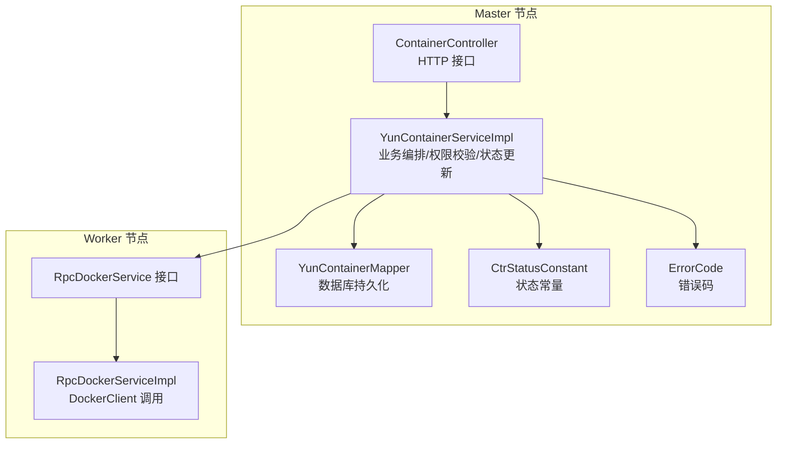
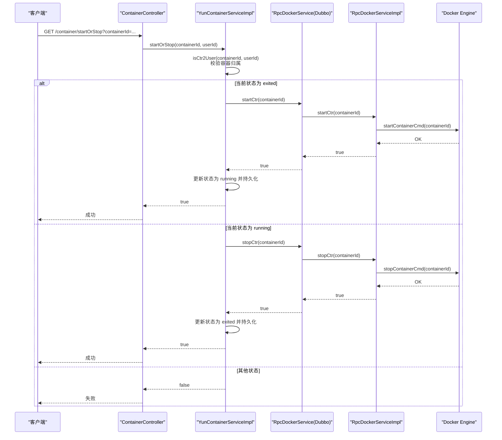
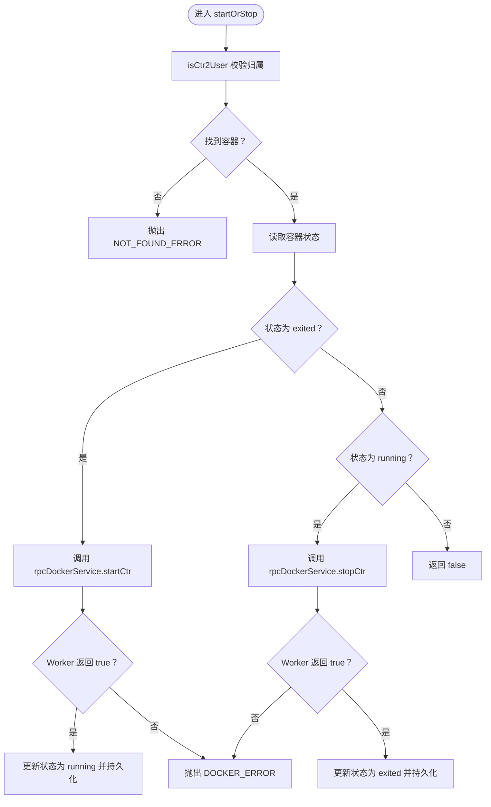
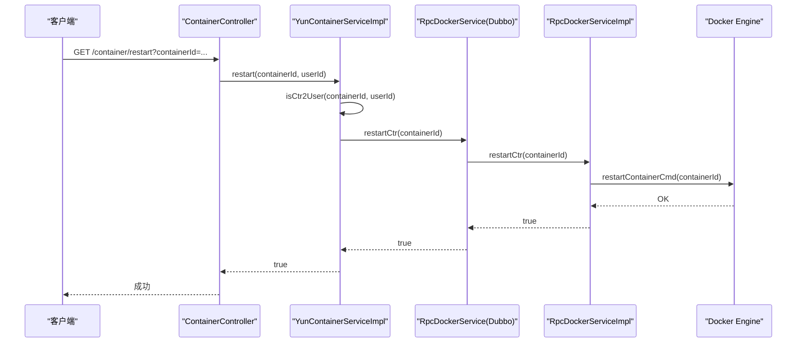
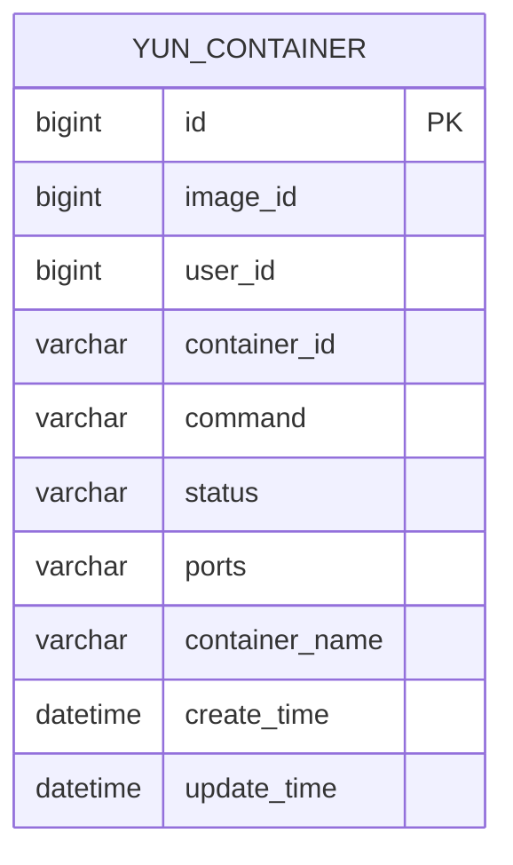
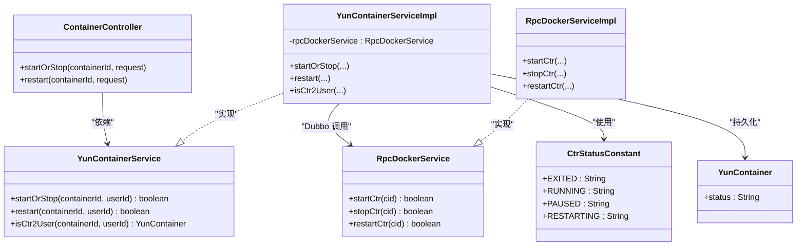

# 容器启停与重启

<cite>
**本文引用的文件**
- [yun-docker-master/src/main/java/com/lfc/yundocker/controller/ContainerController.java](file://yun-docker-master/src/main/java/com/lfc/yundocker/controller/ContainerController.java)
- [yun-docker-master/src/main/java/com/lfc/yundocker/service/YunContainerService.java](file://yun-docker-master/src/main/java/com/lfc/yundocker/service/YunContainerService.java)
- [yun-docker-master/src/main/java/com/lfc/yundocker/service/impl/YunContainerServiceImpl.java](file://yun-docker-master/src/main/java/com/lfc/yundocker/service/impl/YunContainerServiceImpl.java)
- [yun-docker-worker/src/main/java/com/lfc/yundocker/worker/rpc/RpcDockerServiceImpl.java](file://yun-docker-worker/src/main/java/com/lfc/yundocker/worker/rpc/RpcDockerServiceImpl.java)
- [yun-docker-api/src/main/java/com/lfc/yundocker/service/RpcDockerService.java](file://yun-docker-api/src/main/java/com/lfc/yundocker/service/RpcDockerService.java)
- [yun-docker-common/src/main/java/com/lfc/yundocker/common/constant/CtrStatusConstant.java](file://yun-docker-common/src/main/java/com/lfc/yundocker/common/constant/CtrStatusConstant.java)
- [yun-docker-common/src/main/java/com/lfc/yundocker/common/model/entity/YunContainer.java](file://yun-docker-common/src/main/java/com/lfc/yundocker/common/model/entity/YunContainer.java)
- [yun-docker-common/src/main/java/com/lfc/yundocker/common/model/enums/ErrorCode.java](file://yun-docker-common/src/main/java/com/lfc/yundocker/common/model/enums/ErrorCode.java)
- [yun-docker-common/src/main/java/com/lfc/yundocker/common/exception/BusinessException.java](file://yun-docker-common/src/main/java/com/lfc/yundocker/common/exception/BusinessException.java)
- [sql/yun_docker.sql](file://sql/yun_docker.sql)
</cite>

## 目录
1. [引言](#引言)
2. [项目结构](#项目结构)
3. [核心组件](#核心组件)
4. [架构总览](#架构总览)
5. [详细组件分析](#详细组件分析)
6. [依赖关系分析](#依赖关系分析)
7. [性能考量](#性能考量)
8. [故障排查指南](#故障排查指南)
9. [结论](#结论)

## 引言
本文件围绕容器生命周期管理中的“启停与重启”展开，重点说明以下内容：
- YunContainerService 中的 startOrStop 方法如何依据容器当前状态（running/exited）选择启动或停止命令，并通过 Dubbo RPC 调用 Worker 节点的 startCtr 或 stopCtr 接口。
- restart 方法的实现细节，包括向 Docker Engine 发送 restart 命令的流程与日志记录。
- 状态同步机制：Worker 执行成功后，Master 节点如何更新数据库中的容器状态字段（使用 CtrStatusConstant 常量）。
- 权限校验逻辑（isCtr2User 方法确保容器归属当前用户）与异常处理（如容器不存在、状态不匹配等错误码）。
- 提供启停操作的时序图，并说明操作失败时的补偿策略。

## 项目结构
系统采用 Master/Worker 架构，Master 负责业务编排与状态持久化，Worker 负责与 Docker Engine 交互执行具体命令。容器启停与重启的调用链如下：
- Controller 层接收 HTTP 请求，鉴权后委托 YunContainerService 处理。
- YunContainerService 实现类通过 Dubbo 调用 Worker 的 RpcDockerService 接口，完成对 Docker Engine 的实际操作。
- Worker 执行完成后，Master 将容器状态写回数据库，保持一致性。

图表来源
- [yun-docker-master/src/main/java/com/lfc/yundocker/controller/ContainerController.java](file://yun-docker-master/src/main/java/com/lfc/yundocker/controller/ContainerController.java#L71-L110)
- [yun-docker-master/src/main/java/com/lfc/yundocker/service/impl/YunContainerServiceImpl.java](file://yun-docker-master/src/main/java/com/lfc/yundocker/service/impl/YunContainerServiceImpl.java#L109-L134)
- [yun-docker-worker/src/main/java/com/lfc/yundocker/worker/rpc/RpcDockerServiceImpl.java](file://yun-docker-worker/src/main/java/com/lfc/yundocker/worker/rpc/RpcDockerServiceImpl.java#L321-L438)
- [yun-docker-api/src/main/java/com/lfc/yundocker/service/RpcDockerService.java](file://yun-docker-api/src/main/java/com/lfc/yundocker/service/RpcDockerService.java#L99-L141)
- [yun-docker-common/src/main/java/com/lfc/yundocker/common/constant/CtrStatusConstant.java](file://yun-docker-common/src/main/java/com/lfc/yundocker/common/constant/CtrStatusConstant.java#L1-L30)
- [sql/yun_docker.sql](file://sql/yun_docker.sql#L49-L64)

章节来源
- [yun-docker-master/src/main/java/com/lfc/yundocker/controller/ContainerController.java](file://yun-docker-master/src/main/java/com/lfc/yundocker/controller/ContainerController.java#L71-L110)
- [yun-docker-master/src/main/java/com/lfc/yundocker/service/impl/YunContainerServiceImpl.java](file://yun-docker-master/src/main/java/com/lfc/yundocker/service/impl/YunContainerServiceImpl.java#L109-L134)
- [yun-docker-worker/src/main/java/com/lfc/yundocker/worker/rpc/RpcDockerServiceImpl.java](file://yun-docker-worker/src/main/java/com/lfc/yundocker/worker/rpc/RpcDockerServiceImpl.java#L321-L438)
- [yun-docker-api/src/main/java/com/lfc/yundocker/service/RpcDockerService.java](file://yun-docker-api/src/main/java/com/lfc/yundocker/service/RpcDockerService.java#L99-L141)
- [yun-docker-common/src/main/java/com/lfc/yundocker/common/constant/CtrStatusConstant.java](file://yun-docker-common/src/main/java/com/lfc/yundocker/common/constant/CtrStatusConstant.java#L1-L30)
- [sql/yun_docker.sql](file://sql/yun_docker.sql#L49-L64)

## 核心组件
- Controller 层：提供 HTTP 接口，负责参数校验、鉴权与结果封装。
- Service 层：实现业务逻辑，包含权限校验、状态判断、Dubbo 调用与数据库更新。
- Worker 层：通过 DockerClient 执行容器启停/重启等命令。
- 常量与模型：状态常量、容器实体、错误码等支撑层。

章节来源
- [yun-docker-master/src/main/java/com/lfc/yundocker/controller/ContainerController.java](file://yun-docker-master/src/main/java/com/lfc/yundocker/controller/ContainerController.java#L71-L110)
- [yun-docker-master/src/main/java/com/lfc/yundocker/service/YunContainerService.java](file://yun-docker-master/src/main/java/com/lfc/yundocker/service/YunContainerService.java#L21-L40)
- [yun-docker-master/src/main/java/com/lfc/yundocker/service/impl/YunContainerServiceImpl.java](file://yun-docker-master/src/main/java/com/lfc/yundocker/service/impl/YunContainerServiceImpl.java#L109-L134)
- [yun-docker-worker/src/main/java/com/lfc/yundocker/worker/rpc/RpcDockerServiceImpl.java](file://yun-docker-worker/src/main/java/com/lfc/yundocker/worker/rpc/RpcDockerServiceImpl.java#L321-L438)
- [yun-docker-common/src/main/java/com/lfc/yundocker/common/constant/CtrStatusConstant.java](file://yun-docker-common/src/main/java/com/lfc/yundocker/common/constant/CtrStatusConstant.java#L1-L30)
- [yun-docker-common/src/main/java/com/lfc/yundocker/common/model/entity/YunContainer.java](file://yun-docker-common/src/main/java/com/lfc/yundocker/common/model/entity/YunContainer.java#L1-L79)

## 架构总览
下图展示从 HTTP 请求到 Docker Engine 的完整调用链路，以及 Master/Worker 的职责分工。

图表来源
- [yun-docker-master/src/main/java/com/lfc/yundocker/controller/ContainerController.java](file://yun-docker-master/src/main/java/com/lfc/yundocker/controller/ContainerController.java#L71-L110)
- [yun-docker-master/src/main/java/com/lfc/yundocker/service/impl/YunContainerServiceImpl.java](file://yun-docker-master/src/main/java/com/lfc/yundocker/service/impl/YunContainerServiceImpl.java#L109-L134)
- [yun-docker-worker/src/main/java/com/lfc/yundocker/worker/rpc/RpcDockerServiceImpl.java](file://yun-docker-worker/src/main/java/com/lfc/yundocker/worker/rpc/RpcDockerServiceImpl.java#L321-L337)
- [yun-docker-api/src/main/java/com/lfc/yundocker/service/RpcDockerService.java](file://yun-docker-api/src/main/java/com/lfc/yundocker/service/RpcDockerService.java#L99-L114)

## 详细组件分析

### 启停操作：startOrStop 的实现机制
- 权限校验：通过 isCtr2User(containerId, userId) 查询数据库，若不存在则抛出“数据不存在”错误。
- 状态判断：
  - 若当前状态为 exited，则调用 rpcDockerService.startCtr(containerId)，成功后将数据库状态更新为 running 并持久化。
  - 若当前状态为 running，则调用 rpcDockerService.stopCtr(containerId)，成功后将数据库状态更新为 exited 并持久化。
- 异常处理：当 Worker 返回失败或查询不到容器时，抛出相应错误码（如 DOCKER_ERROR、NOT_FOUND_ERROR）。

图表来源
- [yun-docker-master/src/main/java/com/lfc/yundocker/service/impl/YunContainerServiceImpl.java](file://yun-docker-master/src/main/java/com/lfc/yundocker/service/impl/YunContainerServiceImpl.java#L109-L134)
- [yun-docker-worker/src/main/java/com/lfc/yundocker/worker/rpc/RpcDockerServiceImpl.java](file://yun-docker-worker/src/main/java/com/lfc/yundocker/worker/rpc/RpcDockerServiceImpl.java#L321-L337)
- [yun-docker-common/src/main/java/com/lfc/yundocker/common/constant/CtrStatusConstant.java](file://yun-docker-common/src/main/java/com/lfc/yundocker/common/constant/CtrStatusConstant.java#L1-L30)

章节来源
- [yun-docker-master/src/main/java/com/lfc/yundocker/service/impl/YunContainerServiceImpl.java](file://yun-docker-master/src/main/java/com/lfc/yundocker/service/impl/YunContainerServiceImpl.java#L109-L134)
- [yun-docker-worker/src/main/java/com/lfc/yundocker/worker/rpc/RpcDockerServiceImpl.java](file://yun-docker-worker/src/main/java/com/lfc/yundocker/worker/rpc/RpcDockerServiceImpl.java#L321-L337)
- [yun-docker-common/src/main/java/com/lfc/yundocker/common/constant/CtrStatusConstant.java](file://yun-docker-common/src/main/java/com/lfc/yundocker/common/constant/CtrStatusConstant.java#L1-L30)

### 重启操作：restart 的实现机制
- 权限校验：同样通过 isCtr2User(containerId, userId) 校验容器归属。
- 执行流程：直接调用 rpcDockerService.restartCtr(containerId)，由 Worker 侧通过 DockerClient 调用 restartContainerCmd。
- 日志记录：Worker 在重启前后打印日志，便于问题定位。

图表来源
- [yun-docker-master/src/main/java/com/lfc/yundocker/controller/ContainerController.java](file://yun-docker-master/src/main/java/com/lfc/yundocker/controller/ContainerController.java#L97-L107)
- [yun-docker-master/src/main/java/com/lfc/yundocker/service/impl/YunContainerServiceImpl.java](file://yun-docker-master/src/main/java/com/lfc/yundocker/service/impl/YunContainerServiceImpl.java#L218-L227)
- [yun-docker-worker/src/main/java/com/lfc/yundocker/worker/rpc/RpcDockerServiceImpl.java](file://yun-docker-worker/src/main/java/com/lfc/yundocker/worker/rpc/RpcDockerServiceImpl.java#L433-L438)
- [yun-docker-api/src/main/java/com/lfc/yundocker/service/RpcDockerService.java](file://yun-docker-api/src/main/java/com/lfc/yundocker/service/RpcDockerService.java#L135-L141)

章节来源
- [yun-docker-master/src/main/java/com/lfc/yundocker/controller/ContainerController.java](file://yun-docker-master/src/main/java/com/lfc/yundocker/controller/ContainerController.java#L97-L107)
- [yun-docker-master/src/main/java/com/lfc/yundocker/service/impl/YunContainerServiceImpl.java](file://yun-docker-master/src/main/java/com/lfc/yundocker/service/impl/YunContainerServiceImpl.java#L218-L227)
- [yun-docker-worker/src/main/java/com/lfc/yundocker/worker/rpc/RpcDockerServiceImpl.java](file://yun-docker-worker/src/main/java/com/lfc/yundocker/worker/rpc/RpcDockerServiceImpl.java#L433-L438)
- [yun-docker-api/src/main/java/com/lfc/yundocker/service/RpcDockerService.java](file://yun-docker-api/src/main/java/com/lfc/yundocker/service/RpcDockerService.java#L135-L141)

### 状态同步机制
- Master/Worker 之间通过 Dubbo 接口通信，Worker 执行 Docker 命令后返回布尔值。
- Master 在成功路径上更新数据库中的容器状态字段：
  - 从 exited 切换到 running 时，将 status 字段更新为 RUNNING 常量。
  - 从 running 切换到 exited 时，将 status 字段更新为 EXITED 常量。
- 数据库表结构包含 status 字段，确保状态持久化。

图表来源
- [sql/yun_docker.sql](file://sql/yun_docker.sql#L49-L64)
- [yun-docker-common/src/main/java/com/lfc/yundocker/common/model/entity/YunContainer.java](file://yun-docker-common/src/main/java/com/lfc/yundocker/common/model/entity/YunContainer.java#L1-L79)
- [yun-docker-common/src/main/java/com/lfc/yundocker/common/constant/CtrStatusConstant.java](file://yun-docker-common/src/main/java/com/lfc/yundocker/common/constant/CtrStatusConstant.java#L1-L30)

章节来源
- [yun-docker-master/src/main/java/com/lfc/yundocker/service/impl/YunContainerServiceImpl.java](file://yun-docker-master/src/main/java/com/lfc/yundocker/service/impl/YunContainerServiceImpl.java#L116-L131)
- [sql/yun_docker.sql](file://sql/yun_docker.sql#L49-L64)
- [yun-docker-common/src/main/java/com/lfc/yundocker/common/constant/CtrStatusConstant.java](file://yun-docker-common/src/main/java/com/lfc/yundocker/common/constant/CtrStatusConstant.java#L1-L30)

### 权限校验逻辑
- isCtr2User(containerId, userId) 通过数据库查询容器是否属于当前用户，若不存在则抛出 NOT_FOUND_ERROR。
- Controller 层在调用 Service 前先获取登录用户信息，确保操作具备有效身份。

章节来源
- [yun-docker-master/src/main/java/com/lfc/yundocker/service/impl/YunContainerServiceImpl.java](file://yun-docker-master/src/main/java/com/lfc/yundocker/service/impl/YunContainerServiceImpl.java#L266-L271)
- [yun-docker-master/src/main/java/com/lfc/yundocker/controller/ContainerController.java](file://yun-docker-master/src/main/java/com/lfc/yundocker/controller/ContainerController.java#L78-L88)

### 异常处理与错误码
- 常见错误码：
  - NOT_FOUND_ERROR：容器不存在或不属于当前用户。
  - DOCKER_ERROR：Docker 操作失败。
  - SYSTEM_ERROR：通用系统异常。
- 异常传播：Service 层捕获底层异常并抛出自定义 BusinessException，Controller 层统一包装为 BaseResponse。

章节来源
- [yun-docker-common/src/main/java/com/lfc/yundocker/common/model/enums/ErrorCode.java](file://yun-docker-common/src/main/java/com/lfc/yundocker/common/model/enums/ErrorCode.java#L1-L49)
- [yun-docker-common/src/main/java/com/lfc/yundocker/common/exception/BusinessException.java](file://yun-docker-common/src/main/java/com/lfc/yundocker/common/exception/BusinessException.java#L1-L37)
- [yun-docker-master/src/main/java/com/lfc/yundocker/service/impl/YunContainerServiceImpl.java](file://yun-docker-master/src/main/java/com/lfc/yundocker/service/impl/YunContainerServiceImpl.java#L113-L124)

### 补偿策略
- 启停失败补偿：
  - 若 Worker 返回失败，Service 抛出 DOCKER_ERROR，Controller 返回失败。建议前端重试或提示用户稍后重试。
  - 对于状态不一致的情况，可在定时任务或事件驱动机制中对数据库状态与 Docker 实际状态进行比对与修复（当前仓库未实现该机制，建议后续扩展）。
- 重启失败补偿：
  - 若 restartCtr 返回失败，同样抛出 DOCKER_ERROR，建议前端重试或检查容器健康状态。

章节来源
- [yun-docker-worker/src/main/java/com/lfc/yundocker/worker/rpc/RpcDockerServiceImpl.java](file://yun-docker-worker/src/main/java/com/lfc/yundocker/worker/rpc/RpcDockerServiceImpl.java#L321-L337)
- [yun-docker-worker/src/main/java/com/lfc/yundocker/worker/rpc/RpcDockerServiceImpl.java](file://yun-docker-worker/src/main/java/com/lfc/yundocker/worker/rpc/RpcDockerServiceImpl.java#L433-L438)

## 依赖关系分析
- 控制器依赖服务接口与用户服务，用于鉴权与结果封装。
- 服务实现依赖：
  - RpcDockerService（Dubbo 接口），用于调用 Worker 执行 Docker 命令。
  - YunContainerMapper，用于状态更新与查询。
  - CtrStatusConstant，用于状态常量。
  - ErrorCode/BusinessException，用于错误码与异常封装。
- Worker 实现依赖 DockerClient，直接与 Docker Engine 交互。

图表来源
- [yun-docker-master/src/main/java/com/lfc/yundocker/controller/ContainerController.java](file://yun-docker-master/src/main/java/com/lfc/yundocker/controller/ContainerController.java#L71-L110)
- [yun-docker-master/src/main/java/com/lfc/yundocker/service/YunContainerService.java](file://yun-docker-master/src/main/java/com/lfc/yundocker/service/YunContainerService.java#L21-L40)
- [yun-docker-master/src/main/java/com/lfc/yundocker/service/impl/YunContainerServiceImpl.java](file://yun-docker-master/src/main/java/com/lfc/yundocker/service/impl/YunContainerServiceImpl.java#L109-L134)
- [yun-docker-worker/src/main/java/com/lfc/yundocker/worker/rpc/RpcDockerServiceImpl.java](file://yun-docker-worker/src/main/java/com/lfc/yundocker/worker/rpc/RpcDockerServiceImpl.java#L321-L438)
- [yun-docker-api/src/main/java/com/lfc/yundocker/service/RpcDockerService.java](file://yun-docker-api/src/main/java/com/lfc/yundocker/service/RpcDockerService.java#L99-L141)
- [yun-docker-common/src/main/java/com/lfc/yundocker/common/constant/CtrStatusConstant.java](file://yun-docker-common/src/main/java/com/lfc/yundocker/common/constant/CtrStatusConstant.java#L1-L30)
- [yun-docker-common/src/main/java/com/lfc/yundocker/common/model/entity/YunContainer.java](file://yun-docker-common/src/main/java/com/lfc/yundocker/common/model/entity/YunContainer.java#L1-L79)

## 性能考量
- 启停/重启均为轻量级 RPC 调用，主要耗时在 Docker Engine 的实际执行。
- 建议：
  - 对频繁启停的场景，可引入幂等控制与去抖动策略，避免重复触发。
  - 对批量启停，可考虑异步化与并发控制，减少阻塞。
  - 对日志与指标采集，注意 I/O 与网络开销，避免成为瓶颈。

## 故障排查指南
- 常见问题与定位要点：
  - 参数错误：检查请求参数是否为空或格式不正确。
  - 未登录/无权限：确认登录态与 isCtr2User 校验是否通过。
  - 容器不存在：确认 containerId 是否正确且属于当前用户。
  - Docker 异常：查看 Worker 日志中 Docker 命令执行情况与返回值。
  - 状态不一致：核对数据库 status 字段与 Docker 实际状态，必要时进行人工修复。
- 建议的排查步骤：
  1) 确认 Controller 层鉴权通过。
  2) 检查 Service 层 isCtr2User 是否返回容器对象。
  3) 观察 Worker 日志中 startCtr/stopCtr/restartCtr 的执行情况。
  4) 核对数据库 yun_container 表 status 字段是否更新成功。

章节来源
- [yun-docker-master/src/main/java/com/lfc/yundocker/controller/ContainerController.java](file://yun-docker-master/src/main/java/com/lfc/yundocker/controller/ContainerController.java#L78-L107)
- [yun-docker-master/src/main/java/com/lfc/yundocker/service/impl/YunContainerServiceImpl.java](file://yun-docker-master/src/main/java/com/lfc/yundocker/service/impl/YunContainerServiceImpl.java#L109-L134)
- [yun-docker-worker/src/main/java/com/lfc/yundocker/worker/rpc/RpcDockerServiceImpl.java](file://yun-docker-worker/src/main/java/com/lfc/yundocker/worker/rpc/RpcDockerServiceImpl.java#L321-L337)
- [yun-docker-worker/src/main/java/com/lfc/yundocker/worker/rpc/RpcDockerServiceImpl.java](file://yun-docker-worker/src/main/java/com/lfc/yundocker/worker/rpc/RpcDockerServiceImpl.java#L433-L438)
- [yun-docker-common/src/main/java/com/lfc/yundocker/common/model/enums/ErrorCode.java](file://yun-docker-common/src/main/java/com/lfc/yundocker/common/model/enums/ErrorCode.java#L1-L49)

## 结论
- 启停与重启流程清晰：Master 侧负责权限校验与状态更新，Worker 侧负责与 Docker Engine 交互。
- 状态同步通过数据库持久化保障一致性，状态常量集中管理，便于维护。
- 异常处理覆盖了常见场景，错误码统一规范，便于前端与运维定位问题。
- 建议后续增强补偿与对账机制，提升系统在异常场景下的自愈能力。