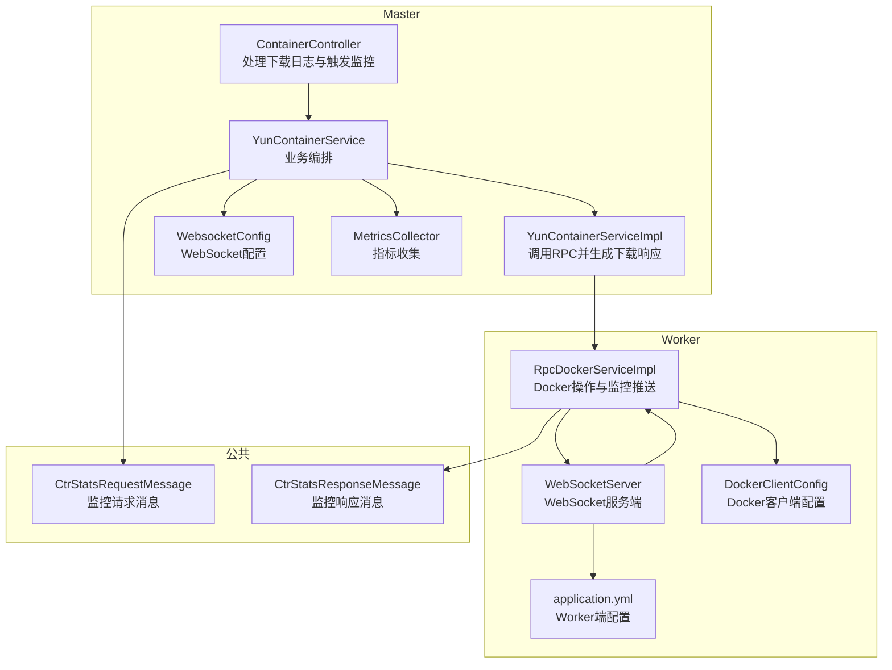
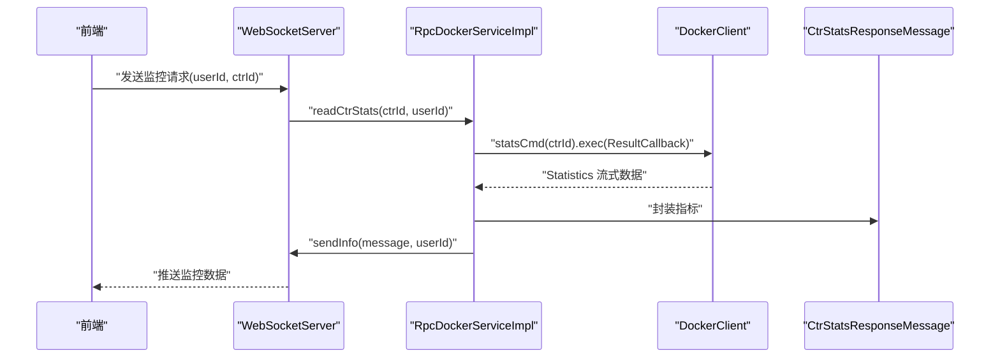
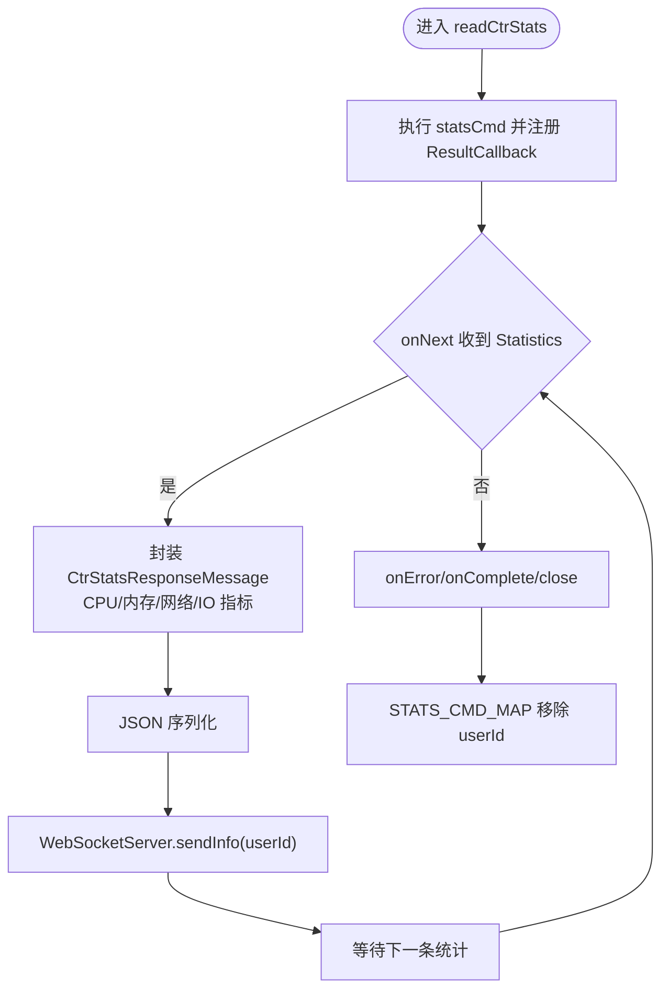
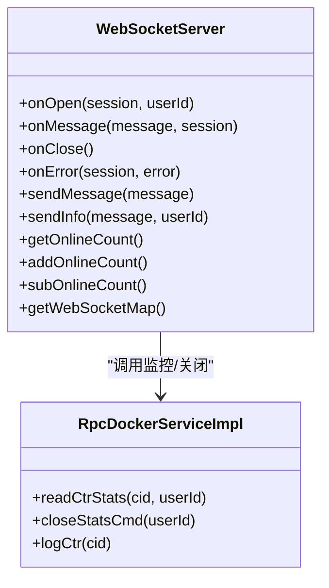
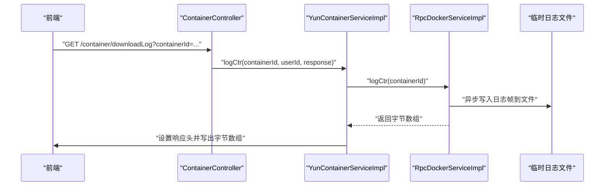
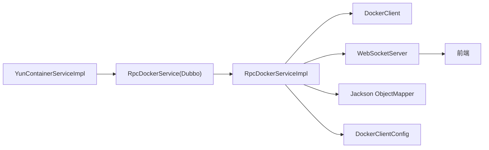

# 容器监控与日志

<cite>
**本文引用的文件**
- [yun-docker-common/src/main/java/com/lfc/yundocker/common/model/dto/message/CtrStatsRequestMessage.java](file://yun-docker-common/src/main/java/com/lfc/yundocker/common/model/dto/message/CtrStatsRequestMessage.java)
- [yun-docker-common/src/main/java/com/lfc/yundocker/common/model/dto/message/CtrStatsResponseMessage.java](file://yun-docker-common/src/main/java/com/lfc/yundocker/common/model/dto/message/CtrStatsResponseMessage.java)
- [yun-docker-worker/src/main/java/com/lfc/yundocker/worker/websocket/WebSocketServer.java](file://yun-docker-worker/src/main/java/com/lfc/yundocker/worker/websocket/WebSocketServer.java)
- [yun-docker-worker/src/main/java/com/lfc/yundocker/worker/rpc/RpcDockerServiceImpl.java](file://yun-docker-worker/src/main/java/com/lfc/yundocker/worker/rpc/RpcDockerServiceImpl.java)
- [yun-docker-worker/src/main/java/com/lfc/yundocker/worker/config/DockerClientConfig.java](file://yun-docker-worker/src/main/java/com/lfc/yundocker/worker/config/DockerClientConfig.java)
- [yun-docker-worker/src/main/java/com/lfc/yundocker/worker/config/WebsocketConfig.java](file://yun-docker-worker/src/main/java/com/lfc/yundocker/worker/config/WebsocketConfig.java)
- [yun-docker-master/src/main/java/com/lfc/yundocker/controller/ContainerController.java](file://yun-docker-master/src/main/java/com/lfc/yundocker/controller/ContainerController.java)
- [yun-docker-master/src/main/java/com/lfc/yundocker/service/YunContainerService.java](file://yun-docker-master/src/main/java/com/lfc/yundocker/service/YunContainerService.java)
- [yun-docker-master/src/main/java/com/lfc/yundocker/service/impl/YunContainerServiceImpl.java](file://yun-docker-master/src/main/java/com/lfc/yundocker/service/impl/YunContainerServiceImpl.java)
- [yun-docker-master/src/main/java/com/lfc/yundocker/config/WebsocketConfig.java](file://yun-docker-master/src/main/java/com/lfc/yundocker/config/WebsocketConfig.java)
- [yun-docker-master/src/main/java/com/lfc/yundocker/monitor/MetricsCollector.java](file://yun-docker-master/src/main/java/com/lfc/yundocker/monitor/MetricsCollector.java)
- [yun-docker-worker/src/main/resources/application.yml](file://yun-docker-worker/src/main/resources/application.yml)
- [yun-docker-master/src/main/resources/application.yml](file://yun-docker-master/src/main/resources/application.yml)
</cite>

## 目录
1. [引言](#引言)
2. [项目结构](#项目结构)
3. [核心组件](#核心组件)
4. [架构总览](#架构总览)
5. [详细组件分析](#详细组件分析)
6. [依赖关系分析](#依赖关系分析)
7. [性能考量](#性能考量)
8. [故障排查指南](#故障排查指南)
9. [结论](#结论)
10. [附录](#附录)

## 引言
本文件围绕“容器实时监控与日志查看”的技术实现展开，重点说明以下内容：
- readStats 方法如何触发 Worker 节点的 readCtrStats 接口，启动 Docker stats 命令持续采集 CPU、内存、网络、磁盘 IO 等指标，并通过 WebSocketServer 将封装为 CtrStatsResponseMessage 的监控数据实时推送给前端。
- WebSocket 连接管理机制（STATS_CMD_MAP 存储用户与监控回调的映射）与数据推送流程。
- logCtr 方法的实现：Worker 节点如何异步读取容器日志并写入临时文件，再将日志内容以字节数组形式返回给 Master 节点，最终由 Master 生成文件下载响应。
- 监控数据的计算方式（如内存使用率、网络流量转换）。
- 监控数据流的时序图，并说明如何关闭监控流（closeStatsCmd）。

## 项目结构
该仓库采用多模块结构，包含公共模型、Master 控制器与服务、Worker RPC 与 WebSocket、以及 Docker 客户端配置等。监控与日志功能主要分布在 Master 的控制器与服务层，以及 Worker 的 RPC 实现与 WebSocket 服务端。

图表来源
- [yun-docker-master/src/main/java/com/lfc/yundocker/controller/ContainerController.java](file://yun-docker-master/src/main/java/com/lfc/yundocker/controller/ContainerController.java#L1-L173)
- [yun-docker-master/src/main/java/com/lfc/yundocker/service/YunContainerService.java](file://yun-docker-master/src/main/java/com/lfc/yundocker/service/YunContainerService.java#L1-L40)
- [yun-docker-master/src/main/java/com/lfc/yundocker/service/impl/YunContainerServiceImpl.java](file://yun-docker-master/src/main/java/com/lfc/yundocker/service/impl/YunContainerServiceImpl.java#L1-L294)
- [yun-docker-worker/src/main/java/com/lfc/yundocker/worker/rpc/RpcDockerServiceImpl.java](file://yun-docker-worker/src/main/java/com/lfc/yundocker/worker/rpc/RpcDockerServiceImpl.java#L1-L440)
- [yun-docker-worker/src/main/java/com/lfc/yundocker/worker/websocket/WebSocketServer.java](file://yun-docker-worker/src/main/java/com/lfc/yundocker/worker/websocket/WebSocketServer.java#L1-L175)
- [yun-docker-worker/src/main/java/com/lfc/yundocker/worker/config/DockerClientConfig.java](file://yun-docker-worker/src/main/java/com/lfc/yundocker/worker/config/DockerClientConfig.java#L1-L31)
- [yun-docker-worker/src/main/resources/application.yml](file://yun-docker-worker/src/main/resources/application.yml#L1-L51)
- [yun-docker-common/src/main/java/com/lfc/yundocker/common/model/dto/message/CtrStatsRequestMessage.java](file://yun-docker-common/src/main/java/com/lfc/yundocker/common/model/dto/message/CtrStatsRequestMessage.java#L1-L17)
- [yun-docker-common/src/main/java/com/lfc/yundocker/common/model/dto/message/CtrStatsResponseMessage.java](file://yun-docker-common/src/main/java/com/lfc/yundocker/common/model/dto/message/CtrStatsResponseMessage.java#L1-L69)

章节来源
- [yun-docker-master/src/main/java/com/lfc/yundocker/controller/ContainerController.java](file://yun-docker-master/src/main/java/com/lfc/yundocker/controller/ContainerController.java#L1-L173)
- [yun-docker-worker/src/main/java/com/lfc/yundocker/worker/rpc/RpcDockerServiceImpl.java](file://yun-docker-worker/src/main/java/com/lfc/yundocker/worker/rpc/RpcDockerServiceImpl.java#L1-L440)

## 核心组件
- 监控请求/响应消息模型：用于在 Worker 与前端之间传递监控数据。
- WebSocket 服务端：负责建立与维护用户连接，接收前端监控请求，转发至 RPC 层，并将监控结果回推给前端。
- RPC 实现：封装 Docker Java 客户端调用，执行 stats 命令并推送数据；同时提供日志读取能力。
- Master 控制器与服务：对外暴露下载日志接口，内部调用 RPC 并生成下载响应；同时触发监控读取。

章节来源
- [yun-docker-common/src/main/java/com/lfc/yundocker/common/model/dto/message/CtrStatsRequestMessage.java](file://yun-docker-common/src/main/java/com/lfc/yundocker/common/model/dto/message/CtrStatsRequestMessage.java#L1-L17)
- [yun-docker-common/src/main/java/com/lfc/yundocker/common/model/dto/message/CtrStatsResponseMessage.java](file://yun-docker-common/src/main/java/com/lfc/yundocker/common/model/dto/message/CtrStatsResponseMessage.java#L1-L69)
- [yun-docker-worker/src/main/java/com/lfc/yundocker/worker/websocket/WebSocketServer.java](file://yun-docker-worker/src/main/java/com/lfc/yundocker/worker/websocket/WebSocketServer.java#L1-L175)
- [yun-docker-worker/src/main/java/com/lfc/yundocker/worker/rpc/RpcDockerServiceImpl.java](file://yun-docker-worker/src/main/java/com/lfc/yundocker/worker/rpc/RpcDockerServiceImpl.java#L1-L440)
- [yun-docker-master/src/main/java/com/lfc/yundocker/controller/ContainerController.java](file://yun-docker-master/src/main/java/com/lfc/yundocker/controller/ContainerController.java#L1-L173)
- [yun-docker-master/src/main/java/com/lfc/yundocker/service/impl/YunContainerServiceImpl.java](file://yun-docker-master/src/main/java/com/lfc/yundocker/service/impl/YunContainerServiceImpl.java#L1-L294)

## 架构总览
监控与日志功能的总体流程如下：
- 前端通过 WebSocket 连接 Worker，发送包含用户 ID 与容器 ID 的消息。
- Worker 的 WebSocketServer 解析消息后，调用 RpcDockerServiceImpl 的 readCtrStats，启动 Docker stats 命令持续采集指标。
- RpcDockerServiceImpl 将指标封装为 CtrStatsResponseMessage，通过 WebSocketServer 推送回前端。
- 日志下载流程：Master 的 ContainerController 触发 YunContainerServiceImpl 调用 RpcDockerServiceImpl 的 logCtr，将日志写入临时文件并返回字节数组，Master 生成下载响应。

图表来源
- [yun-docker-worker/src/main/java/com/lfc/yundocker/worker/websocket/WebSocketServer.java](file://yun-docker-worker/src/main/java/com/lfc/yundocker/worker/websocket/WebSocketServer.java#L90-L120)
- [yun-docker-worker/src/main/java/com/lfc/yundocker/worker/rpc/RpcDockerServiceImpl.java](file://yun-docker-worker/src/main/java/com/lfc/yundocker/worker/rpc/RpcDockerServiceImpl.java#L196-L259)
- [yun-docker-common/src/main/java/com/lfc/yundocker/common/model/dto/message/CtrStatsResponseMessage.java](file://yun-docker-common/src/main/java/com/lfc/yundocker/common/model/dto/message/CtrStatsResponseMessage.java#L1-L69)

## 详细组件分析

### 组件A：监控数据采集与推送（readStats → readCtrStats）
- 触发链路
  - Master 的 YunContainerServiceImpl.readStats 校验容器归属后，调用 RpcDockerService.readCtrStats。
  - Worker 的 RpcDockerServiceImpl.readCtrStats 通过 DockerClient.statsCmd 执行 stats 命令，注册 ResultCallback 接收流式 Statistics 数据。
  - 每次 onNext 回调中，将 CPU、内存、网络、磁盘 IO 等指标封装为 CtrStatsResponseMessage，并序列化后通过 WebSocketServer.sendInfo 推送。
- 数据封装与转换
  - CPU：总使用时间（纳秒转秒）、每核使用数组、在线 CPU 数。
  - 内存：当前使用、最大使用、限制，单位换算为 MB。
  - 网络：入站/出站字节求和后换算为 KB。
  - 磁盘 IO：blkio 统计项求和后换算为 KB。
- 连接管理与关闭
  - STATS_CMD_MAP 以 userId 为键，保存 ResultCallback，便于后续 closeStatsCmd 关闭对应用户的监控流。
  - WebSocketServer.onClose 中调用 RpcDockerServiceImpl.closeStatsCmd(userId)，确保资源释放。

图表来源
- [yun-docker-worker/src/main/java/com/lfc/yundocker/worker/rpc/RpcDockerServiceImpl.java](file://yun-docker-worker/src/main/java/com/lfc/yundocker/worker/rpc/RpcDockerServiceImpl.java#L196-L259)
- [yun-docker-worker/src/main/java/com/lfc/yundocker/worker/websocket/WebSocketServer.java](file://yun-docker-worker/src/main/java/com/lfc/yundocker/worker/websocket/WebSocketServer.java#L69-L82)

章节来源
- [yun-docker-master/src/main/java/com/lfc/yundocker/service/impl/YunContainerServiceImpl.java](file://yun-docker-master/src/main/java/com/lfc/yundocker/service/impl/YunContainerServiceImpl.java#L248-L257)
- [yun-docker-worker/src/main/java/com/lfc/yundocker/worker/rpc/RpcDockerServiceImpl.java](file://yun-docker-worker/src/main/java/com/lfc/yundocker/worker/rpc/RpcDockerServiceImpl.java#L196-L278)
- [yun-docker-worker/src/main/java/com/lfc/yundocker/worker/websocket/WebSocketServer.java](file://yun-docker-worker/src/main/java/com/lfc/yundocker/worker/websocket/WebSocketServer.java#L69-L82)

### 组件B：WebSocket 连接管理与数据推送
- 连接生命周期
  - onOpen：根据 userId 建立或替换连接映射，维护在线计数。
  - onMessage：解析消息，调用 RpcDockerServiceImpl.readCtrStats 开始监控。
  - onClose：移除连接映射并调用 closeStatsCmd 关闭对应用户的监控流。
  - sendInfo：根据 userId 查找连接并发送文本消息。
- 连接映射
  - WEB_SOCKET_MAP：ConcurrentHashMap<Long, WebSocketServer>，用于按用户查找连接。
  - STATS_CMD_MAP：HashMap<Long, ResultCallback<Statistics>>，用于按用户查找并关闭监控回调。

图表来源
- [yun-docker-worker/src/main/java/com/lfc/yundocker/worker/websocket/WebSocketServer.java](file://yun-docker-worker/src/main/java/com/lfc/yundocker/worker/websocket/WebSocketServer.java#L1-L175)
- [yun-docker-worker/src/main/java/com/lfc/yundocker/worker/rpc/RpcDockerServiceImpl.java](file://yun-docker-worker/src/main/java/com/lfc/yundocker/worker/rpc/RpcDockerServiceImpl.java#L1-L440)

章节来源
- [yun-docker-worker/src/main/java/com/lfc/yundocker/worker/websocket/WebSocketServer.java](file://yun-docker-worker/src/main/java/com/lfc/yundocker/worker/websocket/WebSocketServer.java#L1-L175)
- [yun-docker-worker/src/main/java/com/lfc/yundocker/worker/rpc/RpcDockerServiceImpl.java](file://yun-docker-worker/src/main/java/com/lfc/yundocker/worker/rpc/RpcDockerServiceImpl.java#L1-L440)

### 组件C：日志读取与下载（logCtr）
- Worker 端
  - RpcDockerServiceImpl.logCtr 异步读取容器日志，将帧数据追加到临时文件（UTF-8），完成后读取文件为字节数组返回。
  - 使用 DockerClient.logContainerCmd 并设置 withStdOut/withStdErr。
- Master 端
  - ContainerController.downloadLog 接收容器 ID，调用 YunContainerServiceImpl.logCtr。
  - YunContainerServiceImpl.logCtr 校验归属后调用 RPC，设置响应头（Content-Disposition、Content-Length、Content-Type），并将字节数组写入输出流完成下载。

图表来源
- [yun-docker-master/src/main/java/com/lfc/yundocker/controller/ContainerController.java](file://yun-docker-master/src/main/java/com/lfc/yundocker/controller/ContainerController.java#L154-L171)
- [yun-docker-master/src/main/java/com/lfc/yundocker/service/impl/YunContainerServiceImpl.java](file://yun-docker-master/src/main/java/com/lfc/yundocker/service/impl/YunContainerServiceImpl.java#L273-L294)
- [yun-docker-worker/src/main/java/com/lfc/yundocker/worker/rpc/RpcDockerServiceImpl.java](file://yun-docker-worker/src/main/java/com/lfc/yundocker/worker/rpc/RpcDockerServiceImpl.java#L346-L413)

章节来源
- [yun-docker-master/src/main/java/com/lfc/yundocker/controller/ContainerController.java](file://yun-docker-master/src/main/java/com/lfc/yundocker/controller/ContainerController.java#L154-L171)
- [yun-docker-master/src/main/java/com/lfc/yundocker/service/impl/YunContainerServiceImpl.java](file://yun-docker-master/src/main/java/com/lfc/yundocker/service/impl/YunContainerServiceImpl.java#L273-L294)
- [yun-docker-worker/src/main/java/com/lfc/yundocker/worker/rpc/RpcDockerServiceImpl.java](file://yun-docker-worker/src/main/java/com/lfc/yundocker/worker/rpc/RpcDockerServiceImpl.java#L346-L413)

### 组件D：监控数据计算方式与单位换算
- CPU
  - 总使用时间：Docker 返回纳秒，转换为秒（除以 10^9）。
  - 每核使用数组与在线 CPU 数：直接取用。
- 内存
  - 当前使用、最大使用、限制：Docker 返回字节，转换为 MB（除以 1024^2）。
- 网络
  - 入站/出站字节：遍历 networks 统计项求和，转换为 KB（除以 1000）。
- 磁盘 IO
  - blkio 统计项求和，转换为 KB（除以 1000）。

章节来源
- [yun-docker-worker/src/main/java/com/lfc/yundocker/worker/rpc/RpcDockerServiceImpl.java](file://yun-docker-worker/src/main/java/com/lfc/yundocker/worker/rpc/RpcDockerServiceImpl.java#L206-L221)

## 依赖关系分析
- 组件耦合
  - Master 的 YunContainerServiceImpl 通过 Dubbo 调用 Worker 的 RpcDockerService，实现监控与日志能力的解耦。
  - WebSocketServer 通过 SpringContextUtils 获取 RpcDockerServiceImpl，避免直接注入导致的容器托管问题。
  - DockerClient 通过 DockerClientConfig 注入，统一配置 Docker 服务地址。
- 外部依赖
  - Docker Java API：用于 stats、log、inspect、create 等操作。
  - Jackson：用于将 CtrStatsResponseMessage 序列化为 JSON。
  - WebSocket：基于 javax.websocket，ServerEndpoint 注解启用。

图表来源
- [yun-docker-master/src/main/java/com/lfc/yundocker/service/impl/YunContainerServiceImpl.java](file://yun-docker-master/src/main/java/com/lfc/yundocker/service/impl/YunContainerServiceImpl.java#L1-L294)
- [yun-docker-worker/src/main/java/com/lfc/yundocker/worker/rpc/RpcDockerServiceImpl.java](file://yun-docker-worker/src/main/java/com/lfc/yundocker/worker/rpc/RpcDockerServiceImpl.java#L1-L440)
- [yun-docker-worker/src/main/java/com/lfc/yundocker/worker/config/DockerClientConfig.java](file://yun-docker-worker/src/main/java/com/lfc/yundocker/worker/config/DockerClientConfig.java#L1-L31)

章节来源
- [yun-docker-worker/src/main/java/com/lfc/yundocker/worker/rpc/RpcDockerServiceImpl.java](file://yun-docker-worker/src/main/java/com/lfc/yundocker/worker/rpc/RpcDockerServiceImpl.java#L1-L440)
- [yun-docker-worker/src/main/java/com/lfc/yundocker/worker/config/DockerClientConfig.java](file://yun-docker-worker/src/main/java/com/lfc/yundocker/worker/config/DockerClientConfig.java#L1-L31)

## 性能考量
- 流式推送：Docker stats 以 ResultCallback 形式持续推送，避免一次性拉取造成阻塞。
- 单连接单用户：通过 WEB_SOCKET_MAP 与 STATS_CMD_MAP 将用户与连接、回调一一对应，便于精准控制与资源回收。
- 字符集与缓冲：日志写入使用 UTF-8，下载时使用 BufferedOutputStream 提升写出效率。
- 资源释放：onClose 主动调用 closeStatsCmd，防止长时间运行导致的资源泄漏。

## 故障排查指南
- 监控无法启动
  - 检查 Docker 服务地址配置（application.yml 中的 docker.server.url）。
  - 确认 WebSocket 端点已启用（WebsocketConfig）。
  - 校验用户与容器归属校验是否通过。
- 监控数据异常
  - 检查 onMessage 是否正确解析 userId/ctrId。
  - 确认 ResultCallback 是否被放入 STATS_CMD_MAP，且在 onClose 正确移除。
- 日志下载失败
  - 检查临时日志目录是否存在并可写。
  - 确认响应头设置（Content-Disposition、Content-Length、Content-Type）是否正确。
  - 校验容器日志是否可读（withStdOut/withStdErr）。

章节来源
- [yun-docker-worker/src/main/resources/application.yml](file://yun-docker-worker/src/main/resources/application.yml#L1-L51)
- [yun-docker-master/src/main/resources/application.yml](file://yun-docker-master/src/main/resources/application.yml#L1-L60)
- [yun-docker-worker/src/main/java/com/lfc/yundocker/worker/config/WebsocketConfig.java](file://yun-docker-worker/src/main/java/com/lfc/yundocker/worker/config/WebsocketConfig.java#L1-L20)
- [yun-docker-master/src/main/java/com/lfc/yundocker/config/WebsocketConfig.java](file://yun-docker-master/src/main/java/com/lfc/yundocker/config/WebsocketConfig.java#L1-L20)
- [yun-docker-worker/src/main/java/com/lfc/yundocker/worker/rpc/RpcDockerServiceImpl.java](file://yun-docker-worker/src/main/java/com/lfc/yundocker/worker/rpc/RpcDockerServiceImpl.java#L346-L413)

## 结论
本系统通过 Dubbo 将 Master 的业务编排与 Worker 的 Docker 操作解耦，利用 WebSocket 实现实时监控推送，结合临时文件与字节数组实现日志下载。监控数据在 Worker 端完成计算与序列化，通过 WebSocketServer 精准推送到前端；日志在 Worker 端异步写入并在 Master 端生成下载响应，形成完整的监控与日志闭环。

## 附录
- 关闭监控流流程
  - 前端断开或页面关闭触发 WebSocketServer.onClose。
  - onClosed 调用 RpcDockerServiceImpl.closeStatsCmd(userId)，关闭对应 ResultCallback 并从 STATS_CMD_MAP 移除。
  - 关闭后不再产生新的推送，避免资源泄漏。

章节来源
- [yun-docker-worker/src/main/java/com/lfc/yundocker/worker/websocket/WebSocketServer.java](file://yun-docker-worker/src/main/java/com/lfc/yundocker/worker/websocket/WebSocketServer.java#L69-L82)
- [yun-docker-worker/src/main/java/com/lfc/yundocker/worker/rpc/RpcDockerServiceImpl.java](file://yun-docker-worker/src/main/java/com/lfc/yundocker/worker/rpc/RpcDockerServiceImpl.java#L262-L278)