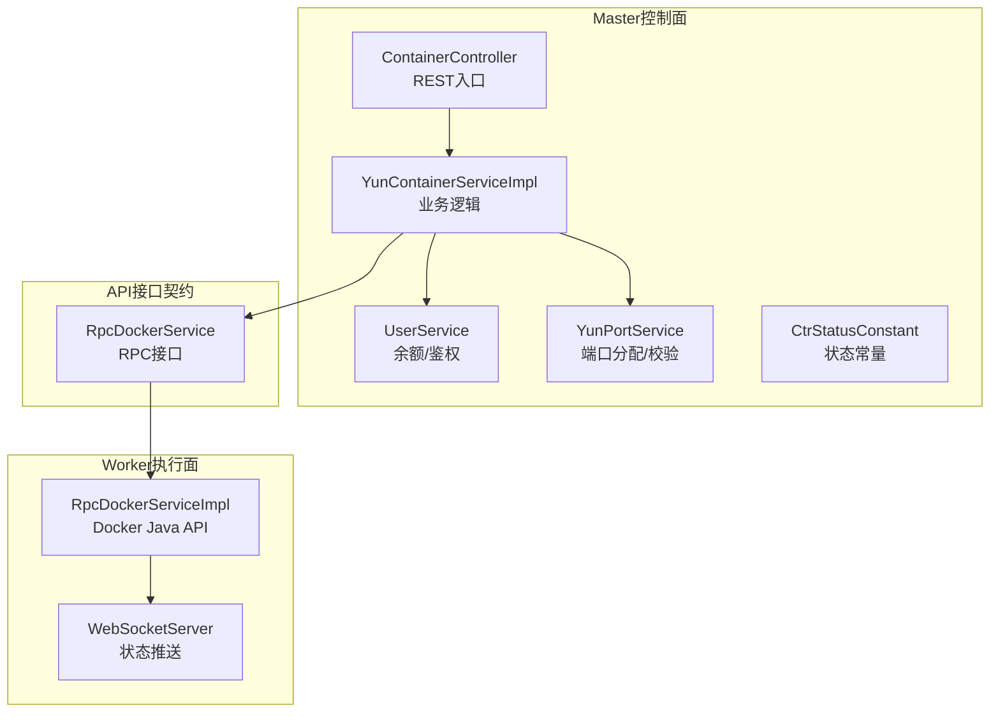
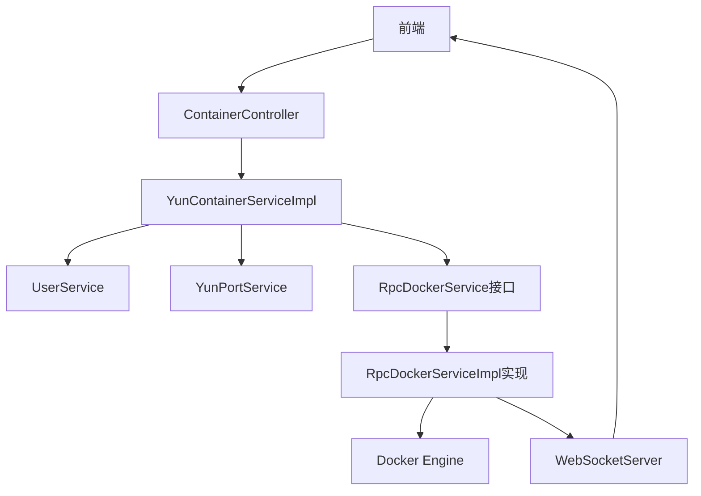
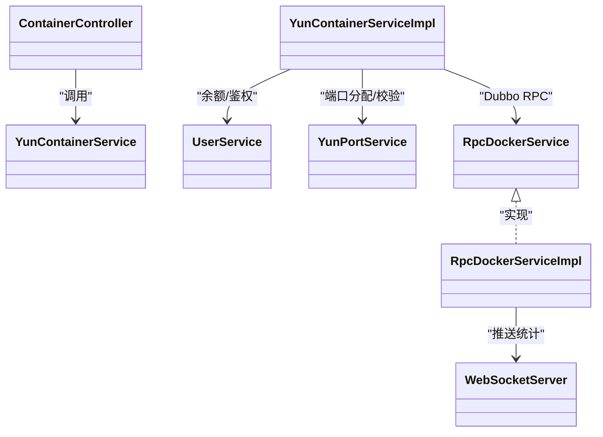
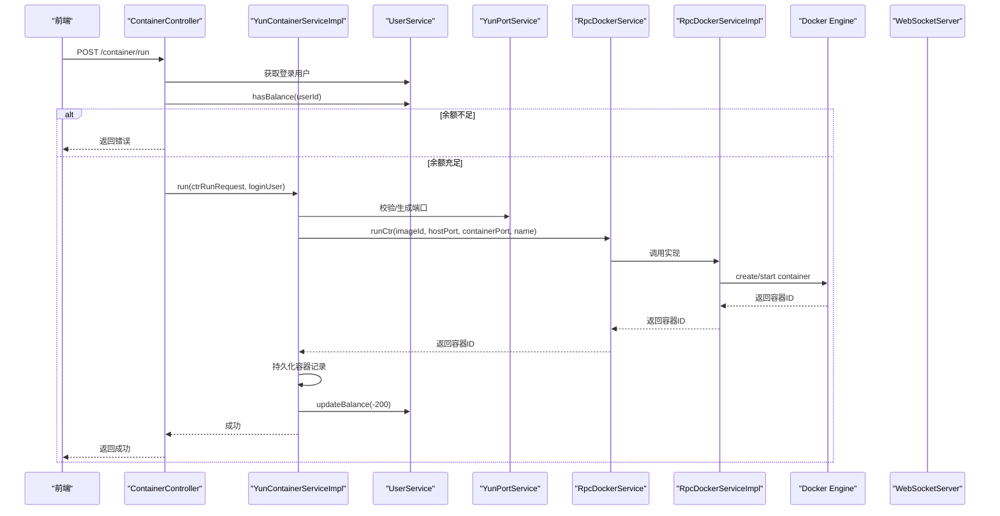

# 容器管理

<cite>
**本文引用的文件**
- [ContainerController.java](file://yun-docker-master/src/main/java/com/lfc/yundocker/controller/ContainerController.java)
- [YunContainerService.java](file://yun-docker-master/src/main/java/com/lfc/yundocker/service/YunContainerService.java)
- [YunContainerServiceImpl.java](file://yun-docker-master/src/main/java/com/lfc/yundocker/service/impl/YunContainerServiceImpl.java)
- [RpcDockerService.java](file://yun-docker-api/src/main/java/com/lfc/yundocker/service/RpcDockerService.java)
- [RpcDockerServiceImpl.java](file://yun-docker-worker/src/main/java/com/lfc/yundocker/worker/rpc/RpcDockerServiceImpl.java)
- [WebSocketServer.java](file://yun-docker-worker/src/main/java/com/lfc/yundocker/worker/websocket/WebSocketServer.java)
- [UserService.java](file://yun-docker-master/src/main/java/com/lfc/yundocker/service/UserService.java)
- [YunPortService.java](file://yun-docker-master/src/main/java/com/lfc/yundocker/service/YunPortService.java)
- [CtrStatusConstant.java](file://yun-docker-common/src/main/java/com/lfc/yundocker/common/constant/CtrStatusConstant.java)
- [CtrRunRequest.java](file://yun-docker-common/src/main/java/com/lfc/yundocker/common/model/dto/CtrRunRequest.java)
- [application.yml（master）](file://yun-docker-master/src/main/resources/application.yml)
- [application.yml（worker）](file://yun-docker-worker/src/main/resources/application.yml)
- [create_table.sql](file://sql/create_table.sql)
- [GlobalExceptionHandler.java](file://yun-docker-common/src/main/java/com/lfc/yundocker/common/exception/GlobalExceptionHandler.java)
</cite>

## 目录
1. [引言](#引言)
2. [项目结构](#项目结构)
3. [核心组件](#核心组件)
4. [架构总览](#架构总览)
5. [详细组件分析](#详细组件分析)
6. [依赖关系分析](#依赖关系分析)
7. [性能考量](#性能考量)
8. [故障排查指南](#故障排查指南)
9. [结论](#结论)
10. [附录](#附录)

## 引言
本文件围绕“容器全生命周期管理”的技术实现路径展开，系统性梳理从HTTP请求到Docker执行的完整链路：前端发起REST请求→Controller参数校验与鉴权→业务层执行余额与配额校验、数据库状态更新→通过Dubbo RPC调用Worker节点的RpcDockerService→Worker节点使用Docker Java API执行容器操作（run/start/remove/restart等）→通过WebSocket向前端推送实时状态。文档同时结合代码片段路径说明关键逻辑，如run()方法中如何生成唯一容器名、分配端口、扣减用户积分；并分析异常处理策略与回滚思路，最后给出创建容器的时序图，覆盖Controller→Service→RPC→Docker Engine全流程。

## 项目结构
项目采用多模块划分：
- master：Web控制器与业务服务，负责鉴权、参数校验、余额与配额检查、数据库状态更新、Dubbo调用Worker。
- worker：Dubbo服务端，承接容器生命周期操作，使用Docker Java API与Docker Engine交互，通过WebSocket推送状态。
- api：接口契约（RpcDockerService），定义容器相关RPC能力。
- common：通用常量、异常、工具与DTO模型。
- sql：数据库建表脚本。

图表来源
- [ContainerController.java](file://yun-docker-master/src/main/java/com/lfc/yundocker/controller/ContainerController.java#L1-L173)
- [YunContainerServiceImpl.java](file://yun-docker-master/src/main/java/com/lfc/yundocker/service/impl/YunContainerServiceImpl.java#L1-L318)
- [UserService.java](file://yun-docker-master/src/main/java/com/lfc/yundocker/service/UserService.java#L1-L124)
- [YunPortService.java](file://yun-docker-master/src/main/java/com/lfc/yundocker/service/YunPortService.java#L1-L19)
- [CtrStatusConstant.java](file://yun-docker-common/src/main/java/com/lfc/yundocker/common/constant/CtrStatusConstant.java#L1-L30)
- [RpcDockerService.java](file://yun-docker-api/src/main/java/com/lfc/yundocker/service/RpcDockerService.java#L1-L143)
- [RpcDockerServiceImpl.java](file://yun-docker-worker/src/main/java/com/lfc/yundocker/worker/rpc/RpcDockerServiceImpl.java#L1-L440)
- [WebSocketServer.java](file://yun-docker-worker/src/main/java/com/lfc/yundocker/worker/websocket/WebSocketServer.java#L1-L175)

章节来源
- [application.yml（master）](file://yun-docker-master/src/main/resources/application.yml#L1-L60)
- [application.yml（worker）](file://yun-docker-worker/src/main/resources/application.yml#L1-L51)

## 核心组件
- ContainerController：REST入口，负责参数校验、鉴权、调用业务层。
- YunContainerService/Impl：业务编排，余额检查、资源配额、数据库持久化、Dubbo调用Worker。
- RpcDockerService/Impl：Worker侧容器操作接口与实现，对接Docker Java API。
- WebSocketServer：基于Javax WebSocket向前端推送容器状态。
- UserService/YunPortService：余额与端口服务。
- CtrStatusConstant：容器状态常量。
- CtrRunRequest：创建容器请求体DTO。

章节来源
- [ContainerController.java](file://yun-docker-master/src/main/java/com/lfc/yundocker/controller/ContainerController.java#L1-L173)
- [YunContainerServiceImpl.java](file://yun-docker-master/src/main/java/com/lfc/yundocker/service/impl/YunContainerServiceImpl.java#L1-L318)
- [RpcDockerService.java](file://yun-docker-api/src/main/java/com/lfc/yundocker/service/RpcDockerService.java#L1-L143)
- [RpcDockerServiceImpl.java](file://yun-docker-worker/src/main/java/com/lfc/yundocker/worker/rpc/RpcDockerServiceImpl.java#L1-L440)
- [WebSocketServer.java](file://yun-docker-worker/src/main/java/com/lfc/yundocker/worker/websocket/WebSocketServer.java#L1-L175)
- [UserService.java](file://yun-docker-master/src/main/java/com/lfc/yundocker/service/UserService.java#L1-L124)
- [YunPortService.java](file://yun-docker-master/src/main/java/com/lfc/yundocker/service/YunPortService.java#L1-L19)
- [CtrStatusConstant.java](file://yun-docker-common/src/main/java/com/lfc/yundocker/common/constant/CtrStatusConstant.java#L1-L30)
- [CtrRunRequest.java](file://yun-docker-common/src/main/java/com/lfc/yundocker/common/model/dto/CtrRunRequest.java#L1-L35)

## 架构总览
整体采用“控制面+执行面”分离：
- 控制面（master）：负责鉴权、参数校验、余额/配额、状态持久化、RPC调度。
- 执行面（worker）：负责与Docker Engine交互、统计采集、状态推送。
- 通信：Dubbo RPC（master→worker），WebSocket（worker→前端）。

图表来源
- [ContainerController.java](file://yun-docker-master/src/main/java/com/lfc/yundocker/controller/ContainerController.java#L1-L173)
- [YunContainerServiceImpl.java](file://yun-docker-master/src/main/java/com/lfc/yundocker/service/impl/YunContainerServiceImpl.java#L1-L318)
- [RpcDockerService.java](file://yun-docker-api/src/main/java/com/lfc/yundocker/service/RpcDockerService.java#L1-L143)
- [RpcDockerServiceImpl.java](file://yun-docker-worker/src/main/java/com/lfc/yundocker/worker/rpc/RpcDockerServiceImpl.java#L1-L440)
- [WebSocketServer.java](file://yun-docker-worker/src/main/java/com/lfc/yundocker/worker/websocket/WebSocketServer.java#L1-L175)

## 详细组件分析

### 控制器层：ContainerController
- 负责REST端点与参数校验，鉴权通过UserService获取登录用户。
- 提供分页查询、启停/重启/删除、创建容器、下载日志等接口。
- 创建容器前进行余额检查，不足则直接返回错误。

关键路径
- [run()创建容器](file://yun-docker-master/src/main/java/com/lfc/yundocker/controller/ContainerController.java#L117-L133)
- [startOrStop()启停](file://yun-docker-master/src/main/java/com/lfc/yundocker/controller/ContainerController.java#L78-L88)
- [restart()重启](file://yun-docker-master/src/main/java/com/lfc/yundocker/controller/ContainerController.java#L97-L107)
- [remove()删除](file://yun-docker-master/src/main/java/com/lfc/yundocker/controller/ContainerController.java#L142-L152)
- [logCtr()下载日志](file://yun-docker-master/src/main/java/com/lfc/yundocker/controller/ContainerController.java#L161-L170)

章节来源
- [ContainerController.java](file://yun-docker-master/src/main/java/com/lfc/yundocker/controller/ContainerController.java#L1-L173)
- [UserService.java](file://yun-docker-master/src/main/java/com/lfc/yundocker/service/UserService.java#L1-L124)

### 业务层：YunContainerServiceImpl
- run()：镜像合法性校验、端口分配/校验、容器名生成、调用Worker runCtr、持久化、扣减余额。
- startOrStop()：根据状态切换，调用Worker startCtr/stopCtr并更新数据库。
- restart()/remove()：调用Worker restartCtr/removeCtr，删除时返还余额。
- logCtr()：调用Worker logCtr并将日志写入响应流。
- readStats()：触发Worker统计采集，前端通过WebSocket接收。

关键路径
- [run()创建流程](file://yun-docker-master/src/main/java/com/lfc/yundocker/service/impl/YunContainerServiceImpl.java#L136-L215)
- [startOrStop()启停流程](file://yun-docker-master/src/main/java/com/lfc/yundocker/service/impl/YunContainerServiceImpl.java#L108-L134)
- [restart()重启流程](file://yun-docker-master/src/main/java/com/lfc/yundocker/service/impl/YunContainerServiceImpl.java#L217-L227)
- [remove()删除流程](file://yun-docker-master/src/main/java/com/lfc/yundocker/service/impl/YunContainerServiceImpl.java#L229-L246)
- [logCtr()日志下载](file://yun-docker-master/src/main/java/com/lfc/yundocker/service/impl/YunContainerServiceImpl.java#L273-L295)
- [readStats()统计采集](file://yun-docker-master/src/main/java/com/lfc/yundocker/service/impl/YunContainerServiceImpl.java#L248-L257)

章节来源
- [YunContainerServiceImpl.java](file://yun-docker-master/src/main/java/com/lfc/yundocker/service/impl/YunContainerServiceImpl.java#L1-L318)
- [UserService.java](file://yun-docker-master/src/main/java/com/lfc/yundocker/service/UserService.java#L1-L124)
- [YunPortService.java](file://yun-docker-master/src/main/java/com/lfc/yundocker/service/YunPortService.java#L1-L19)
- [CtrStatusConstant.java](file://yun-docker-common/src/main/java/com/lfc/yundocker/common/constant/CtrStatusConstant.java#L1-L30)

### Worker执行层：RpcDockerServiceImpl
- runCtr()：创建容器、绑定端口、启动容器并返回容器ID。
- startCtr()/stopCtr()/restartCtr()/removeCtr()：容器启停/重启/删除。
- logCtr()：拉取容器日志并返回字节数组。
- readCtrStats()：持续采集统计并通过WebSocket推送。
- closeStatsCmd()：关闭统计订阅。

关键路径
- [runCtr()创建容器](file://yun-docker-worker/src/main/java/com/lfc/yundocker/worker/rpc/RpcDockerServiceImpl.java#L82-L107)
- [startCtr()/stopCtr()/restartCtr()/removeCtr()](file://yun-docker-worker/src/main/java/com/lfc/yundocker/worker/rpc/RpcDockerServiceImpl.java#L320-L438)
- [logCtr()日志采集](file://yun-docker-worker/src/main/java/com/lfc/yundocker/worker/rpc/RpcDockerServiceImpl.java#L345-L413)
- [readCtrStats()统计推送](file://yun-docker-worker/src/main/java/com/lfc/yundocker/worker/rpc/RpcDockerServiceImpl.java#L195-L258)

章节来源
- [RpcDockerServiceImpl.java](file://yun-docker-worker/src/main/java/com/lfc/yundocker/worker/rpc/RpcDockerServiceImpl.java#L1-L440)
- [WebSocketServer.java](file://yun-docker-worker/src/main/java/com/lfc/yundocker/worker/websocket/WebSocketServer.java#L1-L175)

### WebSocket推送：WebSocketServer
- 建立/维护用户到WebSocket的映射，接收前端统计订阅消息，转发到Worker执行统计采集。
- 断开连接时关闭对应用户的统计订阅。

关键路径
- [onOpen/onClose/onMessage/sendInfo](file://yun-docker-worker/src/main/java/com/lfc/yundocker/worker/websocket/WebSocketServer.java#L50-L175)

章节来源
- [WebSocketServer.java](file://yun-docker-worker/src/main/java/com/lfc/yundocker/worker/websocket/WebSocketServer.java#L1-L175)

### 数据模型与状态
- 容器状态常量：RUNNING/EXITED/PAUSED/RESTARTING。
- 请求体：CtrRunRequest包含镜像ID、宿主机端口、容器端口、自定义名称。
- 数据库表：user、yun_image、yun_container、yun_port、yun_order。

章节来源
- [CtrStatusConstant.java](file://yun-docker-common/src/main/java/com/lfc/yundocker/common/constant/CtrStatusConstant.java#L1-L30)
- [CtrRunRequest.java](file://yun-docker-common/src/main/java/com/lfc/yundocker/common/model/dto/CtrRunRequest.java#L1-L35)
- [create_table.sql](file://sql/create_table.sql#L1-L87)

## 依赖关系分析
- 控制器依赖业务服务与用户服务。
- 业务服务通过Dubbo引用RpcDockerService接口，调用Worker实现。
- Worker实现依赖Docker Java API与WebSocket推送。
- 异常统一由全局异常处理器捕获并返回。

图表来源
- [ContainerController.java](file://yun-docker-master/src/main/java/com/lfc/yundocker/controller/ContainerController.java#L1-L173)
- [YunContainerServiceImpl.java](file://yun-docker-master/src/main/java/com/lfc/yundocker/service/impl/YunContainerServiceImpl.java#L1-L318)
- [UserService.java](file://yun-docker-master/src/main/java/com/lfc/yundocker/service/UserService.java#L1-L124)
- [YunPortService.java](file://yun-docker-master/src/main/java/com/lfc/yundocker/service/YunPortService.java#L1-L19)
- [RpcDockerService.java](file://yun-docker-api/src/main/java/com/lfc/yundocker/service/RpcDockerService.java#L1-L143)
- [RpcDockerServiceImpl.java](file://yun-docker-worker/src/main/java/com/lfc/yundocker/worker/rpc/RpcDockerServiceImpl.java#L1-L440)
- [WebSocketServer.java](file://yun-docker-worker/src/main/java/com/lfc/yundocker/worker/websocket/WebSocketServer.java#L1-L175)

## 性能考量
- 端口分配：公共镜像使用固定容器端口，私有镜像可自定义或自动生成，避免冲突。
- 统计采集：按需开启/关闭，断开连接时及时释放资源，降低内存占用。
- 日志拉取：异步写入临时文件再读取，避免阻塞IO。
- Docker内存限制：Worker侧对容器内存进行限制，防止资源滥用。
- Dubbo超时与重试：master侧配置了超时与重试策略，需结合业务场景调整。

章节来源
- [YunContainerServiceImpl.java](file://yun-docker-master/src/main/java/com/lfc/yundocker/service/impl/YunContainerServiceImpl.java#L136-L215)
- [RpcDockerServiceImpl.java](file://yun-docker-worker/src/main/java/com/lfc/yundocker/worker/rpc/RpcDockerServiceImpl.java#L82-L107)
- [application.yml（master）](file://yun-docker-master/src/main/resources/application.yml#L1-L60)
- [application.yml（worker）](file://yun-docker-worker/src/main/resources/application.yml#L1-L51)

## 故障排查指南
- 参数校验失败：检查请求体与鉴权信息，确保登录态有效。
- 余额不足：创建容器前会校验余额，提示充值。
- Docker操作失败：捕获业务异常并记录错误指标，必要时回滚数据库状态（删除时返还余额）。
- WebSocket无法推送：确认连接建立、用户ID匹配、连接断开时关闭统计订阅。
- 端口冲突：检查宿主机端口合法性或自动生成可用端口。

章节来源
- [ContainerController.java](file://yun-docker-master/src/main/java/com/lfc/yundocker/controller/ContainerController.java#L117-L133)
- [YunContainerServiceImpl.java](file://yun-docker-master/src/main/java/com/lfc/yundocker/service/impl/YunContainerServiceImpl.java#L136-L215)
- [GlobalExceptionHandler.java](file://yun-docker-common/src/main/java/com/lfc/yundocker/common/exception/GlobalExceptionHandler.java#L1-L32)
- [WebSocketServer.java](file://yun-docker-worker/src/main/java/com/lfc/yundocker/worker/websocket/WebSocketServer.java#L50-L175)

## 结论
该系统通过“控制面+执行面”的清晰分工，实现了从HTTP请求到Docker执行的完整闭环：控制面负责鉴权、参数校验、余额与配额、数据库状态与RPC调度；执行面负责与Docker Engine交互与状态推送。业务层在创建容器时完成镜像校验、端口分配、容器命名、扣减余额与持久化；异常通过全局处理器统一处理。整体架构具备良好的扩展性与可观测性。

## 附录

### 创建容器时序图（Controller→Service→RPC→Docker Engine）

图表来源
- [ContainerController.java](file://yun-docker-master/src/main/java/com/lfc/yundocker/controller/ContainerController.java#L117-L133)
- [YunContainerServiceImpl.java](file://yun-docker-master/src/main/java/com/lfc/yundocker/service/impl/YunContainerServiceImpl.java#L136-L215)
- [UserService.java](file://yun-docker-master/src/main/java/com/lfc/yundocker/service/UserService.java#L1-L124)
- [YunPortService.java](file://yun-docker-master/src/main/java/com/lfc/yundocker/service/YunPortService.java#L1-L19)
- [RpcDockerService.java](file://yun-docker-api/src/main/java/com/lfc/yundocker/service/RpcDockerService.java#L1-L143)
- [RpcDockerServiceImpl.java](file://yun-docker-worker/src/main/java/com/lfc/yundocker/worker/rpc/RpcDockerServiceImpl.java#L82-L107)

### 关键逻辑说明（代码片段路径）
- 容器名生成与端口分配
  - [run()中容器名生成与端口策略](file://yun-docker-master/src/main/java/com/lfc/yundocker/service/impl/YunContainerServiceImpl.java#L160-L176)
- 扣减用户积分
  - [run()中扣减余额](file://yun-docker-master/src/main/java/com/lfc/yundocker/service/impl/YunContainerServiceImpl.java#L213-L215)
- 启停状态切换
  - [startOrStop()状态切换与DB更新](file://yun-docker-master/src/main/java/com/lfc/yundocker/service/impl/YunContainerServiceImpl.java#L108-L134)
- 删除时返还余额
  - [remove()返还余额与删除容器](file://yun-docker-master/src/main/java/com/lfc/yundocker/service/impl/YunContainerServiceImpl.java#L229-L246)
- Docker操作失败回滚
  - [run()中异常捕获与指标记录](file://yun-docker-master/src/main/java/com/lfc/yundocker/service/impl/YunContainerServiceImpl.java#L186-L192)
  - [logCtr()异常处理](file://yun-docker-master/src/main/java/com/lfc/yundocker/service/impl/YunContainerServiceImpl.java#L280-L295)
- WebSocket统计推送
  - [readCtrStats()统计采集与推送](file://yun-docker-worker/src/main/java/com/lfc/yundocker/worker/rpc/RpcDockerServiceImpl.java#L195-L258)
  - [WebSocketServer消息路由](file://yun-docker-worker/src/main/java/com/lfc/yundocker/worker/websocket/WebSocketServer.java#L90-L120)