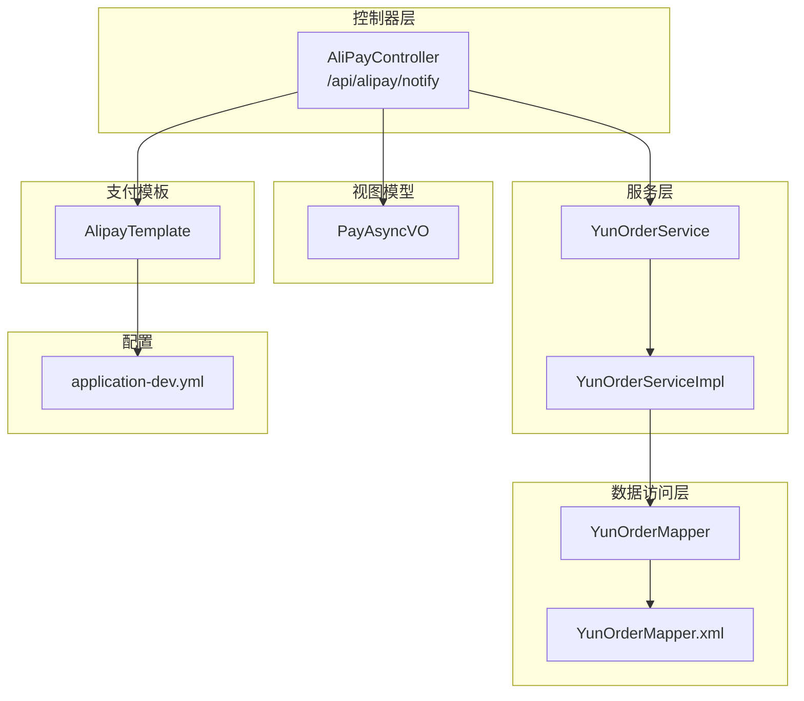
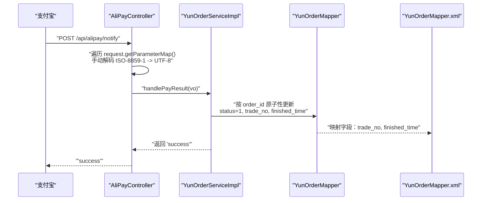
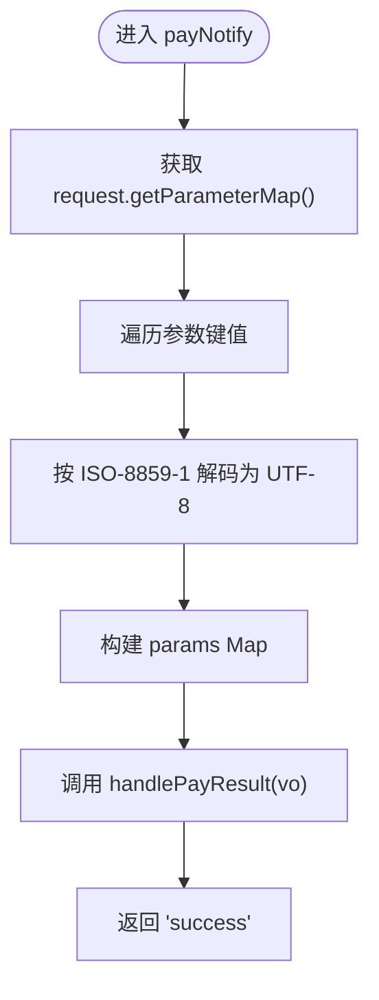
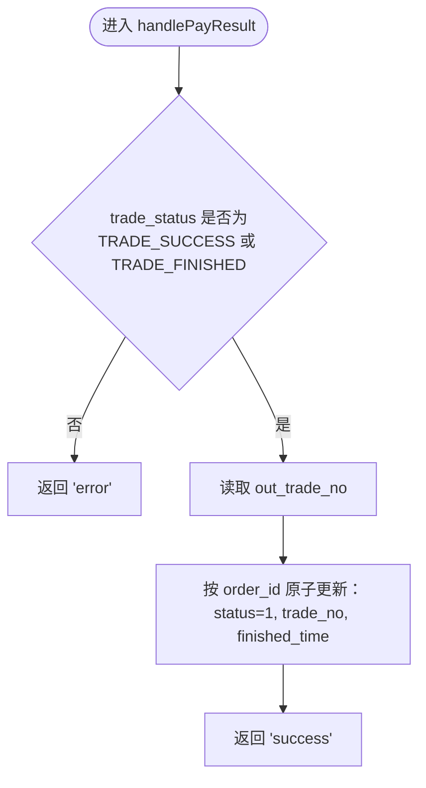
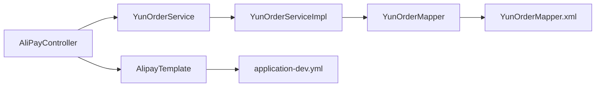

# 异步回调处理

<cite>
**本文引用的文件**
- [AliPayController.java](file://yun-docker-master/src/main/java/com/lfc/yundocker/controller/AliPayController.java)
- [PayAsyncVO.java](file://yun-docker-master/src/main/java/com/lfc/yundocker/common/model/vo/PayAsyncVO.java)
- [YunOrderService.java](file://yun-docker-master/src/main/java/com/lfc/yundocker/service/YunOrderService.java)
- [YunOrderServiceImpl.java](file://yun-docker-master/src/main/java/com/lfc/yundocker/service/impl/YunOrderServiceImpl.java)
- [YunOrderMapper.java](file://yun-docker-master/src/main/java/com/lfc/yundocker/mapper/YunOrderMapper.java)
- [YunOrderMapper.xml](file://yun-docker-master/src/main/resources/mapper/YunOrderMapper.xml)
- [AlipayTemplate.java](file://yun-docker-master/src/main/java/com/lfc/yundocker/manager/AlipayTemplate.java)
- [application-dev.yml](file://yun-docker-master/src/main/resources/application-dev.yml)
</cite>

## 目录
1. [简介](#简介)
2. [项目结构](#项目结构)
3. [核心组件](#核心组件)
4. [架构总览](#架构总览)
5. [详细组件分析](#详细组件分析)
6. [依赖关系分析](#依赖关系分析)
7. [性能与并发特性](#性能与并发特性)
8. [故障排查指南](#故障排查指南)
9. [结论](#结论)

## 简介
本文聚焦于支付宝异步回调 notifyUrl 的处理流程，系统性解析 AliPayController.payNotify() 如何接收并解析支付宝 POST 回调参数，如何将参数映射到 PayAsyncVO 对象，以及在当前实现中手动解析字符编码（ISO-8859-1 转 UTF-8）的必要性。随后深入剖析 YunOrderService.handlePayResult() 的实现细节：当 trade_status 为 TRADE_SUCCESS 或 TRADE_FINISHED 时，如何原子性地更新订单状态、写入支付宝交易号与完成时间，并返回字符串“success”以避免支付宝重复推送。最后，结合代码指出当前验签逻辑处于注释状态，强调在生产环境必须启用 AlipaySignature.rsaCheckV2() 进行安全校验，防止伪造通知。

## 项目结构
围绕支付宝异步回调的关键模块分布如下：
- 控制器层：AliPayController 提供 /api/alipay/notify 的 POST 接口，负责接收支付宝回调并转发给业务服务。
- 视图模型：PayAsyncVO 定义了异步回调参数的字段集合，用于接收支付宝回调数据。
- 服务层：YunOrderService 接口声明 handlePayResult() 方法；YunOrderServiceImpl 实现该方法，执行订单状态更新与记录。
- 数据访问层：YunOrderMapper 与 YunOrderMapper.xml 定义订单实体映射与基础列清单。
- 支付模板：AlipayTemplate 注入支付宝配置（如 notifyUrl、alipayPublicKey、charset、signType 等），并在下单时设置 notifyUrl。
- 配置文件：application-dev.yml 提供支付宝网关、公钥、回调地址等关键配置。

图表来源
- [AliPayController.java](file://yun-docker-master/src/main/java/com/lfc/yundocker/controller/AliPayController.java#L74-L112)
- [PayAsyncVO.java](file://yun-docker-master/src/main/java/com/lfc/yundocker/common/model/vo/PayAsyncVO.java#L1-L39)
- [YunOrderService.java](file://yun-docker-master/src/main/java/com/lfc/yundocker/service/YunOrderService.java#L1-L27)
- [YunOrderServiceImpl.java](file://yun-docker-master/src/main/java/com/lfc/yundocker/service/impl/YunOrderServiceImpl.java#L64-L81)
- [YunOrderMapper.java](file://yun-docker-master/src/main/java/com/lfc/yundocker/mapper/YunOrderMapper.java#L1-L19)
- [YunOrderMapper.xml](file://yun-docker-master/src/main/resources/mapper/YunOrderMapper.xml#L1-L26)
- [AlipayTemplate.java](file://yun-docker-master/src/main/java/com/lfc/yundocker/manager/AlipayTemplate.java#L1-L108)
- [application-dev.yml](file://yun-docker-master/src/main/resources/application-dev.yml#L69-L81)

章节来源
- [AliPayController.java](file://yun-docker-master/src/main/java/com/lfc/yundocker/controller/AliPayController.java#L74-L112)
- [AlipayTemplate.java](file://yun-docker-master/src/main/java/com/lfc/yundocker/manager/AlipayTemplate.java#L37-L41)
- [application-dev.yml](file://yun-docker-master/src/main/resources/application-dev.yml#L69-L81)

## 核心组件
- AliPayController.payNotify(): 接收支付宝 POST 回调，手动解析参数编码，构造参数 Map，调用 YunOrderService.handlePayResult() 并返回“success”。
- PayAsyncVO: 承载支付宝异步回调参数的 VO 类，包含 out_trade_no、trade_status、trade_no、notify_time 等字段。
- YunOrderService.handlePayResult(): 根据 trade_status 决策是否更新订单状态为已支付，写入支付宝交易号与完成时间，返回“success”或“error”。

章节来源
- [AliPayController.java](file://yun-docker-master/src/main/java/com/lfc/yundocker/controller/AliPayController.java#L74-L112)
- [PayAsyncVO.java](file://yun-docker-master/src/main/java/com/lfc/yundocker/common/model/vo/PayAsyncVO.java#L1-L39)
- [YunOrderService.java](file://yun-docker-master/src/main/java/com/lfc/yundocker/service/YunOrderService.java#L19-L21)
- [YunOrderServiceImpl.java](file://yun-docker-master/src/main/java/com/lfc/yundocker/service/impl/YunOrderServiceImpl.java#L64-L81)

## 架构总览
支付宝异步回调的整体交互流程如下：
- 支付宝向 notifyUrl 发送 POST 请求，携带签名与业务参数。
- AliPayController 接收请求，手动解析参数编码，构造参数 Map。
- 将 PayAsyncVO 交由 YunOrderService.handlePayResult() 处理。
- 若满足条件（trade_status 为 TRADE_SUCCESS 或 TRADE_FINISHED），原子性更新订单状态、交易号与完成时间。
- 返回“success”，告知支付宝不再重复推送。

图表来源
- [AliPayController.java](file://yun-docker-master/src/main/java/com/lfc/yundocker/controller/AliPayController.java#L74-L112)
- [YunOrderServiceImpl.java](file://yun-docker-master/src/main/java/com/lfc/yundocker/service/impl/YunOrderServiceImpl.java#L64-L81)
- [YunOrderMapper.xml](file://yun-docker-master/src/main/resources/mapper/YunOrderMapper.xml#L1-L26)

## 详细组件分析

### AliPayController.payNotify()：参数接收与字符编码处理
- 接口路径：/api/alipay/notify，POST 方法。
- 参数绑定：使用 @RequestBody 绑定 PayAsyncVO，但实际实现中通过 request.getParameterMap() 手动构建参数 Map，以规避默认字符集导致的乱码问题。
- 字符编码处理：遍历 request.getParameterMap()，将每个键值串从 ISO-8859-1 解码为 UTF-8，再放入 params Map，确保后续验签与业务处理的正确性。
- 调用链：将 PayAsyncVO 传入 YunOrderService.handlePayResult()，统一返回“success”。

图表来源
- [AliPayController.java](file://yun-docker-master/src/main/java/com/lfc/yundocker/controller/AliPayController.java#L74-L112)

章节来源
- [AliPayController.java](file://yun-docker-master/src/main/java/com/lfc/yundocker/controller/AliPayController.java#L74-L112)

### PayAsyncVO：异步回调参数载体
- 字段覆盖：包含 out_trade_no（商户订单号）、trade_status（交易状态）、trade_no（支付宝交易号）、notify_time（通知时间）、sign（签名）、sign_type（签名类型）等。
- 使用场景：作为 AliPayController 接收回调后的参数载体，传递给业务层处理。

章节来源
- [PayAsyncVO.java](file://yun-docker-master/src/main/java/com/lfc/yundocker/common/model/vo/PayAsyncVO.java#L1-L39)

### YunOrderService.handlePayResult()：订单状态更新与原子性
- 条件判断：当 trade_status 等于“TRADE_SUCCESS”或“TRADE_FINISHED”时执行更新。
- 更新内容：将订单状态设为 1（支付成功），写入支付宝交易号（trade_no），记录完成时间（finished_time）。
- 原子性：通过 MyBatis-Plus 的 update() 条件更新，基于 order_id 原子性地修改目标字段，避免并发冲突影响。
- 返回值：返回“success”，用于告知支付宝不再重复推送；否则返回“error”。

图表来源
- [YunOrderServiceImpl.java](file://yun-docker-master/src/main/java/com/lfc/yundocker/service/impl/YunOrderServiceImpl.java#L64-L81)
- [YunOrderMapper.xml](file://yun-docker-master/src/main/resources/mapper/YunOrderMapper.xml#L1-L26)

章节来源
- [YunOrderService.java](file://yun-docker-master/src/main/java/com/lfc/yundocker/service/YunOrderService.java#L19-L21)
- [YunOrderServiceImpl.java](file://yun-docker-master/src/main/java/com/lfc/yundocker/service/impl/YunOrderServiceImpl.java#L64-L81)
- [YunOrderMapper.xml](file://yun-docker-master/src/main/resources/mapper/YunOrderMapper.xml#L1-L26)

### 数据模型与映射
- 实体映射：YunOrderMapper.xml 定义了订单实体字段与数据库列的映射，包括 trade_no、finished_time 等，确保更新字段与数据库一致。
- 查询与更新：YunOrderMapper 接口继承 BaseMapper，提供通用 CRUD 能力；handlePayResult() 使用条件更新，确保只更新匹配的订单。

章节来源
- [YunOrderMapper.java](file://yun-docker-master/src/main/java/com/lfc/yundocker/mapper/YunOrderMapper.java#L1-L19)
- [YunOrderMapper.xml](file://yun-docker-master/src/main/resources/mapper/YunOrderMapper.xml#L1-L26)

### 支付模板与回调地址
- 回调地址：AlipayTemplate 中注入 notifyUrl，下单时设置为 /api/alipay/notify，确保支付宝回调指向应用接口。
- 配置来源：application-dev.yml 提供支付宝网关、公钥、回调地址、签名类型与字符集等关键配置。

章节来源
- [AlipayTemplate.java](file://yun-docker-master/src/main/java/com/lfc/yundocker/manager/AlipayTemplate.java#L37-L41)
- [application-dev.yml](file://yun-docker-master/src/main/resources/application-dev.yml#L69-L81)

## 依赖关系分析
- 控制器依赖服务：AliPayController 注入 YunOrderService 与 UserService，其中 YunOrderService 由 YunOrderServiceImpl 实现。
- 服务依赖数据访问：YunOrderServiceImpl 继承 ServiceImpl<YunOrderMapper, YunOrder>，直接使用 MyBatis-Plus 的 Mapper 能力。
- 配置依赖：AlipayTemplate 从 application-dev.yml 读取支付宝配置，包括 notifyUrl、alipayPublicKey、charset、signType 等。

图表来源
- [AliPayController.java](file://yun-docker-master/src/main/java/com/lfc/yundocker/controller/AliPayController.java#L1-L112)
- [YunOrderService.java](file://yun-docker-master/src/main/java/com/lfc/yundocker/service/YunOrderService.java#L1-L27)
- [YunOrderServiceImpl.java](file://yun-docker-master/src/main/java/com/lfc/yundocker/service/impl/YunOrderServiceImpl.java#L1-L118)
- [YunOrderMapper.java](file://yun-docker-master/src/main/java/com/lfc/yundocker/mapper/YunOrderMapper.java#L1-L19)
- [YunOrderMapper.xml](file://yun-docker-master/src/main/resources/mapper/YunOrderMapper.xml#L1-L26)
- [AlipayTemplate.java](file://yun-docker-master/src/main/java/com/lfc/yundocker/manager/AlipayTemplate.java#L1-L108)
- [application-dev.yml](file://yun-docker-master/src/main/resources/application-dev.yml#L69-L81)

章节来源
- [AliPayController.java](file://yun-docker-master/src/main/java/com/lfc/yundocker/controller/AliPayController.java#L1-L112)
- [YunOrderServiceImpl.java](file://yun-docker-master/src/main/java/com/lfc/yundocker/service/impl/YunOrderServiceImpl.java#L1-L118)
- [AlipayTemplate.java](file://yun-docker-master/src/main/java/com/lfc/yundocker/manager/AlipayTemplate.java#L1-L108)
- [application-dev.yml](file://yun-docker-master/src/main/resources/application-dev.yml#L69-L81)

## 性能与并发特性
- 原子性更新：handlePayResult() 使用 MyBatis-Plus 条件更新，基于主键或唯一条件（order_id）进行更新，具备数据库层面的原子性，降低并发写入风险。
- 编码处理：手动遍历并解码参数，避免因默认字符集导致的乱码，减少后续验签与业务处理的不确定性。
- 返回策略：统一返回“success”，可有效阻止支付宝重复推送，降低重复处理的风险与系统压力。

章节来源
- [YunOrderServiceImpl.java](file://yun-docker-master/src/main/java/com/lfc/yundocker/service/impl/YunOrderServiceImpl.java#L64-L81)
- [AliPayController.java](file://yun-docker-master/src/main/java/com/lfc/yundocker/controller/AliPayController.java#L74-L112)

## 故障排查指南
- 验签失败：当前实现中验签逻辑被注释，生产环境务必启用 AlipaySignature.rsaCheckV2()，使用 AlipayTemplate 中的 alipayPublicKey、charset、signType 进行验签，防止伪造通知。
- 参数乱码：若未进行 ISO-8859-1 -> UTF-8 解码，可能导致中文参数乱码，进而影响验签与业务处理。
- 回调地址：确认 application-dev.yml 中的 notifyUrl 与 AlipayTemplate.notifyUrl 设置正确，且可被支付宝外网访问。
- 幂等性：返回“success”后支付宝可能重复推送，需确保 handlePayResult() 对相同 out_trade_no 的重复处理不会产生副作用（例如二次扣款）。

章节来源
- [AliPayController.java](file://yun-docker-master/src/main/java/com/lfc/yundocker/controller/AliPayController.java#L74-L112)
- [AlipayTemplate.java](file://yun-docker-master/src/main/java/com/lfc/yundocker/manager/AlipayTemplate.java#L37-L41)
- [application-dev.yml](file://yun-docker-master/src/main/resources/application-dev.yml#L69-L81)

## 结论
本实现通过 AliPayController.payNotify() 接收支付宝回调，手动处理字符编码问题，并将参数映射到 PayAsyncVO，随后调用 YunOrderService.handlePayResult() 完成订单状态更新与记录。当前实现具备良好的原子性与幂等返回策略，但在生产环境中必须启用 AlipaySignature.rsaCheckV2() 进行安全校验，以抵御伪造通知攻击。建议在后续版本中完善日志与异常处理，增强可观测性与可维护性。