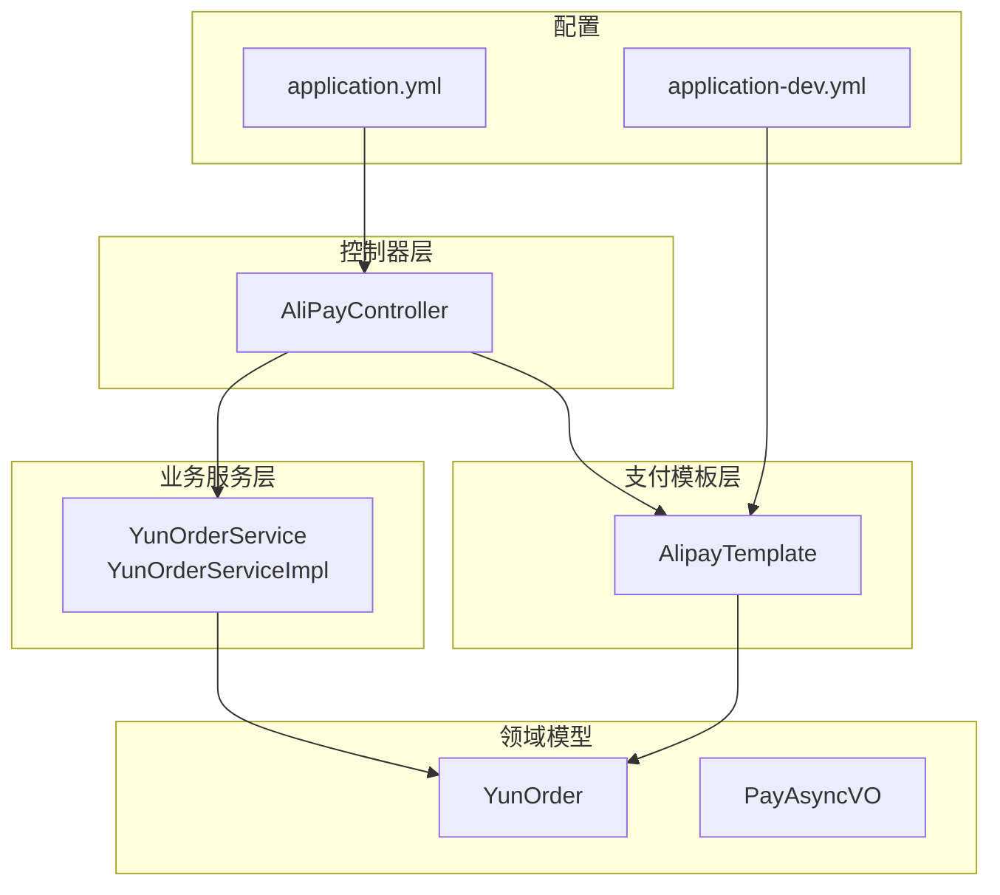
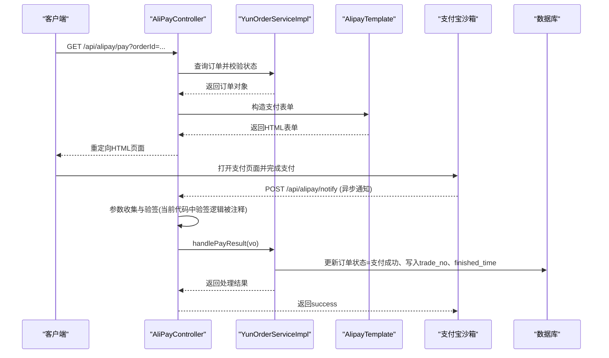
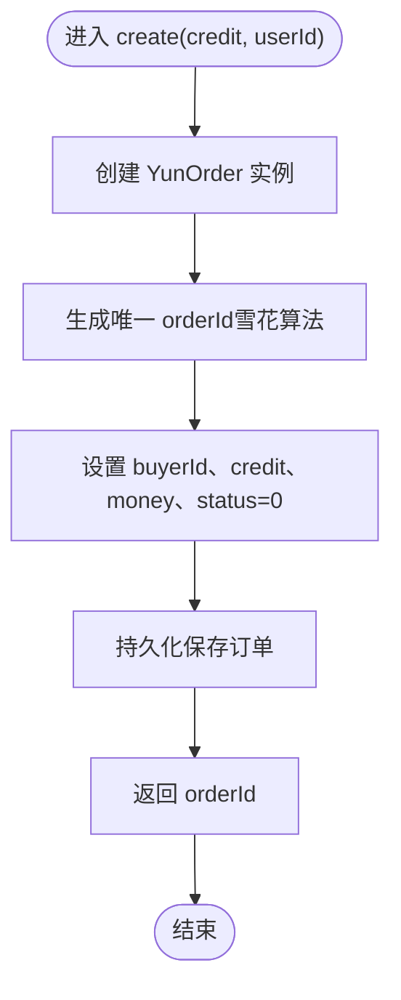
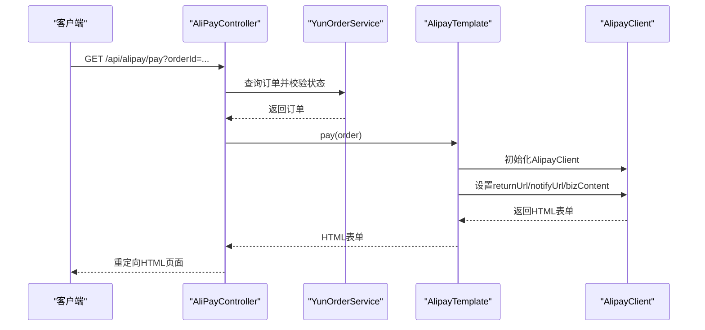
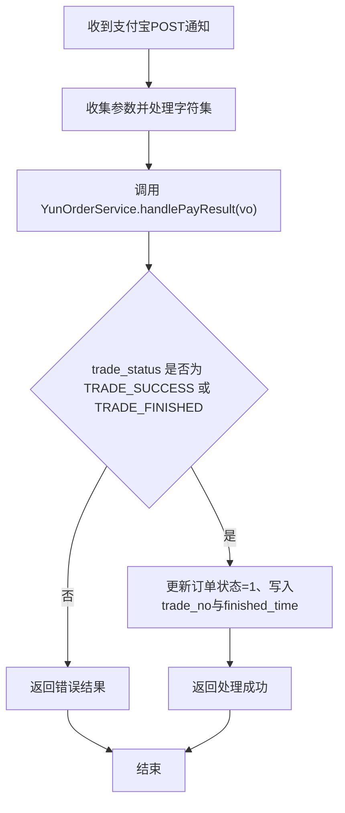
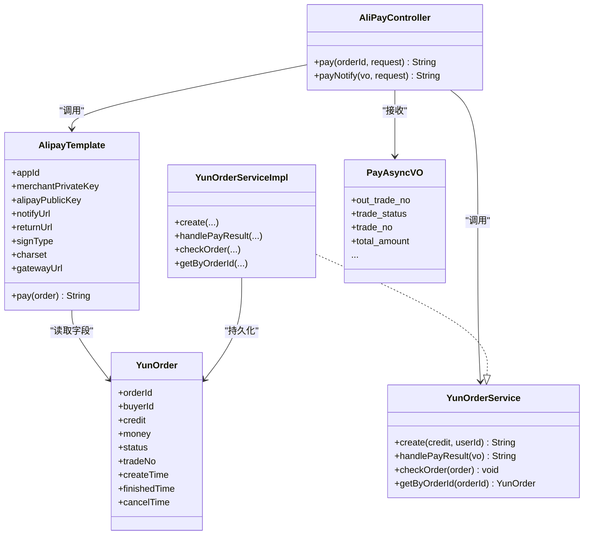

# 支付系统

<cite>
**本文引用的文件**
- [AliPayController.java](file://yun-docker-master/src/main/java/com/lfc/yundocker/controller/AliPayController.java)
- [AlipayTemplate.java](file://yun-docker-master/src/main/java/com/lfc/yundocker/manager/AlipayTemplate.java)
- [YunOrderService.java](file://yun-docker-master/src/main/java/com/lfc/yundocker/service/YunOrderService.java)
- [YunOrderServiceImpl.java](file://yun-docker-master/src/main/java/com/lfc/yundocker/service/impl/YunOrderServiceImpl.java)
- [PayAsyncVO.java](file://yun-docker-master/src/main/java/com/lfc/yundocker/common/model/vo/PayAsyncVO.java)
- [YunOrder.java](file://yun-docker-master/src/main/java/com/lfc/yundocker/common/model/entity/YunOrder.java)
- [application-dev.yml](file://yun-docker-master/src/main/resources/application-dev.yml)
- [application.yml](file://yun-docker-master/src/main/resources/application.yml)
</cite>

## 目录
1. [引言](#引言)
2. [项目结构](#项目结构)
3. [核心组件](#核心组件)
4. [架构总览](#架构总览)
5. [详细组件分析](#详细组件分析)
6. [依赖关系分析](#依赖关系分析)
7. [性能与并发特性](#性能与并发特性)
8. [故障排查指南](#故障排查指南)
9. [结论](#结论)

## 引言
本文件面向“基于支付宝的积分充值与订单管理系统”的实现进行深入解析，围绕以下目标展开：
- 解析 YunOrderService.create() 如何创建订单、生成唯一订单号、设置金额与初始状态；
- 分析 AliPayController.pay() 接口如何接收订单ID、校验订单状态、调用 AlipayTemplate.pay() 构造支付宝支付表单并返回重定向HTML；
- 重点解析异步回调 notifyUrl 的处理流程：AliPayController.payNotify() 接收支付宝POST通知、进行验签、调用 YunOrderService.handlePayResult() 更新订单状态为“支付成功”；
- 结合 application.yml 与 application-dev.yml 中的 alipay 配置项说明其作用；
- 提供支付流程的时序图，强调幂等性与安全验签的重要性。

## 项目结构
本项目采用分层与按功能模块组织的结构，支付相关的关键文件分布如下：
- 控制器层：AliPayController 负责对外暴露支付入口与异步回调接收；
- 业务服务层：YunOrderService 接口与其实现 YunOrderServiceImpl 负责订单生命周期管理；
- 支付模板层：AlipayTemplate 封装支付宝SDK初始化与支付表单构造；
- 领域模型：YunOrder 表示订单实体；PayAsyncVO 表示异步回调参数载体；
- 配置：application.yml 为通用配置，application-dev.yml 为开发环境的支付宝配置。

图表来源
- [AliPayController.java](file://yun-docker-master/src/main/java/com/lfc/yundocker/controller/AliPayController.java#L1-L113)
- [AlipayTemplate.java](file://yun-docker-master/src/main/java/com/lfc/yundocker/manager/AlipayTemplate.java#L1-L108)
- [YunOrderService.java](file://yun-docker-master/src/main/java/com/lfc/yundocker/service/YunOrderService.java#L1-L27)
- [YunOrderServiceImpl.java](file://yun-docker-master/src/main/java/com/lfc/yundocker/service/impl/YunOrderServiceImpl.java#L1-L118)
- [PayAsyncVO.java](file://yun-docker-master/src/main/java/com/lfc/yundocker/common/model/vo/PayAsyncVO.java#L1-L39)
- [YunOrder.java](file://yun-docker-master/src/main/java/com/lfc/yundocker/common/model/entity/YunOrder.java#L1-L77)
- [application.yml](file://yun-docker-master/src/main/resources/application.yml#L1-L60)
- [application-dev.yml](file://yun-docker-master/src/main/resources/application-dev.yml#L69-L81)

章节来源
- [AliPayController.java](file://yun-docker-master/src/main/java/com/lfc/yundocker/controller/AliPayController.java#L1-L113)
- [AlipayTemplate.java](file://yun-docker-master/src/main/java/com/lfc/yundocker/manager/AlipayTemplate.java#L1-L108)
- [YunOrderService.java](file://yun-docker-master/src/main/java/com/lfc/yundocker/service/YunOrderService.java#L1-L27)
- [YunOrderServiceImpl.java](file://yun-docker-master/src/main/java/com/lfc/yundocker/service/impl/YunOrderServiceImpl.java#L1-L118)
- [PayAsyncVO.java](file://yun-docker-master/src/main/java/com/lfc/yundocker/common/model/vo/PayAsyncVO.java#L1-L39)
- [YunOrder.java](file://yun-docker-master/src/main/java/com/lfc/yundocker/common/model/entity/YunOrder.java#L1-L77)
- [application.yml](file://yun-docker-master/src/main/resources/application.yml#L1-L60)
- [application-dev.yml](file://yun-docker-master/src/main/resources/application-dev.yml#L69-L81)

## 核心组件
- AliPayController：对外提供支付入口与异步回调接收，负责参数校验、订单查询与调用支付模板；
- AlipayTemplate：封装支付宝SDK初始化、支付请求构造与返回HTML表单；
- YunOrderService/YunOrderServiceImpl：订单创建、状态更新、超时取消、查询等；
- PayAsyncVO：异步回调参数载体；
- YunOrder：订单实体，包含订单号、金额、状态、交易号等字段；
- 配置：application-dev.yml 中的 alipay 节点提供 appId、merchantPrivateKey、alipayPublicKey、gatewayUrl、notifyUrl、returnUrl、signType、charset 等。

章节来源
- [AliPayController.java](file://yun-docker-master/src/main/java/com/lfc/yundocker/controller/AliPayController.java#L1-L113)
- [AlipayTemplate.java](file://yun-docker-master/src/main/java/com/lfc/yundocker/manager/AlipayTemplate.java#L1-L108)
- [YunOrderService.java](file://yun-docker-master/src/main/java/com/lfc/yundocker/service/YunOrderService.java#L1-L27)
- [YunOrderServiceImpl.java](file://yun-docker-master/src/main/java/com/lfc/yundocker/service/impl/YunOrderServiceImpl.java#L1-L118)
- [PayAsyncVO.java](file://yun-docker-master/src/main/java/com/lfc/yundocker/common/model/vo/PayAsyncVO.java#L1-L39)
- [YunOrder.java](file://yun-docker-master/src/main/java/com/lfc/yundocker/common/model/entity/YunOrder.java#L1-L77)
- [application-dev.yml](file://yun-docker-master/src/main/resources/application-dev.yml#L69-L81)

## 架构总览
支付系统整体交互流程如下：
- 前端发起支付请求，携带 orderId；
- 控制器查询订单并校验状态；
- 调用支付模板构造支付宝支付表单并返回HTML；
- 用户在支付宝沙箱完成支付后，支付宝向 notifyUrl 发送异步通知；
- 控制器接收通知、进行验签（当前代码中验签逻辑被注释，但保留了参数收集与签名变量），调用订单服务更新状态为“支付成功”。

图表来源
- [AliPayController.java](file://yun-docker-master/src/main/java/com/lfc/yundocker/controller/AliPayController.java#L44-L112)
- [AlipayTemplate.java](file://yun-docker-master/src/main/java/com/lfc/yundocker/manager/AlipayTemplate.java#L59-L106)
- [YunOrderServiceImpl.java](file://yun-docker-master/src/main/java/com/lfc/yundocker/service/impl/YunOrderServiceImpl.java#L70-L81)
- [YunOrder.java](file://yun-docker-master/src/main/java/com/lfc/yundocker/common/model/entity/YunOrder.java#L1-L77)

## 详细组件分析

### 订单创建与初始化（YunOrderService.create）
- 输入：积分数量 credit、用户ID userId；
- 生成唯一订单号：使用雪花算法生成 orderId；
- 设置初始状态：status=0（待支付）；
- 计算金额：money=0.01 × credit；
- 保存订单并返回 orderId。

图表来源
- [YunOrderServiceImpl.java](file://yun-docker-master/src/main/java/com/lfc/yundocker/service/impl/YunOrderServiceImpl.java#L48-L62)
- [YunOrder.java](file://yun-docker-master/src/main/java/com/lfc/yundocker/common/model/entity/YunOrder.java#L1-L77)

章节来源
- [YunOrderService.java](file://yun-docker-master/src/main/java/com/lfc/yundocker/service/YunOrderService.java#L19-L20)
- [YunOrderServiceImpl.java](file://yun-docker-master/src/main/java/com/lfc/yundocker/service/impl/YunOrderServiceImpl.java#L48-L62)
- [YunOrder.java](file://yun-docker-master/src/main/java/com/lfc/yundocker/common/model/entity/YunOrder.java#L1-L77)

### 支付入口与表单构造（AliPayController.pay 与 AlipayTemplate.pay）
- AliPayController.pay：
  - 校验 orderId 参数；
  - 通过 UserService 获取当前登录用户；
  - 使用 YunOrderService 查询订单并校验状态（必须为待支付）；
  - 调用 AlipayTemplate.pay(order) 返回支付宝支付表单HTML。
- AlipayTemplate.pay：
  - 初始化 AlipayClient（使用配置中的 appId、merchantPrivateKey、alipayPublicKey、gatewayUrl、charset、signType）；
  - 设置 returnUrl 与 notifyUrl；
  - 构造业务参数：out_trade_no（订单号）、total_amount（金额，保留两位小数）、subject（商品名）、timeout_express（超时时间）、product_code（FAST_INSTANT_TRADE_PAY）；
  - 执行 pageExecute 并返回 HTML 页面。

图表来源
- [AliPayController.java](file://yun-docker-master/src/main/java/com/lfc/yundocker/controller/AliPayController.java#L44-L65)
- [AlipayTemplate.java](file://yun-docker-master/src/main/java/com/lfc/yundocker/manager/AlipayTemplate.java#L59-L106)
- [YunOrder.java](file://yun-docker-master/src/main/java/com/lfc/yundocker/common/model/entity/YunOrder.java#L1-L77)

章节来源
- [AliPayController.java](file://yun-docker-master/src/main/java/com/lfc/yundocker/controller/AliPayController.java#L44-L65)
- [AlipayTemplate.java](file://yun-docker-master/src/main/java/com/lfc/yundocker/manager/AlipayTemplate.java#L59-L106)
- [application-dev.yml](file://yun-docker-master/src/main/resources/application-dev.yml#L69-L81)

### 异步回调处理（AliPayController.payNotify 与 YunOrderService.handlePayResult）
- AliPayController.payNotify：
  - 收集请求参数并进行字符集处理；
  - 当前代码中保留了验签逻辑的注释与参数收集，实际返回固定字符串；
  - 调用 YunOrderService.handlePayResult(vo) 处理支付结果。
- YunOrderService.handlePayResult：
  - 若 trade_status 为 TRADE_SUCCESS 或 TRADE_FINISHED，则更新订单状态为 1（支付成功）、写入 trade_no 与 finished_time；
  - 返回处理结果字符串。

图表来源
- [AliPayController.java](file://yun-docker-master/src/main/java/com/lfc/yundocker/controller/AliPayController.java#L75-L112)
- [YunOrderServiceImpl.java](file://yun-docker-master/src/main/java/com/lfc/yundocker/service/impl/YunOrderServiceImpl.java#L70-L81)
- [PayAsyncVO.java](file://yun-docker-master/src/main/java/com/lfc/yundocker/common/model/vo/PayAsyncVO.java#L1-L39)

章节来源
- [AliPayController.java](file://yun-docker-master/src/main/java/com/lfc/yundocker/controller/AliPayController.java#L75-L112)
- [YunOrderServiceImpl.java](file://yun-docker-master/src/main/java/com/lfc/yundocker/service/impl/YunOrderServiceImpl.java#L70-L81)
- [PayAsyncVO.java](file://yun-docker-master/src/main/java/com/lfc/yundocker/common/model/vo/PayAsyncVO.java#L1-L39)

### 配置项说明（application-dev.yml 中的 alipay）
- appId：应用ID；
- merchantPrivateKey：应用私钥；
- alipayPublicKey：支付宝公钥；
- notifyUrl：异步通知地址；
- returnUrl：同步回跳地址；
- signType：签名方式（RSA2）；
- charset：字符集（utf-8）；
- gatewayUrl：支付宝网关（沙箱地址）。

章节来源
- [application-dev.yml](file://yun-docker-master/src/main/resources/application-dev.yml#L69-L81)
- [AlipayTemplate.java](file://yun-docker-master/src/main/java/com/lfc/yundocker/manager/AlipayTemplate.java#L21-L56)

## 依赖关系分析
- AliPayController 依赖 AlipayTemplate 与 YunOrderService；
- AlipayTemplate 依赖 YunOrder 实体与配置项；
- YunOrderServiceImpl 实现 YunOrderService 接口，依赖数据库映射与实体；
- PayAsyncVO 作为回调参数载体，被 AliPayController 接收并传递给订单服务。

图表来源
- [AliPayController.java](file://yun-docker-master/src/main/java/com/lfc/yundocker/controller/AliPayController.java#L1-L113)
- [AlipayTemplate.java](file://yun-docker-master/src/main/java/com/lfc/yundocker/manager/AlipayTemplate.java#L1-L108)
- [YunOrderService.java](file://yun-docker-master/src/main/java/com/lfc/yundocker/service/YunOrderService.java#L1-L27)
- [YunOrderServiceImpl.java](file://yun-docker-master/src/main/java/com/lfc/yundocker/service/impl/YunOrderServiceImpl.java#L1-L118)
- [PayAsyncVO.java](file://yun-docker-master/src/main/java/com/lfc/yundocker/common/model/vo/PayAsyncVO.java#L1-L39)
- [YunOrder.java](file://yun-docker-master/src/main/java/com/lfc/yundocker/common/model/entity/YunOrder.java#L1-L77)

## 性能与并发特性
- 订单创建：使用雪花算法生成全局唯一 orderId，具备高并发场景下的唯一性保障；
- 支付表单构造：通过 AlipayClient 初始化一次，后续复用，避免频繁创建客户端带来的开销；
- 回调处理：handlePayResult 仅在 TRADE_SUCCESS/TRADE_FINISHED 时更新状态，减少无效写入；
- 幂等性建议：当前回调处理未做去重幂等控制，建议在回调入口增加幂等键（如 out_trade_no + sign）或数据库唯一索引，防止重复更新；
- 安全性：当前验签逻辑被注释，存在安全风险，建议恢复并启用 AlipaySignature.rsaCheckV2 校验，确保回调来源可信。

[本节为通用指导，无需列出具体文件来源]

## 故障排查指南
- 支付页面无法打开或跳转异常：
  - 检查 AlipayTemplate 中的 gatewayUrl、returnUrl、notifyUrl 是否正确；
  - 确认订单状态为待支付（0）且订单归属当前用户。
- 回调未生效或状态未更新：
  - 确认 notifyUrl 地址可被外网访问；
  - 检查 handlePayResult 的 trade_status 判断是否命中；
  - 恢复并启用验签逻辑，避免伪造回调。
- 金额或订单号不一致：
  - 检查 bizContent 中 out_trade_no、total_amount、subject 的拼接；
  - 确保金额保留两位小数。
- 日志定位：
  - 支付模板返回的 HTML 页面日志可用于定位支付页面渲染问题；
  - 回调入口的日志可用于定位回调到达与处理路径。

章节来源
- [AlipayTemplate.java](file://yun-docker-master/src/main/java/com/lfc/yundocker/manager/AlipayTemplate.java#L59-L106)
- [AliPayController.java](file://yun-docker-master/src/main/java/com/lfc/yundocker/controller/AliPayController.java#L75-L112)
- [YunOrderServiceImpl.java](file://yun-docker-master/src/main/java/com/lfc/yundocker/service/impl/YunOrderServiceImpl.java#L70-L81)

## 结论
该支付系统实现了从订单创建、支付跳转到异步回调的完整闭环。YunOrderService.create() 负责订单初始化，AliPayController 与 AlipayTemplate 负责支付表单构造与返回，YunOrderServiceImpl.handlePayResult() 负责回调后的状态更新。当前实现中，验签逻辑被注释，建议尽快恢复并完善幂等性控制，以确保支付流程的安全与稳定。