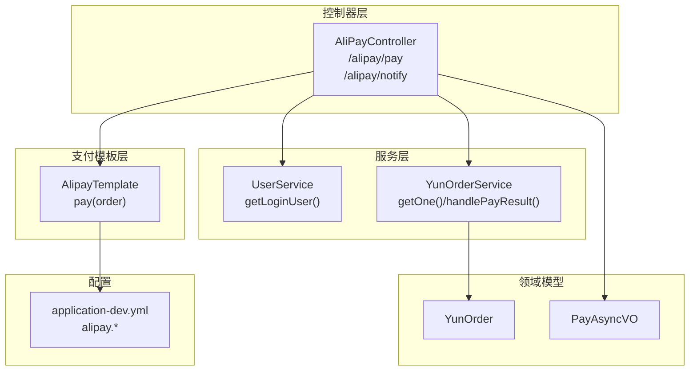
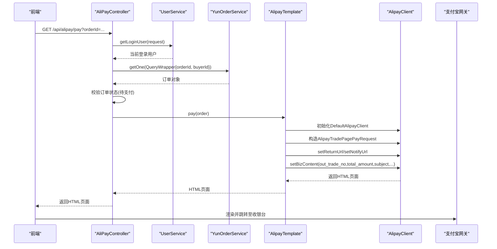
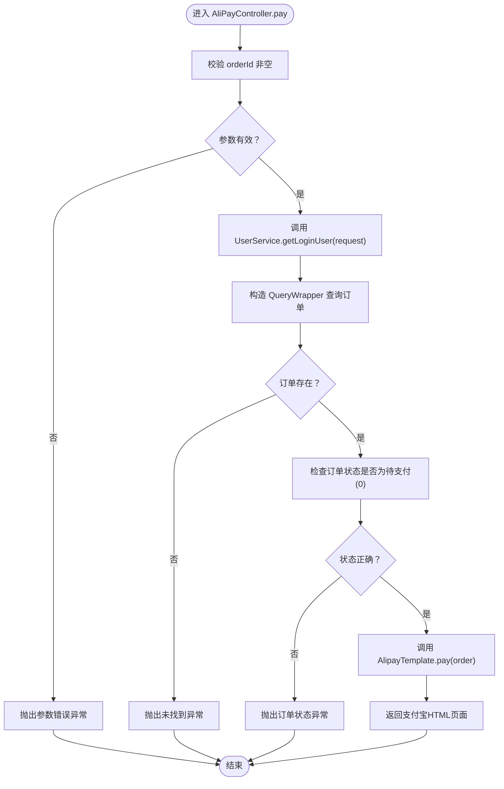
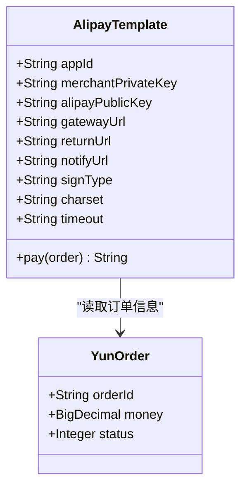
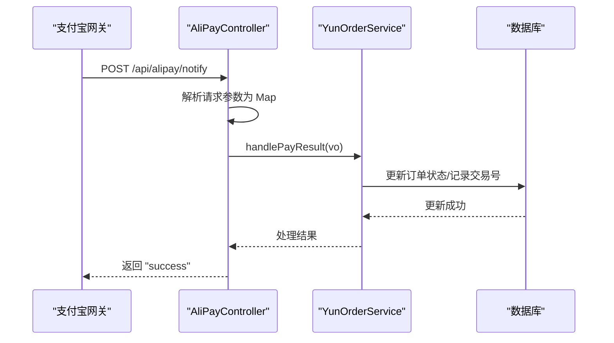
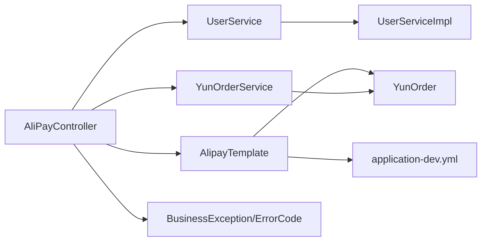

# 支付跳转

<cite>
**本文引用的文件**
- [AliPayController.java](file://yun-docker-master/src/main/java/com/lfc/yundocker/controller/AliPayController.java)
- [AlipayTemplate.java](file://yun-docker-master/src/main/java/com/lfc/yundocker/manager/AlipayTemplate.java)
- [UserService.java](file://yun-docker-master/src/main/java/com/lfc/yundocker/service/UserService.java)
- [UserServiceImpl.java](file://yun-docker-master/src/main/java/com/lfc/yundocker/service/impl/UserServiceImpl.java)
- [YunOrderService.java](file://yun-docker-master/src/main/java/com/lfc/yundocker/service/YunOrderService.java)
- [YunOrder.java](file://yun-docker-master/src/main/java/com/lfc/yundocker/common/model/entity/YunOrder.java)
- [PayAsyncVO.java](file://yun-docker-master/src/main/java/com/lfc/yundocker/common/model/vo/PayAsyncVO.java)
- [application-dev.yml](file://yun-docker-master/src/main/resources/application-dev.yml)
- [application.yml](file://yun-docker-master/src/main/resources/application.yml)
- [BusinessException.java](file://yun-docker-common/src/main/java/com/lfc/yundocker/common/exception/BusinessException.java)
- [ErrorCode.java](file://yun-docker-common/src/main/java/com/lfc/yundocker/common/model/enums/ErrorCode.java)
</cite>

## 目录
1. [简介](#简介)
2. [项目结构](#项目结构)
3. [核心组件](#核心组件)
4. [架构总览](#架构总览)
5. [详细组件分析](#详细组件分析)
6. [依赖关系分析](#依赖关系分析)
7. [性能与安全考量](#性能与安全考量)
8. [故障排查指南](#故障排查指南)
9. [结论](#结论)

## 简介
本文围绕 AliPayController.pay() 接口的支付跳转流程进行深入分析，涵盖：
- 前端传入订单ID（orderId）的接收与校验
- 当前登录用户获取与订单归属校验
- 订单状态校验与异常处理
- AlipayTemplate.pay() 初始化支付宝客户端、构造支付请求、设置回调URL与业务参数
- 返回支付宝HTML页面实现浏览器重定向至收银台
- 支付异步回调流程与验签要点
- 敏感信息（私钥、公钥、网关）的配置化管理

## 项目结构
支付相关代码主要分布在以下模块与文件中：
- 控制器层：AliPayController 提供 /alipay/pay 与 /alipay/notify 接口
- 支付模板层：AlipayTemplate 封装支付宝SDK调用与配置读取
- 服务层：UserService 获取登录用户；YunOrderService 处理订单与异步结果
- 领域模型：YunOrder 订单实体；PayAsyncVO 回调参数载体
- 配置文件：application-dev.yml 中包含支付宝配置项
- 异常与错误码：BusinessException 与 ErrorCode

图表来源
- [AliPayController.java](file://yun-docker-master/src/main/java/com/lfc/yundocker/controller/AliPayController.java#L43-L112)
- [AlipayTemplate.java](file://yun-docker-master/src/main/java/com/lfc/yundocker/manager/AlipayTemplate.java#L1-L108)
- [UserService.java](file://yun-docker-master/src/main/java/com/lfc/yundocker/service/UserService.java#L48-L63)
- [YunOrderService.java](file://yun-docker-master/src/main/java/com/lfc/yundocker/service/YunOrderService.java#L1-L27)
- [YunOrder.java](file://yun-docker-master/src/main/java/com/lfc/yundocker/common/model/entity/YunOrder.java#L1-L77)
- [PayAsyncVO.java](file://yun-docker-master/src/main/java/com/lfc/yundocker/common/model/vo/PayAsyncVO.java#L1-L39)
- [application-dev.yml](file://yun-docker-master/src/main/resources/application-dev.yml#L69-L81)

章节来源
- [AliPayController.java](file://yun-docker-master/src/main/java/com/lfc/yundocker/controller/AliPayController.java#L43-L112)
- [AlipayTemplate.java](file://yun-docker-master/src/main/java/com/lfc/yundocker/manager/AlipayTemplate.java#L1-L108)
- [application-dev.yml](file://yun-docker-master/src/main/resources/application-dev.yml#L69-L81)

## 核心组件
- AliPayController.pay(): 接收 orderId，校验参数，获取登录用户，按用户与订单ID查询订单，校验订单状态，委托 AlipayTemplate 执行支付并返回HTML页面。
- AlipayTemplate.pay(): 读取配置（appId、merchantPrivateKey、alipayPublicKey、gatewayUrl、returnUrl、notifyUrl、signType、charset、timeout），构造 AlipayClient 与 AlipayTradePagePayRequest，设置业务参数（out_trade_no、total_amount、subject、timeout_express、product_code），执行 pageExecute 并返回支付宝页面。
- UserService/getLoginUser(): 从 Session 获取当前登录用户，若未登录或用户不存在则抛出业务异常。
- YunOrderService: 提供订单查询与异步回调处理（handlePayResult）。
- 配置中心：application-dev.yml 中 alipay.* 项集中管理支付宝相关敏感参数。

章节来源
- [AliPayController.java](file://yun-docker-master/src/main/java/com/lfc/yundocker/controller/AliPayController.java#L43-L112)
- [AlipayTemplate.java](file://yun-docker-master/src/main/java/com/lfc/yundocker/manager/AlipayTemplate.java#L1-L108)
- [UserService.java](file://yun-docker-master/src/main/java/com/lfc/yundocker/service/UserService.java#L48-L63)
- [YunOrderService.java](file://yun-docker-master/src/main/java/com/lfc/yundocker/service/YunOrderService.java#L1-L27)
- [application-dev.yml](file://yun-docker-master/src/main/resources/application-dev.yml#L69-L81)

## 架构总览
支付跳转涉及从前端到后端再到支付宝的链路，关键点包括：
- 参数校验与用户鉴权
- 订单归属与状态校验
- 支付宝SDK初始化与请求构造
- 浏览器渲染支付宝页面完成支付
- 支付宝异步回调与验签

图表来源
- [AliPayController.java](file://yun-docker-master/src/main/java/com/lfc/yundocker/controller/AliPayController.java#L43-L112)
- [AlipayTemplate.java](file://yun-docker-master/src/main/java/com/lfc/yundocker/manager/AlipayTemplate.java#L59-L106)
- [UserService.java](file://yun-docker-master/src/main/java/com/lfc/yundocker/service/UserService.java#L48-L63)
- [YunOrderService.java](file://yun-docker-master/src/main/java/com/lfc/yundocker/service/YunOrderService.java#L1-L27)

## 详细组件分析

### AliPayController.pay() 处理流程
- 参数校验：orderId 不能为空，否则抛出参数错误异常。
- 登录用户获取：通过 UserService.getLoginUser(request) 获取当前登录用户。
- 订单查询：使用 QueryWrapper 条件 eq("order_id", orderId) 与 eq("buyer_id", loginUser.getId()) 查询订单。
- 订单存在性与状态校验：若订单不存在或状态非待支付（0），抛出相应业务异常。
- 支付执行：调用 AlipayTemplate.pay(order) 返回支付宝页面HTML，前端渲染后跳转至收银台。

图表来源
- [AliPayController.java](file://yun-docker-master/src/main/java/com/lfc/yundocker/controller/AliPayController.java#L43-L112)
- [BusinessException.java](file://yun-docker-common/src/main/java/com/lfc/yundocker/common/exception/BusinessException.java#L1-L37)
- [ErrorCode.java](file://yun-docker-common/src/main/java/com/lfc/yundocker/common/model/enums/ErrorCode.java#L1-L49)

章节来源
- [AliPayController.java](file://yun-docker-master/src/main/java/com/lfc/yundocker/controller/AliPayController.java#L43-L112)
- [BusinessException.java](file://yun-docker-common/src/main/java/com/lfc/yundocker/common/exception/BusinessException.java#L1-L37)
- [ErrorCode.java](file://yun-docker-common/src/main/java/com/lfc/yundocker/common/model/enums/ErrorCode.java#L1-L49)

### AlipayTemplate.pay() 方法详解
- 配置读取：通过 @ConfigurationProperties(prefix = "alipay") 与 @Value 注解从 application-dev.yml 读取 appId、merchantPrivateKey、alipayPublicKey、gatewayUrl、returnUrl、notifyUrl、signType、charset、timeout。
- 客户端初始化：使用 DefaultAlipayClient(gatewayUrl, appId, merchantPrivateKey, "json", charset, alipayPublicKey, signType) 构造 AlipayClient。
- 请求构造：创建 AlipayTradePagePayRequest，设置 returnUrl 与 notifyUrl。
- 业务参数设置：通过 setBizContent 设置 out_trade_no、total_amount、subject、timeout_express、product_code 等关键字段。
- 页面返回：调用 pageExecute 返回 HTML 页面，前端渲染后跳转至支付宝收银台。

图表来源
- [AlipayTemplate.java](file://yun-docker-master/src/main/java/com/lfc/yundocker/manager/AlipayTemplate.java#L1-L108)
- [YunOrder.java](file://yun-docker-master/src/main/java/com/lfc/yundocker/common/model/entity/YunOrder.java#L1-L77)

章节来源
- [AlipayTemplate.java](file://yun-docker-master/src/main/java/com/lfc/yundocker/manager/AlipayTemplate.java#L1-L108)
- [application-dev.yml](file://yun-docker-master/src/main/resources/application-dev.yml#L69-L81)

### 支付异步回调流程
- 接口定义：AliPayController.postMapping("/notify") 接收支付宝异步通知。
- 参数封装：遍历 request.getParameterMap()，将参数放入 Map 并进行字符集转换。
- 结果处理：调用 YunOrderService.handlePayResult(vo) 更新订单状态。
- 验签说明：当前代码中注释了验签逻辑（AlipaySignature.rsaCheckV2），实际部署建议启用并完善验签与幂等处理。

图表来源
- [AliPayController.java](file://yun-docker-master/src/main/java/com/lfc/yundocker/controller/AliPayController.java#L74-L112)
- [YunOrderService.java](file://yun-docker-master/src/main/java/com/lfc/yundocker/service/YunOrderService.java#L1-L27)

章节来源
- [AliPayController.java](file://yun-docker-master/src/main/java/com/lfc/yundocker/controller/AliPayController.java#L74-L112)
- [YunOrderService.java](file://yun-docker-master/src/main/java/com/lfc/yundocker/service/YunOrderService.java#L1-L27)

## 依赖关系分析
- AliPayController 依赖 UserService、YunOrderService、AlipayTemplate
- AlipayTemplate 依赖 YunOrder 实体与 application-dev.yml 的 alipay.* 配置
- UserServiceImpl 实现 getLoginUser，依赖 Session 与 User 实体
- YunOrderService 接口定义订单查询与异步处理方法
- BusinessException 与 ErrorCode 提供统一异常与错误码

图表来源
- [AliPayController.java](file://yun-docker-master/src/main/java/com/lfc/yundocker/controller/AliPayController.java#L43-L112)
- [AlipayTemplate.java](file://yun-docker-master/src/main/java/com/lfc/yundocker/manager/AlipayTemplate.java#L1-L108)
- [UserService.java](file://yun-docker-master/src/main/java/com/lfc/yundocker/service/UserService.java#L48-L63)
- [UserServiceImpl.java](file://yun-docker-master/src/main/java/com/lfc/yundocker/service/impl/UserServiceImpl.java#L171-L211)
- [YunOrderService.java](file://yun-docker-master/src/main/java/com/lfc/yundocker/service/YunOrderService.java#L1-L27)
- [YunOrder.java](file://yun-docker-master/src/main/java/com/lfc/yundocker/common/model/entity/YunOrder.java#L1-L77)
- [BusinessException.java](file://yun-docker-common/src/main/java/com/lfc/yundocker/common/exception/BusinessException.java#L1-L37)
- [ErrorCode.java](file://yun-docker-common/src/main/java/com/lfc/yundocker/common/model/enums/ErrorCode.java#L1-L49)

章节来源
- [AliPayController.java](file://yun-docker-master/src/main/java/com/lfc/yundocker/controller/AliPayController.java#L43-L112)
- [AlipayTemplate.java](file://yun-docker-master/src/main/java/com/lfc/yundocker/manager/AlipayTemplate.java#L1-L108)
- [UserService.java](file://yun-docker-master/src/main/java/com/lfc/yundocker/service/UserService.java#L48-L63)
- [UserServiceImpl.java](file://yun-docker-master/src/main/java/com/lfc/yundocker/service/impl/UserServiceImpl.java#L171-L211)
- [YunOrderService.java](file://yun-docker-master/src/main/java/com/lfc/yundocker/service/YunOrderService.java#L1-L27)
- [YunOrder.java](file://yun-docker-master/src/main/java/com/lfc/yundocker/common/model/entity/YunOrder.java#L1-L77)
- [BusinessException.java](file://yun-docker-common/src/main/java/com/lfc/yundocker/common/exception/BusinessException.java#L1-L37)
- [ErrorCode.java](file://yun-docker-common/src/main/java/com/lfc/yundocker/common/model/enums/ErrorCode.java#L1-L49)

## 性能与安全考量
- 性能
  - 订单查询使用精确条件（orderId + buyerId），避免全表扫描。
  - 支付模板初始化在每次支付时创建 AlipayClient，建议结合连接池或缓存策略优化（当前实现简单直接）。
- 安全
  - 支付敏感参数（merchantPrivateKey、alipayPublicKey、gatewayUrl、returnUrl、notifyUrl）集中于 application-dev.yml，建议：
    - 在生产环境使用加密配置或环境变量注入
    - 严格控制配置文件访问权限
    - 使用只读权限的部署账户
  - 异步回调建议启用验签（AlipaySignature.rsaCheckV2），并对重复通知做幂等处理
  - returnUrl/notifyUrl 必须与支付宝后台配置保持一致，防止钓鱼与中间人攻击

[本节为通用指导，无需特定文件来源]

## 故障排查指南
- 参数错误
  - orderId 为空或非法：抛出参数错误异常
  - 章节来源
    - [AliPayController.java](file://yun-docker-master/src/main/java/com/lfc/yundocker/controller/AliPayController.java#L43-L112)
    - [ErrorCode.java](file://yun-docker-common/src/main/java/com/lfc/yundocker/common/model/enums/ErrorCode.java#L1-L49)
- 未登录或用户不存在
  - 未登录或 Session 中用户不存在：抛出未登录异常
  - 章节来源
    - [UserServiceImpl.java](file://yun-docker-master/src/main/java/com/lfc/yundocker/service/impl/UserServiceImpl.java#L171-L211)
    - [ErrorCode.java](file://yun-docker-common/src/main/java/com/lfc/yundocker/common/model/enums/ErrorCode.java#L1-L49)
- 订单不存在
  - 查询不到订单：抛出未找到异常
  - 章节来源
    - [AliPayController.java](file://yun-docker-master/src/main/java/com/lfc/yundocker/controller/AliPayController.java#L43-L112)
    - [ErrorCode.java](file://yun-docker-common/src/main/java/com/lfc/yundocker/common/model/enums/ErrorCode.java#L1-L49)
- 订单状态异常
  - 非待支付状态：抛出订单状态异常
  - 章节来源
    - [AliPayController.java](file://yun-docker-master/src/main/java/com/lfc/yundocker/controller/AliPayController.java#L43-L112)
    - [YunOrder.java](file://yun-docker-master/src/main/java/com/lfc/yundocker/common/model/entity/YunOrder.java#L1-L77)
    - [ErrorCode.java](file://yun-docker-common/src/main/java/com/lfc/yundocker/common/model/enums/ErrorCode.java#L1-L49)
- 支付宝回调验签问题
  - 当前代码注释了验签逻辑，建议启用并核对签名参数与字符集
  - 章节来源
    - [AliPayController.java](file://yun-docker-master/src/main/java/com/lfc/yundocker/controller/AliPayController.java#L74-L112)
    - [AlipayTemplate.java](file://yun-docker-master/src/main/java/com/lfc/yundocker/manager/AlipayTemplate.java#L1-L108)

## 结论
- AliPayController.pay() 通过严格的参数与订单状态校验，确保只有合法的“待支付”订单才能发起支付。
- AlipayTemplate 将支付宝SDK调用与配置集中管理，便于扩展与维护。
- 支付流程以返回HTML页面的方式完成浏览器重定向至支付宝收银台，异步回调负责更新订单状态。
- 建议在生产环境中完善验签、配置加密与日志审计，保障支付安全与稳定性。