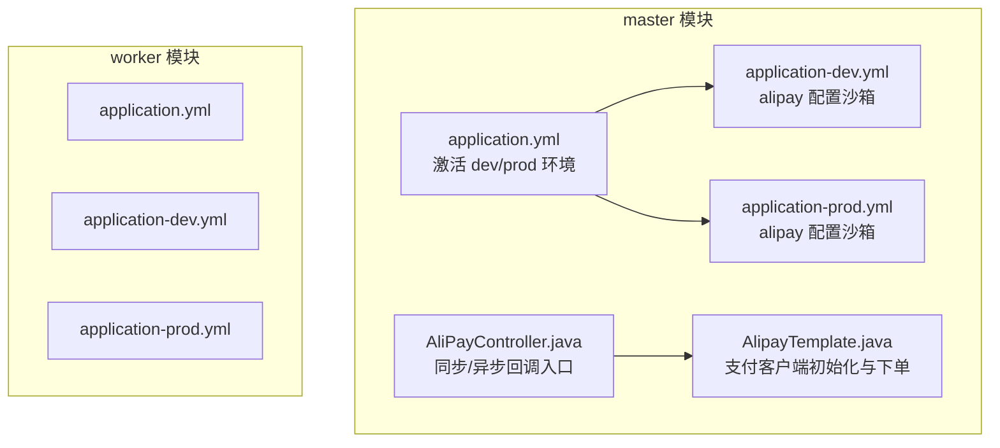
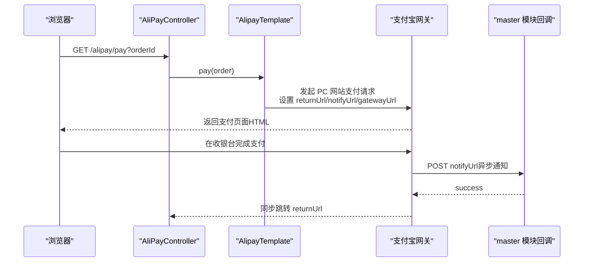
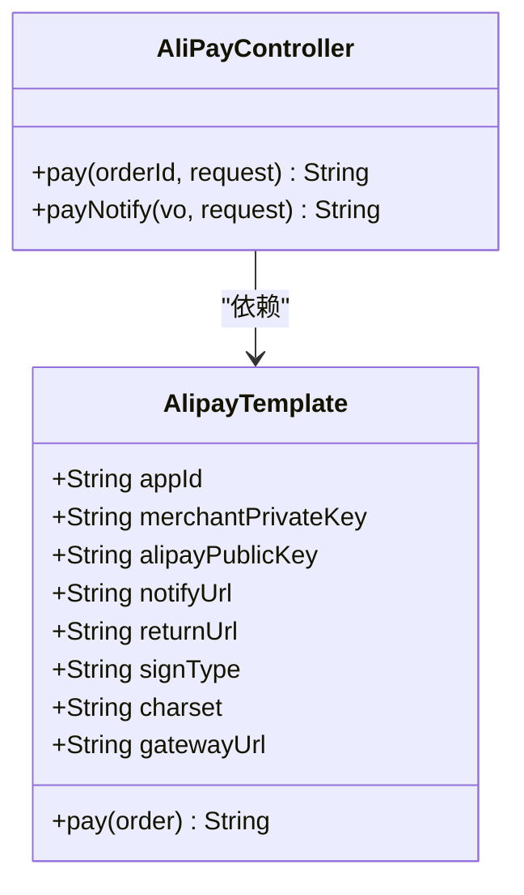

# 支付配置

<cite>
**本文引用的文件**
- [yun-docker-master/src/main/resources/application.yml](file://yun-docker-master/src/main/resources/application.yml)
- [yun-docker-master/src/main/resources/application-dev.yml](file://yun-docker-master/src/main/resources/application-dev.yml)
- [yun-docker-master/src/main/resources/application-prod.yml](file://yun-docker-master/src/main/resources/application-prod.yml)
- [yun-docker-master/src/main/java/com/lfc/yundocker/manager/AlipayTemplate.java](file://yun-docker-master/src/main/java/com/lfc/yundocker/manager/AlipayTemplate.java)
- [yun-docker-master/src/main/java/com/lfc/yundocker/controller/AliPayController.java](file://yun-docker-master/src/main/java/com/lfc/yundocker/controller/AliPayController.java)
- [yun-docker-worker/src/main/resources/application.yml](file://yun-docker-worker/src/main/resources/application.yml)
- [yun-docker-worker/src/main/resources/application-dev.yml](file://yun-docker-worker/src/main/resources/application-dev.yml)
- [yun-docker-worker/src/main/resources/application-prod.yml](file://yun-docker-worker/src/main/resources/application-prod.yml)
- [README.md](file://README.md)
</cite>

## 目录
1. [简介](#简介)
2. [项目结构](#项目结构)
3. [核心组件](#核心组件)
4. [架构总览](#架构总览)
5. [详细组件分析](#详细组件分析)
6. [依赖关系分析](#依赖关系分析)
7. [性能与安全考量](#性能与安全考量)
8. [故障排查指南](#故障排查指南)
9. [结论](#结论)
10. [附录](#附录)

## 简介
本文件系统化说明项目中 application.yml 的支付宝（Alipay）相关配置项的作用与安全实践，逐项解释以下关键参数：
- appId（应用ID）
- merchantPrivateKey（商户私钥）
- alipayPublicKey（支付宝公钥）
- gatewayUrl（网关地址，沙箱环境与生产环境的区别）
- notifyUrl（异步通知地址）
- returnUrl（同步返回地址）
- signType（签名算法，如 RSA2）
- charset（字符集）

同时强调私钥与公钥在安全通信中的角色，解释为何 notifyUrl 必须为公网可访问地址；对比 application-dev.yml 与 application-prod.yml 中的配置差异，指出当前配置使用沙箱网关，实际生产部署需替换为正式网关；最后给出配置管理的最佳实践，如使用环境变量或配置中心来管理敏感信息。

## 项目结构
本项目包含 master 与 worker 两个模块，其中 master 模块负责支付流程的前端交互与回调处理，worker 模块为任务执行侧，二者均包含公共配置与环境配置文件。支付相关的核心配置位于 master 模块的 application-dev.yml 与 application-prod.yml 中，支付调用与回调处理分别由 AlipayTemplate 与 AliPayController 承担。

图表来源
- [yun-docker-master/src/main/resources/application.yml](file://yun-docker-master/src/main/resources/application.yml#L1-L60)
- [yun-docker-master/src/main/resources/application-dev.yml](file://yun-docker-master/src/main/resources/application-dev.yml#L69-L81)
- [yun-docker-master/src/main/resources/application-prod.yml](file://yun-docker-master/src/main/resources/application-prod.yml#L70-L82)
- [yun-docker-master/src/main/java/com/lfc/yundocker/manager/AlipayTemplate.java](file://yun-docker-master/src/main/java/com/lfc/yundocker/manager/AlipayTemplate.java#L1-L108)
- [yun-docker-master/src/main/java/com/lfc/yundocker/controller/AliPayController.java](file://yun-docker-master/src/main/java/com/lfc/yundocker/controller/AliPayController.java#L1-L113)
- [yun-docker-worker/src/main/resources/application.yml](file://yun-docker-worker/src/main/resources/application.yml#L1-L51)
- [yun-docker-worker/src/main/resources/application-dev.yml](file://yun-docker-worker/src/main/resources/application-dev.yml#L1-L65)
- [yun-docker-worker/src/main/resources/application-prod.yml](file://yun-docker-worker/src/main/resources/application-prod.yml#L1-L65)

章节来源
- [yun-docker-master/src/main/resources/application.yml](file://yun-docker-master/src/main/resources/application.yml#L1-L60)
- [yun-docker-worker/src/main/resources/application.yml](file://yun-docker-worker/src/main/resources/application.yml#L1-L51)

## 核心组件
- AlipayTemplate：负责从配置读取 alipay.* 参数并构造 AlipayClient，发起 PC 网站支付请求，设置 returnUrl 与 notifyUrl，并返回支付宝返回的 HTML 页面供浏览器渲染。
- AliPayController：提供 /alipay/pay 发起支付，以及 /alipay/notify 异步回调入口；当前代码中对 notify 回调的验签逻辑被注释，实际应启用验签后再处理业务。

章节来源
- [yun-docker-master/src/main/java/com/lfc/yundocker/manager/AlipayTemplate.java](file://yun-docker-master/src/main/java/com/lfc/yundocker/manager/AlipayTemplate.java#L1-L108)
- [yun-docker-master/src/main/java/com/lfc/yundocker/controller/AliPayController.java](file://yun-docker-master/src/main/java/com/lfc/yundocker/controller/AliPayController.java#L1-L113)

## 架构总览
支付流程涉及前端浏览器、master 模块服务、支付宝网关与回调服务端。master 模块通过 AlipayTemplate 初始化支付客户端，发起支付请求并将用户重定向至支付宝收银台；支付宝在支付完成后向 notifyUrl 发送异步通知，master 模块接收并处理订单状态更新。

图表来源
- [yun-docker-master/src/main/java/com/lfc/yundocker/controller/AliPayController.java](file://yun-docker-master/src/main/java/com/lfc/yundocker/controller/AliPayController.java#L43-L112)
- [yun-docker-master/src/main/java/com/lfc/yundocker/manager/AlipayTemplate.java](file://yun-docker-master/src/main/java/com/lfc/yundocker/manager/AlipayTemplate.java#L59-L106)

## 详细组件分析

### 支付配置项详解
- appId（应用ID）
  - 作用：标识接入的应用，支付宝侧用于识别商户应用。
  - 读取位置：AlipayTemplate 通过 @Value 从 alipay.appId 读取。
  - 章节来源
    - [yun-docker-master/src/main/java/com/lfc/yundocker/manager/AlipayTemplate.java](file://yun-docker-master/src/main/java/com/lfc/yundocker/manager/AlipayTemplate.java#L27-L35)
    - [yun-docker-master/src/main/resources/application-dev.yml](file://yun-docker-master/src/main/resources/application-dev.yml#L69-L81)
    - [yun-docker-master/src/main/resources/application-prod.yml](file://yun-docker-master/src/main/resources/application-prod.yml#L70-L82)

- merchantPrivateKey（商户私钥）
  - 作用：用于对请求参数进行签名，确保请求来源可信与数据完整性。
  - 读取位置：AlipayTemplate 通过 @Value 从 alipay.merchantPrivateKey 读取。
  - 安全要点：私钥必须妥善保管，避免泄露；仅在服务端持有，不暴露给前端。
  - 章节来源
    - [yun-docker-master/src/main/java/com/lfc/yundocker/manager/AlipayTemplate.java](file://yun-docker-master/src/main/java/com/lfc/yundocker/manager/AlipayTemplate.java#L31-L35)
    - [yun-docker-master/src/main/resources/application-dev.yml](file://yun-docker-master/src/main/resources/application-dev.yml#L69-L81)
    - [yun-docker-master/src/main/resources/application-prod.yml](file://yun-docker-master/src/main/resources/application-prod.yml#L70-L82)

- alipayPublicKey（支付宝公钥）
  - 作用：用于验证支付宝返回数据与回调通知的签名，确保数据来自支付宝。
  - 读取位置：AlipayTemplate 通过 @Value 从 alipay.alipayPublicKey 读取。
  - 安全要点：公钥可公开分发，但需与商户私钥匹配，防止伪造签名。
  - 章节来源
    - [yun-docker-master/src/main/java/com/lfc/yundocker/manager/AlipayTemplate.java](file://yun-docker-master/src/main/java/com/lfc/yundocker/manager/AlipayTemplate.java#L31-L35)
    - [yun-docker-master/src/main/resources/application-dev.yml](file://yun-docker-master/src/main/resources/application-dev.yml#L69-L81)
    - [yun-docker-master/src/main/resources/application-prod.yml](file://yun-docker-master/src/main/resources/application-prod.yml#L70-L82)

- gatewayUrl（网关地址）
  - 作用：指定支付宝网关 URL，决定请求发送到沙箱还是生产环境。
  - 当前配置：使用沙箱网关地址。
  - 章节来源
    - [yun-docker-master/src/main/java/com/lfc/yundocker/manager/AlipayTemplate.java](file://yun-docker-master/src/main/java/com/lfc/yundocker/manager/AlipayTemplate.java#L52-L56)
    - [yun-docker-master/src/main/resources/application-dev.yml](file://yun-docker-master/src/main/resources/application-dev.yml#L78-L78)
    - [yun-docker-master/src/main/resources/application-prod.yml](file://yun-docker-master/src/main/resources/application-prod.yml#L79-L79)

- notifyUrl（异步通知地址）
  - 作用：支付宝在支付完成后向该地址推送异步通知，服务端需验证签名并更新订单状态。
  - 当前配置：使用本地回环地址，仅适用于本地联调。
  - 安全要求：必须为公网可访问地址，且 HTTPS 更佳；服务端需实现验签逻辑。
  - 章节来源
    - [yun-docker-master/src/main/java/com/lfc/yundocker/manager/AlipayTemplate.java](file://yun-docker-master/src/main/java/com/lfc/yundocker/manager/AlipayTemplate.java#L37-L42)
    - [yun-docker-master/src/main/resources/application-dev.yml](file://yun-docker-master/src/main/resources/application-dev.yml#L73-L73)
    - [yun-docker-master/src/main/resources/application-prod.yml](file://yun-docker-master/src/main/resources/application-prod.yml#L74-L74)
    - [yun-docker-master/src/main/java/com/lfc/yundocker/controller/AliPayController.java](file://yun-docker-master/src/main/java/com/lfc/yundocker/controller/AliPayController.java#L74-L112)

- returnUrl（同步返回地址）
  - 作用：支付完成后，用户浏览器同步跳转到该地址，通常用于展示支付结果页。
  - 当前配置：指向本地前端地址，仅适用于本地联调。
  - 章节来源
    - [yun-docker-master/src/main/java/com/lfc/yundocker/manager/AlipayTemplate.java](file://yun-docker-master/src/main/java/com/lfc/yundocker/manager/AlipayTemplate.java#L41-L42)
    - [yun-docker-master/src/main/resources/application-dev.yml](file://yun-docker-master/src/main/resources/application-dev.yml#L74-L74)
    - [yun-docker-master/src/main/resources/application-prod.yml](file://yun-docker-master/src/main/resources/application-prod.yml#L75-L75)

- signType（签名算法）
  - 作用：指定签名算法类型，如 RSA2。
  - 章节来源
    - [yun-docker-master/src/main/java/com/lfc/yundocker/manager/AlipayTemplate.java](file://yun-docker-master/src/main/java/com/lfc/yundocker/manager/AlipayTemplate.java#L45-L50)
    - [yun-docker-master/src/main/resources/application-dev.yml](file://yun-docker-master/src/main/resources/application-dev.yml#L75-L75)
    - [yun-docker-master/src/main/resources/application-prod.yml](file://yun-docker-master/src/main/resources/application-prod.yml#L76-L76)

- charset（字符集）
  - 作用：指定请求与响应使用的字符集，确保中文等字符正确传输。
  - 章节来源
    - [yun-docker-master/src/main/java/com/lfc/yundocker/manager/AlipayTemplate.java](file://yun-docker-master/src/main/java/com/lfc/yundocker/manager/AlipayTemplate.java#L49-L50)
    - [yun-docker-master/src/main/resources/application-dev.yml](file://yun-docker-master/src/main/resources/application-dev.yml#L76-L76)
    - [yun-docker-master/src/main/resources/application-prod.yml](file://yun-docker-master/src/main/resources/application-prod.yml#L77-L77)

### 配置文件对比：application-dev.yml 与 application-prod.yml
- 相同点
  - 均包含 alipay.* 配置项，字段一致。
- 不同点
  - 网关地址：当前两者均为沙箱网关地址，生产环境需替换为正式网关。
  - notifyUrl/returnUrl：当前两者均为本地回环地址，生产环境需替换为公网可访问地址。
  - 其他环境配置（如数据库、Redis、Elasticsearch）在两份文件中均标注为待替换，体现生产环境需按实际部署调整。

章节来源
- [yun-docker-master/src/main/resources/application-dev.yml](file://yun-docker-master/src/main/resources/application-dev.yml#L69-L81)
- [yun-docker-master/src/main/resources/application-prod.yml](file://yun-docker-master/src/main/resources/application-prod.yml#L70-L82)

### 支付流程与安全要点
- 私钥与公钥的角色
  - 商户私钥用于对请求参数签名，支付宝公钥用于验证回调签名，确保请求与响应的真实性和完整性。
- notifyUrl 必须公网可访问的原因
  - 支付宝异步通知由支付宝服务器主动推送，若服务端不可公网访问，将无法收到通知，导致订单状态不同步。
- 当前配置使用沙箱网关
  - 项目当前使用沙箱网关地址，适合本地联调；生产部署需替换为正式网关地址。

章节来源
- [yun-docker-master/src/main/java/com/lfc/yundocker/manager/AlipayTemplate.java](file://yun-docker-master/src/main/java/com/lfc/yundocker/manager/AlipayTemplate.java#L59-L106)
- [yun-docker-master/src/main/java/com/lfc/yundocker/controller/AliPayController.java](file://yun-docker-master/src/main/java/com/lfc/yundocker/controller/AliPayController.java#L74-L112)
- [yun-docker-master/src/main/resources/application-dev.yml](file://yun-docker-master/src/main/resources/application-dev.yml#L78-L78)
- [yun-docker-master/src/main/resources/application-prod.yml](file://yun-docker-master/src/main/resources/application-prod.yml#L79-L79)

## 依赖关系分析
AlipayTemplate 与 AliPayController 的依赖关系如下：

图表来源
- [yun-docker-master/src/main/java/com/lfc/yundocker/manager/AlipayTemplate.java](file://yun-docker-master/src/main/java/com/lfc/yundocker/manager/AlipayTemplate.java#L1-L108)
- [yun-docker-master/src/main/java/com/lfc/yundocker/controller/AliPayController.java](file://yun-docker-master/src/main/java/com/lfc/yundocker/controller/AliPayController.java#L1-L113)

章节来源
- [yun-docker-master/src/main/java/com/lfc/yundocker/manager/AlipayTemplate.java](file://yun-docker-master/src/main/java/com/lfc/yundocker/manager/AlipayTemplate.java#L1-L108)
- [yun-docker-master/src/main/java/com/lfc/yundocker/controller/AliPayController.java](file://yun-docker-master/src/main/java/com/lfc/yundocker/controller/AliPayController.java#L1-L113)

## 性能与安全考量
- 网关切换
  - 当前使用沙箱网关，生产环境务必替换为正式网关，否则无法真实交易。
- 回调地址
  - notifyUrl 必须为公网可访问地址，建议使用 HTTPS 并具备健康检查能力。
- 验签逻辑
  - AliPayController 中的 notify 回调存在验签逻辑注释，应启用验签后再处理业务，防止伪造回调。
- 敏感信息保护
  - merchantPrivateKey 属于敏感信息，不应硬编码在配置文件中，建议通过环境变量或配置中心注入。
- 字符集与签名
  - charset 与 signType 需与支付宝侧保持一致，避免验签失败或乱码问题。

章节来源
- [yun-docker-master/src/main/java/com/lfc/yundocker/controller/AliPayController.java](file://yun-docker-master/src/main/java/com/lfc/yundocker/controller/AliPayController.java#L74-L112)
- [yun-docker-master/src/main/java/com/lfc/yundocker/manager/AlipayTemplate.java](file://yun-docker-master/src/main/java/com/lfc/yundocker/manager/AlipayTemplate.java#L45-L56)

## 故障排查指南
- 无法收到异步通知
  - 检查 notifyUrl 是否为公网可访问地址，且服务端已正确监听 /alipay/notify。
  - 章节来源
    - [yun-docker-master/src/main/java/com/lfc/yundocker/controller/AliPayController.java](file://yun-docker-master/src/main/java/com/lfc/yundocker/controller/AliPayController.java#L74-L112)
    - [yun-docker-master/src/main/resources/application-dev.yml](file://yun-docker-master/src/main/resources/application-dev.yml#L73-L73)
    - [yun-docker-master/src/main/resources/application-prod.yml](file://yun-docker-master/src/main/resources/application-prod.yml#L74-L74)

- 订单状态不同步
  - 确认已启用验签逻辑并正确处理回调参数，再更新订单状态。
  - 章节来源
    - [yun-docker-master/src/main/java/com/lfc/yundocker/controller/AliPayController.java](file://yun-docker-master/src/main/java/com/lfc/yundocker/controller/AliPayController.java#L74-L112)

- 网关错误或沙箱/生产混淆
  - 确认 gatewayUrl 已切换为正式网关（生产），当前配置仍为沙箱地址。
  - 章节来源
    - [yun-docker-master/src/main/resources/application-dev.yml](file://yun-docker-master/src/main/resources/application-dev.yml#L78-L78)
    - [yun-docker-master/src/main/resources/application-prod.yml](file://yun-docker-master/src/main/resources/application-prod.yml#L79-L79)

- 字符集或签名异常
  - 确认 charset 与 signType 与支付宝侧一致，避免验签失败或中文乱码。
  - 章节来源
    - [yun-docker-master/src/main/java/com/lfc/yundocker/manager/AlipayTemplate.java](file://yun-docker-master/src/main/java/com/lfc/yundocker/manager/AlipayTemplate.java#L45-L50)

## 结论
- 项目当前使用沙箱网关与本地回调地址，适合本地联调；生产部署需替换为正式网关与公网可访问的回调地址。
- merchantPrivateKey 与 alipayPublicKey 是支付安全的关键，必须妥善保管与正确配置。
- AliPayController 的 notify 回调应启用验签逻辑，确保回调来源可信。
- 建议通过环境变量或配置中心管理敏感配置，避免明文写入配置文件。

## 附录
- 项目背景与功能概述
  - 项目来源于华南农业大学虚拟云实验平台，提供容器化部署与积分充值等能力，集成支付宝沙箱支付用于积分充值场景。
  - 章节来源
    - [README.md](file://README.md#L1-L7)