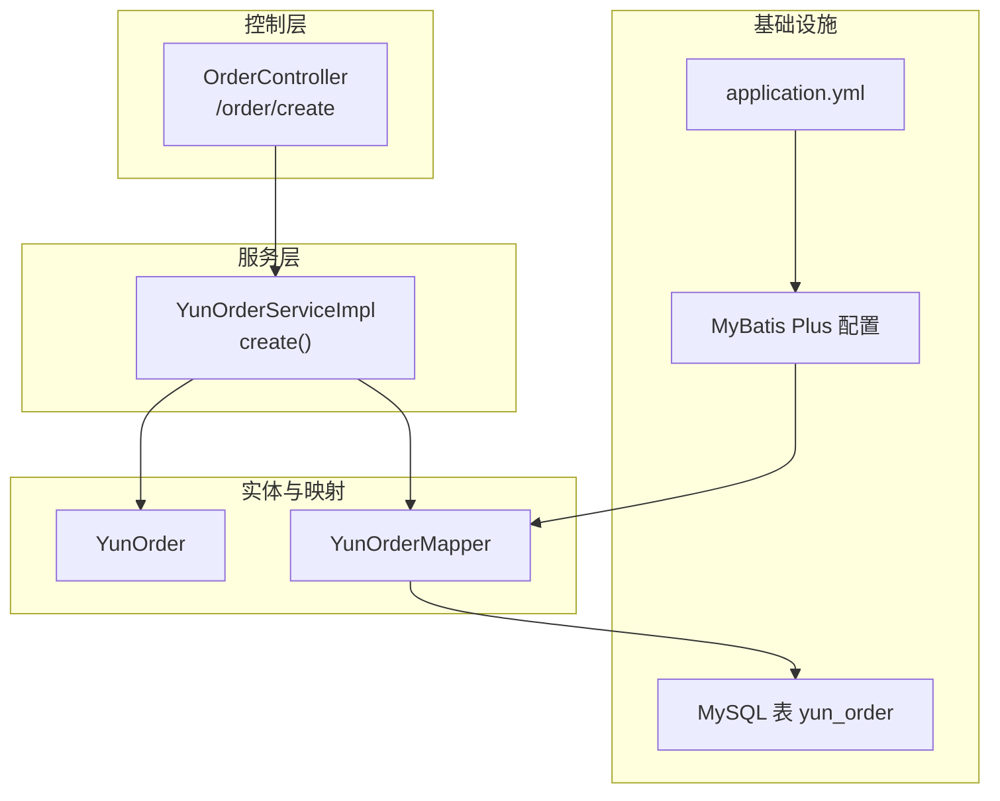
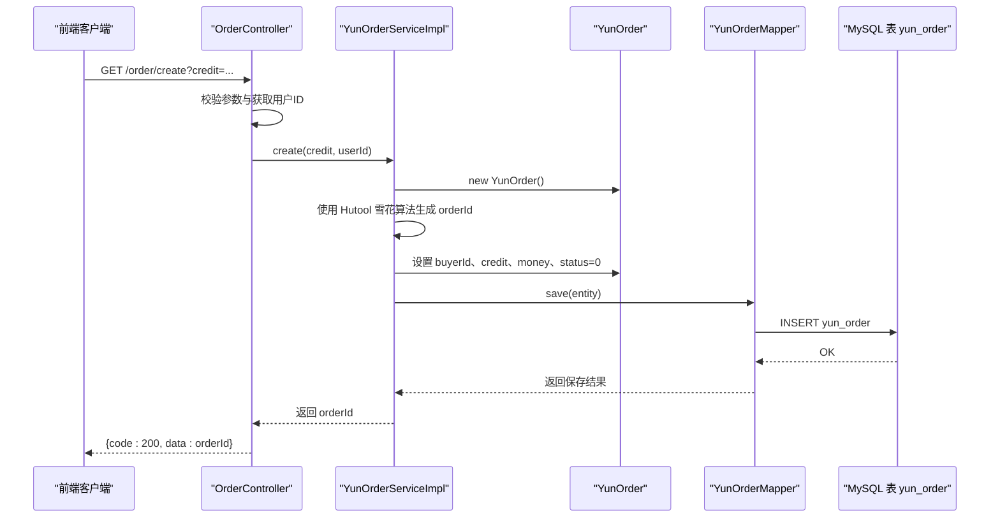
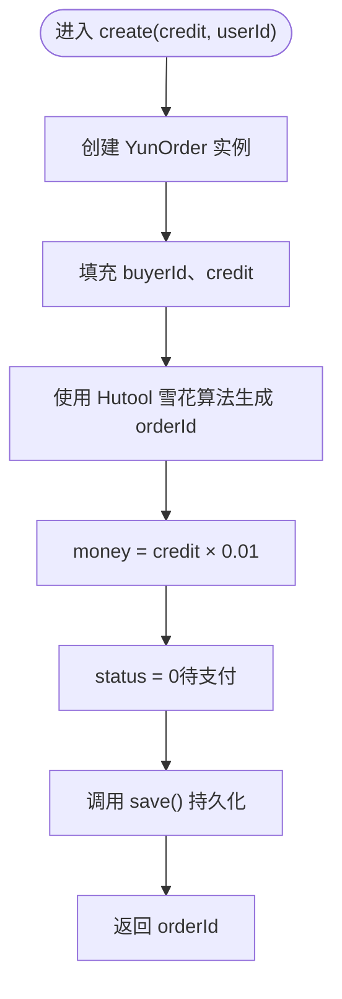
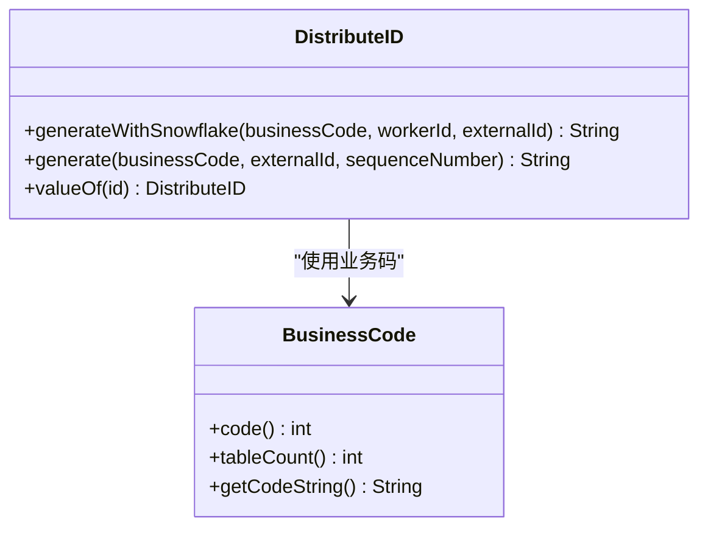
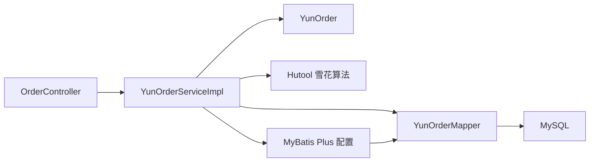

# 订单创建

<cite>
**本文引用的文件列表**
- [YunOrderService.java](file://yun-docker-master/src/main/java/com/lfc/yundocker/service/YunOrderService.java)
- [YunOrderServiceImpl.java](file://yun-docker-master/src/main/java/com/lfc/yundocker/service/impl/YunOrderServiceImpl.java)
- [YunOrder.java](file://yun-docker-master/src/main/java/com/lfc/yundocker/common/model/entity/YunOrder.java)
- [YunOrderMapper.java](file://yun-docker-master/src/main/java/com/lfc/yundocker/mapper/YunOrderMapper.java)
- [OrderController.java](file://yun-docker-master/src/main/java/com/lfc/yundocker/controller/OrderController.java)
- [create_table.sql](file://sql/create_table.sql)
- [application.yml](file://yun-docker-master/src/main/resources/application.yml)
- [MyBatisPlusConfig.java](file://yun-docker-master/src/main/java/com/lfc/yundocker/config/MyBatisPlusConfig.java)
- [DistributeID.java](file://yun-docker-common/src/main/java/com/lfc/yundocker/common/util/id/DistributeID.java)
- [BusinessCode.java](file://yun-docker-common/src/main/java/com/lfc/yundocker/common/util/id/BusinessCode.java)
</cite>

## 目录
1. [简介](#简介)
2. [项目结构与入口](#项目结构与入口)
3. [核心组件](#核心组件)
4. [架构总览](#架构总览)
5. [详细组件分析](#详细组件分析)
6. [依赖关系分析](#依赖关系分析)
7. [性能与并发特性](#性能与并发特性)
8. [故障排查指南](#故障排查指南)
9. [结论](#结论)
10. [附录](#附录)

## 简介
本节聚焦于 YunOrderService.create() 方法的实现逻辑，说明其如何接收积分数量（credit）与用户ID（userId），创建 YunOrder 实体对象，使用 Hutool 的雪花算法生成全局唯一订单号（orderId），按“积分×0.01”计算金额（money），并将初始状态设为 0（待支付）。随后通过 save() 将订单持久化至数据库，并返回 orderId 字符串给前端调用。文档还提供从前端请求到数据库落库的完整时序图，并指出未来将采用“雪花算法+基因法”的分布式 ID 生成策略。

## 项目结构与入口
- 控制层：OrderController 提供 /order/create 接口，接收 credit 参数并调用 YunOrderService.create()。
- 服务层：YunOrderServiceImpl 实现 YunOrderService 接口，包含 create()、handlePayResult()、checkOrder() 等方法。
- 实体层：YunOrder 定义订单字段，包括 buyerId、orderId、credit、money、status 等。
- 数据访问层：YunOrderMapper 继承 MyBatis-Plus 基类，提供通用 CRUD 能力。
- 配置层：MyBatisPlusConfig 开启分页插件；application.yml 配置数据库与 MyBatis Plus 全局逻辑删除等。

图表来源
- [OrderController.java](file://yun-docker-master/src/main/java/com/lfc/yundocker/controller/OrderController.java#L63-L76)
- [YunOrderServiceImpl.java](file://yun-docker-master/src/main/java/com/lfc/yundocker/service/impl/YunOrderServiceImpl.java#L47-L62)
- [YunOrder.java](file://yun-docker-master/src/main/java/com/lfc/yundocker/common/model/entity/YunOrder.java#L1-L77)
- [YunOrderMapper.java](file://yun-docker-master/src/main/java/com/lfc/yundocker/mapper/YunOrderMapper.java#L1-L19)
- [MyBatisPlusConfig.java](file://yun-docker-master/src/main/java/com/lfc/yundocker/config/MyBatisPlusConfig.java#L1-L32)
- [application.yml](file://yun-docker-master/src/main/resources/application.yml#L1-L60)

章节来源
- [OrderController.java](file://yun-docker-master/src/main/java/com/lfc/yundocker/controller/OrderController.java#L63-L76)
- [YunOrderServiceImpl.java](file://yun-docker-master/src/main/java/com/lfc/yundocker/service/impl/YunOrderServiceImpl.java#L47-L62)
- [YunOrder.java](file://yun-docker-master/src/main/java/com/lfc/yundocker/common/model/entity/YunOrder.java#L1-L77)
- [YunOrderMapper.java](file://yun-docker-master/src/main/java/com/lfc/yundocker/mapper/YunOrderMapper.java#L1-L19)
- [MyBatisPlusConfig.java](file://yun-docker-master/src/main/java/com/lfc/yundocker/config/MyBatisPlusConfig.java#L1-L32)
- [application.yml](file://yun-docker-master/src/main/resources/application.yml#L1-L60)

## 核心组件
- 接口定义：YunOrderService 暴露 create() 方法签名，用于创建订单并返回 orderId。
- 实现逻辑：YunOrderServiceImpl.create() 完成实体构建、ID 生成、金额计算、状态设置与持久化。
- 实体模型：YunOrder 字段覆盖 buyerId、orderId、credit、money、status、tradeNo、时间戳等。
- 数据访问：YunOrderMapper 继承 MyBatis-Plus 基类，提供 save() 等通用能力。
- 控制器入口：OrderController.get("/create") 接收 credit，校验参数后调用服务层 create() 并返回 orderId。

章节来源
- [YunOrderService.java](file://yun-docker-master/src/main/java/com/lfc/yundocker/service/YunOrderService.java#L15-L26)
- [YunOrderServiceImpl.java](file://yun-docker-master/src/main/java/com/lfc/yundocker/service/impl/YunOrderServiceImpl.java#L47-L62)
- [YunOrder.java](file://yun-docker-master/src/main/java/com/lfc/yundocker/common/model/entity/YunOrder.java#L1-L77)
- [YunOrderMapper.java](file://yun-docker-master/src/main/java/com/lfc/yundocker/mapper/YunOrderMapper.java#L1-L19)
- [OrderController.java](file://yun-docker-master/src/main/java/com/lfc/yundocker/controller/OrderController.java#L63-L76)

## 架构总览
从请求到落库的关键路径如下：
- 前端调用 /order/create，携带 credit。
- OrderController 校验参数并获取当前登录用户 ID。
- 调用 YunOrderService.create(credit, userId)，内部构建 YunOrder，生成 orderId，设置 money 和 status=0，调用 save() 持久化。
- 返回 orderId 给前端。

图表来源
- [OrderController.java](file://yun-docker-master/src/main/java/com/lfc/yundocker/controller/OrderController.java#L63-L76)
- [YunOrderServiceImpl.java](file://yun-docker-master/src/main/java/com/lfc/yundocker/service/impl/YunOrderServiceImpl.java#L47-L62)
- [YunOrder.java](file://yun-docker-master/src/main/java/com/lfc/yundocker/common/model/entity/YunOrder.java#L1-L77)
- [YunOrderMapper.java](file://yun-docker-master/src/main/java/com/lfc/yundocker/mapper/YunOrderMapper.java#L1-L19)
- [create_table.sql](file://sql/create_table.sql#L68-L87)

## 详细组件分析

### 方法：YunOrderService.create()
- 输入参数：credit（积分数量）、userId（用户ID）
- 输出：orderId（字符串）
- 关键步骤：
  - 构建 YunOrder 实体并填充 buyerId、credit。
  - 使用 Hutool 雪花算法生成全局唯一 orderId。
  - 将 money 设为 credit × 0.01。
  - 将 status 设为 0（待支付）。
  - 调用 save() 持久化订单。
  - 返回 orderId。

图表来源
- [YunOrderServiceImpl.java](file://yun-docker-master/src/main/java/com/lfc/yundocker/service/impl/YunOrderServiceImpl.java#L47-L62)
- [YunOrder.java](file://yun-docker-master/src/main/java/com/lfc/yundocker/common/model/entity/YunOrder.java#L1-L77)

章节来源
- [YunOrderService.java](file://yun-docker-master/src/main/java/com/lfc/yundocker/service/YunOrderService.java#L15-L26)
- [YunOrderServiceImpl.java](file://yun-docker-master/src/main/java/com/lfc/yundocker/service/impl/YunOrderServiceImpl.java#L47-L62)
- [YunOrder.java](file://yun-docker-master/src/main/java/com/lfc/yundocker/common/model/entity/YunOrder.java#L1-L77)

### 实体：YunOrder 字段与约束
- 字段说明：
  - buyerId：买家用户ID
  - orderId：订单号（唯一）
  - credit：充值积分数量
  - money：支付金额（元）
  - status：订单状态（0 待支付、1 成功、2 失败、3 已取消）
  - tradeNo：第三方交易号
  - 时间字段：create_time、finished_time、cancel_time
  - isDelete：逻辑删除标志
- 表结构约束：订单号唯一，金额 money 为 DECIMAL(10,2)，状态默认 0。

章节来源
- [YunOrder.java](file://yun-docker-master/src/main/java/com/lfc/yundocker/common/model/entity/YunOrder.java#L1-L77)
- [create_table.sql](file://sql/create_table.sql#L68-L87)

### 数据访问：YunOrderMapper 与 MyBatis Plus
- YunOrderMapper 继承 BaseMapper，天然具备 insert、select、update、delete 等能力。
- MyBatisPlusConfig 注册分页插件，确保分页查询正常工作。
- application.yml 中配置了驼峰映射与逻辑删除字段，保证实体与表字段一致。

章节来源
- [YunOrderMapper.java](file://yun-docker-master/src/main/java/com/lfc/yundocker/mapper/YunOrderMapper.java#L1-L19)
- [MyBatisPlusConfig.java](file://yun-docker-master/src/main/java/com/lfc/yundocker/config/MyBatisPlusConfig.java#L1-L32)
- [application.yml](file://yun-docker-master/src/main/resources/application.yml#L42-L50)

### 控制器：OrderController.create()
- 接口：GET /order/create
- 参数：credit（正整数）
- 流程：校验参数、获取当前登录用户 ID、调用服务层 create()、封装响应返回 orderId。

章节来源
- [OrderController.java](file://yun-docker-master/src/main/java/com/lfc/yundocker/controller/OrderController.java#L63-L76)

### 未来优化：分布式 ID 生成策略（雪花算法+基因法）
- 当前实现：使用 Hutool 雪花算法直接生成 orderId。
- 未来计划：采用“雪花算法+基因法”的分布式 ID 生成策略，结合业务码、外部 ID（如 buyerId）与分表策略，生成更可读且具备分片特征的全局 ID。
- 相关工具类：
  - DistributeID：提供 generateWithSnowflake() 与 generate()，支持业务码、外部 ID 与分表位拼接。
  - BusinessCode：定义业务码（如 TRADE_ORDER）与分表数量。

图表来源
- [DistributeID.java](file://yun-docker-common/src/main/java/com/lfc/yundocker/common/util/id/DistributeID.java#L1-L91)
- [BusinessCode.java](file://yun-docker-common/src/main/java/com/lfc/yundocker/common/util/id/BusinessCode.java#L1-L51)

章节来源
- [YunOrderServiceImpl.java](file://yun-docker-master/src/main/java/com/lfc/yundocker/service/impl/YunOrderServiceImpl.java#L47-L62)
- [DistributeID.java](file://yun-docker-common/src/main/java/com/lfc/yundocker/common/util/id/DistributeID.java#L1-L91)
- [BusinessCode.java](file://yun-docker-common/src/main/java/com/lfc/yundocker/common/util/id/BusinessCode.java#L1-L51)

## 依赖关系分析
- 控制层依赖服务层接口与用户服务。
- 服务层依赖实体、Mapper 与 Hutool 雪花算法。
- Mapper 依赖 MyBatis Plus 与数据库驱动。
- 配置层影响实体映射与逻辑删除行为。

图表来源
- [OrderController.java](file://yun-docker-master/src/main/java/com/lfc/yundocker/controller/OrderController.java#L63-L76)
- [YunOrderServiceImpl.java](file://yun-docker-master/src/main/java/com/lfc/yundocker/service/impl/YunOrderServiceImpl.java#L47-L62)
- [YunOrderMapper.java](file://yun-docker-master/src/main/java/com/lfc/yundocker/mapper/YunOrderMapper.java#L1-L19)
- [MyBatisPlusConfig.java](file://yun-docker-master/src/main/java/com/lfc/yundocker/config/MyBatisPlusConfig.java#L1-L32)

章节来源
- [OrderController.java](file://yun-docker-master/src/main/java/com/lfc/yundocker/controller/OrderController.java#L63-L76)
- [YunOrderServiceImpl.java](file://yun-docker-master/src/main/java/com/lfc/yundocker/service/impl/YunOrderServiceImpl.java#L47-L62)
- [YunOrderMapper.java](file://yun-docker-master/src/main/java/com/lfc/yundocker/mapper/YunOrderMapper.java#L1-L19)
- [MyBatisPlusConfig.java](file://yun-docker-master/src/main/java/com/lfc/yundocker/config/MyBatisPlusConfig.java#L1-L32)

## 性能与并发特性
- ID 生成：Hutool 雪花算法在单机上具备高吞吐与全局唯一性，适合高频订单创建场景。
- 数据库写入：MyBatis Plus 的 save() 为单条插入，建议在高并发下结合数据库连接池与索引优化（如订单号唯一索引）。
- 金额计算：使用乘法与 BigDecimal 存储，避免浮点误差；注意前端传参校验与后端幂等处理。
- 状态检查：服务层提供订单超时取消逻辑，可在用户查看订单时触发，避免长时间占用资源。

[本节为通用性能讨论，不直接分析具体文件]

## 故障排查指南
- 参数校验失败：OrderController 对 credit 进行空值与正数校验，若失败会抛出业务异常。
- 逻辑删除：application.yml 配置了逻辑删除字段与值，查询时需注意过滤 isDelete=0 的记录。
- ID 冲突：当前使用雪花算法生成全局唯一 ID，冲突概率极低；未来采用“雪花算法+基因法”可进一步提升可读性与分片能力。
- 数据一致性：save() 为本地事务，若存在跨服务调用，需考虑分布式事务或补偿机制。

章节来源
- [OrderController.java](file://yun-docker-master/src/main/java/com/lfc/yundocker/controller/OrderController.java#L63-L76)
- [application.yml](file://yun-docker-master/src/main/resources/application.yml#L42-L50)
- [YunOrderServiceImpl.java](file://yun-docker-master/src/main/java/com/lfc/yundocker/service/impl/YunOrderServiceImpl.java#L47-L62)

## 结论
YunOrderService.create() 方法以简洁清晰的方式实现了订单创建的核心流程：接收积分与用户ID，生成全局唯一订单号，计算金额并设置初始状态，最后持久化并返回 orderId。当前实现稳定可靠，未来可升级为“雪花算法+基因法”的分布式 ID 策略，进一步增强可读性与扩展性。整体架构层次清晰，便于维护与演进。

[本节为总结性内容，不直接分析具体文件]

## 附录
- 接口定义与实现参考：
  - [YunOrderService.java](file://yun-docker-master/src/main/java/com/lfc/yundocker/service/YunOrderService.java#L15-L26)
  - [YunOrderServiceImpl.java](file://yun-docker-master/src/main/java/com/lfc/yundocker/service/impl/YunOrderServiceImpl.java#L47-L62)
- 实体与表结构参考：
  - [YunOrder.java](file://yun-docker-master/src/main/java/com/lfc/yundocker/common/model/entity/YunOrder.java#L1-L77)
  - [create_table.sql](file://sql/create_table.sql#L68-L87)
- 控制器入口参考：
  - [OrderController.java](file://yun-docker-master/src/main/java/com/lfc/yundocker/controller/OrderController.java#L63-L76)
- 分布式 ID 工具参考：
  - [DistributeID.java](file://yun-docker-common/src/main/java/com/lfc/yundocker/common/util/id/DistributeID.java#L1-L91)
  - [BusinessCode.java](file://yun-docker-common/src/main/java/com/lfc/yundocker/common/util/id/BusinessCode.java#L1-L51)