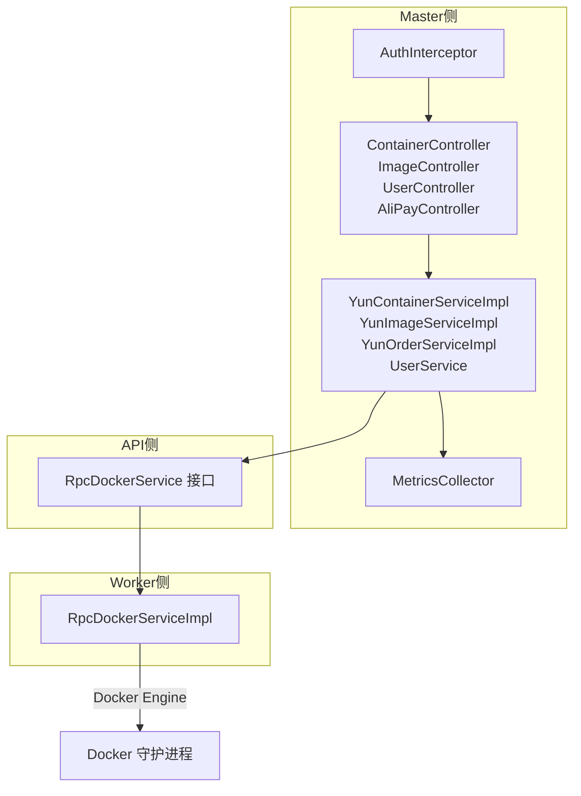
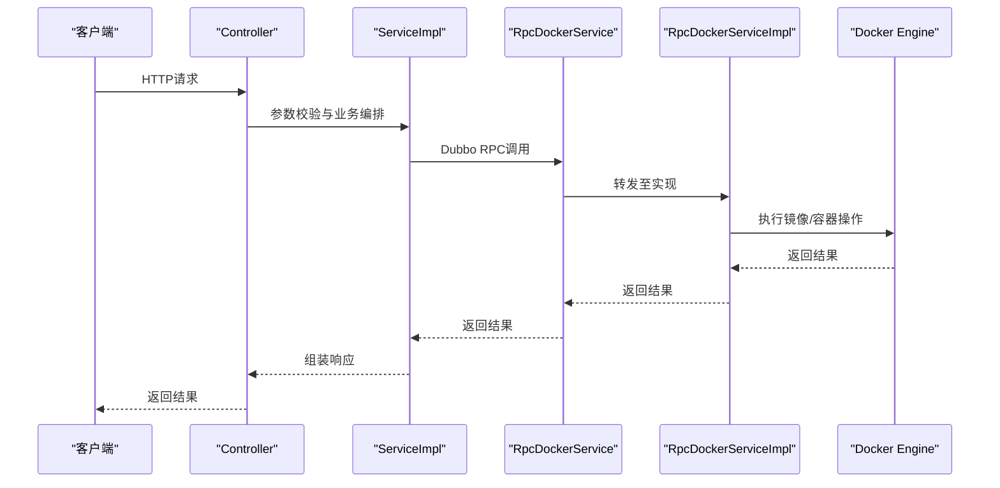
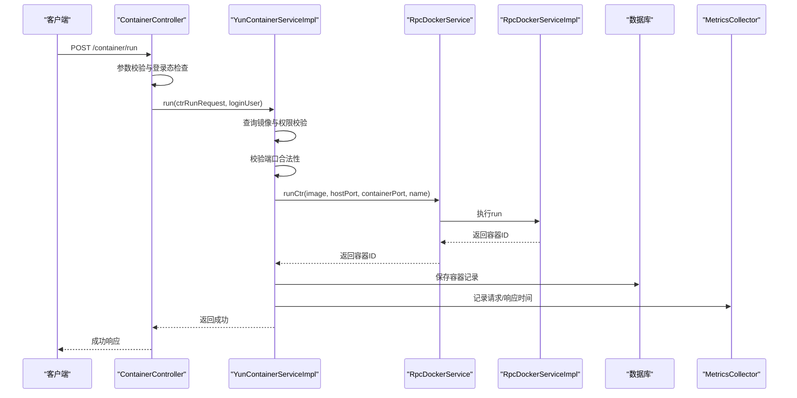
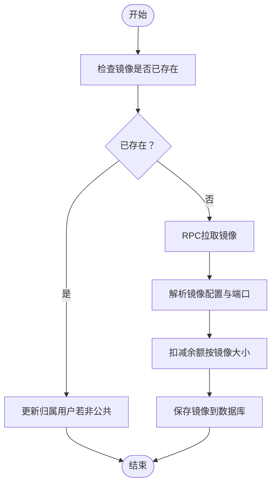
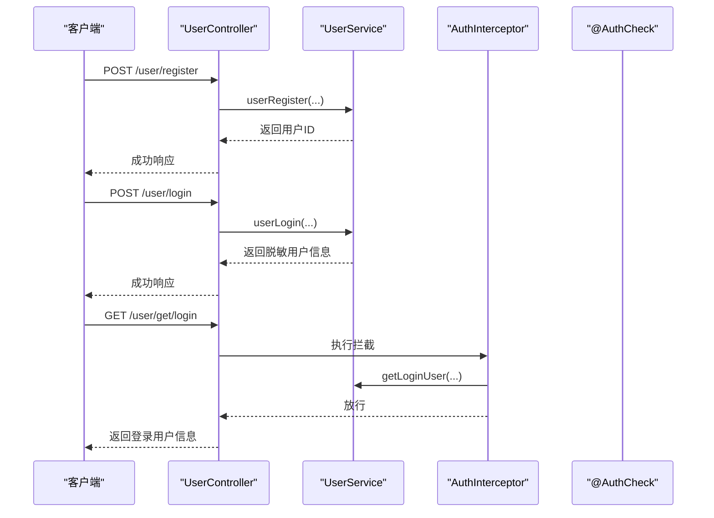
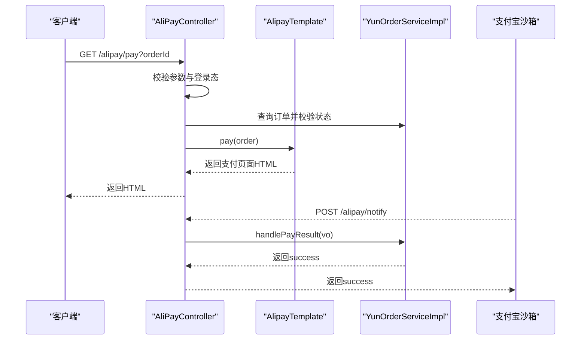
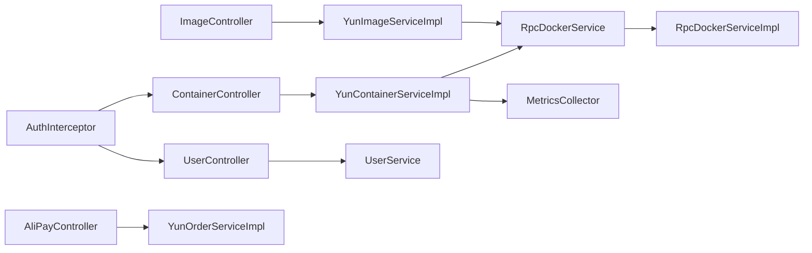

# 核心功能详解

<cite>
**本文引用的文件**
- [ContainerController.java](file://yun-docker-master/src/main/java/com/lfc/yundocker/controller/ContainerController.java)
- [ImageController.java](file://yun-docker-master/src/main/java/com/lfc/yundocker/controller/ImageController.java)
- [UserController.java](file://yun-docker-master/src/main/java/com/lfc/yundocker/controller/UserController.java)
- [AliPayController.java](file://yun-docker-master/src/main/java/com/lfc/yundocker/controller/AliPayController.java)
- [AlipayTemplate.java](file://yun-docker-master/src/main/java/com/lfc/yundocker/manager/AlipayTemplate.java)
- [MetricsCollector.java](file://yun-docker-master/src/main/java/com/lfc/yundocker/monitor/MetricsCollector.java)
- [AuthInterceptor.java](file://yun-docker-master/src/main/java/com/lfc/yundocker/aop/AuthInterceptor.java)
- [AuthCheck.java](file://yun-docker-master/src/main/java/com/lfc/yundocker/annotation/AuthCheck.java)
- [YunContainerServiceImpl.java](file://yun-docker-master/src/main/java/com/lfc/yundocker/service/impl/YunContainerServiceImpl.java)
- [YunImageServiceImpl.java](file://yun-docker-master/src/main/java/com/lfc/yundocker/service/impl/YunImageServiceImpl.java)
- [YunOrderServiceImpl.java](file://yun-docker-master/src/main/java/com/lfc/yundocker/service/impl/YunOrderServiceImpl.java)
- [RpcDockerServiceImpl.java](file://yun-docker-worker/src/main/java/com/lfc/yundocker/worker/rpc/RpcDockerServiceImpl.java)
- [RpcDockerService.java](file://yun-docker-api/src/main/java/com/lfc/yundocker/service/RpcDockerService.java)
- [application.yml（master）](file://yun-docker-master/src/main/resources/application.yml)
- [application.yml（worker）](file://yun-docker-worker/src/main/resources/application.yml)
- [UserService.java](file://yun-docker-master/src/main/java/com/lfc/yundocker/service/UserService.java)
</cite>

## 目录
1. [引言](#引言)
2. [项目结构](#项目结构)
3. [核心组件](#核心组件)
4. [架构总览](#架构总览)
5. [详细组件分析](#详细组件分析)
6. [依赖关系分析](#依赖关系分析)
7. [性能考量](#性能考量)
8. [故障排查指南](#故障排查指南)
9. [结论](#结论)

## 引言
本文件围绕“云Docker管理系统”的四大核心功能进行技术实现路径剖析：
- 容器管理：从HTTP请求到Docker执行的完整链路，包含参数校验、资源配额检查、RPC调用与状态同步。
- 镜像管理：拉取、缓存与本地列表展示机制。
- 用户系统：注册加密、登录态维护（基于Session）、权限拦截（AuthCheck注解）。
- 支付系统：订单创建、支付宝沙箱跳转、异步回调验签与积分更新的原子性保障。

文档在每个功能模块下提供时序图与异常处理策略，并通过“章节来源”和“图表来源”标注具体代码位置，便于读者定位实现细节。

## 项目结构
系统采用前后端分离与Dubbo RPC分层设计：
- master侧负责HTTP接口、业务编排、权限控制、指标采集与支付流程。
- worker侧负责与Docker引擎交互，执行镜像拉取、容器生命周期管理与实时监控推送。
- API侧提供统一的RPC接口契约，供master侧调用。

图表来源
- [ContainerController.java](file://yun-docker-master/src/main/java/com/lfc/yundocker/controller/ContainerController.java#L1-L173)
- [ImageController.java](file://yun-docker-master/src/main/java/com/lfc/yundocker/controller/ImageController.java#L1-L116)
- [UserController.java](file://yun-docker-master/src/main/java/com/lfc/yundocker/controller/UserController.java#L1-L309)
- [AliPayController.java](file://yun-docker-master/src/main/java/com/lfc/yundocker/controller/AliPayController.java#L1-L113)
- [YunContainerServiceImpl.java](file://yun-docker-master/src/main/java/com/lfc/yundocker/service/impl/YunContainerServiceImpl.java#L1-L318)
- [YunImageServiceImpl.java](file://yun-docker-master/src/main/java/com/lfc/yundocker/service/impl/YunImageServiceImpl.java#L1-L145)
- [YunOrderServiceImpl.java](file://yun-docker-master/src/main/java/com/lfc/yundocker/service/impl/YunOrderServiceImpl.java#L1-L118)
- [RpcDockerServiceImpl.java](file://yun-docker-worker/src/main/java/com/lfc/yundocker/worker/rpc/RpcDockerServiceImpl.java#L1-L440)
- [RpcDockerService.java](file://yun-docker-api/src/main/java/com/lfc/yundocker/service/RpcDockerService.java#L1-L143)
- [MetricsCollector.java](file://yun-docker-master/src/main/java/com/lfc/yundocker/monitor/MetricsCollector.java#L1-L76)
- [AuthInterceptor.java](file://yun-docker-master/src/main/java/com/lfc/yundocker/aop/AuthInterceptor.java#L1-L70)
- [AuthCheck.java](file://yun-docker-master/src/main/java/com/lfc/yundocker/annotation/AuthCheck.java#L1-L29)

章节来源
- [application.yml（master）](file://yun-docker-master/src/main/resources/application.yml#L1-L60)
- [application.yml（worker）](file://yun-docker-worker/src/main/resources/application.yml#L1-L51)

## 核心组件
- 控制器层：提供REST接口，完成参数校验、鉴权与业务编排。
- 服务层：实现业务规则、资源配额检查、RPC调用与状态同步。
- RPC实现层：对接Docker Engine，执行镜像拉取、容器生命周期管理与监控。
- 权限与安全：基于注解的AOP拦截器，统一权限校验。
- 指标采集：Micrometer计数器与定时器，记录镜像运行与错误情况。

章节来源
- [ContainerController.java](file://yun-docker-master/src/main/java/com/lfc/yundocker/controller/ContainerController.java#L1-L173)
- [ImageController.java](file://yun-docker-master/src/main/java/com/lfc/yundocker/controller/ImageController.java#L1-L116)
- [UserController.java](file://yun-docker-master/src/main/java/com/lfc/yundocker/controller/UserController.java#L1-L309)
- [AliPayController.java](file://yun-docker-master/src/main/java/com/lfc/yundocker/controller/AliPayController.java#L1-L113)
- [YunContainerServiceImpl.java](file://yun-docker-master/src/main/java/com/lfc/yundocker/service/impl/YunContainerServiceImpl.java#L1-L318)
- [YunImageServiceImpl.java](file://yun-docker-master/src/main/java/com/lfc/yundocker/service/impl/YunImageServiceImpl.java#L1-L145)
- [YunOrderServiceImpl.java](file://yun-docker-master/src/main/java/com/lfc/yundocker/service/impl/YunOrderServiceImpl.java#L1-L118)
- [RpcDockerServiceImpl.java](file://yun-docker-worker/src/main/java/com/lfc/yundocker/worker/rpc/RpcDockerServiceImpl.java#L1-L440)
- [RpcDockerService.java](file://yun-docker-api/src/main/java/com/lfc/yundocker/service/RpcDockerService.java#L1-L143)
- [MetricsCollector.java](file://yun-docker-master/src/main/java/com/lfc/yundocker/monitor/MetricsCollector.java#L1-L76)
- [AuthInterceptor.java](file://yun-docker-master/src/main/java/com/lfc/yundocker/aop/AuthInterceptor.java#L1-L70)
- [AuthCheck.java](file://yun-docker-master/src/main/java/com/lfc/yundocker/annotation/AuthCheck.java#L1-L29)

## 架构总览
系统采用“控制器-服务-接口-实现-引擎”的分层架构，master侧通过Dubbo调用worker侧提供的RpcDockerService，worker侧直接与Docker Engine交互。同时，master侧负责用户态、鉴权、支付与指标采集。

图表来源
- [ContainerController.java](file://yun-docker-master/src/main/java/com/lfc/yundocker/controller/ContainerController.java#L117-L133)
- [YunContainerServiceImpl.java](file://yun-docker-master/src/main/java/com/lfc/yundocker/service/impl/YunContainerServiceImpl.java#L136-L215)
- [RpcDockerService.java](file://yun-docker-api/src/main/java/com/lfc/yundocker/service/RpcDockerService.java#L1-L143)
- [RpcDockerServiceImpl.java](file://yun-docker-worker/src/main/java/com/lfc/yundocker/worker/rpc/RpcDockerServiceImpl.java#L82-L107)

## 详细组件分析

### 容器管理：从HTTP请求到Docker执行的完整链路
- 请求入口与参数校验
  - 控制器对分页、容器ID等参数进行非空校验，防止非法输入。
  - 登录态校验：所有容器操作均需登录用户身份。
- 资源配额检查
  - 创建容器前检查用户余额，不足则拒绝创建。
- RPC调用与状态同步
  - 通过Dubbo调用worker侧RpcDockerService执行run/start/stop/restart/remove/log等操作。
  - 成功后更新数据库状态与端口映射，失败抛出业务异常。
- 指标采集
  - 使用MetricsCollector记录镜像运行次数、错误次数与响应时间，便于监控与告警。

图表来源
- [ContainerController.java](file://yun-docker-master/src/main/java/com/lfc/yundocker/controller/ContainerController.java#L117-L133)
- [YunContainerServiceImpl.java](file://yun-docker-master/src/main/java/com/lfc/yundocker/service/impl/YunContainerServiceImpl.java#L136-L215)
- [RpcDockerService.java](file://yun-docker-api/src/main/java/com/lfc/yundocker/service/RpcDockerService.java#L28-L38)
- [RpcDockerServiceImpl.java](file://yun-docker-worker/src/main/java/com/lfc/yundocker/worker/rpc/RpcDockerServiceImpl.java#L82-L107)
- [MetricsCollector.java](file://yun-docker-master/src/main/java/com/lfc/yundocker/monitor/MetricsCollector.java#L33-L72)

章节来源
- [ContainerController.java](file://yun-docker-master/src/main/java/com/lfc/yundocker/controller/ContainerController.java#L48-L171)
- [YunContainerServiceImpl.java](file://yun-docker-master/src/main/java/com/lfc/yundocker/service/impl/YunContainerServiceImpl.java#L136-L215)
- [RpcDockerServiceImpl.java](file://yun-docker-worker/src/main/java/com/lfc/yundocker/worker/rpc/RpcDockerServiceImpl.java#L82-L107)
- [MetricsCollector.java](file://yun-docker-master/src/main/java/com/lfc/yundocker/monitor/MetricsCollector.java#L33-L72)

异常处理策略
- 参数非法：抛出业务异常，提示参数错误。
- 镜像不存在或权限不足：抛出未找到错误。
- Docker操作失败：抛出Docker错误，记录指标错误计数。
- 余额不足：返回余额不足提示，阻止创建。

### 镜像管理：拉取、缓存与本地列表展示
- 拉取镜像
  - 若镜像已存在且非公共镜像，直接更新归属用户；否则通过RPC拉取镜像并解析配置端口。
  - 扣减用户余额（按镜像大小计算），并将镜像信息入库。
- 删除镜像
  - 校验镜像归属与类型，通过RPC删除镜像并返还余额，最后删除数据库记录。
- 本地列表展示
  - 支持分页查询，公共镜像对所有人可见，私有镜像仅本人可见。

图表来源
- [ImageController.java](file://yun-docker-master/src/main/java/com/lfc/yundocker/controller/ImageController.java#L46-L61)
- [YunImageServiceImpl.java](file://yun-docker-master/src/main/java/com/lfc/yundocker/service/impl/YunImageServiceImpl.java#L41-L84)
- [RpcDockerServiceImpl.java](file://yun-docker-worker/src/main/java/com/lfc/yundocker/worker/rpc/RpcDockerServiceImpl.java#L53-L72)

章节来源
- [ImageController.java](file://yun-docker-master/src/main/java/com/lfc/yundocker/controller/ImageController.java#L46-L112)
- [YunImageServiceImpl.java](file://yun-docker-master/src/main/java/com/lfc/yundocker/service/impl/YunImageServiceImpl.java#L41-L102)
- [RpcDockerServiceImpl.java](file://yun-docker-worker/src/main/java/com/lfc/yundocker/worker/rpc/RpcDockerServiceImpl.java#L53-L72)

异常处理策略
- 镜像不存在或权限不足：抛出未找到错误。
- RPC拉取失败：抛出业务异常并记录指标错误。
- 删除镜像时非本人或非私有镜像：抛出未找到错误。

### 用户系统：注册加密、登录态维护与权限拦截
- 注册与登录
  - 注册接口对必填字段进行校验，调用服务层完成用户创建。
  - 登录接口校验账户与密码，返回脱敏后的登录用户信息。
- 登录态维护
  - 基于Spring Session（可选Redis分布式会话），默认使用本地Session。
- 权限拦截
  - 通过AuthCheck注解与AuthInterceptor切面，统一校验用户角色与封禁状态，未满足条件抛出无权限错误。

图表来源
- [UserController.java](file://yun-docker-master/src/main/java/com/lfc/yundocker/controller/UserController.java#L50-L122)
- [UserService.java](file://yun-docker-master/src/main/java/com/lfc/yundocker/service/UserService.java#L1-L124)
- [AuthInterceptor.java](file://yun-docker-master/src/main/java/com/lfc/yundocker/aop/AuthInterceptor.java#L40-L67)
- [AuthCheck.java](file://yun-docker-master/src/main/java/com/lfc/yundocker/annotation/AuthCheck.java#L1-L29)

章节来源
- [UserController.java](file://yun-docker-master/src/main/java/com/lfc/yundocker/controller/UserController.java#L50-L122)
- [UserService.java](file://yun-docker-master/src/main/java/com/lfc/yundocker/service/UserService.java#L1-L124)
- [AuthInterceptor.java](file://yun-docker-master/src/main/java/com/lfc/yundocker/aop/AuthInterceptor.java#L40-L67)
- [AuthCheck.java](file://yun-docker-master/src/main/java/com/lfc/yundocker/annotation/AuthCheck.java#L1-L29)
- [application.yml（master）](file://yun-docker-master/src/main/resources/application.yml#L23-L41)

异常处理策略
- 参数为空：抛出参数错误。
- 登录失败：抛出系统错误或业务错误。
- 权限不足：抛出无权限错误。

### 支付系统：订单创建、沙箱跳转、异步回调与原子性保障
- 订单创建
  - 服务层根据充值积分生成唯一订单号与金额，状态初始化为未支付。
- 支付发起
  - 控制器根据订单号与登录用户查询订单，校验状态后调用AlipayTemplate构造支付表单并返回HTML页面。
- 异步回调与验签
  - 支付宝异步通知接口接收参数，构建参数Map并调用订单服务处理支付结果。
  - 服务层根据交易状态更新订单状态与流水号，返回success。
- 原子性保障
  - 订单状态更新与字段写入在同一事务中完成，确保一致性。

图表来源
- [AliPayController.java](file://yun-docker-master/src/main/java/com/lfc/yundocker/controller/AliPayController.java#L43-L112)
- [AlipayTemplate.java](file://yun-docker-master/src/main/java/com/lfc/yundocker/manager/AlipayTemplate.java#L59-L106)
- [YunOrderServiceImpl.java](file://yun-docker-master/src/main/java/com/lfc/yundocker/service/impl/YunOrderServiceImpl.java#L48-L81)

章节来源
- [AliPayController.java](file://yun-docker-master/src/main/java/com/lfc/yundocker/controller/AliPayController.java#L43-L112)
- [AlipayTemplate.java](file://yun-docker-master/src/main/java/com/lfc/yundocker/manager/AlipayTemplate.java#L59-L106)
- [YunOrderServiceImpl.java](file://yun-docker-master/src/main/java/com/lfc/yundocker/service/impl/YunOrderServiceImpl.java#L48-L81)

异常处理策略
- 订单不存在或状态异常：抛出未找到或订单状态错误。
- 回调验签失败：当前代码示例中保留了验签逻辑占位，建议补充完整验签流程。
- 订单超时：订单服务在查询时检查超时并更新状态为取消。

## 依赖关系分析
- 控制器依赖服务层，服务层依赖RPC接口，RPC接口由worker侧实现。
- 权限拦截通过注解与AOP织入，统一校验用户角色。
- 指标采集通过Micrometer注册计数器与定时器，避免重复创建。

图表来源
- [ContainerController.java](file://yun-docker-master/src/main/java/com/lfc/yundocker/controller/ContainerController.java#L1-L173)
- [ImageController.java](file://yun-docker-master/src/main/java/com/lfc/yundocker/controller/ImageController.java#L1-L116)
- [UserController.java](file://yun-docker-master/src/main/java/com/lfc/yundocker/controller/UserController.java#L1-L309)
- [AliPayController.java](file://yun-docker-master/src/main/java/com/lfc/yundocker/controller/AliPayController.java#L1-L113)
- [YunContainerServiceImpl.java](file://yun-docker-master/src/main/java/com/lfc/yundocker/service/impl/YunContainerServiceImpl.java#L1-L318)
- [YunImageServiceImpl.java](file://yun-docker-master/src/main/java/com/lfc/yundocker/service/impl/YunImageServiceImpl.java#L1-L145)
- [YunOrderServiceImpl.java](file://yun-docker-master/src/main/java/com/lfc/yundocker/service/impl/YunOrderServiceImpl.java#L1-L118)
- [RpcDockerService.java](file://yun-docker-api/src/main/java/com/lfc/yundocker/service/RpcDockerService.java#L1-L143)
- [RpcDockerServiceImpl.java](file://yun-docker-worker/src/main/java/com/lfc/yundocker/worker/rpc/RpcDockerServiceImpl.java#L1-L440)
- [AuthInterceptor.java](file://yun-docker-master/src/main/java/com/lfc/yundocker/aop/AuthInterceptor.java#L1-L70)
- [MetricsCollector.java](file://yun-docker-master/src/main/java/com/lfc/yundocker/monitor/MetricsCollector.java#L1-L76)

章节来源
- [RpcDockerService.java](file://yun-docker-api/src/main/java/com/lfc/yundocker/service/RpcDockerService.java#L1-L143)
- [RpcDockerServiceImpl.java](file://yun-docker-worker/src/main/java/com/lfc/yundocker/worker/rpc/RpcDockerServiceImpl.java#L1-L440)
- [AuthInterceptor.java](file://yun-docker-master/src/main/java/com/lfc/yundocker/aop/AuthInterceptor.java#L1-L70)

## 性能考量
- 指标采集
  - MetricsCollector对计数器与定时器进行缓存，避免重复创建，降低开销。
- RPC调用
  - master侧通过Dubbo调用worker侧，合理设置超时与重试策略，避免阻塞。
- 日志与监控
  - Prometheus端点暴露健康与指标，便于外部监控系统抓取。

章节来源
- [MetricsCollector.java](file://yun-docker-master/src/main/java/com/lfc/yundocker/monitor/MetricsCollector.java#L27-L72)
- [application.yml（master）](file://yun-docker-master/src/main/resources/application.yml#L51-L60)
- [application.yml（worker）](file://yun-docker-worker/src/main/resources/application.yml#L42-L51)

## 故障排查指南
- 容器创建失败
  - 检查镜像是否存在与权限是否匹配；核对端口占用与容器端口映射；查看Docker操作异常日志。
- 镜像拉取失败
  - 确认镜像名称格式与仓库可达性；检查余额扣减逻辑与数据库保存。
- 支付回调异常
  - 校验回调参数完整性与签名；确认订单状态更新逻辑；检查超时与取消逻辑。
- 权限拦截失败
  - 检查AuthCheck注解使用与用户角色；确认登录态有效；查看拦截器异常分支。

章节来源
- [YunContainerServiceImpl.java](file://yun-docker-master/src/main/java/com/lfc/yundocker/service/impl/YunContainerServiceImpl.java#L186-L215)
- [YunImageServiceImpl.java](file://yun-docker-master/src/main/java/com/lfc/yundocker/service/impl/YunImageServiceImpl.java#L41-L84)
- [YunOrderServiceImpl.java](file://yun-docker-master/src/main/java/com/lfc/yundocker/service/impl/YunOrderServiceImpl.java#L70-L81)
- [AuthInterceptor.java](file://yun-docker-master/src/main/java/com/lfc/yundocker/aop/AuthInterceptor.java#L40-L67)

## 结论
本系统通过清晰的分层设计与完善的异常处理策略，实现了容器与镜像的全生命周期管理、用户态与权限控制、以及支付流程的可靠落地。指标采集与监控端点为运维提供了可观测性支撑。建议后续完善支付回调验签与容器监控统计的稳定性，持续优化用户体验与系统可靠性。