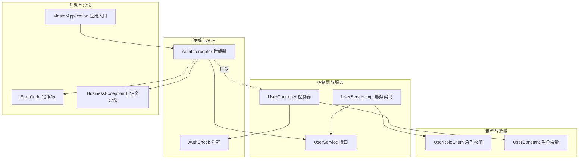
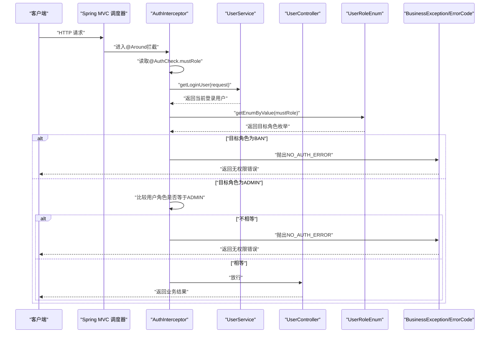
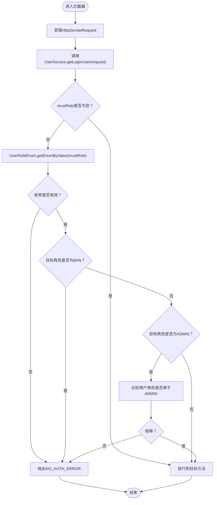
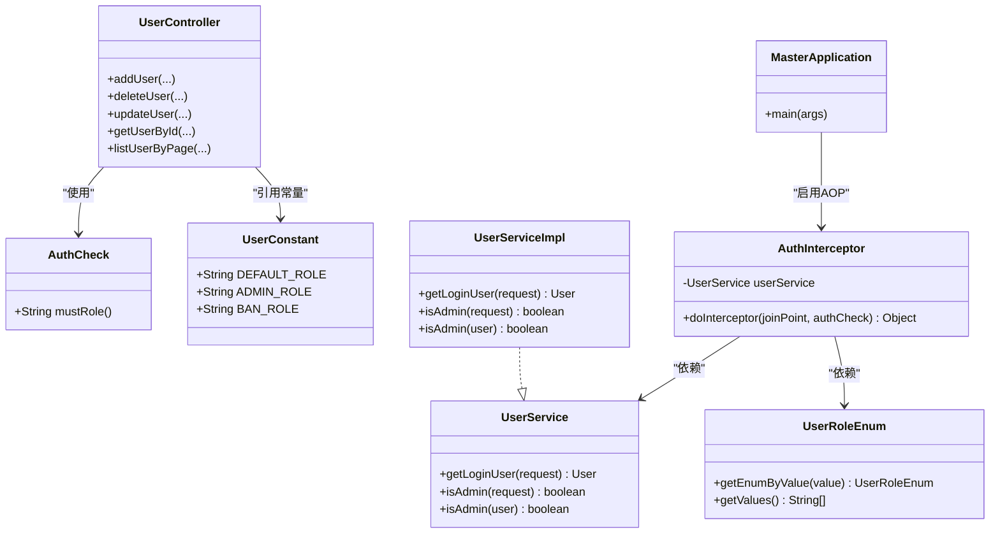

# 权限控制与角色管理

<cite>
**本文引用的文件**
- [AuthCheck.java](file://yun-docker-master/src/main/java/com/lfc/yundocker/annotation/AuthCheck.java)
- [AuthInterceptor.java](file://yun-docker-master/src/main/java/com/lfc/yundocker/aop/AuthInterceptor.java)
- [UserRoleEnum.java](file://yun-docker-common/src/main/java/com/lfc/yundocker/common/model/enums/UserRoleEnum.java)
- [UserConstant.java](file://yun-docker-common/src/main/java/com/lfc/yundocker/common/constant/UserConstant.java)
- [UserController.java](file://yun-docker-master/src/main/java/com/lfc/yundocker/controller/UserController.java)
- [UserService.java](file://yun-docker-master/src/main/java/com/lfc/yundocker/service/UserService.java)
- [UserServiceImpl.java](file://yun-docker-master/src/main/java/com/lfc/yundocker/service/impl/UserServiceImpl.java)
- [MasterApplication.java](file://yun-docker-master/src/main/java/com/lfc/yundocker/MasterApplication.java)
- [ErrorCode.java](file://yun-docker-common/src/main/java/com/lfc/yundocker/common/model/enums/ErrorCode.java)
- [BusinessException.java](file://yun-docker-common/src/main/java/com/lfc/yundocker/common/exception/BusinessException.java)
</cite>

## 目录
1. [简介](#简介)
2. [项目结构](#项目结构)
3. [核心组件](#核心组件)
4. [架构总览](#架构总览)
5. [详细组件分析](#详细组件分析)
6. [依赖关系分析](#依赖关系分析)
7. [性能考量](#性能考量)
8. [故障排查指南](#故障排查指南)
9. [结论](#结论)

## 简介
本文件系统性解析基于注解与AOP的权限控制机制，重点说明：
- 在UserController中，通过@AuthCheck(mustRole = UserConstant.ADMIN_ROLE)声明管理员权限要求，覆盖新增、删除、更新、分页查询等管理接口。
- AuthInterceptor在请求进入Controller前，利用AOP拦截带有@AuthCheck的方法，通过反射读取注解参数，调用UserService获取当前登录用户并校验其角色是否满足要求。
- UserRoleEnum定义了用户角色值（如ADMIN、BAN），用于权限匹配与封禁判定。
- 普通用户调用管理接口时会被拦截并返回“无权限”错误。
- 提供权限校验的拦截时序图，并建议在高并发场景下结合Redis缓存用户角色信息以提升性能。

## 项目结构
围绕权限控制的关键模块分布如下：
- 注解层：AuthCheck.java 定义权限注解，声明 mustRole 字段。
- AOP层：AuthInterceptor.java 实现环绕通知，拦截带注解的方法，执行权限校验。
- 枚举层：UserRoleEnum.java 定义角色值与枚举转换工具。
- 常量层：UserConstant.java 定义默认角色、管理员角色、封号角色等常量。
- 控制器层：UserController.java 使用@AuthCheck标注管理接口。
- 服务层：UserService.java 与 UserServiceImpl.java 提供登录态获取与角色判断能力。
- 启动类：MasterApplication.java 开启@EnableAspectJAutoProxy，使AOP生效。
- 异常与错误码：ErrorCode.java、BusinessException.java 统一错误返回。

图表来源
- [AuthCheck.java](file://yun-docker-master/src/main/java/com/lfc/yundocker/annotation/AuthCheck.java#L1-L29)
- [AuthInterceptor.java](file://yun-docker-master/src/main/java/com/lfc/yundocker/aop/AuthInterceptor.java#L1-L70)
- [UserController.java](file://yun-docker-master/src/main/java/com/lfc/yundocker/controller/UserController.java#L1-L309)
- [UserService.java](file://yun-docker-master/src/main/java/com/lfc/yundocker/service/UserService.java#L1-L124)
- [UserServiceImpl.java](file://yun-docker-master/src/main/java/com/lfc/yundocker/service/impl/UserServiceImpl.java#L1-L301)
- [UserRoleEnum.java](file://yun-docker-common/src/main/java/com/lfc/yundocker/common/model/enums/UserRoleEnum.java#L1-L64)
- [UserConstant.java](file://yun-docker-common/src/main/java/com/lfc/yundocker/common/constant/UserConstant.java#L1-L34)
- [MasterApplication.java](file://yun-docker-master/src/main/java/com/lfc/yundocker/MasterApplication.java#L1-L25)
- [ErrorCode.java](file://yun-docker-common/src/main/java/com/lfc/yundocker/common/model/enums/ErrorCode.java#L1-L49)
- [BusinessException.java](file://yun-docker-common/src/main/java/com/lfc/yundocker/common/exception/BusinessException.java#L1-L37)

章节来源
- [AuthCheck.java](file://yun-docker-master/src/main/java/com/lfc/yundocker/annotation/AuthCheck.java#L1-L29)
- [AuthInterceptor.java](file://yun-docker-master/src/main/java/com/lfc/yundocker/aop/AuthInterceptor.java#L1-L70)
- [UserController.java](file://yun-docker-master/src/main/java/com/lfc/yundocker/controller/UserController.java#L140-L214)
- [UserService.java](file://yun-docker-master/src/main/java/com/lfc/yundocker/service/UserService.java#L48-L78)
- [UserServiceImpl.java](file://yun-docker-master/src/main/java/com/lfc/yundocker/service/impl/UserServiceImpl.java#L171-L231)
- [UserRoleEnum.java](file://yun-docker-common/src/main/java/com/lfc/yundocker/common/model/enums/UserRoleEnum.java#L14-L64)
- [UserConstant.java](file://yun-docker-common/src/main/java/com/lfc/yundocker/common/constant/UserConstant.java#L8-L34)
- [MasterApplication.java](file://yun-docker-master/src/main/java/com/lfc/yundocker/MasterApplication.java#L1-L25)
- [ErrorCode.java](file://yun-docker-common/src/main/java/com/lfc/yundocker/common/model/enums/ErrorCode.java#L8-L25)
- [BusinessException.java](file://yun-docker-common/src/main/java/com/lfc/yundocker/common/exception/BusinessException.java#L1-L37)

## 核心组件
- 注解 AuthCheck：用于在Controller方法上声明“必须具备的角色”，默认空表示无需特定角色，否则按mustRole进行校验。
- AOP拦截器 AuthInterceptor：通过@Around("@annotation(authCheck)")拦截所有带@AuthCheck的方法，读取注解参数，获取当前登录用户，校验角色是否满足要求。
- 角色枚举 UserRoleEnum：包含USER、ADMIN、BAN三种角色值，提供根据value获取枚举的工具方法。
- 角色常量 UserConstant：提供DEFAULT_ROLE、ADMIN_ROLE、BAN_ROLE等字符串常量，便于在注解中引用。
- 控制器 UserController：在多个管理接口上使用@AuthCheck(mustRole = UserConstant.ADMIN_ROLE)，确保只有管理员可调用。
- 服务 UserService/UserServiceImpl：提供获取登录用户、判断是否管理员的能力，拦截器依赖这些方法获取用户角色。
- 启动类 MasterApplication：开启@EnableAspectJAutoProxy，使AOP生效。
- 错误码与异常：ErrorCode定义NO_AUTH_ERROR等错误码，BusinessException统一抛出。

章节来源
- [AuthCheck.java](file://yun-docker-master/src/main/java/com/lfc/yundocker/annotation/AuthCheck.java#L16-L26)
- [AuthInterceptor.java](file://yun-docker-master/src/main/java/com/lfc/yundocker/aop/AuthInterceptor.java#L40-L67)
- [UserRoleEnum.java](file://yun-docker-common/src/main/java/com/lfc/yundocker/common/model/enums/UserRoleEnum.java#L14-L64)
- [UserConstant.java](file://yun-docker-common/src/main/java/com/lfc/yundocker/common/constant/UserConstant.java#L16-L31)
- [UserController.java](file://yun-docker-master/src/main/java/com/lfc/yundocker/controller/UserController.java#L147-L174)
- [UserService.java](file://yun-docker-master/src/main/java/com/lfc/yundocker/service/UserService.java#L48-L78)
- [UserServiceImpl.java](file://yun-docker-master/src/main/java/com/lfc/yundocker/service/impl/UserServiceImpl.java#L171-L231)
- [MasterApplication.java](file://yun-docker-master/src/main/java/com/lfc/yundocker/MasterApplication.java#L17-L17)
- [ErrorCode.java](file://yun-docker-common/src/main/java/com/lfc/yundocker/common/model/enums/ErrorCode.java#L10-L17)
- [BusinessException.java](file://yun-docker-common/src/main/java/com/lfc/yundocker/common/exception/BusinessException.java#L11-L36)

## 架构总览
权限控制的整体流程：
- 控制器方法使用@AuthCheck(mustRole = UserConstant.ADMIN_ROLE)声明管理员权限。
- 请求进入Spring MVC后，AOP拦截器AuthInterceptor对带@AuthCheck的方法进行环绕拦截。
- 拦截器通过反射读取注解的mustRole，调用UserService.getLoginUser(request)获取当前登录用户。
- 将mustRole映射为UserRoleEnum，若目标角色为BAN则直接拒绝；若目标角色为ADMIN，则比较用户角色是否等于ADMIN，不相等则拒绝。
- 校验通过后放行到Controller方法执行业务逻辑。

图表来源
- [AuthInterceptor.java](file://yun-docker-master/src/main/java/com/lfc/yundocker/aop/AuthInterceptor.java#L40-L67)
- [UserService.java](file://yun-docker-master/src/main/java/com/lfc/yundocker/service/UserService.java#L48-L54)
- [UserServiceImpl.java](file://yun-docker-master/src/main/java/com/lfc/yundocker/service/impl/UserServiceImpl.java#L171-L192)
- [UserRoleEnum.java](file://yun-docker-common/src/main/java/com/lfc/yundocker/common/model/enums/UserRoleEnum.java#L38-L54)
- [ErrorCode.java](file://yun-docker-common/src/main/java/com/lfc/yundocker/common/model/enums/ErrorCode.java#L10-L17)
- [BusinessException.java](file://yun-docker-common/src/main/java/com/lfc/yundocker/common/exception/BusinessException.java#L18-L31)

## 详细组件分析

### 注解 AuthCheck
- 作用域：仅用于方法级别。
- 关键字段：mustRole，默认空字符串，表示无需特定角色；当设置为ADMIN_ROLE时，要求调用者必须为管理员。
- 使用方式：在Controller方法上添加@AuthCheck(mustRole = UserConstant.ADMIN_ROLE)。

章节来源
- [AuthCheck.java](file://yun-docker-master/src/main/java/com/lfc/yundocker/annotation/AuthCheck.java#L16-L26)
- [UserConstant.java](file://yun-docker-common/src/main/java/com/lfc/yundocker/common/constant/UserConstant.java#L20-L31)

### AOP拦截器 AuthInterceptor
- 切点表达式：@Around("@annotation(authCheck)")，拦截所有带@AuthCheck的方法。
- 核心流程：
  - 从请求上下文中获取当前登录用户。
  - 若mustRole非空，将其映射为UserRoleEnum。
  - 若目标角色为BAN，直接抛出NO_AUTH_ERROR。
  - 若目标角色为ADMIN，比较用户角色是否等于ADMIN，不相等则抛出NO_AUTH_ERROR。
  - 校验通过则放行到目标方法。
- 异常处理：统一使用BusinessException携带ErrorCode.NO_AUTH_ERROR。

图表来源
- [AuthInterceptor.java](file://yun-docker-master/src/main/java/com/lfc/yundocker/aop/AuthInterceptor.java#L40-L67)
- [UserService.java](file://yun-docker-master/src/main/java/com/lfc/yundocker/service/UserService.java#L48-L54)
- [UserServiceImpl.java](file://yun-docker-master/src/main/java/com/lfc/yundocker/service/impl/UserServiceImpl.java#L171-L192)
- [UserRoleEnum.java](file://yun-docker-common/src/main/java/com/lfc/yundocker/common/model/enums/UserRoleEnum.java#L38-L54)
- [ErrorCode.java](file://yun-docker-common/src/main/java/com/lfc/yundocker/common/model/enums/ErrorCode.java#L10-L17)
- [BusinessException.java](file://yun-docker-common/src/main/java/com/lfc/yundocker/common/exception/BusinessException.java#L18-L31)

章节来源
- [AuthInterceptor.java](file://yun-docker-master/src/main/java/com/lfc/yundocker/aop/AuthInterceptor.java#L40-L67)

### 角色枚举 UserRoleEnum
- 定义：USER("用户","user")、ADMIN("管理员","admin")、BAN("被封号","ban")。
- 工具方法：getEnumByValue(value)根据字符串值获取对应枚举；getValues()返回所有value集合。
- 用途：拦截器将mustRole映射为枚举，用于角色匹配与封禁判定。

章节来源
- [UserRoleEnum.java](file://yun-docker-common/src/main/java/com/lfc/yundocker/common/model/enums/UserRoleEnum.java#L14-L64)

### 角色常量 UserConstant
- 定义：DEFAULT_ROLE、ADMIN_ROLE、BAN_ROLE分别对应"user"、"admin"、"ban"。
- 用途：在@AuthCheck中引用，确保注解与枚举值一致。

章节来源
- [UserConstant.java](file://yun-docker-common/src/main/java/com/lfc/yundocker/common/constant/UserConstant.java#L16-L31)

### 控制器 UserController 的管理接口
- 在以下接口上使用@AuthCheck(mustRole = UserConstant.ADMIN_ROLE)：
  - POST /user/add
  - POST /user/delete
  - POST /user/update
  - GET /user/get
  - POST /user/list/page
- 这些接口均需要管理员身份，普通用户或未登录用户将被拦截并返回无权限。

章节来源
- [UserController.java](file://yun-docker-master/src/main/java/com/lfc/yundocker/controller/UserController.java#L147-L174)
- [UserController.java](file://yun-docker-master/src/main/java/com/lfc/yundocker/controller/UserController.java#L184-L196)
- [UserController.java](file://yun-docker-master/src/main/java/com/lfc/yundocker/controller/UserController.java#L205-L214)
- [UserController.java](file://yun-docker-master/src/main/java/com/lfc/yundocker/controller/UserController.java#L249-L258)

### 服务层 UserService 与 UserServiceImpl
- 获取登录用户：getLoginUser(HttpServletRequest request)从Session中取出当前用户，若为空则抛出未登录异常；随后从数据库重新加载以保证最新状态。
- 判断管理员：isAdmin(HttpServletRequest request)与isAdmin(User user)通过UserRoleEnum.ADMIN.getValue()与用户角色比较，判断是否管理员。
- 与拦截器协作：AuthInterceptor依赖getLoginUser(request)获取用户，再通过isAdmin(user)或角色字符串比较完成校验。

章节来源
- [UserService.java](file://yun-docker-master/src/main/java/com/lfc/yundocker/service/UserService.java#L48-L78)
- [UserServiceImpl.java](file://yun-docker-master/src/main/java/com/lfc/yundocker/service/impl/UserServiceImpl.java#L171-L231)

### 启动类 MasterApplication
- 通过@EnableAspectJAutoProxy(proxyTargetClass = true, exposeProxy = true)启用AOP代理，使AuthInterceptor生效。

章节来源
- [MasterApplication.java](file://yun-docker-master/src/main/java/com/lfc/yundocker/MasterApplication.java#L17-L17)

## 依赖关系分析
- 控制器依赖注解与常量：UserController使用@AuthCheck与UserConstant.ADMIN_ROLE。
- 拦截器依赖服务与枚举：AuthInterceptor依赖UserService.getLoginUser与UserRoleEnum.getEnumByValue。
- 服务实现依赖枚举与异常：UserServiceImpl.isAdmin依赖UserRoleEnum，getLoginUser在未登录时抛出异常。
- 启动类依赖AOP：MasterApplication启用AspectJ自动代理。

图表来源
- [AuthCheck.java](file://yun-docker-master/src/main/java/com/lfc/yundocker/annotation/AuthCheck.java#L16-L26)
- [AuthInterceptor.java](file://yun-docker-master/src/main/java/com/lfc/yundocker/aop/AuthInterceptor.java#L40-L67)
- [UserController.java](file://yun-docker-master/src/main/java/com/lfc/yundocker/controller/UserController.java#L147-L174)
- [UserService.java](file://yun-docker-master/src/main/java/com/lfc/yundocker/service/UserService.java#L48-L78)
- [UserServiceImpl.java](file://yun-docker-master/src/main/java/com/lfc/yundocker/service/impl/UserServiceImpl.java#L171-L231)
- [UserRoleEnum.java](file://yun-docker-common/src/main/java/com/lfc/yundocker/common/model/enums/UserRoleEnum.java#L38-L54)
- [UserConstant.java](file://yun-docker-common/src/main/java/com/lfc/yundocker/common/constant/UserConstant.java#L16-L31)
- [MasterApplication.java](file://yun-docker-master/src/main/java/com/lfc/yundocker/MasterApplication.java#L17-L17)

章节来源
- [AuthInterceptor.java](file://yun-docker-master/src/main/java/com/lfc/yundocker/aop/AuthInterceptor.java#L40-L67)
- [UserService.java](file://yun-docker-master/src/main/java/com/lfc/yundocker/service/UserService.java#L48-L78)
- [UserServiceImpl.java](file://yun-docker-master/src/main/java/com/lfc/yundocker/service/impl/UserServiceImpl.java#L171-L231)
- [UserRoleEnum.java](file://yun-docker-common/src/main/java/com/lfc/yundocker/common/model/enums/UserRoleEnum.java#L38-L54)
- [UserConstant.java](file://yun-docker-common/src/main/java/com/lfc/yundocker/common/constant/UserConstant.java#L16-L31)
- [MasterApplication.java](file://yun-docker-master/src/main/java/com/lfc/yundocker/MasterApplication.java#L17-L17)

## 性能考量
- 当前实现中，AuthInterceptor每次都会调用UserService.getLoginUser(request)获取用户并从数据库查询最新状态，这在高并发场景下可能带来额外的数据库压力。
- 建议在高并发场景下结合Redis缓存用户角色信息：
  - 缓存键设计：以用户ID为键，存储用户角色值与过期时间。
  - 读取策略：拦截器优先从Redis读取用户角色，未命中再回源数据库。
  - 写入与失效：登录成功写入缓存；用户角色变更或登出时主动失效缓存。
  - 注意：缓存一致性与过期策略需与业务需求匹配，避免脏读或长时间不一致。

[本节为通用性能建议，不直接分析具体文件，故无章节来源]

## 故障排查指南
- 现象：普通用户调用管理接口返回“无权限”。
  - 可能原因：mustRole为ADMIN，但用户角色不等于ADMIN；或目标角色为BAN。
  - 排查步骤：确认用户登录态是否正确；检查用户角色字段是否为ADMIN；确认注解mustRole与UserConstant.ADMIN_ROLE一致。
- 现象：未登录用户调用管理接口。
  - 可能原因：UserService.getLoginUser(request)抛出未登录异常，拦截器捕获后转换为NO_AUTH_ERROR。
  - 排查步骤：确认Session中是否保存了登录态键；检查登录流程是否成功写入Session。
- 现象：AOP未生效。
  - 可能原因：未启用@EnableAspectJAutoProxy或代理暴露配置不当。
  - 排查步骤：确认MasterApplication已启用@EnableAspectJAutoProxy。

章节来源
- [AuthInterceptor.java](file://yun-docker-master/src/main/java/com/lfc/yundocker/aop/AuthInterceptor.java#L40-L67)
- [UserService.java](file://yun-docker-master/src/main/java/com/lfc/yundocker/service/UserService.java#L48-L54)
- [UserServiceImpl.java](file://yun-docker-master/src/main/java/com/lfc/yundocker/service/impl/UserServiceImpl.java#L171-L192)
- [MasterApplication.java](file://yun-docker-master/src/main/java/com/lfc/yundocker/MasterApplication.java#L17-L17)
- [ErrorCode.java](file://yun-docker-common/src/main/java/com/lfc/yundocker/common/model/enums/ErrorCode.java#L10-L17)

## 结论
本权限控制体系通过@AuthCheck注解与AuthInterceptor AOP拦截器实现了细粒度的管理员权限保护。注解与常量确保了声明的一致性，拦截器在请求进入Controller前完成角色校验，UserRoleEnum提供稳定的枚举映射，配合ErrorCode与BusinessException形成统一的错误返回。对于高并发场景，建议引入Redis缓存用户角色信息以降低数据库压力，同时注意缓存一致性与过期策略的设计。