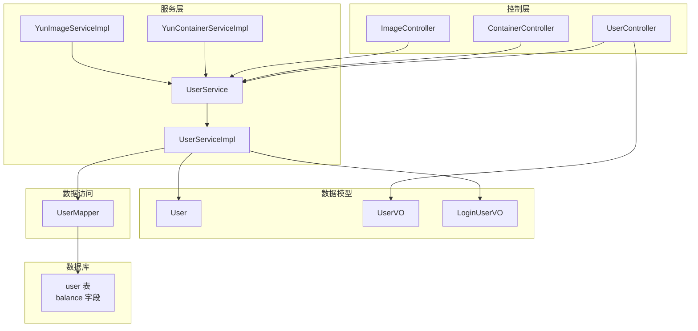
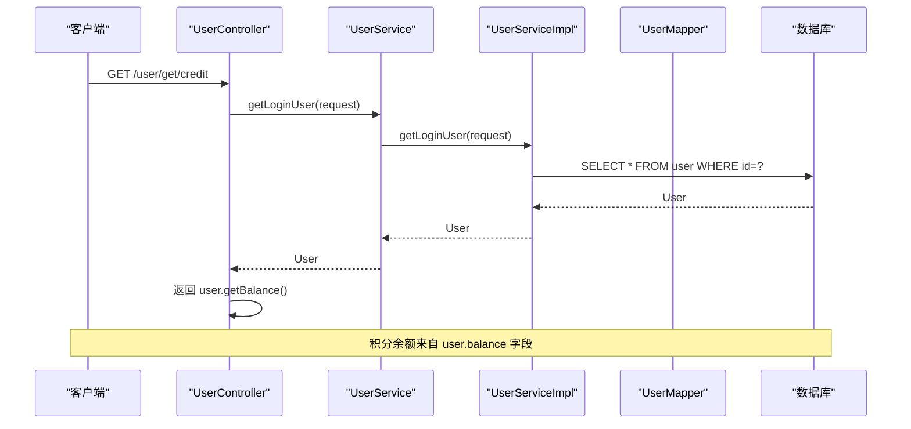
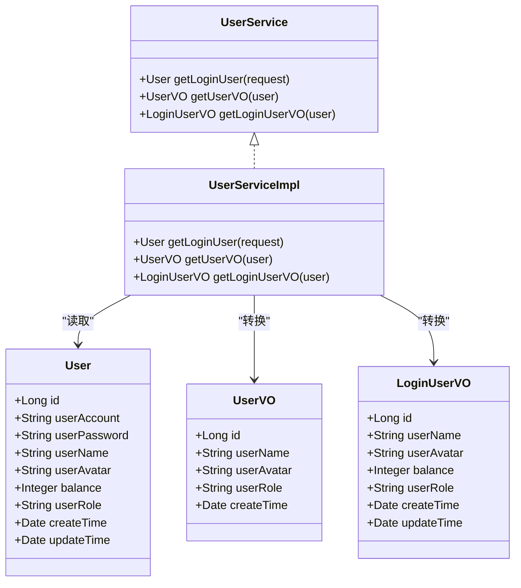
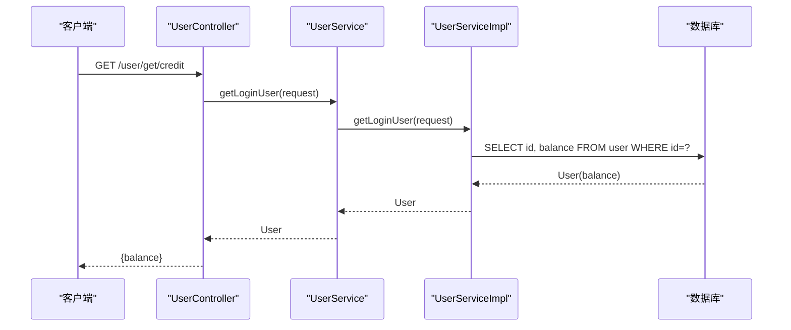
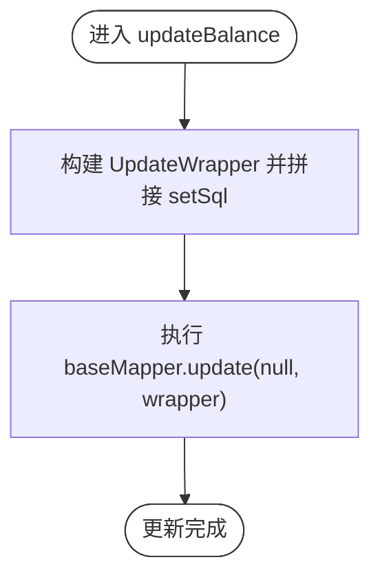
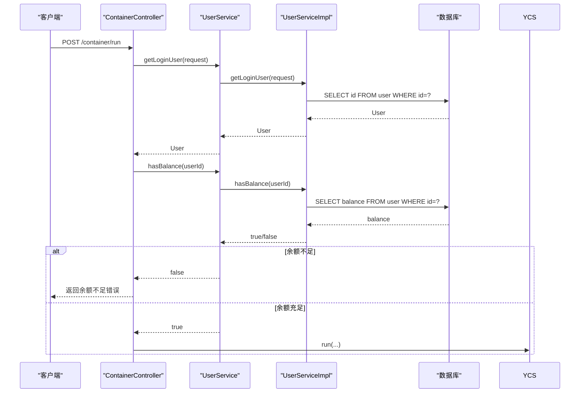
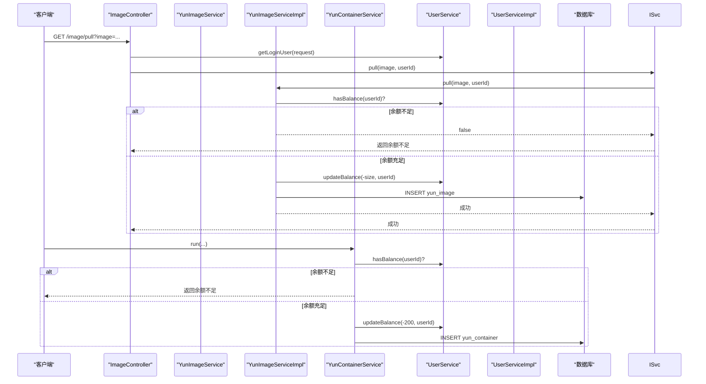
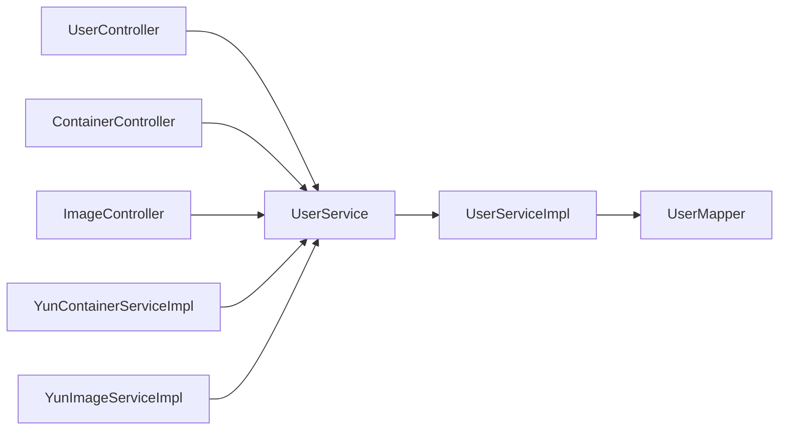

# 用户信息与积分管理

<cite>
**本文引用的文件**
- [UserController.java](file://yun-docker-master/src/main/java/com/lfc/yundocker/controller/UserController.java)
- [UserService.java](file://yun-docker-master/src/main/java/com/lfc/yundocker/service/UserService.java)
- [UserServiceImpl.java](file://yun-docker-master/src/main/java/com/lfc/yundocker/service/impl/UserServiceImpl.java)
- [UserVO.java](file://yun-docker-master/src/main/java/com/lfc/yundocker/common/model/vo/UserVO.java)
- [LoginUserVO.java](file://yun-docker-master/src/main/java/com/lfc/yundocker/common/model/vo/LoginUserVO.java)
- [User.java](file://yun-docker-master/src/main/java/com/lfc/yundocker/common/model/entity/User.java)
- [UserMapper.java](file://yun-docker-master/src/main/java/com/lfc/yundocker/mapper/UserMapper.java)
- [ContainerController.java](file://yun-docker-master/src/main/java/com/lfc/yundocker/controller/ContainerController.java)
- [YunContainerServiceImpl.java](file://yun-docker-master/src/main/java/com/lfc/yundocker/service/impl/YunContainerServiceImpl.java)
- [ImageController.java](file://yun-docker-master/src/main/java/com/lfc/yundocker/controller/ImageController.java)
- [YunImageServiceImpl.java](file://yun-docker-master/src/main/java/com/lfc/yundocker/service/impl/YunImageServiceImpl.java)
- [create_table.sql](file://sql/create_table.sql)
</cite>

## 目录
1. [简介](#简介)
2. [项目结构](#项目结构)
3. [核心组件](#核心组件)
4. [架构总览](#架构总览)
5. [详细组件分析](#详细组件分析)
6. [依赖关系分析](#依赖关系分析)
7. [性能考量](#性能考量)
8. [故障排查指南](#故障排查指南)
9. [结论](#结论)

## 简介
本文件聚焦于用户信息查询与积分管理的实现，围绕以下目标展开：
- UserController 提供 getUserVOById、listUserVOByPage 等接口，利用 UserVO 和 LoginUserVO 视图对象对敏感信息（如密码）进行脱敏处理。
- getCredit 接口根据当前登录用户获取其 balance 积分余额。
- ServiceImpl 中 updateBalance 使用 MyBatis-Plus 的 UpdateWrapper 结合 setSql("balance = balance + ?") 执行原子性更新，避免并发扣减导致的超卖问题。
- hasBalance 方法用于检查用户余额是否充足（>300）的业务规则。
- 在容器创建、镜像拉取等操作前调用 hasBalance 进行余额校验的重要性。

## 项目结构
- 控制层：UserController、ContainerController、ImageController
- 服务层：UserService 接口及其实现 UserServiceImpl；YunContainerServiceImpl、YunImageServiceImpl
- 数据模型：User 实体、UserVO、LoginUserVO
- 数据访问：UserMapper
- 数据库初始化：create_table.sql

图表来源
- [UserController.java](file://yun-docker-master/src/main/java/com/lfc/yundocker/controller/UserController.java#L1-L309)
- [UserService.java](file://yun-docker-master/src/main/java/com/lfc/yundocker/service/UserService.java#L1-L124)
- [UserServiceImpl.java](file://yun-docker-master/src/main/java/com/lfc/yundocker/service/impl/UserServiceImpl.java#L1-L301)
- [UserVO.java](file://yun-docker-master/src/main/java/com/lfc/yundocker/common/model/vo/UserVO.java#L1-L43)
- [LoginUserVO.java](file://yun-docker-master/src/main/java/com/lfc/yundocker/common/model/vo/LoginUserVO.java#L1-L54)
- [User.java](file://yun-docker-master/src/main/java/com/lfc/yundocker/common/model/entity/User.java#L1-L79)
- [UserMapper.java](file://yun-docker-master/src/main/java/com/lfc/yundocker/mapper/UserMapper.java#L1-L18)
- [create_table.sql](file://sql/create_table.sql#L1-L24)

章节来源
- [UserController.java](file://yun-docker-master/src/main/java/com/lfc/yundocker/controller/UserController.java#L1-L309)
- [UserService.java](file://yun-docker-master/src/main/java/com/lfc/yundocker/service/UserService.java#L1-L124)
- [UserServiceImpl.java](file://yun-docker-master/src/main/java/com/lfc/yundocker/service/impl/UserServiceImpl.java#L1-L301)
- [UserVO.java](file://yun-docker-master/src/main/java/com/lfc/yundocker/common/model/vo/UserVO.java#L1-L43)
- [LoginUserVO.java](file://yun-docker-master/src/main/java/com/lfc/yundocker/common/model/vo/LoginUserVO.java#L1-L54)
- [User.java](file://yun-docker-master/src/main/java/com/lfc/yundocker/common/model/entity/User.java#L1-L79)
- [UserMapper.java](file://yun-docker-master/src/main/java/com/lfc/yundocker/mapper/UserMapper.java#L1-L18)
- [create_table.sql](file://sql/create_table.sql#L1-L24)

## 核心组件
- 用户控制器 UserController：提供用户登录、登出、获取当前登录用户、按 id 获取用户视图、分页获取用户视图、获取积分余额等接口。
- 用户服务 UserService/Impl：提供登录态获取、脱敏用户视图转换、查询条件构造、余额检查 hasBalance、余额更新 updateBalance。
- 视图对象 UserVO、LoginUserVO：用于对外返回的用户信息脱敏展示。
- 容器服务 YunContainerServiceImpl：在创建容器前进行余额校验并在操作后进行余额调整。
- 镜像服务 YunImageServiceImpl：在拉取镜像前进行余额校验并在操作后进行余额调整。
- 数据库 user 表：包含 balance 字段，初始默认值为 1000。

章节来源
- [UserController.java](file://yun-docker-master/src/main/java/com/lfc/yundocker/controller/UserController.java#L1-L309)
- [UserService.java](file://yun-docker-master/src/main/java/com/lfc/yundocker/service/UserService.java#L1-L124)
- [UserServiceImpl.java](file://yun-docker-master/src/main/java/com/lfc/yundocker/service/impl/UserServiceImpl.java#L1-L301)
- [UserVO.java](file://yun-docker-master/src/main/java/com/lfc/yundocker/common/model/vo/UserVO.java#L1-L43)
- [LoginUserVO.java](file://yun-docker-master/src/main/java/com/lfc/yundocker/common/model/vo/LoginUserVO.java#L1-L54)
- [User.java](file://yun-docker-master/src/main/java/com/lfc/yundocker/common/model/entity/User.java#L1-L79)
- [YunContainerServiceImpl.java](file://yun-docker-master/src/main/java/com/lfc/yundocker/service/impl/YunContainerServiceImpl.java#L150-L215)
- [YunImageServiceImpl.java](file://yun-docker-master/src/main/java/com/lfc/yundocker/service/impl/YunImageServiceImpl.java#L1-L113)
- [create_table.sql](file://sql/create_table.sql#L1-L24)

## 架构总览
用户信息与积分管理涉及“控制层-服务层-数据访问-数据库”的完整链路。控制层负责接收请求、鉴权与参数校验；服务层负责业务逻辑与数据一致性；数据访问层通过 MyBatis-Plus 操作数据库；数据库提供余额字段以支撑积分扣减与充值。

图表来源
- [UserController.java](file://yun-docker-master/src/main/java/com/lfc/yundocker/controller/UserController.java#L230-L241)
- [UserServiceImpl.java](file://yun-docker-master/src/main/java/com/lfc/yundocker/service/impl/UserServiceImpl.java#L171-L211)
- [User.java](file://yun-docker-master/src/main/java/com/lfc/yundocker/common/model/entity/User.java#L1-L79)
- [create_table.sql](file://sql/create_table.sql#L1-L24)

## 详细组件分析

### 用户信息查询与脱敏
- getUserVOById：先通过管理员权限的 getUserById 获取 User，再调用 UserService.getUserVO 转换为 UserVO，避免返回密码等敏感字段。
- listUserVOByPage：分页查询用户列表，限制每页最大条数，随后将 User 列表转换为 UserVO 列表返回。
- LoginUserVO：用于登录后返回的用户信息，包含余额字段，但不包含密码等敏感信息。
- UserVO：通用用户视图，用于非敏感信息展示。

图表来源
- [User.java](file://yun-docker-master/src/main/java/com/lfc/yundocker/common/model/entity/User.java#L1-L79)
- [UserVO.java](file://yun-docker-master/src/main/java/com/lfc/yundocker/common/model/vo/UserVO.java#L1-L43)
- [LoginUserVO.java](file://yun-docker-master/src/main/java/com/lfc/yundocker/common/model/vo/LoginUserVO.java#L1-L54)
- [UserService.java](file://yun-docker-master/src/main/java/com/lfc/yundocker/service/UserService.java#L1-L124)
- [UserServiceImpl.java](file://yun-docker-master/src/main/java/com/lfc/yundocker/service/impl/UserServiceImpl.java#L247-L273)

章节来源
- [UserController.java](file://yun-docker-master/src/main/java/com/lfc/yundocker/controller/UserController.java#L216-L283)
- [UserService.java](file://yun-docker-master/src/main/java/com/lfc/yundocker/service/UserService.java#L88-L118)
- [UserServiceImpl.java](file://yun-docker-master/src/main/java/com/lfc/yundocker/service/impl/UserServiceImpl.java#L247-L273)
- [UserVO.java](file://yun-docker-master/src/main/java/com/lfc/yundocker/common/model/vo/UserVO.java#L1-L43)
- [LoginUserVO.java](file://yun-docker-master/src/main/java/com/lfc/yundocker/common/model/vo/LoginUserVO.java#L1-L54)

### 积分余额查询与脱敏
- getCredit 接口：获取当前登录用户，返回其 balance 积分余额。
- LoginUserVO 包含 balance 字段，便于前端展示余额。
- 数据库 user 表 balance 默认 1000，作为初始积分。

图表来源
- [UserController.java](file://yun-docker-master/src/main/java/com/lfc/yundocker/controller/UserController.java#L230-L241)
- [UserServiceImpl.java](file://yun-docker-master/src/main/java/com/lfc/yundocker/service/impl/UserServiceImpl.java#L171-L211)
- [User.java](file://yun-docker-master/src/main/java/com/lfc/yundocker/common/model/entity/User.java#L1-L79)
- [create_table.sql](file://sql/create_table.sql#L1-L24)

章节来源
- [UserController.java](file://yun-docker-master/src/main/java/com/lfc/yundocker/controller/UserController.java#L230-L241)
- [UserServiceImpl.java](file://yun-docker-master/src/main/java/com/lfc/yundocker/service/impl/UserServiceImpl.java#L171-L211)
- [User.java](file://yun-docker-master/src/main/java/com/lfc/yundocker/common/model/entity/User.java#L1-L79)
- [create_table.sql](file://sql/create_table.sql#L1-L24)

### 余额更新与原子性保障
- updateBalance：使用 MyBatis-Plus 的 UpdateWrapper 并通过 setSql("balance = balance + ?") 构造 SQL 表达式，确保在单条 UPDATE 中完成余额变更，避免并发场景下的超卖。
- 余额检查 hasBalance：当余额 > 300 时才允许后续操作（如创建容器、拉取镜像），防止余额不足导致的异常。

图表来源
- [UserServiceImpl.java](file://yun-docker-master/src/main/java/com/lfc/yundocker/service/impl/UserServiceImpl.java#L90-L103)
- [UserMapper.java](file://yun-docker-master/src/main/java/com/lfc/yundocker/mapper/UserMapper.java#L1-L18)

章节来源
- [UserServiceImpl.java](file://yun-docker-master/src/main/java/com/lfc/yundocker/service/impl/UserServiceImpl.java#L90-L103)
- [UserService.java](file://yun-docker-master/src/main/java/com/lfc/yundocker/service/UserService.java#L119-L123)

### 业务规则：余额充足检查
- hasBalance：当用户余额 > 300 时返回 true，否则 false。
- 在容器创建前调用 hasBalance，若余额不足则拒绝创建并提示充值。
- 在镜像拉取前同样需要检查余额，避免因网络拉取导致的超卖风险。

图表来源
- [ContainerController.java](file://yun-docker-master/src/main/java/com/lfc/yundocker/controller/ContainerController.java#L117-L133)
- [UserService.java](file://yun-docker-master/src/main/java/com/lfc/yundocker/service/UserService.java#L119-L123)
- [UserServiceImpl.java](file://yun-docker-master/src/main/java/com/lfc/yundocker/service/impl/UserServiceImpl.java#L294-L300)
- [User.java](file://yun-docker-master/src/main/java/com/lfc/yundocker/common/model/entity/User.java#L1-L79)

章节来源
- [ContainerController.java](file://yun-docker-master/src/main/java/com/lfc/yundocker/controller/ContainerController.java#L117-L133)
- [UserService.java](file://yun-docker-master/src/main/java/com/lfc/yundocker/service/UserService.java#L119-L123)
- [UserServiceImpl.java](file://yun-docker-master/src/main/java/com/lfc/yundocker/service/impl/UserServiceImpl.java#L294-L300)

### 容器创建与镜像拉取的余额校验与调整
- 容器创建：在创建前检查余额，创建成功后扣减固定额度（例如 200）。
- 镜像拉取：在拉取前检查余额，拉取成功后按镜像大小扣减相应额度。
- 镜像删除：恢复相应额度。

图表来源
- [ImageController.java](file://yun-docker-master/src/main/java/com/lfc/yundocker/controller/ImageController.java#L46-L62)
- [YunImageServiceImpl.java](file://yun-docker-master/src/main/java/com/lfc/yundocker/service/impl/YunImageServiceImpl.java#L41-L84)
- [YunContainerServiceImpl.java](file://yun-docker-master/src/main/java/com/lfc/yundocker/service/impl/YunContainerServiceImpl.java#L192-L215)
- [UserService.java](file://yun-docker-master/src/main/java/com/lfc/yundocker/service/UserService.java#L119-L123)
- [UserServiceImpl.java](file://yun-docker-master/src/main/java/com/lfc/yundocker/service/impl/UserServiceImpl.java#L90-L103)

章节来源
- [ImageController.java](file://yun-docker-master/src/main/java/com/lfc/yundocker/controller/ImageController.java#L46-L62)
- [YunImageServiceImpl.java](file://yun-docker-master/src/main/java/com/lfc/yundocker/service/impl/YunImageServiceImpl.java#L41-L84)
- [YunContainerServiceImpl.java](file://yun-docker-master/src/main/java/com/lfc/yundocker/service/impl/YunContainerServiceImpl.java#L192-L215)
- [UserService.java](file://yun-docker-master/src/main/java/com/lfc/yundocker/service/UserService.java#L119-L123)
- [UserServiceImpl.java](file://yun-docker-master/src/main/java/com/lfc/yundocker/service/impl/UserServiceImpl.java#L90-L103)

## 依赖关系分析
- 控制层依赖服务层：UserController、ContainerController、ImageController 通过注入 UserService 获取登录用户与余额检查。
- 服务层依赖数据访问层：UserServiceImpl 通过 UserMapper 访问数据库。
- 余额更新依赖 MyBatis-Plus：通过 UpdateWrapper.setSql 构造原子性 SQL，避免并发超卖。
- 业务层依赖：YunContainerServiceImpl、YunImageServiceImpl 在关键操作前后调用 UserService.hasBalance 与 UserService.updateBalance。

图表来源
- [UserController.java](file://yun-docker-master/src/main/java/com/lfc/yundocker/controller/UserController.java#L1-L309)
- [ContainerController.java](file://yun-docker-master/src/main/java/com/lfc/yundocker/controller/ContainerController.java#L100-L173)
- [ImageController.java](file://yun-docker-master/src/main/java/com/lfc/yundocker/controller/ImageController.java#L1-L91)
- [UserService.java](file://yun-docker-master/src/main/java/com/lfc/yundocker/service/UserService.java#L1-L124)
- [UserServiceImpl.java](file://yun-docker-master/src/main/java/com/lfc/yundocker/service/impl/UserServiceImpl.java#L1-L301)
- [UserMapper.java](file://yun-docker-master/src/main/java/com/lfc/yundocker/mapper/UserMapper.java#L1-L18)
- [YunContainerServiceImpl.java](file://yun-docker-master/src/main/java/com/lfc/yundocker/service/impl/YunContainerServiceImpl.java#L150-L215)
- [YunImageServiceImpl.java](file://yun-docker-master/src/main/java/com/lfc/yundocker/service/impl/YunImageServiceImpl.java#L1-L113)

章节来源
- [UserController.java](file://yun-docker-master/src/main/java/com/lfc/yundocker/controller/UserController.java#L1-L309)
- [UserService.java](file://yun-docker-master/src/main/java/com/lfc/yundocker/service/UserService.java#L1-L124)
- [UserServiceImpl.java](file://yun-docker-master/src/main/java/com/lfc/yundocker/service/impl/UserServiceImpl.java#L1-L301)
- [UserMapper.java](file://yun-docker-master/src/main/java/com/lfc/yundocker/mapper/UserMapper.java#L1-L18)
- [YunContainerServiceImpl.java](file://yun-docker-master/src/main/java/com/lfc/yundocker/service/impl/YunContainerServiceImpl.java#L150-L215)
- [YunImageServiceImpl.java](file://yun-docker-master/src/main/java/com/lfc/yundocker/service/impl/YunImageServiceImpl.java#L1-L113)

## 性能考量
- 原子性更新：通过 setSql("balance = balance + ?") 在数据库层面完成，减少中间状态，避免并发竞争。
- 缓存策略：UserServiceImpl.getLoginUser 会从数据库重新查询当前用户，确保余额等实时性；如需提升性能可在业务允许范围内引入缓存并注意失效策略。
- 分页限制：listUserVOByPage 对每页大小进行限制，防止过度查询造成资源压力。

## 故障排查指南
- 余额不足：容器创建或镜像拉取前检查 hasBalance，若返回 false，应引导用户充值。
- 并发超卖：确认 updateBalance 使用 setSql 原子更新；如出现异常，检查数据库事务隔离级别与连接池配置。
- 登录态失效：getLoginUser 若返回未登录错误，需检查 Session 与登录态存储。
- 数据不一致：核对数据库 user 表 balance 字段是否正确初始化与更新。

章节来源
- [ContainerController.java](file://yun-docker-master/src/main/java/com/lfc/yundocker/controller/ContainerController.java#L117-L133)
- [UserServiceImpl.java](file://yun-docker-master/src/main/java/com/lfc/yundocker/service/impl/UserServiceImpl.java#L90-L103)
- [UserServiceImpl.java](file://yun-docker-master/src/main/java/com/lfc/yundocker/service/impl/UserServiceImpl.java#L171-L211)
- [create_table.sql](file://sql/create_table.sql#L1-L24)

## 结论
本系统通过视图对象对用户敏感信息进行脱敏，通过 hasBalance 与 updateBalance 的组合实现了可靠的余额校验与原子性更新，有效避免了并发场景下的超卖问题。在容器创建与镜像拉取等关键业务前均进行余额校验，确保了业务的稳定性与用户体验的一致性。