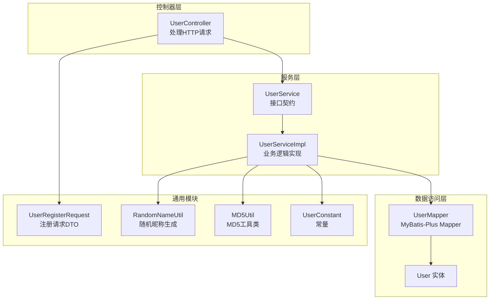
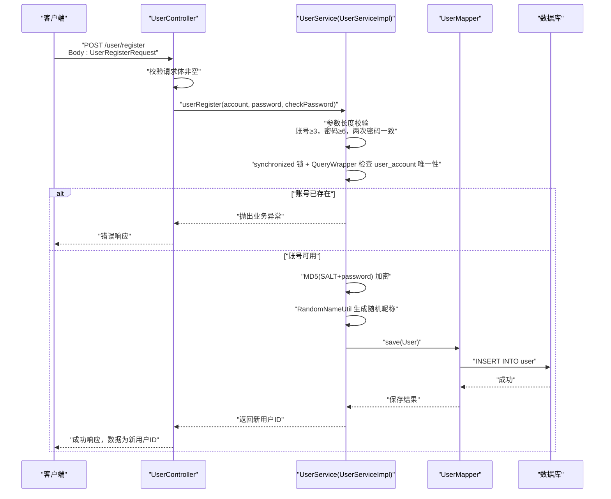
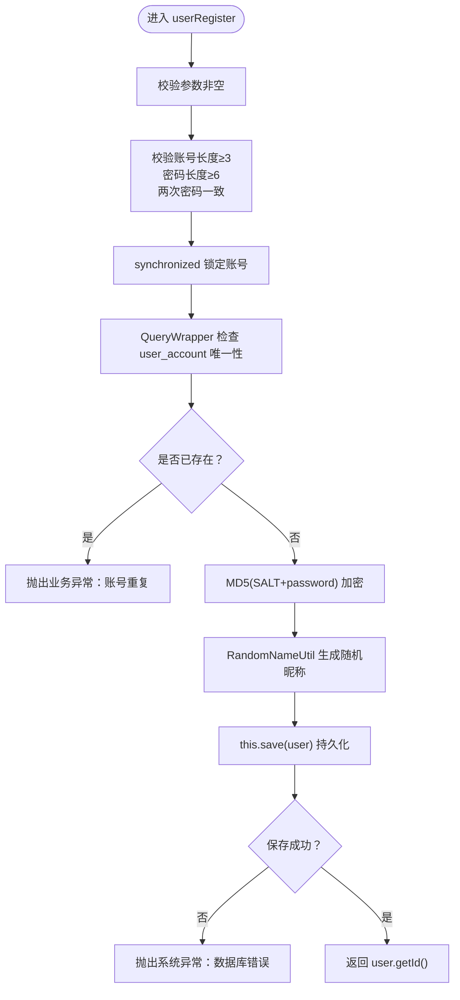
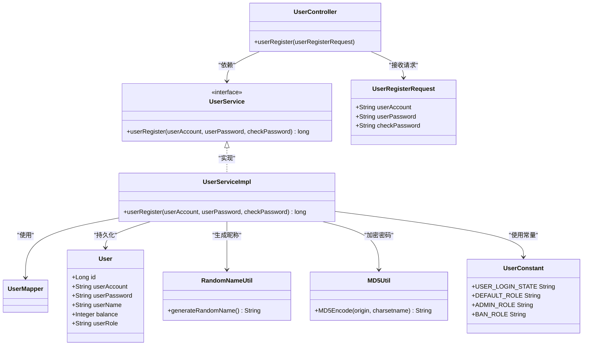
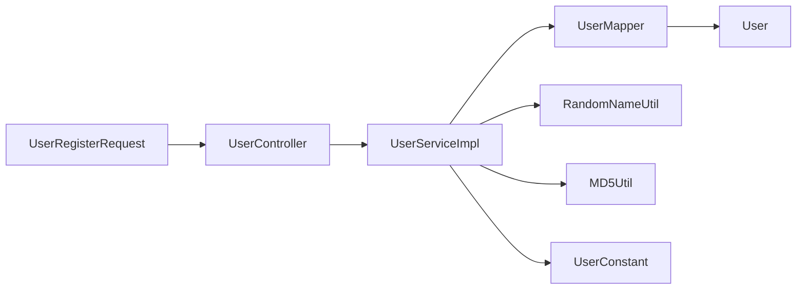

# 用户注册

<cite>
**本文引用的文件**
- [UserController.java](file://yun-docker-master/src/main/java/com/lfc/yundocker/controller/UserController.java)
- [UserServiceImpl.java](file://yun-docker-master/src/main/java/com/lfc/yundocker/service/impl/UserServiceImpl.java)
- [UserRegisterRequest.java](file://yun-docker-common/src/main/java/com/lfc/yundocker/common/model/dto/user/UserRegisterRequest.java)
- [RandomNameUtil.java](file://yun-docker-common/src/main/java/com/lfc/yundocker/common/util/RandomNameUtil.java)
- [MD5Util.java](file://yun-docker-common/src/main/java/com/lfc/yundocker/common/util/MD5Util.java)
- [User.java](file://yun-docker-master/src/main/java/com/lfc/yundocker/common/model/entity/User.java)
- [UserMapper.java](file://yun-docker-master/src/main/java/com/lfc/yundocker/mapper/UserMapper.java)
- [UserService.java](file://yun-docker-master/src/main/java/com/lfc/yundocker/service/UserService.java)
- [UserConstant.java](file://yun-docker-common/src/main/java/com/lfc/yundocker/common/constant/UserConstant.java)
</cite>

## 目录
1. [简介](#简介)
2. [项目结构](#项目结构)
3. [核心组件](#核心组件)
4. [架构总览](#架构总览)
5. [详细组件分析](#详细组件分析)
6. [依赖关系分析](#依赖关系分析)
7. [性能与安全考量](#性能与安全考量)
8. [故障排查指南](#故障排查指南)
9. [结论](#结论)

## 简介
本文件围绕“用户注册”流程展开，聚焦以下目标：
- UserController 中 userRegister 接口如何接收 UserRegisterRequest 请求参数，并进行非空校验与基础参数验证（账号长度≥3，密码长度≥6）。
- UserServiceImpl 中 userRegister 方法的三步核心逻辑：1) 使用 synchronized 锁防止账号重复注册，通过 QueryWrapper 检查 user_account 唯一性；2) 使用 MD5 加盐（SALT="yupi"）对用户密码进行加密存储；3) 注册成功后调用 RandomNameUtil 生成随机用户名并插入数据库。
- 注册成功后返回新用户 ID 的机制。
- 提供用户注册的时序图，说明从 HTTP 请求到数据库持久化的完整数据流。
- 指出潜在风险（如暴力注册），并建议增加验证码或限流等防护措施。

## 项目结构
用户注册涉及三层：控制器层、服务层、数据访问层，以及通用模型与工具类。下图展示关键文件之间的关系。

图表来源
- [UserController.java](file://yun-docker-master/src/main/java/com/lfc/yundocker/controller/UserController.java#L44-L63)
- [UserServiceImpl.java](file://yun-docker-master/src/main/java/com/lfc/yundocker/service/impl/UserServiceImpl.java#L47-L88)
- [UserMapper.java](file://yun-docker-master/src/main/java/com/lfc/yundocker/mapper/UserMapper.java#L1-L18)
- [User.java](file://yun-docker-master/src/main/java/com/lfc/yundocker/common/model/entity/User.java#L1-L79)
- [UserRegisterRequest.java](file://yun-docker-common/src/main/java/com/lfc/yundocker/common/model/dto/user/UserRegisterRequest.java#L1-L23)
- [RandomNameUtil.java](file://yun-docker-common/src/main/java/com/lfc/yundocker/common/util/RandomNameUtil.java#L1-L30)
- [MD5Util.java](file://yun-docker-common/src/main/java/com/lfc/yundocker/common/util/MD5Util.java#L1-L50)
- [UserConstant.java](file://yun-docker-common/src/main/java/com/lfc/yundocker/common/constant/UserConstant.java#L1-L34)

章节来源
- [UserController.java](file://yun-docker-master/src/main/java/com/lfc/yundocker/controller/UserController.java#L44-L63)
- [UserServiceImpl.java](file://yun-docker-master/src/main/java/com/lfc/yundocker/service/impl/UserServiceImpl.java#L47-L88)
- [UserRegisterRequest.java](file://yun-docker-common/src/main/java/com/lfc/yundocker/common/model/dto/user/UserRegisterRequest.java#L1-L23)

## 核心组件
- 控制器层：UserController 提供 /user/register 接口，接收 UserRegisterRequest，完成基本参数校验后委托 UserService 执行注册。
- 服务层：UserServiceImpl 实现注册业务，包含三步核心逻辑：唯一性校验（synchronized + QueryWrapper）、密码加盐加密（MD5Util 或 Spring DigestUtils）、随机昵称生成与入库。
- 数据访问层：UserMapper 继承 MyBatis-Plus BaseMapper，User 实体映射 user 表。
- 通用模块：UserRegisterRequest 定义注册请求字段；RandomNameUtil 生成随机昵称；MD5Util 提供 MD5 编码能力；UserConstant 定义用户相关常量。

章节来源
- [UserController.java](file://yun-docker-master/src/main/java/com/lfc/yundocker/controller/UserController.java#L44-L63)
- [UserServiceImpl.java](file://yun-docker-master/src/main/java/com/lfc/yundocker/service/impl/UserServiceImpl.java#L47-L88)
- [UserRegisterRequest.java](file://yun-docker-common/src/main/java/com/lfc/yundocker/common/model/dto/user/UserRegisterRequest.java#L1-L23)
- [RandomNameUtil.java](file://yun-docker-common/src/main/java/com/lfc/yundocker/common/util/RandomNameUtil.java#L1-L30)
- [MD5Util.java](file://yun-docker-common/src/main/java/com/lfc/yundocker/common/util/MD5Util.java#L1-L50)
- [User.java](file://yun-docker-master/src/main/java/com/lfc/yundocker/common/model/entity/User.java#L1-L79)
- [UserMapper.java](file://yun-docker-master/src/main/java/com/lfc/yundocker/mapper/UserMapper.java#L1-L18)
- [UserService.java](file://yun-docker-master/src/main/java/com/lfc/yundocker/service/UserService.java#L19-L27)
- [UserConstant.java](file://yun-docker-common/src/main/java/com/lfc/yundocker/common/constant/UserConstant.java#L1-L34)

## 架构总览
用户注册的端到端流程如下：客户端发起 POST /user/register，控制器解析请求并调用服务层，服务层执行业务校验与持久化，最终返回新用户 ID。

图表来源
- [UserController.java](file://yun-docker-master/src/main/java/com/lfc/yundocker/controller/UserController.java#L44-L63)
- [UserServiceImpl.java](file://yun-docker-master/src/main/java/com/lfc/yundocker/service/impl/UserServiceImpl.java#L47-L88)
- [UserRegisterRequest.java](file://yun-docker-common/src/main/java/com/lfc/yundocker/common/model/dto/user/UserRegisterRequest.java#L1-L23)
- [RandomNameUtil.java](file://yun-docker-common/src/main/java/com/lfc/yundocker/common/util/RandomNameUtil.java#L1-L30)
- [MD5Util.java](file://yun-docker-common/src/main/java/com/lfc/yundocker/common/util/MD5Util.java#L1-L50)
- [UserMapper.java](file://yun-docker-master/src/main/java/com/lfc/yundocker/mapper/UserMapper.java#L1-L18)
- [User.java](file://yun-docker-master/src/main/java/com/lfc/yundocker/common/model/entity/User.java#L1-L79)

## 详细组件分析

### 控制器层：UserController.userRegister
- 接口路径：/user/register，方法：POST
- 参数绑定：@RequestBody UserRegisterRequest
- 校验逻辑：
  - 请求体非空校验（若为空直接抛出参数错误）
  - 从请求体提取 userAccount、userPassword、checkPassword
  - 若任一字段为空，立即返回空响应（此处行为与参数校验不一致，建议统一为抛出异常）
- 调用服务：调用 userService.userRegister(account, password, checkPassword)
- 返回：ResultUtils.success(result)，其中 result 为新用户ID

章节来源
- [UserController.java](file://yun-docker-master/src/main/java/com/lfc/yundocker/controller/UserController.java#L44-L63)
- [UserRegisterRequest.java](file://yun-docker-common/src/main/java/com/lfc/yundocker/common/model/dto/user/UserRegisterRequest.java#L1-L23)
- [UserService.java](file://yun-docker-master/src/main/java/com/lfc/yundocker/service/UserService.java#L19-L27)

### 服务层：UserServiceImpl.userRegister
- 参数校验：
  - 非空校验
  - 账号长度≥3
  - 密码长度≥6，且两次输入一致
- 唯一性保障：
  - 使用 synchronized (userAccount.intern()) 对账号进行加锁，避免并发重复注册
  - 通过 QueryWrapper 查询 user_account 是否已存在，若存在则抛出业务异常
- 密码加密：
  - 使用 MD5 加盐（SALT="yupi"）进行加密存储
  - 代码中同时存在 Spring 的 DigestUtils 与自定义 MD5Util，建议统一使用一种方式
- 随机昵称与入库：
  - 调用 RandomNameUtil.generateRandomName() 生成随机昵称
  - 构造 User 对象并调用 this.save(user) 持久化
- 返回新用户ID：
  - 成功后返回 user.getId()

图表来源
- [UserServiceImpl.java](file://yun-docker-master/src/main/java/com/lfc/yundocker/service/impl/UserServiceImpl.java#L47-L88)
- [RandomNameUtil.java](file://yun-docker-common/src/main/java/com/lfc/yundocker/common/util/RandomNameUtil.java#L1-L30)
- [MD5Util.java](file://yun-docker-common/src/main/java/com/lfc/yundocker/common/util/MD5Util.java#L1-L50)

章节来源
- [UserServiceImpl.java](file://yun-docker-master/src/main/java/com/lfc/yundocker/service/impl/UserServiceImpl.java#L47-L88)
- [RandomNameUtil.java](file://yun-docker-common/src/main/java/com/lfc/yundocker/common/util/RandomNameUtil.java#L1-L30)
- [MD5Util.java](file://yun-docker-common/src/main/java/com/lfc/yundocker/common/util/MD5Util.java#L1-L50)

### 数据模型与映射
- User 实体：包含 id、userAccount、userPassword、userName、userAvatar、phone、balance、userRole、createTime、updateTime、isDelete 等字段
- UserMapper：继承 BaseMapper<User>，提供基础 CRUD 能力
- UserRegisterRequest：注册请求 DTO，包含 userAccount、userPassword、checkPassword 字段

章节来源
- [User.java](file://yun-docker-master/src/main/java/com/lfc/yundocker/common/model/entity/User.java#L1-L79)
- [UserMapper.java](file://yun-docker-master/src/main/java/com/lfc/yundocker/mapper/UserMapper.java#L1-L18)
- [UserRegisterRequest.java](file://yun-docker-common/src/main/java/com/lfc/yundocker/common/model/dto/user/UserRegisterRequest.java#L1-L23)

### 类关系图

图表来源
- [UserController.java](file://yun-docker-master/src/main/java/com/lfc/yundocker/controller/UserController.java#L44-L63)
- [UserService.java](file://yun-docker-master/src/main/java/com/lfc/yundocker/service/UserService.java#L19-L27)
- [UserServiceImpl.java](file://yun-docker-master/src/main/java/com/lfc/yundocker/service/impl/UserServiceImpl.java#L47-L88)
- [UserMapper.java](file://yun-docker-master/src/main/java/com/lfc/yundocker/mapper/UserMapper.java#L1-L18)
- [User.java](file://yun-docker-master/src/main/java/com/lfc/yundocker/common/model/entity/User.java#L1-L79)
- [UserRegisterRequest.java](file://yun-docker-common/src/main/java/com/lfc/yundocker/common/model/dto/user/UserRegisterRequest.java#L1-L23)
- [RandomNameUtil.java](file://yun-docker-common/src/main/java/com/lfc/yundocker/common/util/RandomNameUtil.java#L1-L30)
- [MD5Util.java](file://yun-docker-common/src/main/java/com/lfc/yundocker/common/util/MD5Util.java#L1-L50)
- [UserConstant.java](file://yun-docker-common/src/main/java/com/lfc/yundocker/common/constant/UserConstant.java#L1-L34)

## 依赖关系分析
- 控制器依赖服务接口，服务实现依赖 Mapper 与实体。
- 注册流程中，服务层承担了业务规则与数据持久化职责，控制器仅负责参数绑定与响应封装。
- 工具类 RandomNameUtil 与 MD5Util 在服务层被直接使用，建议在统一的工具层抽象以减少耦合。

图表来源
- [UserController.java](file://yun-docker-master/src/main/java/com/lfc/yundocker/controller/UserController.java#L44-L63)
- [UserServiceImpl.java](file://yun-docker-master/src/main/java/com/lfc/yundocker/service/impl/UserServiceImpl.java#L47-L88)
- [UserRegisterRequest.java](file://yun-docker-common/src/main/java/com/lfc/yundocker/common/model/dto/user/UserRegisterRequest.java#L1-L23)
- [RandomNameUtil.java](file://yun-docker-common/src/main/java/com/lfc/yundocker/common/util/RandomNameUtil.java#L1-L30)
- [MD5Util.java](file://yun-docker-common/src/main/java/com/lfc/yundocker/common/util/MD5Util.java#L1-L50)
- [User.java](file://yun-docker-master/src/main/java/com/lfc/yundocker/common/model/entity/User.java#L1-L79)
- [UserMapper.java](file://yun-docker-master/src/main/java/com/lfc/yundocker/mapper/UserMapper.java#L1-L18)
- [UserConstant.java](file://yun-docker-common/src/main/java/com/lfc/yundocker/common/constant/UserConstant.java#L1-L34)

## 性能与安全考量
- 并发控制：服务层使用 synchronized (userAccount.intern()) 对账号加锁，有效避免同一账号的并发重复注册，但锁粒度与 JVM 字符串驻留策略可能带来额外开销与边界问题，建议评估更细粒度的锁或数据库层面的唯一约束配合乐观重试。
- 唯一性保障：虽然有 synchronized + 查询校验，但更稳妥的做法是在数据库层为 user_account 添加唯一索引，以保证强一致性。
- 密码加密：代码中同时出现 Spring 的 DigestUtils 与自定义 MD5Util，建议统一采用一种方式并考虑更强的现代哈希算法（如 bcrypt）以提升安全性。
- 返回值：注册成功返回新用户ID，便于前端后续登录或初始化流程；建议在响应体中包含必要的用户标识信息以便前端快速识别。
- 暴力注册风险：当前未见验证码或限流机制，建议引入图形验证码与接口级限流（如基于 IP 或账号维度），并结合黑名单与风控策略。

章节来源
- [UserServiceImpl.java](file://yun-docker-master/src/main/java/com/lfc/yundocker/service/impl/UserServiceImpl.java#L47-L88)
- [MD5Util.java](file://yun-docker-common/src/main/java/com/lfc/yundocker/common/util/MD5Util.java#L1-L50)

## 故障排查指南
- 参数为空或格式不正确：控制器侧对请求体非空进行了校验，若仍出现空值，需检查客户端请求体与 Content-Type 设置。
- 账号长度不足或密码长度不足：服务层会抛出业务异常，定位到参数校验分支。
- 两次密码不一致：服务层会抛出业务异常，定位到密码一致性校验分支。
- 账号重复：synchronized + 查询校验后若仍出现重复，检查数据库唯一约束是否生效，或排查锁范围与字符串驻留策略的影响。
- 数据库写入失败：服务层保存失败会抛出系统异常，检查数据库连接、表结构与权限。
- 密码加密异常：确认使用的加密方式与盐值配置一致，避免前后端不兼容。

章节来源
- [UserController.java](file://yun-docker-master/src/main/java/com/lfc/yundocker/controller/UserController.java#L44-L63)
- [UserServiceImpl.java](file://yun-docker-master/src/main/java/com/lfc/yundocker/service/impl/UserServiceImpl.java#L47-L88)

## 结论
用户注册流程在控制器与服务层之间职责清晰：控制器负责参数绑定与响应封装，服务层负责业务规则与持久化。其实现包含三步核心逻辑：参数校验、唯一性保障、密码加密与入库。返回新用户ID的设计便于后续流程衔接。为进一步提升健壮性与安全性，建议：
- 在数据库层添加 user_account 唯一索引；
- 统一密码加密方式并考虑更强的哈希算法；
- 引入验证码与限流机制，防范暴力注册；
- 优化锁策略，降低并发场景下的性能与一致性风险。