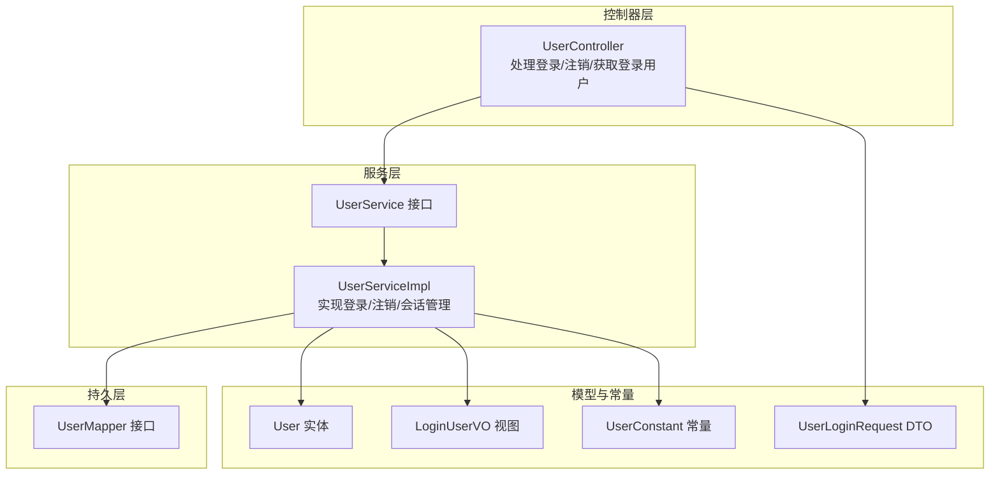
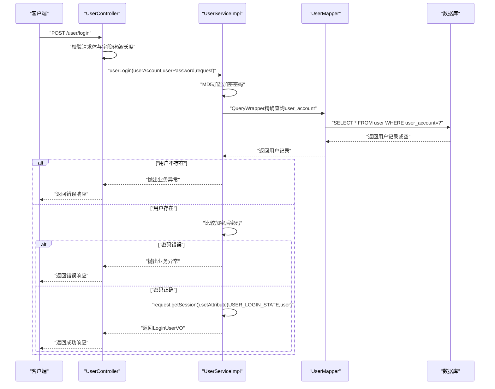
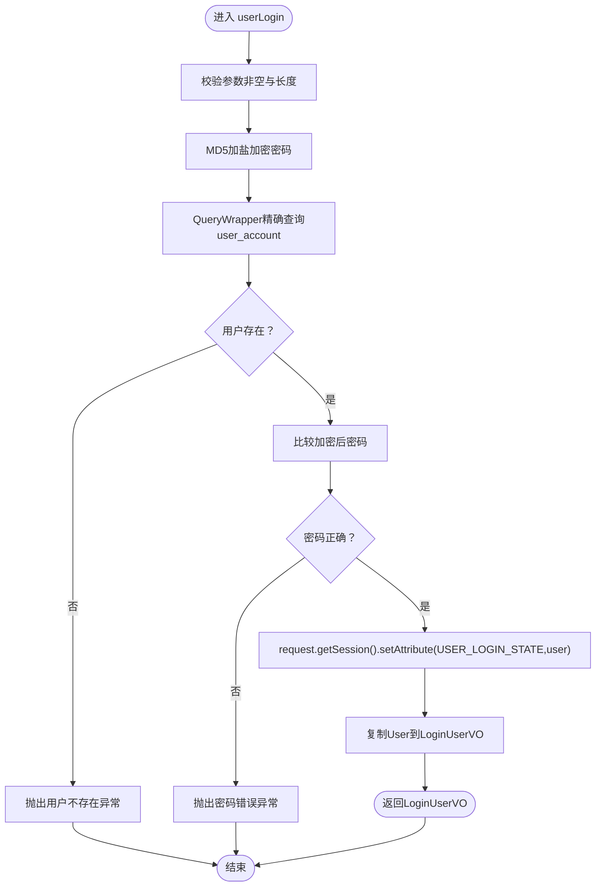
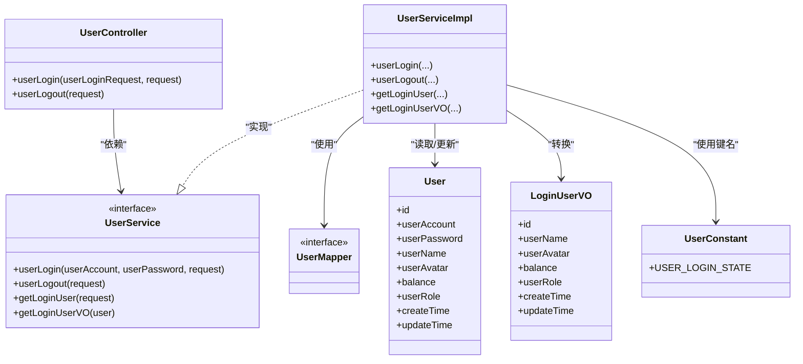

# 用户登录与认证

<cite>
**本文引用的文件**
- [UserController.java](file://yun-docker-master/src/main/java/com/lfc/yundocker/controller/UserController.java)
- [UserService.java](file://yun-docker-master/src/main/java/com/lfc/yundocker/service/UserService.java)
- [UserServiceImpl.java](file://yun-docker-master/src/main/java/com/lfc/yundocker/service/impl/UserServiceImpl.java)
- [UserMapper.java](file://yun-docker-master/src/main/java/com/lfc/yundocker/mapper/UserMapper.java)
- [User.java](file://yun-docker-master/src/main/java/com/lfc/yundocker/common/model/entity/User.java)
- [LoginUserVO.java](file://yun-docker-master/src/main/java/com/lfc/yundocker/common/model/vo/LoginUserVO.java)
- [UserConstant.java](file://yun-docker-common/src/main/java/com/lfc/yundocker/common/constant/UserConstant.java)
- [UserLoginRequest.java](file://yun-docker-common/src/main/java/com/lfc/yundocker/common/model/dto/user/UserLoginRequest.java)
- [MD5Util.java](file://yun-docker-common/src/main/java/com/lfc/yundocker/common/util/MD5Util.java)
</cite>

## 目录
1. [简介](#简介)
2. [项目结构](#项目结构)
3. [核心组件](#核心组件)
4. [架构总览](#架构总览)
5. [详细组件分析](#详细组件分析)
6. [依赖关系分析](#依赖关系分析)
7. [性能考量](#性能考量)
8. [故障排查指南](#故障排查指南)
9. [结论](#结论)
10. [附录](#附录)

## 简介
本文件围绕用户登录(userLogin)与注销(userLogout)流程进行深入解析，覆盖以下要点：
- Controller层对userAccount与userPassword的非空与长度校验逻辑
- Service层使用MD5加盐加密密码，并通过QueryWrapper精确查询user_account是否存在
- 登录成功后通过request.getSession().setAttribute将用户信息存入Session以维持登录态
- 返回的LoginUserVO为脱敏后的用户视图对象
- 注销时通过removeAttribute清除Session中的登录态
- 对比Session认证方式的优缺点，并给出分布式环境下使用Redis存储Session的扩展建议

## 项目结构
本项目采用分层架构，用户登录相关的核心代码集中在控制器、服务与持久层：
- 控制器层：处理HTTP请求，负责参数校验与结果封装
- 服务层：业务逻辑与安全控制（密码加密、会话管理）
- 持久层：基于MyBatis-Plus的Mapper接口
- 数据模型与常量：实体类、视图对象、用户常量

图表来源
- [UserController.java](file://yun-docker-master/src/main/java/com/lfc/yundocker/controller/UserController.java#L72-L84)
- [UserService.java](file://yun-docker-master/src/main/java/com/lfc/yundocker/service/UserService.java#L37-L37)
- [UserServiceImpl.java](file://yun-docker-master/src/main/java/com/lfc/yundocker/service/impl/UserServiceImpl.java#L105-L137)
- [UserMapper.java](file://yun-docker-master/src/main/java/com/lfc/yundocker/mapper/UserMapper.java#L1-L18)
- [User.java](file://yun-docker-master/src/main/java/com/lfc/yundocker/common/model/entity/User.java#L1-L79)
- [LoginUserVO.java](file://yun-docker-master/src/main/java/com/lfc/yundocker/common/model/vo/LoginUserVO.java#L1-L54)
- [UserConstant.java](file://yun-docker-common/src/main/java/com/lfc/yundocker/common/constant/UserConstant.java#L1-L34)
- [UserLoginRequest.java](file://yun-docker-common/src/main/java/com/lfc/yundocker/common/model/dto/user/UserLoginRequest.java#L1-L21)

章节来源
- [UserController.java](file://yun-docker-master/src/main/java/com/lfc/yundocker/controller/UserController.java#L72-L84)
- [UserServiceImpl.java](file://yun-docker-master/src/main/java/com/lfc/yundocker/service/impl/UserServiceImpl.java#L105-L137)
- [UserMapper.java](file://yun-docker-master/src/main/java/com/lfc/yundocker/mapper/UserMapper.java#L1-L18)

## 核心组件
- 控制器UserController：接收登录请求，执行参数校验，调用UserService完成登录，并返回LoginUserVO
- 服务实现UserServiceImpl：执行密码加盐MD5加密、精确查询用户、设置Session登录态、返回脱敏视图
- 实体User：数据库映射的用户表结构
- 视图LoginUserVO：对外暴露的脱敏用户信息
- 常量UserConstant：统一管理登录态键名等常量
- 请求DTO UserLoginRequest：登录请求参数载体

章节来源
- [UserController.java](file://yun-docker-master/src/main/java/com/lfc/yundocker/controller/UserController.java#L72-L84)
- [UserService.java](file://yun-docker-master/src/main/java/com/lfc/yundocker/service/UserService.java#L37-L37)
- [UserServiceImpl.java](file://yun-docker-master/src/main/java/com/lfc/yundocker/service/impl/UserServiceImpl.java#L105-L137)
- [User.java](file://yun-docker-master/src/main/java/com/lfc/yundocker/common/model/entity/User.java#L1-L79)
- [LoginUserVO.java](file://yun-docker-master/src/main/java/com/lfc/yundocker/common/model/vo/LoginUserVO.java#L1-L54)
- [UserConstant.java](file://yun-docker-common/src/main/java/com/lfc/yundocker/common/constant/UserConstant.java#L1-L34)
- [UserLoginRequest.java](file://yun-docker-common/src/main/java/com/lfc/yundocker/common/model/dto/user/UserLoginRequest.java#L1-L21)

## 架构总览
下图展示用户登录的端到端流程：从HTTP请求到Session设置与视图返回。

图表来源
- [UserController.java](file://yun-docker-master/src/main/java/com/lfc/yundocker/controller/UserController.java#L72-L84)
- [UserServiceImpl.java](file://yun-docker-master/src/main/java/com/lfc/yundocker/service/impl/UserServiceImpl.java#L105-L137)
- [UserMapper.java](file://yun-docker-master/src/main/java/com/lfc/yundocker/mapper/UserMapper.java#L1-L18)
- [UserConstant.java](file://yun-docker-common/src/main/java/com/lfc/yundocker/common/constant/UserConstant.java#L1-L34)

## 详细组件分析

### 控制器：UserController 的登录入口
- 参数校验：对UserLoginRequest进行非空检查；若为空，抛出参数错误
- 调用服务：将userAccount、userPassword与HttpServletRequest传入UserService.userLogin
- 结果封装：通过统一响应工具返回LoginUserVO

章节来源
- [UserController.java](file://yun-docker-master/src/main/java/com/lfc/yundocker/controller/UserController.java#L72-L84)
- [UserLoginRequest.java](file://yun-docker-common/src/main/java/com/lfc/yundocker/common/model/dto/user/UserLoginRequest.java#L1-L21)

### 服务：UserServiceImpl 的登录与会话管理
- 参数校验：对userAccount与userPassword进行非空与长度校验
- 密码加密：使用固定盐值进行MD5加盐加密
- 精确查询：通过QueryWrapper.eq("user_account", userAccount)精确匹配用户
- 登录态维护：登录成功后将User对象放入Session，键名为UserConstant.USER_LOGIN_STATE
- 视图转换：将User对象复制到LoginUserVO并返回

图表来源
- [UserServiceImpl.java](file://yun-docker-master/src/main/java/com/lfc/yundocker/service/impl/UserServiceImpl.java#L105-L137)
- [UserConstant.java](file://yun-docker-common/src/main/java/com/lfc/yundocker/common/constant/UserConstant.java#L1-L34)

章节来源
- [UserServiceImpl.java](file://yun-docker-master/src/main/java/com/lfc/yundocker/service/impl/UserServiceImpl.java#L105-L137)

### 持久层：UserMapper 与实体 User
- UserMapper：继承MyBatis-Plus的BaseMapper，提供基础CRUD能力
- User实体：包含用户标识、账号、密码、昵称、头像、余额、角色、时间戳等字段

章节来源
- [UserMapper.java](file://yun-docker-master/src/main/java/com/lfc/yundocker/mapper/UserMapper.java#L1-L18)
- [User.java](file://yun-docker-master/src/main/java/com/lfc/yundocker/common/model/entity/User.java#L1-L79)

### 视图对象：LoginUserVO 的脱敏设计
- LoginUserVO：仅包含对外展示的必要字段（如id、userName、userAvatar、balance、userRole、createTime、updateTime），避免泄露敏感信息（如userAccount、userPassword）

章节来源
- [LoginUserVO.java](file://yun-docker-master/src/main/java/com/lfc/yundocker/common/model/vo/LoginUserVO.java#L1-L54)

### 常量：UserConstant 的登录态键名
- USER_LOGIN_STATE：用于Session中保存登录态的键名，确保全局一致性

章节来源
- [UserConstant.java](file://yun-docker-common/src/main/java/com/lfc/yundocker/common/constant/UserConstant.java#L1-L34)

### 密码加密工具：MD5Util 的使用说明
- 项目中实际使用的加密方式为Spring的DigestUtils结合固定盐值进行MD5加盐
- MD5Util提供通用MD5编码工具，但登录流程中未直接使用该工具类

章节来源
- [UserServiceImpl.java](file://yun-docker-master/src/main/java/com/lfc/yundocker/service/impl/UserServiceImpl.java#L118-L118)
- [MD5Util.java](file://yun-docker-common/src/main/java/com/lfc/yundocker/common/util/MD5Util.java#L1-L50)

### 注销流程：userLogout 清除Session
- 若Session中无登录态，抛出未登录异常
- 否则移除登录态键，返回true表示注销成功

章节来源
- [UserServiceImpl.java](file://yun-docker-master/src/main/java/com/lfc/yundocker/service/impl/UserServiceImpl.java#L238-L245)

## 依赖关系分析
- 控制器依赖服务接口UserService
- 服务实现依赖Mapper接口与实体类
- 登录态依赖UserConstant中的键名
- 视图转换依赖BeanUtils进行属性复制

图表来源
- [UserController.java](file://yun-docker-master/src/main/java/com/lfc/yundocker/controller/UserController.java#L72-L84)
- [UserService.java](file://yun-docker-master/src/main/java/com/lfc/yundocker/service/UserService.java#L37-L37)
- [UserServiceImpl.java](file://yun-docker-master/src/main/java/com/lfc/yundocker/service/impl/UserServiceImpl.java#L105-L137)
- [UserMapper.java](file://yun-docker-master/src/main/java/com/lfc/yundocker/mapper/UserMapper.java#L1-L18)
- [User.java](file://yun-docker-master/src/main/java/com/lfc/yundocker/common/model/entity/User.java#L1-L79)
- [LoginUserVO.java](file://yun-docker-master/src/main/java/com/lfc/yundocker/common/model/vo/LoginUserVO.java#L1-L54)
- [UserConstant.java](file://yun-docker-common/src/main/java/com/lfc/yundocker/common/constant/UserConstant.java#L1-L34)

## 性能考量
- 密码加密：使用固定盐值的MD5加盐，简单高效；若需更强安全性，可考虑升级为bcrypt/scrypt或PBKDF2
- 查询策略：通过精确字段查询user_account，建议在数据库层面建立唯一索引以提升命中率与减少回表
- Session存储：单机场景下Session本地内存即可满足；在多实例部署时，建议引入Redis集中式存储，避免会话漂移导致的重复登录问题

## 故障排查指南
- 参数错误：当userAccount或userPassword为空或长度不合规时，将抛出参数错误异常
- 用户不存在：查询不到对应user_account时，抛出用户不存在异常
- 密码错误：加密后密码不匹配时，抛出密码错误异常
- 未登录：注销前若Session中无登录态，抛出未登录异常
- 登录态失效：Session被清理或重启后，需要重新登录

章节来源
- [UserServiceImpl.java](file://yun-docker-master/src/main/java/com/lfc/yundocker/service/impl/UserServiceImpl.java#L105-L137)
- [UserServiceImpl.java](file://yun-docker-master/src/main/java/com/lfc/yundocker/service/impl/UserServiceImpl.java#L238-L245)

## 结论
- 本项目采用Session+MD5加盐的登录认证方案，流程清晰、实现简洁
- 登录成功后通过Session维持登录态，返回LoginUserVO实现数据脱敏
- 在分布式环境下，建议将Session迁移至Redis，以支持多实例共享与高可用

## 附录

### 分布式环境下的Session扩展方案（Redis）
- 使用Spring Session + Redis作为会话存储，实现Session跨节点共享
- 配置项建议：
  - 过期时间：根据业务设定合理的Session过期策略
  - 序列化：选择合适的序列化方式，保证跨语言兼容
  - 安全：开启HTTPS、设置HttpOnly与SameSite等安全Cookie属性
- 优点：会话状态集中存储，便于横向扩展与负载均衡
- 缺点：增加外部依赖与网络开销，需关注Redis可用性与性能