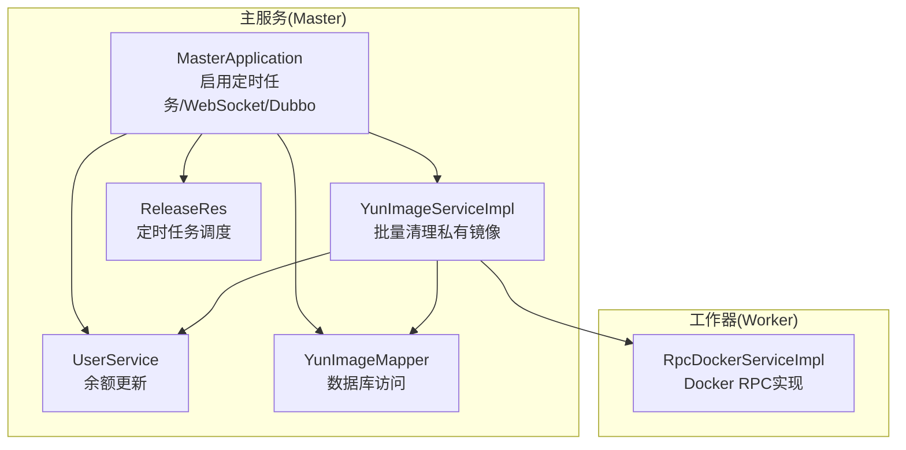
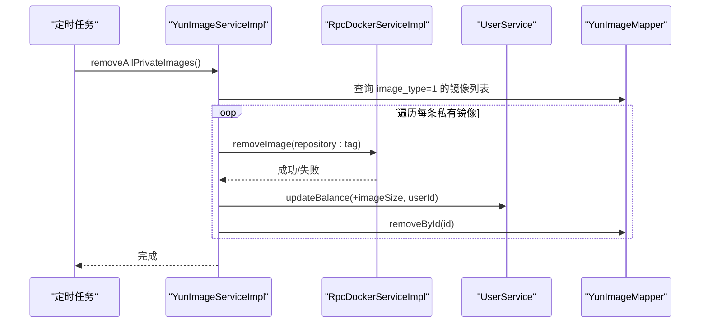
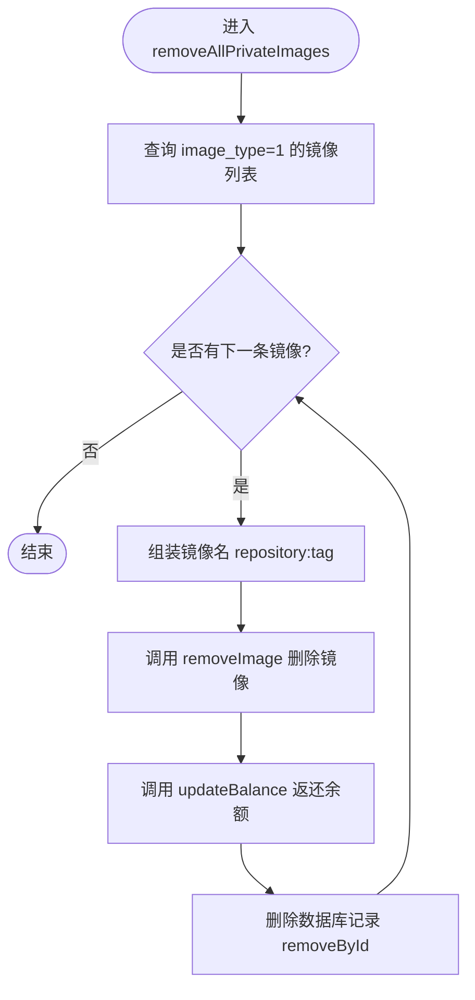
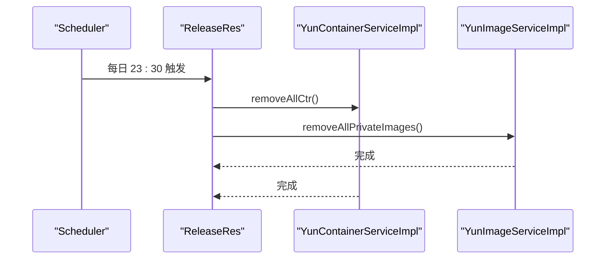
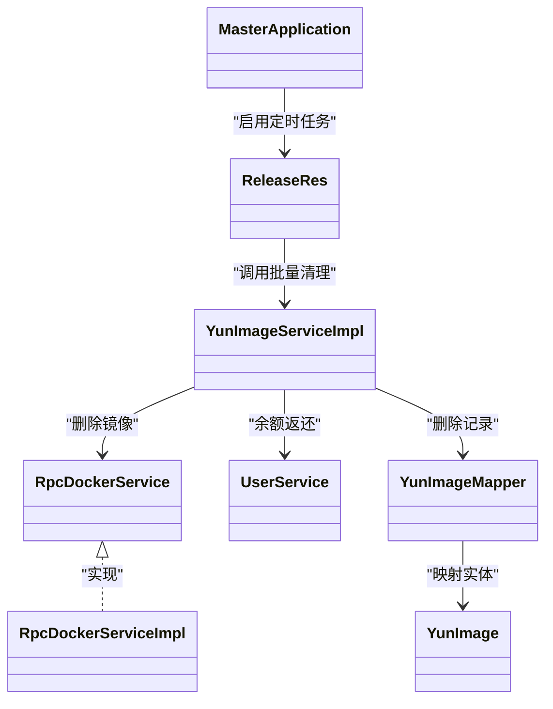

# 批量清理私有镜像

<cite>
**本文引用的文件**
- [MasterApplication.java](file://yun-docker-master/src/main/java/com/lfc/yundocker/MasterApplication.java)
- [application.yml](file://yun-docker-master/src/main/resources/application.yml)
- [YunImageService.java](file://yun-docker-master/src/main/java/com/lfc/yundocker/service/YunImageService.java)
- [YunImageServiceImpl.java](file://yun-docker-master/src/main/java/com/lfc/yundocker/service/impl/YunImageServiceImpl.java)
- [YunImage.java](file://yun-docker-master/src/main/java/com/lfc/yundocker/common/model/entity/YunImage.java)
- [YunImageMapper.java](file://yun-docker-master/src/main/java/com/lfc/yundocker/mapper/YunImageMapper.java)
- [UserService.java](file://yun-docker-master/src/main/java/com/lfc/yundocker/service/UserService.java)
- [RpcDockerService.java](file://yun-docker-api/src/main/java/com/lfc/yundocker/service/RpcDockerService.java)
- [RpcDockerServiceImpl.java](file://yun-docker-worker/src/main/java/com/lfc/yundocker/worker/rpc/RpcDockerServiceImpl.java)
- [ReleaseRes.java](file://yun-docker-master/src/main/java/com/lfc/yundocker/job/cycle/ReleaseRes.java)
</cite>

## 目录
1. [简介](#简介)
2. [项目结构](#项目结构)
3. [核心组件](#核心组件)
4. [架构总览](#架构总览)
5. [详细组件分析](#详细组件分析)
6. [依赖分析](#依赖分析)
7. [性能考虑](#性能考虑)
8. [故障排查指南](#故障排查指南)
9. [结论](#结论)
10. [附录](#附录)

## 简介
本文件聚焦于“批量清理私有镜像”后台任务的实现与运维实践，围绕 YunImageService.removeAllPrivateImages() 方法展开，说明其设计目的、调用场景、实现逻辑、异常处理策略、资源影响与执行时机，并阐述与定时任务 ReleaseRes 的集成方式及运维建议。

## 项目结构
- 后台主服务（Master）负责业务编排、定时任务调度、数据库访问与用户余额管理。
- Worker 侧负责与 Docker 引擎交互，提供 RPC 接口（拉取/删除镜像、容器生命周期等）。
- 采用 Dubbo 进行服务间通信，Master 侧通过 @DubboReference 注入 Worker 侧的 RpcDockerService 实现。

图表来源
- [MasterApplication.java](file://yun-docker-master/src/main/java/com/lfc/yundocker/MasterApplication.java#L1-L25)
- [YunImageServiceImpl.java](file://yun-docker-master/src/main/java/com/lfc/yundocker/service/impl/YunImageServiceImpl.java#L1-L145)
- [UserService.java](file://yun-docker-master/src/main/java/com/lfc/yundocker/service/UserService.java#L1-L124)
- [YunImageMapper.java](file://yun-docker-master/src/main/java/com/lfc/yundocker/mapper/YunImageMapper.java#L1-L19)
- [ReleaseRes.java](file://yun-docker-master/src/main/java/com/lfc/yundocker/job/cycle/ReleaseRes.java#L1-L47)
- [RpcDockerServiceImpl.java](file://yun-docker-worker/src/main/java/com/lfc/yundocker/worker/rpc/RpcDockerServiceImpl.java#L1-L440)

章节来源
- [MasterApplication.java](file://yun-docker-master/src/main/java/com/lfc/yundocker/MasterApplication.java#L1-L25)
- [application.yml](file://yun-docker-master/src/main/resources/application.yml#L1-L60)

## 核心组件
- YunImageService.removeAllPrivateImages(): 批量清理所有私有镜像（image_type=1），逐条执行与单个删除一致的流程：调用 RPC 删除 Docker 镜像、返还用户余额、删除数据库记录。
- ReleaseRes：定时任务，每日晚11:30触发，先清理容器，再调用 removeAllPrivateImages()。
- RpcDockerService.removeImage(image): Worker 侧删除镜像的 RPC 接口，Master 侧通过 @DubboReference 调用。
- UserService.updateBalance(cost, userId): 余额增减接口，用于返还私有镜像占用的空间费用。
- YunImage/YunImageMapper：私有镜像实体与数据库映射，包含镜像仓库、标签、大小、类型、所属用户等字段。

章节来源
- [YunImageService.java](file://yun-docker-master/src/main/java/com/lfc/yundocker/service/YunImageService.java#L1-L19)
- [YunImageServiceImpl.java](file://yun-docker-master/src/main/java/com/lfc/yundocker/service/impl/YunImageServiceImpl.java#L1-L145)
- [YunImage.java](file://yun-docker-master/src/main/java/com/lfc/yundocker/common/model/entity/YunImage.java#L1-L79)
- [YunImageMapper.java](file://yun-docker-master/src/main/java/com/lfc/yundocker/mapper/YunImageMapper.java#L1-L19)
- [UserService.java](file://yun-docker-master/src/main/java/com/lfc/yundocker/service/UserService.java#L1-L124)
- [RpcDockerService.java](file://yun-docker-api/src/main/java/com/lfc/yundocker/service/RpcDockerService.java#L1-L143)
- [RpcDockerServiceImpl.java](file://yun-docker-worker/src/main/java/com/lfc/yundocker/worker/rpc/RpcDockerServiceImpl.java#L1-L440)
- [ReleaseRes.java](file://yun-docker-master/src/main/java/com/lfc/yundocker/job/cycle/ReleaseRes.java#L1-L47)

## 架构总览
批量清理流程由定时任务触发，主服务调用服务层，服务层依次：
1) 查询所有私有镜像；
2) 逐条调用 RPC 删除镜像；
3) 返还用户余额；
4) 删除数据库记录。

图表来源
- [ReleaseRes.java](file://yun-docker-master/src/main/java/com/lfc/yundocker/job/cycle/ReleaseRes.java#L1-L47)
- [YunImageServiceImpl.java](file://yun-docker-master/src/main/java/com/lfc/yundocker/service/impl/YunImageServiceImpl.java#L120-L139)
- [RpcDockerServiceImpl.java](file://yun-docker-worker/src/main/java/com/lfc/yundocker/worker/rpc/RpcDockerServiceImpl.java#L74-L78)
- [UserService.java](file://yun-docker-master/src/main/java/com/lfc/yundocker/service/UserService.java#L120-L123)
- [YunImageMapper.java](file://yun-docker-master/src/main/java/com/lfc/yundocker/mapper/YunImageMapper.java#L1-L19)

## 详细组件分析

### 设计目的与调用场景
- 设计目的：在系统维护或资源回收场景下，统一清理所有私有镜像，释放存储空间并返还用户余额，保持系统状态一致性。
- 调用场景：通常在业务低峰期执行，避免对在线用户造成影响；也可作为定期巡检的一部分，清理长期未使用的私有镜像。

章节来源
- [YunImageService.java](file://yun-docker-master/src/main/java/com/lfc/yundocker/service/YunImageService.java#L1-L19)
- [YunImageServiceImpl.java](file://yun-docker-master/src/main/java/com/lfc/yundocker/service/impl/YunImageServiceImpl.java#L120-L139)

### 实现逻辑
- 查询阶段：使用 QueryWrapper 查询 image_type=1 的所有私有镜像。
- 执行阶段：对每条私有镜像执行三步流程：
  1) 组装镜像名 repository:tag，调用 RpcDockerService.removeImage 删除 Docker 镜像；
  2) 调用 UserService.updateBalance(imageSize, userId) 返还用户余额；
  3) 调用 Mapper.removeById 删除数据库记录。
- 数据一致性：每条镜像的删除均独立执行，若某条失败，后续镜像仍会继续处理，但整体事务性由单条操作保证。

图表来源
- [YunImageServiceImpl.java](file://yun-docker-master/src/main/java/com/lfc/yundocker/service/impl/YunImageServiceImpl.java#L120-L139)
- [RpcDockerService.java](file://yun-docker-api/src/main/java/com/lfc/yundocker/service/RpcDockerService.java#L20-L27)
- [UserService.java](file://yun-docker-master/src/main/java/com/lfc/yundocker/service/UserService.java#L120-L123)
- [YunImageMapper.java](file://yun-docker-master/src/main/java/com/lfc/yundocker/mapper/YunImageMapper.java#L1-L19)

章节来源
- [YunImageServiceImpl.java](file://yun-docker-master/src/main/java/com/lfc/yundocker/service/impl/YunImageServiceImpl.java#L120-L139)

### 异常处理与状态一致性
- 单条失败不影响整体流程：当前实现逐条处理，即使某次删除失败，也不会阻断后续镜像的清理。
- 建议增强策略（可选）：
  - 使用批处理事务包装多条删除，确保要么全部成功，要么全部回滚；
  - 记录失败镜像清单，便于人工复核与重试；
  - 对 Docker 删除失败的情况，补充重试机制或告警通知。

章节来源
- [YunImageServiceImpl.java](file://yun-docker-master/src/main/java/com/lfc/yundocker/service/impl/YunImageServiceImpl.java#L120-L139)

### 与定时任务的集成
- ReleaseRes 在每天 23:30 触发，先清理容器，再调用 removeAllPrivateImages()，形成“容器+镜像”的周期性回收闭环。
- 该定时任务位于 Master 侧，通过 @Scheduled(cron=...) 配置，无需额外外部调度器。

图表来源
- [ReleaseRes.java](file://yun-docker-master/src/main/java/com/lfc/yundocker/job/cycle/ReleaseRes.java#L1-L47)
- [YunImageServiceImpl.java](file://yun-docker-master/src/main/java/com/lfc/yundocker/service/impl/YunImageServiceImpl.java#L120-L139)

章节来源
- [ReleaseRes.java](file://yun-docker-master/src/main/java/com/lfc/yundocker/job/cycle/ReleaseRes.java#L1-L47)

### 与单个删除的一致性
- 单个删除 removeImage(id, userId) 的流程与批量删除一致：校验归属、删除镜像、返还余额、删除记录。
- 区别在于批量删除不涉及用户权限校验（image_type=1 已限定范围），且不抛出“未找到”异常。

章节来源
- [YunImageServiceImpl.java](file://yun-docker-master/src/main/java/com/lfc/yundocker/service/impl/YunImageServiceImpl.java#L86-L102)
- [YunImageServiceImpl.java](file://yun-docker-master/src/main/java/com/lfc/yundocker/service/impl/YunImageServiceImpl.java#L120-L139)

## 依赖分析
- 组件耦合关系：
  - MasterApplication 启用定时任务与 Dubbo，使 ReleaseRes 能扫描到并执行。
  - YunImageServiceImpl 依赖 RpcDockerService（删除镜像）、UserService（余额）、YunImageMapper（数据库）。
  - RpcDockerServiceImpl 依赖 DockerClient，实现镜像删除等底层操作。
- 外部依赖：
  - Dubbo 服务发现与调用；
  - Docker 引擎；
  - MySQL（MyBatis Plus）。

图表来源
- [MasterApplication.java](file://yun-docker-master/src/main/java/com/lfc/yundocker/MasterApplication.java#L1-L25)
- [ReleaseRes.java](file://yun-docker-master/src/main/java/com/lfc/yundocker/job/cycle/ReleaseRes.java#L1-L47)
- [YunImageServiceImpl.java](file://yun-docker-master/src/main/java/com/lfc/yundocker/service/impl/YunImageServiceImpl.java#L1-L145)
- [RpcDockerService.java](file://yun-docker-api/src/main/java/com/lfc/yundocker/service/RpcDockerService.java#L1-L143)
- [RpcDockerServiceImpl.java](file://yun-docker-worker/src/main/java/com/lfc/yundocker/worker/rpc/RpcDockerServiceImpl.java#L1-L440)
- [UserService.java](file://yun-docker-master/src/main/java/com/lfc/yundocker/service/UserService.java#L1-L124)
- [YunImageMapper.java](file://yun-docker-master/src/main/java/com/lfc/yundocker/mapper/YunImageMapper.java#L1-L19)
- [YunImage.java](file://yun-docker-master/src/main/java/com/lfc/yundocker/common/model/entity/YunImage.java#L1-L79)

章节来源
- [MasterApplication.java](file://yun-docker-master/src/main/java/com/lfc/yundocker/MasterApplication.java#L1-L25)
- [application.yml](file://yun-docker-master/src/main/resources/application.yml#L1-L60)

## 性能考虑
- 批量规模：当私有镜像数量较大时，逐条删除会产生较多 RPC 调用与数据库操作，建议在低峰期执行，避免对 Docker 引擎与数据库造成瞬时压力。
- 并发与锁：当前实现未显式加锁，若存在并发写入，建议在服务层增加幂等控制或队列化处理。
- 资源影响：
  - Docker 层：删除镜像会占用磁盘 IO 与 CPU，建议在磁盘空闲时段执行。
  - 数据库层：大量 delete 操作可能产生锁竞争，建议评估索引与分批处理策略。
- 建议优化：
  - 分批处理（例如每次处理 N 条，sleep 间隔）；
  - 统一事务包装（可选）；
  - 记录失败镜像清单，便于后续重试。

[本节为通用性能建议，不直接分析具体文件]

## 故障排查指南
- Docker 删除失败：
  - 检查 Worker 侧 RpcDockerServiceImpl.removeImage 的执行结果与日志；
  - 确认镜像是否被容器占用，必要时先清理容器。
- 余额未返还：
  - 核对 UserService.updateBalance 的调用参数与用户余额表；
  - 检查镜像大小字段是否正确。
- 数据库删除异常：
  - 确认 removeById 的主键是否正确；
  - 检查逻辑删除字段配置与查询条件。
- 定时任务未执行：
  - 确认 MasterApplication 启用了定时任务；
  - 检查 application.yml 中的 Dubbo 与调度配置；
  - 查看 ReleaseRes 的 cron 表达式是否符合预期。

章节来源
- [RpcDockerServiceImpl.java](file://yun-docker-worker/src/main/java/com/lfc/yundocker/worker/rpc/RpcDockerServiceImpl.java#L74-L78)
- [UserService.java](file://yun-docker-master/src/main/java/com/lfc/yundocker/service/UserService.java#L120-L123)
- [YunImageMapper.java](file://yun-docker-master/src/main/java/com/lfc/yundocker/mapper/YunImageMapper.java#L1-L19)
- [MasterApplication.java](file://yun-docker-master/src/main/java/com/lfc/yundocker/MasterApplication.java#L1-L25)
- [application.yml](file://yun-docker-master/src/main/resources/application.yml#L1-L60)
- [ReleaseRes.java](file://yun-docker-master/src/main/java/com/lfc/yundocker/job/cycle/ReleaseRes.java#L1-L47)

## 结论
YunImageService.removeAllPrivateImages() 提供了统一、可重复的私有镜像清理能力，与定时任务 ReleaseRes 集成良好，适合在低峰期执行。当前实现以“逐条处理”保障简单可靠，建议在大规模场景下引入分批与重试策略，进一步提升稳定性与可观测性。

[本节为总结性内容，不直接分析具体文件]

## 附录
- 执行时机建议：每日 23:30（容器清理后）执行，避免与业务高峰冲突。
- 运维操作指南：
  - 确保 Master 与 Worker 正常运行；
  - 监控 Docker 引擎状态与磁盘使用率；
  - 定期检查定时任务日志与失败清单；
  - 在生产环境谨慎扩大批量规模，优先采用分批策略。

[本节为通用运维建议，不直接分析具体文件]