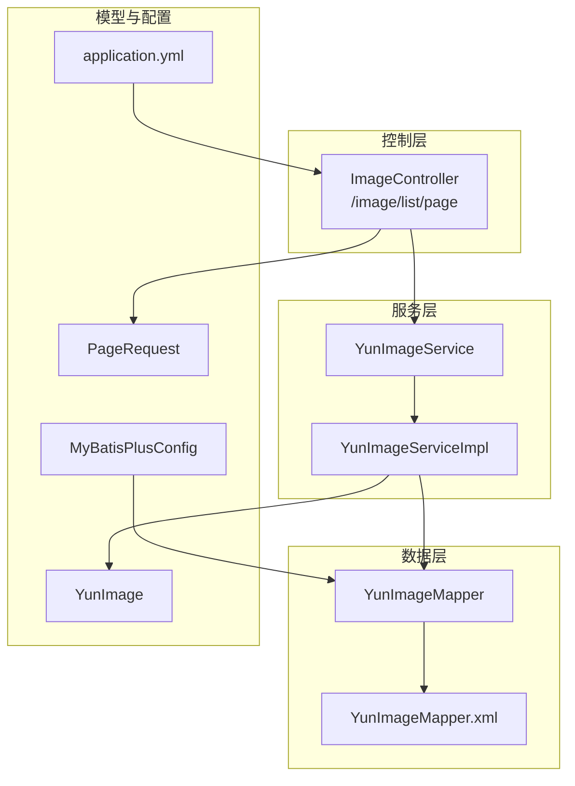
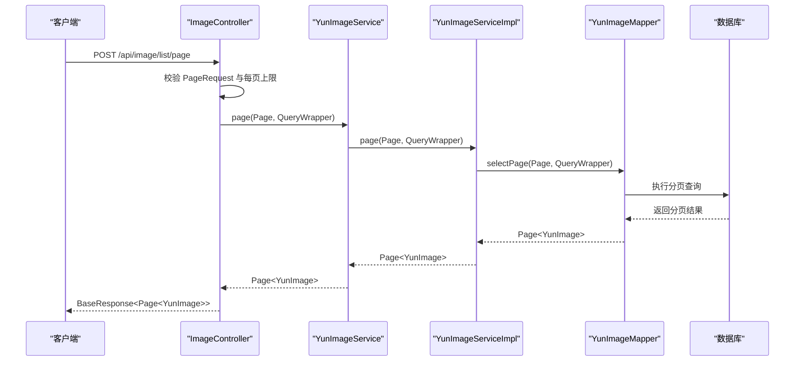
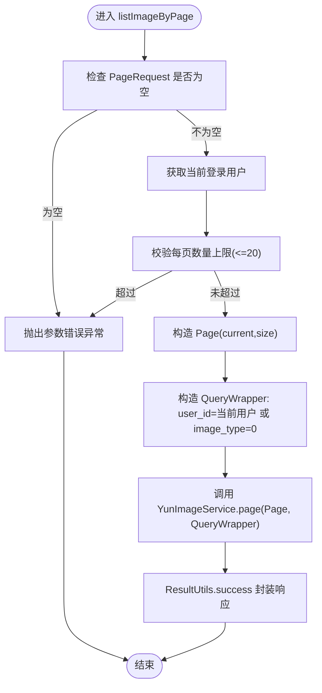
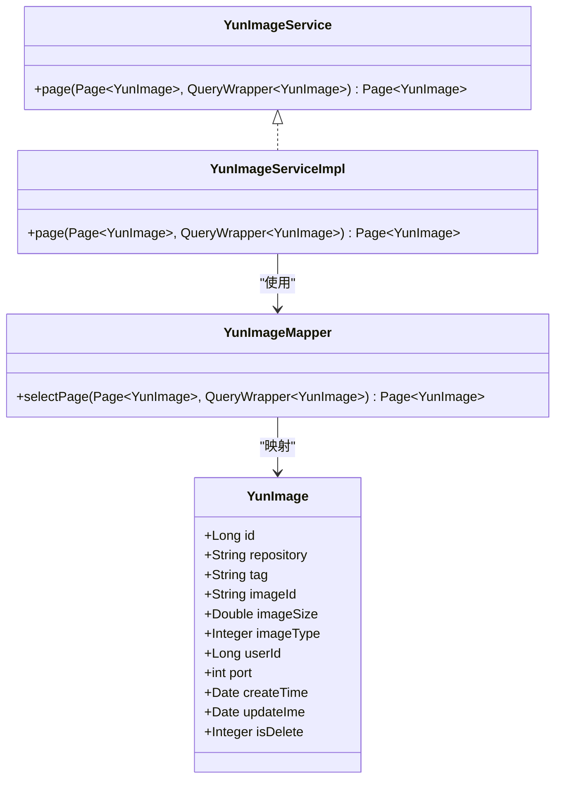
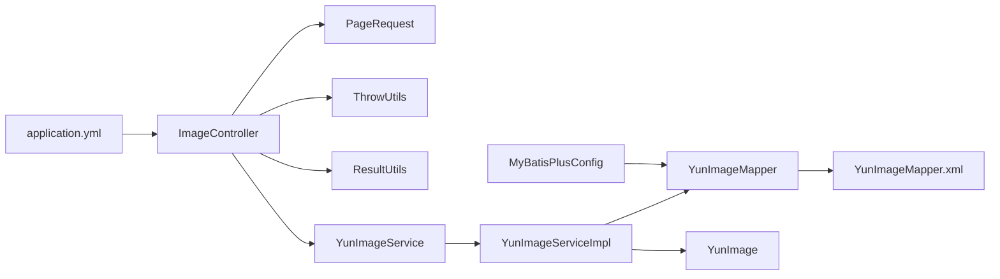

# 镜像列表展示

<cite>
**本文引用的文件**
- [ImageController.java](file://yun-docker-master/src/main/java/com/lfc/yundocker/controller/ImageController.java)
- [YunImageService.java](file://yun-docker-master/src/main/java/com/lfc/yundocker/service/YunImageService.java)
- [YunImageServiceImpl.java](file://yun-docker-master/src/main/java/com/lfc/yundocker/service/impl/YunImageServiceImpl.java)
- [YunImage.java](file://yun-docker-master/src/main/java/com/lfc/yundocker/common/model/entity/YunImage.java)
- [YunImageMapper.java](file://yun-docker-master/src/main/java/com/lfc/yundocker/mapper/YunImageMapper.java)
- [YunImageMapper.xml](file://yun-docker-master/src/main/resources/mapper/YunImageMapper.xml)
- [PageRequest.java](file://yun-docker-common/src/main/java/com/lfc/yundocker/common/model/dto/PageRequest.java)
- [MyBatisPlusConfig.java](file://yun-docker-master/src/main/java/com/lfc/yundocker/config/MyBatisPlusConfig.java)
- [application.yml](file://yun-docker-master/src/main/resources/application.yml)
- [ThrowUtils.java](file://yun-docker-common/src/main/java/com/lfc/yundocker/common/exception/ThrowUtils.java)
- [ResultUtils.java](file://yun-docker-common/src/main/java/com/lfc/yundocker/common/util/ResultUtils.java)
</cite>

## 目录
1. [简介](#简介)
2. [项目结构](#项目结构)
3. [核心组件](#核心组件)
4. [架构总览](#架构总览)
5. [详细组件分析](#详细组件分析)
6. [依赖关系分析](#依赖关系分析)
7. [性能考虑](#性能考虑)
8. [故障排查指南](#故障排查指南)
9. [结论](#结论)
10. [附录](#附录)

## 简介
本文件围绕“镜像列表查询”功能展开，重点解析 ImageController 的 /image/list/page 接口，说明其如何接收分页请求 PageRequest 并进行参数校验（限制每页数量不超过20条以防止爬虫），以及 YunImageService.page() 方法的调用流程：1）获取当前登录用户信息；2）构建 QueryWrapper 查询条件，支持查询当前用户的所有私有镜像（user_id 匹配）和所有公共镜像（image_type=0）；3）执行分页查询并返回 YunImage 分页数据。同时解释数据模型 YunImage 的字段含义及其在前端展示的用途，并给出该查询的 SQL 示例与 API 调用示例，最后提供分页性能优化策略。

## 项目结构
与镜像列表查询直接相关的模块与文件如下：
- 控制层：ImageController 提供 /image/list/page 接口
- 服务层：YunImageService 定义分页查询契约，YunImageServiceImpl 实现具体逻辑
- 数据层：YunImageMapper 继承 MyBatis-Plus 基础 Mapper，YunImageMapper.xml 定义映射
- 实体模型：YunImage 描述镜像字段
- 分页请求模型：PageRequest
- 配置：MyBatisPlusConfig 开启分页插件；application.yml 提供基础运行配置
- 工具与异常：ThrowUtils 参数校验工具；ResultUtils 统一响应封装

图表来源
- [ImageController.java](file://yun-docker-master/src/main/java/com/lfc/yundocker/controller/ImageController.java#L85-L115)
- [YunImageService.java](file://yun-docker-master/src/main/java/com/lfc/yundocker/service/YunImageService.java#L1-L19)
- [YunImageServiceImpl.java](file://yun-docker-master/src/main/java/com/lfc/yundocker/service/impl/YunImageServiceImpl.java#L1-L145)
- [YunImageMapper.java](file://yun-docker-master/src/main/java/com/lfc/yundocker/mapper/YunImageMapper.java#L1-L19)
- [YunImageMapper.xml](file://yun-docker-master/src/main/resources/mapper/YunImageMapper.xml#L1-L24)
- [YunImage.java](file://yun-docker-master/src/main/java/com/lfc/yundocker/common/model/entity/YunImage.java#L1-L79)
- [PageRequest.java](file://yun-docker-common/src/main/java/com/lfc/yundocker/common/model/dto/PageRequest.java#L1-L34)
- [MyBatisPlusConfig.java](file://yun-docker-master/src/main/java/com/lfc/yundocker/config/MyBatisPlusConfig.java#L1-L32)
- [application.yml](file://yun-docker-master/src/main/resources/application.yml#L1-L60)

章节来源
- [ImageController.java](file://yun-docker-master/src/main/java/com/lfc/yundocker/controller/ImageController.java#L85-L115)
- [MyBatisPlusConfig.java](file://yun-docker-master/src/main/java/com/lfc/yundocker/config/MyBatisPlusConfig.java#L1-L32)
- [application.yml](file://yun-docker-master/src/main/resources/application.yml#L1-L60)

## 核心组件
- ImageController.listImageByPage：接收分页请求，进行参数校验（限制每页最大20条），构造 Page 与 QueryWrapper，调用 YunImageService.page 并返回统一响应。
- YunImageService：定义分页查询契约（继承 MyBatis-Plus IService），实际实现由 YunImageServiceImpl 提供。
- YunImageServiceImpl：基于 BaseMapper 执行分页查询，内部使用 QueryWrapper 构建条件。
- YunImageMapper：继承 MyBatis-Plus BaseMapper，配合 XML 映射。
- YunImage：镜像实体，包含 repository、tag、imageId、imageSize、imageType、userId、port、createTime、updateIme、isDelete 等字段。
- PageRequest：分页请求模型，包含 current、pageSize、sortField、sortOrder。
- MyBatisPlusConfig：启用分页插件，确保 Page 分页生效。
- ThrowUtils：条件抛异常工具，用于参数校验。
- ResultUtils：统一响应封装。

章节来源
- [ImageController.java](file://yun-docker-master/src/main/java/com/lfc/yundocker/controller/ImageController.java#L85-L115)
- [YunImageService.java](file://yun-docker-master/src/main/java/com/lfc/yundocker/service/YunImageService.java#L1-L19)
- [YunImageServiceImpl.java](file://yun-docker-master/src/main/java/com/lfc/yundocker/service/impl/YunImageServiceImpl.java#L1-L145)
- [YunImageMapper.java](file://yun-docker-master/src/main/java/com/lfc/yundocker/mapper/YunImageMapper.java#L1-L19)
- [YunImage.java](file://yun-docker-master/src/main/java/com/lfc/yundocker/common/model/entity/YunImage.java#L1-L79)
- [PageRequest.java](file://yun-docker-common/src/main/java/com/lfc/yundocker/common/model/dto/PageRequest.java#L1-L34)
- [MyBatisPlusConfig.java](file://yun-docker-master/src/main/java/com/lfc/yundocker/config/MyBatisPlusConfig.java#L1-L32)
- [ThrowUtils.java](file://yun-docker-common/src/main/java/com/lfc/yundocker/common/exception/ThrowUtils.java#L1-L46)
- [ResultUtils.java](file://yun-docker-common/src/main/java/com/lfc/yundocker/common/util/ResultUtils.java#L1-L56)

## 架构总览
镜像列表查询采用典型的三层架构：
- 控制层负责接收请求、参数校验与响应封装
- 服务层负责业务编排与数据访问
- 数据层通过 MyBatis-Plus 执行 SQL 分页查询

图表来源
- [ImageController.java](file://yun-docker-master/src/main/java/com/lfc/yundocker/controller/ImageController.java#L85-L115)
- [YunImageService.java](file://yun-docker-master/src/main/java/com/lfc/yundocker/service/YunImageService.java#L1-L19)
- [YunImageServiceImpl.java](file://yun-docker-master/src/main/java/com/lfc/yundocker/service/impl/YunImageServiceImpl.java#L1-L145)
- [YunImageMapper.java](file://yun-docker-master/src/main/java/com/lfc/yundocker/mapper/YunImageMapper.java#L1-L19)
- [YunImageMapper.xml](file://yun-docker-master/src/main/resources/mapper/YunImageMapper.xml#L1-L24)

## 详细组件分析

### ImageController.listImageByPage 接口
- 接收参数：@RequestBody PageRequest，HttpServletRequest
- 参数校验：
  - PageRequest 非空校验
  - 每页数量上限校验（size > 20 抛错）
- 用户信息：通过 UserService.getLoginUser(request) 获取当前登录用户
- 分页构造：new Page<>(current, size)
- 查询条件：QueryWrapper.eq("user_id", userId).or().eq("image_type", 0)，即“当前用户私有镜像 或 公共镜像”
- 调用服务：YunImageService.page(page, queryWrapper)
- 响应封装：ResultUtils.success 返回 BaseResponse<Page<YunImage>>

图表来源
- [ImageController.java](file://yun-docker-master/src/main/java/com/lfc/yundocker/controller/ImageController.java#L85-L115)
- [ThrowUtils.java](file://yun-docker-common/src/main/java/com/lfc/yundocker/common/exception/ThrowUtils.java#L1-L46)
- [ResultUtils.java](file://yun-docker-common/src/main/java/com/lfc/yundocker/common/util/ResultUtils.java#L1-L56)

章节来源
- [ImageController.java](file://yun-docker-master/src/main/java/com/lfc/yundocker/controller/ImageController.java#L85-L115)
- [ThrowUtils.java](file://yun-docker-common/src/main/java/com/lfc/yundocker/common/exception/ThrowUtils.java#L1-L46)
- [ResultUtils.java](file://yun-docker-common/src/main/java/com/lfc/yundocker/common/util/ResultUtils.java#L1-L56)

### YunImageService.page() 调用链与实现要点
- 契约：YunImageService 继承 IService<YunImage>，提供分页查询能力
- 实现：YunImageServiceImpl 继承 ServiceImpl<YunImageMapper, YunImage>，底层使用 BaseMapper 的 selectPage
- 关键点：
  - 使用 QueryWrapper 构建查询条件（user_id=当前用户 OR image_type=0）
  - MyBatis-Plus 分页插件自动拦截 Page，生成 LIMIT 与 COUNT 查询
  - 返回 Page<YunImage>，包含 records、total、pages、size、current 等分页元信息

图表来源
- [YunImageService.java](file://yun-docker-master/src/main/java/com/lfc/yundocker/service/YunImageService.java#L1-L19)
- [YunImageServiceImpl.java](file://yun-docker-master/src/main/java/com/lfc/yundocker/service/impl/YunImageServiceImpl.java#L1-L145)
- [YunImageMapper.java](file://yun-docker-master/src/main/java/com/lfc/yundocker/mapper/YunImageMapper.java#L1-L19)
- [YunImage.java](file://yun-docker-master/src/main/java/com/lfc/yundocker/common/model/entity/YunImage.java#L1-L79)

章节来源
- [YunImageService.java](file://yun-docker-master/src/main/java/com/lfc/yundocker/service/YunImageService.java#L1-L19)
- [YunImageServiceImpl.java](file://yun-docker-master/src/main/java/com/lfc/yundocker/service/impl/YunImageServiceImpl.java#L1-L145)
- [YunImageMapper.java](file://yun-docker-master/src/main/java/com/lfc/yundocker/mapper/YunImageMapper.java#L1-L19)

### 数据模型 YunImage 字段说明与前端用途
- id：镜像记录主键
- repository：仓库名（如 nginx、redis 等）
- tag：标签（如 latest、v1.2.3）
- imageId：镜像标识（Docker 镜像 ID）
- imageSize：镜像大小（单位：MB，来源于 Docker 镜像大小计算）
- imageType：镜像类型（0 公共，1 私有）
- userId：创建用户 ID（私有镜像归属）
- port：对外暴露的端口（来自镜像配置）
- createTime/updateIme：创建与更新时间
- isDelete：逻辑删除标记

前端展示用途建议：
- repository + tag：作为镜像名称显示
- imageSize：用于容量统计与计费展示
- imageType：区分公共/私有，影响操作权限与可见性
- port：容器运行时端口映射参考
- createTime：排序与筛选依据

章节来源
- [YunImage.java](file://yun-docker-master/src/main/java/com/lfc/yundocker/common/model/entity/YunImage.java#L1-L79)

### SQL 示例与 API 调用示例
- SQL 示例（对应查询条件 user_id=当前用户 OR image_type=0）：
  - SELECT ... FROM yun_image WHERE (user_id=? OR image_type=0) ORDER BY ... LIMIT ? OFFSET ?
  - COUNT(*) 用于统计 total
- API 调用示例（POST /api/image/list/page）：
  - 请求体：{
      "current": 1,
      "pageSize": 10,
      "sortField": "create_time",
      "sortOrder": "descend"
    }
  - 响应体：{
      "code": 0,
      "data": {
        "records": [...],
        "total": 120,
        "pages": 12,
        "size": 10,
        "current": 1
      },
      "message": "ok"
    }

章节来源
- [ImageController.java](file://yun-docker-master/src/main/java/com/lfc/yundocker/controller/ImageController.java#L85-L115)
- [YunImageMapper.xml](file://yun-docker-master/src/main/resources/mapper/YunImageMapper.xml#L1-L24)
- [PageRequest.java](file://yun-docker-common/src/main/java/com/lfc/yundocker/common/model/dto/PageRequest.java#L1-L34)
- [ResultUtils.java](file://yun-docker-common/src/main/java/com/lfc/yundocker/common/util/ResultUtils.java#L1-L56)

## 依赖关系分析
- 控制层依赖服务层接口与工具类（参数校验、响应封装）
- 服务层依赖 Mapper 与实体模型
- Mapper 依赖 XML 映射与 MyBatis-Plus 配置
- 分页插件由 MyBatisPlusConfig 注册，确保 Page 生效

图表来源
- [ImageController.java](file://yun-docker-master/src/main/java/com/lfc/yundocker/controller/ImageController.java#L85-L115)
- [YunImageService.java](file://yun-docker-master/src/main/java/com/lfc/yundocker/service/YunImageService.java#L1-L19)
- [YunImageServiceImpl.java](file://yun-docker-master/src/main/java/com/lfc/yundocker/service/impl/YunImageServiceImpl.java#L1-L145)
- [YunImageMapper.java](file://yun-docker-master/src/main/java/com/lfc/yundocker/mapper/YunImageMapper.java#L1-L19)
- [YunImageMapper.xml](file://yun-docker-master/src/main/resources/mapper/YunImageMapper.xml#L1-L24)
- [YunImage.java](file://yun-docker-master/src/main/java/com/lfc/yundocker/common/model/entity/YunImage.java#L1-L79)
- [MyBatisPlusConfig.java](file://yun-docker-master/src/main/java/com/lfc/yundocker/config/MyBatisPlusConfig.java#L1-L32)
- [application.yml](file://yun-docker-master/src/main/resources/application.yml#L1-L60)

章节来源
- [MyBatisPlusConfig.java](file://yun-docker-master/src/main/java/com/lfc/yundocker/config/MyBatisPlusConfig.java#L1-L32)
- [application.yml](file://yun-docker-master/src/main/resources/application.yml#L1-L60)

## 性能考虑
- 分页上限控制：接口侧限制每页最大20条，防止爬虫或恶意请求造成数据库压力
- 分页插件：MyBatis-Plus 分页插件自动注入 LIMIT 与 COUNT，避免一次性加载全量数据
- 查询条件：使用 OR 条件可能影响索引利用，建议在 yun_image 表上建立复合索引（如 user_id + image_type）以提升查询效率
- 排序字段：PageRequest 支持 sortField 与 sortOrder，建议在高频查询字段上建立索引
- 逻辑删除：实体包含 isDelete 字段，MyBatis-Plus 全局逻辑删除配置可减少全表扫描
- 缓存策略：对于公共镜像列表可考虑缓存热点数据，降低数据库压力

章节来源
- [ImageController.java](file://yun-docker-master/src/main/java/com/lfc/yundocker/controller/ImageController.java#L85-L115)
- [MyBatisPlusConfig.java](file://yun-docker-master/src/main/java/com/lfc/yundocker/config/MyBatisPlusConfig.java#L1-L32)
- [YunImage.java](file://yun-docker-master/src/main/java/com/lfc/yundocker/common/model/entity/YunImage.java#L1-L79)
- [application.yml](file://yun-docker-master/src/main/resources/application.yml#L1-L60)

## 故障排查指南
- 参数错误：
  - PageRequest 为空或 pageSize 超过 20 会触发参数错误异常
  - 排查点：确认请求体结构与字段命名
- 认证失败：
  - 若无法获取登录用户，需检查鉴权流程与 Token 有效性
- 数据库异常：
  - 分页查询失败时，检查 yun_image 表是否存在、索引是否合理
  - 核对 MyBatis-Plus 分页插件是否正确注册
- 响应异常：
  - 统一响应封装由 ResultUtils 提供，若返回非预期格式，检查封装逻辑

章节来源
- [ImageController.java](file://yun-docker-master/src/main/java/com/lfc/yundocker/controller/ImageController.java#L85-L115)
- [ThrowUtils.java](file://yun-docker-common/src/main/java/com/lfc/yundocker/common/exception/ThrowUtils.java#L1-L46)
- [ResultUtils.java](file://yun-docker-common/src/main/java/com/lfc/yundocker/common/util/ResultUtils.java#L1-L56)
- [MyBatisPlusConfig.java](file://yun-docker-master/src/main/java/com/lfc/yundocker/config/MyBatisPlusConfig.java#L1-L32)

## 结论
镜像列表查询功能通过 ImageController 的 /image/list/page 接口完成，结合 PageRequest 的参数校验与每页上限控制，确保系统安全与稳定。服务层通过 YunImageService.page() 与 YunImageServiceImpl 的分页查询实现，底层依赖 MyBatis-Plus 分页插件与合理的查询条件，最终返回包含完整分页信息的 YunImage 列表。建议在生产环境中完善索引与缓存策略，持续优化查询性能。

## 附录
- 运行环境：application.yml 中配置了 Dubbo、Spring MVC、MyBatis-Plus 等关键参数
- 分页配置：MyBatisPlusConfig 注册 PaginationInnerInterceptor，确保 Page 分页生效

章节来源
- [application.yml](file://yun-docker-master/src/main/resources/application.yml#L1-L60)
- [MyBatisPlusConfig.java](file://yun-docker-master/src/main/java/com/lfc/yundocker/config/MyBatisPlusConfig.java#L1-L32)