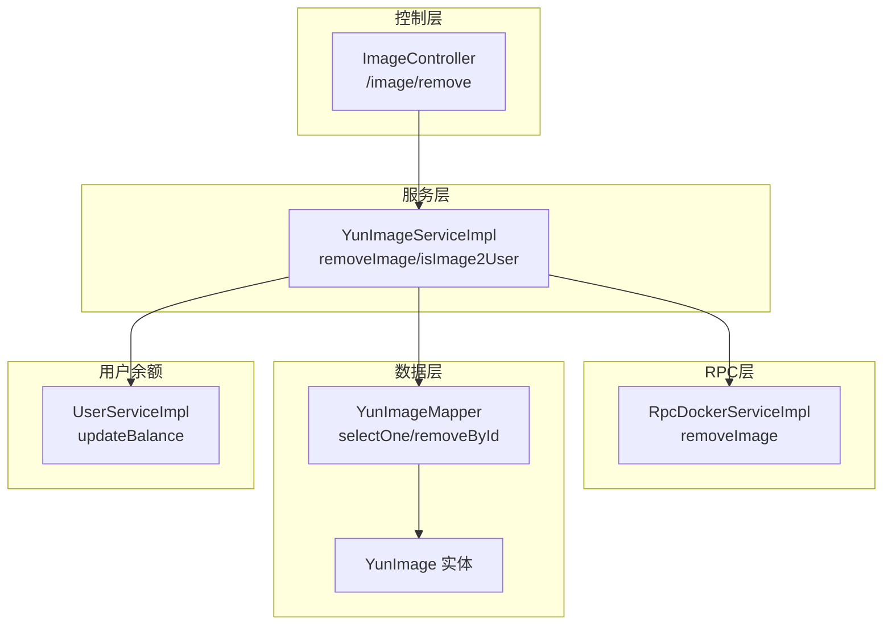
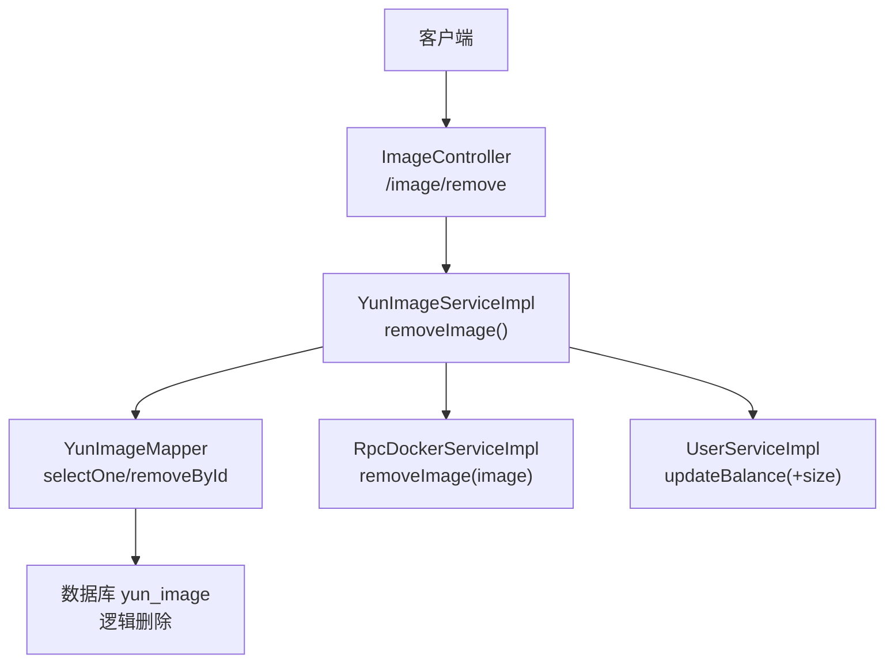
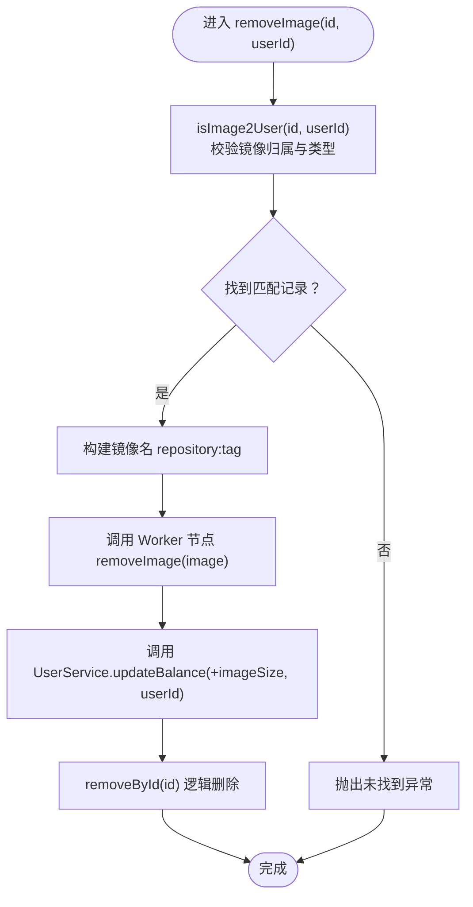
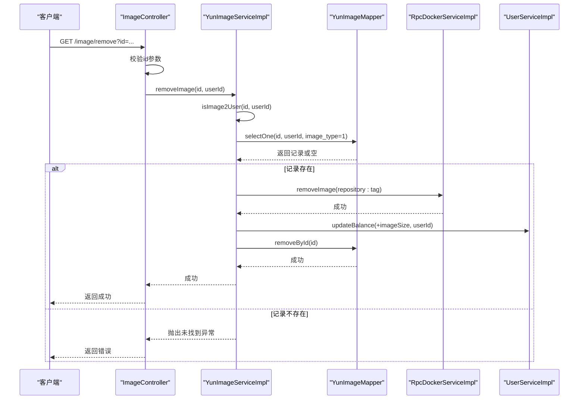
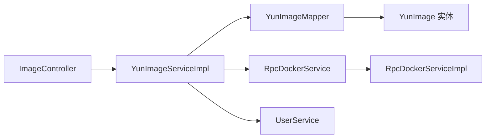

# 镜像删除

<cite>
**本文引用的文件**
- [ImageController.java](file://yun-docker-master/src/main/java/com/lfc/yundocker/controller/ImageController.java)
- [YunImageService.java](file://yun-docker-master/src/main/java/com/lfc/yundocker/service/YunImageService.java)
- [YunImageServiceImpl.java](file://yun-docker-master/src/main/java/com/lfc/yundocker/service/impl/YunImageServiceImpl.java)
- [YunImageMapper.java](file://yun-docker-master/src/main/java/com/lfc/yundocker/mapper/YunImageMapper.java)
- [YunImageMapper.xml](file://yun-docker-master/src/main/resources/mapper/YunImageMapper.xml)
- [YunImage.java](file://yun-docker-master/src/main/java/com/lfc/yundocker/common/model/entity/YunImage.java)
- [RpcDockerService.java](file://yun-docker-api/src/main/java/com/lfc/yundocker/service/RpcDockerService.java)
- [RpcDockerServiceImpl.java](file://yun-docker-worker/src/main/java/com/lfc/yundocker/worker/rpc/RpcDockerServiceImpl.java)
- [UserService.java](file://yun-docker-master/src/main/java/com/lfc/yundocker/service/UserService.java)
- [UserServiceImpl.java](file://yun-docker-master/src/main/java/com/lfc/yundocker/service/impl/UserServiceImpl.java)
- [BusinessException.java](file://yun-docker-common/src/main/java/com/lfc/yundocker/common/exception/BusinessException.java)
- [ThrowUtils.java](file://yun-docker-common/src/main/java/com/lfc/yundocker/common/exception/ThrowUtils.java)
- [create_table.sql](file://sql/create_table.sql)
- [yun_docker.sql](file://sql/yun_docker.sql)
</cite>

## 目录
1. [简介](#简介)
2. [项目结构](#项目结构)
3. [核心组件](#核心组件)
4. [架构总览](#架构总览)
5. [详细组件分析](#详细组件分析)
6. [依赖关系分析](#依赖关系分析)
7. [性能考量](#性能考量)
8. [故障排查指南](#故障排查指南)
9. [结论](#结论)

## 简介
本文件围绕“镜像删除”功能展开，基于 ImageController 的 /remove 接口，系统性梳理 removeImage() 方法的执行流程：参数校验、权限校验（仅允许删除自己的私有镜像）、调用 Worker 节点执行 Docker rmi 命令、返还用户余额、以及从数据库逻辑删除记录。同时重点强调权限控制与事务一致性、异常处理策略（镜像不存在、Docker 命令失败等），并提供时序图与删除私有镜像的操作示例。

## 项目结构
- 控制层：ImageController 提供 /image/remove 接口，负责参数校验与调用服务层。
- 服务层：YunImageService 定义接口，YunImageServiceImpl 实现 removeImage() 与 isImage2User() 等核心逻辑。
- 数据访问层：YunImageMapper 及 MyBatis 映射文件，负责数据库查询与逻辑删除。
- RPC 层：RpcDockerService 接口与 RpcDockerServiceImpl 实现，负责与 Docker 交互（拉取/删除镜像）。
- 用户余额：UserService/Impl 提供余额更新能力，确保删除后返还相应资源费用。
- 异常与工具：BusinessException、ThrowUtils 统一异常与断言。

图表来源
- [ImageController.java](file://yun-docker-master/src/main/java/com/lfc/yundocker/controller/ImageController.java#L71-L83)
- [YunImageServiceImpl.java](file://yun-docker-master/src/main/java/com/lfc/yundocker/service/impl/YunImageServiceImpl.java#L86-L102)
- [YunImageMapper.java](file://yun-docker-master/src/main/java/com/lfc/yundocker/mapper/YunImageMapper.java#L1-L19)
- [YunImageMapper.xml](file://yun-docker-master/src/main/resources/mapper/YunImageMapper.xml#L1-L24)
- [YunImage.java](file://yun-docker-master/src/main/java/com/lfc/yundocker/common/model/entity/YunImage.java#L1-L79)
- [RpcDockerServiceImpl.java](file://yun-docker-worker/src/main/java/com/lfc/yundocker/worker/rpc/RpcDockerServiceImpl.java#L74-L78)
- [UserServiceImpl.java](file://yun-docker-master/src/main/java/com/lfc/yundocker/service/impl/UserServiceImpl.java#L90-L103)

章节来源
- [ImageController.java](file://yun-docker-master/src/main/java/com/lfc/yundocker/controller/ImageController.java#L71-L83)
- [YunImageServiceImpl.java](file://yun-docker-master/src/main/java/com/lfc/yundocker/service/impl/YunImageServiceImpl.java#L86-L102)
- [RpcDockerServiceImpl.java](file://yun-docker-worker/src/main/java/com/lfc/yundocker/worker/rpc/RpcDockerServiceImpl.java#L74-L78)
- [UserServiceImpl.java](file://yun-docker-master/src/main/java/com/lfc/yundocker/service/impl/UserServiceImpl.java#L90-L103)

## 核心组件
- ImageController：接收 /image/remove 请求，校验参数 id，获取当前登录用户，调用 YunImageService.removeImage()。
- YunImageServiceImpl：
  - removeImage()：先通过 isImage2User() 校验镜像归属与类型（仅私有镜像），再调用 Worker 节点执行 Docker rmi，随后返还余额并逻辑删除记录。
  - isImage2User()：限定条件为 id、user_id、image_type=1，确保仅能删除自己的私有镜像。
- RpcDockerServiceImpl：通过 DockerClient 执行 removeImage(image)，返回布尔结果。
- UserServiceImpl：updateBalance() 使用原生 SQL 表达式保证余额增减的原子性。
- YunImageMapper/实体：提供查询与逻辑删除能力，配合 MyBatis 映射。

章节来源
- [ImageController.java](file://yun-docker-master/src/main/java/com/lfc/yundocker/controller/ImageController.java#L71-L83)
- [YunImageServiceImpl.java](file://yun-docker-master/src/main/java/com/lfc/yundocker/service/impl/YunImageServiceImpl.java#L86-L102)
- [YunImageServiceImpl.java](file://yun-docker-master/src/main/java/com/lfc/yundocker/service/impl/YunImageServiceImpl.java#L110-L117)
- [RpcDockerServiceImpl.java](file://yun-docker-worker/src/main/java/com/lfc/yundocker/worker/rpc/RpcDockerServiceImpl.java#L74-L78)
- [UserServiceImpl.java](file://yun-docker-master/src/main/java/com/lfc/yundocker/service/impl/UserServiceImpl.java#L90-L103)
- [YunImageMapper.java](file://yun-docker-master/src/main/java/com/lfc/yundocker/mapper/YunImageMapper.java#L1-L19)
- [YunImage.java](file://yun-docker-master/src/main/java/com/lfc/yundocker/common/model/entity/YunImage.java#L1-L79)

## 架构总览
镜像删除采用“控制层-服务层-RPC层-数据层”的分层设计，通过 Dubbo RPC 调用 Worker 节点执行 Docker 命令，服务层在删除前进行权限校验与余额返还，最后逻辑删除数据库记录。

图表来源
- [ImageController.java](file://yun-docker-master/src/main/java/com/lfc/yundocker/controller/ImageController.java#L71-L83)
- [YunImageServiceImpl.java](file://yun-docker-master/src/main/java/com/lfc/yundocker/service/impl/YunImageServiceImpl.java#L86-L102)
- [YunImageMapper.java](file://yun-docker-master/src/main/java/com/lfc/yundocker/mapper/YunImageMapper.java#L1-L19)
- [RpcDockerServiceImpl.java](file://yun-docker-worker/src/main/java/com/lfc/yundocker/worker/rpc/RpcDockerServiceImpl.java#L74-L78)
- [UserServiceImpl.java](file://yun-docker-master/src/main/java/com/lfc/yundocker/service/impl/UserServiceImpl.java#L90-L103)

## 详细组件分析

### 控制层：ImageController /image/remove
- 参数校验：校验 id 非空且非 0，否则抛出参数错误异常。
- 登录用户获取：通过 UserService.getLoginUser() 获取当前用户。
- 调用服务：调用 YunImageService.removeImage(id, userId)。

章节来源
- [ImageController.java](file://yun-docker-master/src/main/java/com/lfc/yundocker/controller/ImageController.java#L71-L83)

### 服务层：YunImageServiceImpl.removeImage()
执行步骤与要点：
1) 参数合法性校验：控制器已校验 id，服务层不再重复校验。
2) 权限校验与归属验证：调用 isImage2User(id, userId) 仅允许删除自己的私有镜像（image_type=1）。
3) Docker 命令执行：拼接 repository:tag，调用 RpcDockerService.removeImage(image)。
4) 余额返还：根据数据库记录的 imageSize 增加用户余额。
5) 逻辑删除：removeById(id)。

图表来源
- [YunImageServiceImpl.java](file://yun-docker-master/src/main/java/com/lfc/yundocker/service/impl/YunImageServiceImpl.java#L86-L102)
- [YunImageServiceImpl.java](file://yun-docker-master/src/main/java/com/lfc/yundocker/service/impl/YunImageServiceImpl.java#L110-L117)
- [RpcDockerServiceImpl.java](file://yun-docker-worker/src/main/java/com/lfc/yundocker/worker/rpc/RpcDockerServiceImpl.java#L74-L78)
- [UserServiceImpl.java](file://yun-docker-master/src/main/java/com/lfc/yundocker/service/impl/UserServiceImpl.java#L90-L103)

章节来源
- [YunImageServiceImpl.java](file://yun-docker-master/src/main/java/com/lfc/yundocker/service/impl/YunImageServiceImpl.java#L86-L102)
- [YunImageServiceImpl.java](file://yun-docker-master/src/main/java/com/lfc/yundocker/service/impl/YunImageServiceImpl.java#L110-L117)

### 权限控制与事务一致性
- 权限控制：
  - isImage2User() 限定条件包含 id、user_id、image_type=1，确保仅能删除自己的私有镜像，防止越权删除。
  - 列表查询中也体现了公开镜像（image_type=0）可被所有人查看，但删除仍受上述条件约束。
- 事务一致性：
  - 当前实现为多阶段操作：先检查权限，再调用 Docker，再返还余额，最后逻辑删除。若中间任一步骤失败，无法保证强一致。
  - 建议在服务层引入本地事务或补偿机制，确保“删除镜像+返还余额+逻辑删除”三者原子性。

章节来源
- [YunImageServiceImpl.java](file://yun-docker-master/src/main/java/com/lfc/yundocker/service/impl/YunImageServiceImpl.java#L110-L117)
- [ImageController.java](file://yun-docker-master/src/main/java/com/lfc/yundocker/controller/ImageController.java#L84-L115)

### 异常处理策略
- 镜像不存在：isImage2User() 未命中时抛出未找到异常，避免后续操作。
- Docker 命令失败：RpcDockerServiceImpl.removeImage() 返回布尔值，当前未显式抛出异常；建议在调用处捕获并转换为业务异常，统一由全局异常处理器处理。
- 参数错误：控制器对 id 校验不合法时抛出参数错误异常。
- 余额更新异常：UserService.updateBalance() 通过原生 SQL 表达式保证原子性，若数据库异常应由上层捕获。

章节来源
- [YunImageServiceImpl.java](file://yun-docker-master/src/main/java/com/lfc/yundocker/service/impl/YunImageServiceImpl.java#L86-L102)
- [RpcDockerServiceImpl.java](file://yun-docker-worker/src/main/java/com/lfc/yundocker/worker/rpc/RpcDockerServiceImpl.java#L74-L78)
- [ImageController.java](file://yun-docker-master/src/main/java/com/lfc/yundocker/controller/ImageController.java#L71-L83)
- [BusinessException.java](file://yun-docker-common/src/main/java/com/lfc/yundocker/common/exception/BusinessException.java#L1-L37)
- [ThrowUtils.java](file://yun-docker-common/src/main/java/com/lfc/yundocker/common/exception/ThrowUtils.java#L1-L46)

### 数据模型与表结构
- yun_image 表字段关键点：
  - image_type：0 公开，1 私有。
  - user_id：创建用户 id，用于权限校验。
  - image_size：镜像大小，用于余额返还。
  - is_delete：逻辑删除标志。
- 示例数据片段展示了多种镜像类型与状态。

章节来源
- [create_table.sql](file://sql/create_table.sql#L29-L40)
- [yun_docker.sql](file://sql/yun_docker.sql#L72-L100)
- [YunImage.java](file://yun-docker-master/src/main/java/com/lfc/yundocker/common/model/entity/YunImage.java#L1-L79)

### 时序图：删除用户私有镜像

图表来源
- [ImageController.java](file://yun-docker-master/src/main/java/com/lfc/yundocker/controller/ImageController.java#L71-L83)
- [YunImageServiceImpl.java](file://yun-docker-master/src/main/java/com/lfc/yundocker/service/impl/YunImageServiceImpl.java#L86-L102)
- [YunImageMapper.java](file://yun-docker-master/src/main/java/com/lfc/yundocker/mapper/YunImageMapper.java#L1-L19)
- [RpcDockerServiceImpl.java](file://yun-docker-worker/src/main/java/com/lfc/yundocker/worker/rpc/RpcDockerServiceImpl.java#L74-L78)
- [UserServiceImpl.java](file://yun-docker-master/src/main/java/com/lfc/yundocker/service/impl/UserServiceImpl.java#L90-L103)

### 删除用户私有镜像示例
- 场景：用户 A 拥有私有镜像 id=7，执行 /image/remove?id=7。
- 流程：
  1) 控制器校验 id。
  2) 服务层 isImage2User() 校验 id=7、user_id=A、image_type=1。
  3) 拼装镜像名并调用 Worker 节点执行 rmi。
  4) 返还 imageSize 对应余额。
  5) 逻辑删除 yun_image 记录。
- 结果：用户 A 的余额增加，数据库中该记录标记为已删除。

章节来源
- [YunImageServiceImpl.java](file://yun-docker-master/src/main/java/com/lfc/yundocker/service/impl/YunImageServiceImpl.java#L86-L102)
- [YunImageServiceImpl.java](file://yun-docker-master/src/main/java/com/lfc/yundocker/service/impl/YunImageServiceImpl.java#L110-L117)
- [RpcDockerServiceImpl.java](file://yun-docker-worker/src/main/java/com/lfc/yundocker/worker/rpc/RpcDockerServiceImpl.java#L74-L78)
- [UserServiceImpl.java](file://yun-docker-master/src/main/java/com/lfc/yundocker/service/impl/UserServiceImpl.java#L90-L103)

## 依赖关系分析
- 控制层依赖服务层接口与用户服务。
- 服务层依赖 RPC 接口、用户服务与数据映射。
- RPC 层依赖 DockerClient。
- 数据层依赖实体与映射配置。

图表来源
- [ImageController.java](file://yun-docker-master/src/main/java/com/lfc/yundocker/controller/ImageController.java#L71-L83)
- [YunImageServiceImpl.java](file://yun-docker-master/src/main/java/com/lfc/yundocker/service/impl/YunImageServiceImpl.java#L86-L102)
- [YunImageMapper.java](file://yun-docker-master/src/main/java/com/lfc/yundocker/mapper/YunImageMapper.java#L1-L19)
- [YunImage.java](file://yun-docker-master/src/main/java/com/lfc/yundocker/common/model/entity/YunImage.java#L1-L79)
- [RpcDockerService.java](file://yun-docker-api/src/main/java/com/lfc/yundocker/service/RpcDockerService.java#L1-L143)
- [RpcDockerServiceImpl.java](file://yun-docker-worker/src/main/java/com/lfc/yundocker/worker/rpc/RpcDockerServiceImpl.java#L74-L78)
- [UserService.java](file://yun-docker-master/src/main/java/com/lfc/yundocker/service/UserService.java)

## 性能考量
- Docker 命令执行：removeImage() 为同步阻塞操作，建议在 Worker 节点侧做好并发与超时控制。
- 余额更新：UserService.updateBalance() 使用原生 SQL 表达式，具备原子性，避免锁竞争。
- 查询与删除：YunImageMapper 的查询条件包含 user_id 与 image_type，索引 idx_userId 可提升查询效率。
- 并发风险：若同一镜像被并发删除，需在服务层增加幂等校验或分布式锁，避免重复返还余额与重复删除。

## 故障排查指南
- 镜像不存在：isImage2User() 未命中，抛出未找到异常。确认 id、user_id、image_type 是否正确。
- Docker 命令失败：Worker 节点 removeImage() 返回失败或抛出异常。检查 Docker 服务状态、镜像是否存在、权限是否足够。
- 余额未返还：确认 imageSize 是否为空，以及 UserService.updateBalance() 是否执行成功。
- 逻辑删除无效：确认 removeById(id) 是否执行，以及数据库 is_delete 字段是否更新。
- 参数错误：检查 /image/remove 的 id 参数是否传入且非 0。

章节来源
- [YunImageServiceImpl.java](file://yun-docker-master/src/main/java/com/lfc/yundocker/service/impl/YunImageServiceImpl.java#L86-L102)
- [RpcDockerServiceImpl.java](file://yun-docker-worker/src/main/java/com/lfc/yundocker/worker/rpc/RpcDockerServiceImpl.java#L74-L78)
- [UserServiceImpl.java](file://yun-docker-master/src/main/java/com/lfc/yundocker/service/impl/UserServiceImpl.java#L90-L103)
- [ImageController.java](file://yun-docker-master/src/main/java/com/lfc/yundocker/controller/ImageController.java#L71-L83)

## 结论
镜像删除功能通过严格的权限校验（仅私有镜像、仅本人）与余额返还机制，实现了安全可控的资源回收。当前实现为多阶段操作，建议在服务层引入事务或补偿机制，确保“删除镜像+返还余额+逻辑删除”的一致性。同时，Worker 节点的 Docker 命令执行应增强异常处理与可观测性，以便快速定位问题。