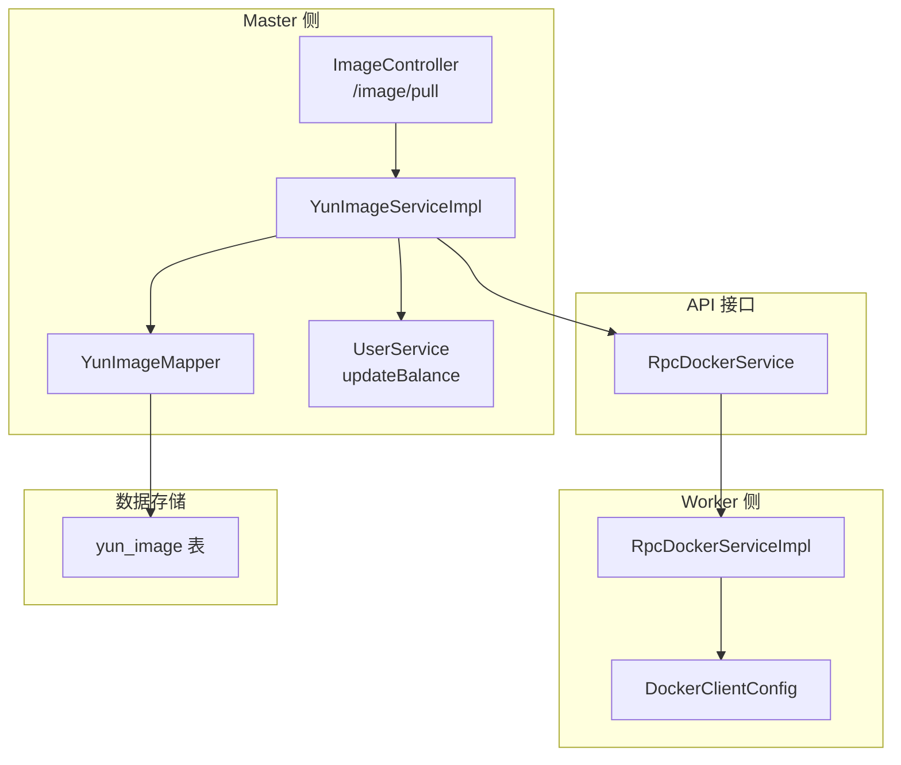
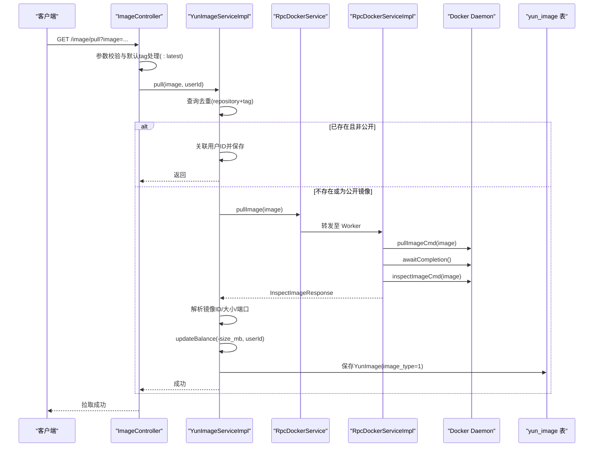
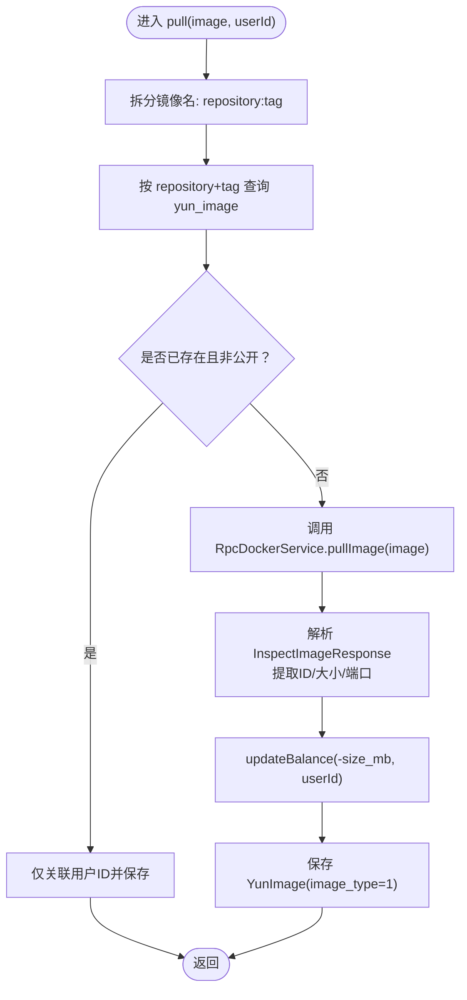
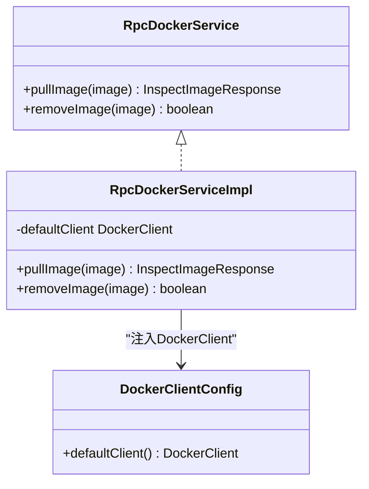
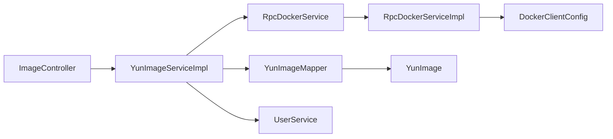

# 镜像拉取

<cite>
**本文引用的文件**
- [ImageController.java](file://yun-docker-master/src/main/java/com/lfc/yundocker/controller/ImageController.java)
- [YunImageService.java](file://yun-docker-master/src/main/java/com/lfc/yundocker/service/YunImageService.java)
- [YunImageServiceImpl.java](file://yun-docker-master/src/main/java/com/lfc/yundocker/service/impl/YunImageServiceImpl.java)
- [YunImageMapper.java](file://yun-docker-master/src/main/java/com/lfc/yundocker/mapper/YunImageMapper.java)
- [YunImage.java](file://yun-docker-master/src/main/java/com/lfc/yundocker/common/model/entity/YunImage.java)
- [RpcDockerService.java](file://yun-docker-api/src/main/java/com/lfc/yundocker/service/RpcDockerService.java)
- [RpcDockerServiceImpl.java](file://yun-docker-worker/src/main/java/com/lfc/yundocker/worker/rpc/RpcDockerServiceImpl.java)
- [DockerClientConfig.java](file://yun-docker-worker/src/main/java/com/lfc/yundocker/worker/config/DockerClientConfig.java)
- [application.yml](file://yun-docker-master/src/main/resources/application.yml)
- [application-dev.yml](file://yun-docker-worker/src/main/resources/application-dev.yml)
- [create_table.sql](file://sql/create_table.sql)
- [UserServiceImpl.java](file://yun-docker-master/src/main/java/com/lfc/yundocker/service/impl/UserServiceImpl.java)
</cite>

## 目录
1. [简介](#简介)
2. [项目结构](#项目结构)
3. [核心组件](#核心组件)
4. [架构总览](#架构总览)
5. [详细组件分析](#详细组件分析)
6. [依赖关系分析](#依赖关系分析)
7. [性能考量](#性能考量)
8. [故障排查指南](#故障排查指南)
9. [结论](#结论)
10. [附录](#附录)

## 简介
本文件围绕“镜像拉取”功能的完整技术流程展开，自 ImageController 的 /pull 接口开始，逐步说明参数校验与默认 tag 处理、镜像去重机制、通过 Dubbo RPC 调用 Worker 节点的 pullImage()、使用 Docker Java API 执行流式拉取并解析镜像元数据、基于镜像大小按 MB 单位扣减用户余额、以及将镜像信息持久化到 yun_image 表并标记为私有镜像。同时，结合代码说明 InterruptedException 的处理与资源配额控制，并提供该操作的时序图与典型使用示例（如拉取 nginx:latest）。

## 项目结构
- 控制层：ImageController 提供 /image/pull 接口，负责参数校验与默认 tag 处理，并调用业务层。
- 业务层：YunImageService 接口与 YunImageServiceImpl 实现，负责镜像去重、RPC 调用、元数据解析、余额扣减与入库。
- RPC 接口：RpcDockerService 定义 pullImage/removeImage 等能力。
- RPC 实现：RpcDockerServiceImpl 在 Worker 节点内使用 Docker Java API 执行拉取与 inspect。
- 数据访问：YunImageMapper 与 YunImage 实体映射 yun_image 表。
- 配置：Master 侧 Dubbo 消费者配置与 Worker 侧 Docker 客户端配置。
- 数据库：yun_image 表包含镜像名称、tag、镜像ID、大小、类型、用户ID、暴露端口等字段。

图表来源
- [ImageController.java](file://yun-docker-master/src/main/java/com/lfc/yundocker/controller/ImageController.java#L46-L62)
- [YunImageServiceImpl.java](file://yun-docker-master/src/main/java/com/lfc/yundocker/service/impl/YunImageServiceImpl.java#L40-L84)
- [RpcDockerService.java](file://yun-docker-api/src/main/java/com/lfc/yundocker/service/RpcDockerService.java#L11-L17)
- [RpcDockerServiceImpl.java](file://yun-docker-worker/src/main/java/com/lfc/yundocker/worker/rpc/RpcDockerServiceImpl.java#L52-L72)
- [DockerClientConfig.java](file://yun-docker-worker/src/main/java/com/lfc/yundocker/worker/config/DockerClientConfig.java#L18-L31)
- [YunImageMapper.java](file://yun-docker-master/src/main/java/com/lfc/yundocker/mapper/YunImageMapper.java#L1-L19)
- [create_table.sql](file://sql/create_table.sql#L25-L41)

章节来源
- [ImageController.java](file://yun-docker-master/src/main/java/com/lfc/yundocker/controller/ImageController.java#L46-L62)
- [YunImageServiceImpl.java](file://yun-docker-master/src/main/java/com/lfc/yundocker/service/impl/YunImageServiceImpl.java#L40-L84)
- [RpcDockerServiceImpl.java](file://yun-docker-worker/src/main/java/com/lfc/yundocker/worker/rpc/RpcDockerServiceImpl.java#L52-L72)
- [DockerClientConfig.java](file://yun-docker-worker/src/main/java/com/lfc/yundocker/worker/config/DockerClientConfig.java#L18-L31)
- [create_table.sql](file://sql/create_table.sql#L25-L41)

## 核心组件
- ImageController：接收 /image/pull 请求，校验参数，补充默认 tag（无冒号时追加 :latest），随后调用 YunImageService.pull()。
- YunImageServiceImpl：核心业务逻辑
  - 镜像去重：按 repository 与 tag 查询 yun_image，若存在且非公开镜像，则仅将用户ID关联保存。
  - RPC 调用：通过 RpcDockerService.pullImage() 触发 Worker 拉取。
  - 元数据解析：解析 InspectImageResponse，提取镜像ID（去除前缀）、大小（字节转 MB，保留一位小数）、暴露端口。
  - 余额扣减：调用 UserService.updateBalance(-size_mb, userId)。
  - 入库：构建 YunImage 并保存，标记 image_type=1（私有）。
- RpcDockerService/RpcDockerServiceImpl：Worker 侧 RPC 接口与实现
  - 使用 Docker Java API 的 PullImageCmd 执行流式拉取，awaitCompletion 等待完成。
  - 拉取完成后 inspectImageCmd 获取镜像详情。
- DockerClientConfig：Worker 侧注入 DockerClient，默认连接配置来自 application-dev.yml 的 docker.server.url。
- 数据模型：YunImage 映射 yun_image 表，包含 repository、tag、imageId、imageSize、imageType、userId、port 等字段。
- 配置：Master 侧 application.yml 中 Dubbo 消费者超时与重试策略；Worker 侧 application-dev.yml 中 docker.server.url 指向 Docker daemon。

章节来源
- [ImageController.java](file://yun-docker-master/src/main/java/com/lfc/yundocker/controller/ImageController.java#L46-L62)
- [YunImageServiceImpl.java](file://yun-docker-master/src/main/java/com/lfc/yundocker/service/impl/YunImageServiceImpl.java#L40-L84)
- [RpcDockerService.java](file://yun-docker-api/src/main/java/com/lfc/yundocker/service/RpcDockerService.java#L11-L17)
- [RpcDockerServiceImpl.java](file://yun-docker-worker/src/main/java/com/lfc/yundocker/worker/rpc/RpcDockerServiceImpl.java#L52-L72)
- [DockerClientConfig.java](file://yun-docker-worker/src/main/java/com/lfc/yundocker/worker/config/DockerClientConfig.java#L18-L31)
- [YunImage.java](file://yun-docker-master/src/main/java/com/lfc/yundocker/common/model/entity/YunImage.java#L18-L79)
- [application.yml](file://yun-docker-master/src/main/resources/application.yml#L3-L12)
- [application-dev.yml](file://yun-docker-worker/src/main/resources/application-dev.yml#L3-L6)

## 架构总览
镜像拉取采用“Master-Worker + Dubbo RPC + Docker Java API”的分层架构：
- Master 负责接口与业务编排（参数校验、去重、余额与入库）。
- Worker 负责实际的 Docker 操作（拉取与 inspect）。
- Master 通过 RpcDockerService 暴露的 pullImage() 接口调用 Worker 的 RpcDockerServiceImpl 实现。
- Worker 使用 DockerClientConfig 注入的 DockerClient 连接到 Docker daemon。

图表来源
- [ImageController.java](file://yun-docker-master/src/main/java/com/lfc/yundocker/controller/ImageController.java#L46-L62)
- [YunImageServiceImpl.java](file://yun-docker-master/src/main/java/com/lfc/yundocker/service/impl/YunImageServiceImpl.java#L40-L84)
- [RpcDockerServiceImpl.java](file://yun-docker-worker/src/main/java/com/lfc/yundocker/worker/rpc/RpcDockerServiceImpl.java#L52-L72)
- [create_table.sql](file://sql/create_table.sql#L25-L41)

## 详细组件分析

### ImageController /pull 接口
- 参数校验：image 不能为空，否则抛出参数异常。
- 默认 tag 处理：若未包含冒号，则追加 :latest。
- 调用业务层：传入 image 与当前登录用户ID，调用 YunImageService.pull()。
- 异常传播：接口声明抛出 InterruptedException，交由上层处理。

章节来源
- [ImageController.java](file://yun-docker-master/src/main/java/com/lfc/yundocker/controller/ImageController.java#L46-L62)

### YunImageService 与 YunImageServiceImpl
- 镜像去重机制
  - 按 repository 与 tag 查询 yun_image。
  - 若已存在且 image_type 不为 0（即非公开），则仅将 userId 关联保存，避免重复拉取。
- RPC 调用
  - 通过 @DubboReference 注入 RpcDockerService，调用 pullImage(image)。
- 元数据解析
  - 从 InspectImageResponse 中提取镜像ID（去除前缀）与大小（字节转 MB，保留一位小数）。
  - 从镜像 Config 的 ExposedPorts 中提取第一个端口作为对外暴露端口。
- 余额扣减
  - 调用 UserService.updateBalance(-size_mb, userId)，确保余额扣减的原子性。
- 入库
  - 构造 YunImage，设置 userId、image_type=1、repository、tag、imageId、imageSize、port，并保存。

图表来源
- [YunImageServiceImpl.java](file://yun-docker-master/src/main/java/com/lfc/yundocker/service/impl/YunImageServiceImpl.java#L40-L84)
- [YunImage.java](file://yun-docker-master/src/main/java/com/lfc/yundocker/common/model/entity/YunImage.java#L18-L79)
- [create_table.sql](file://sql/create_table.sql#L25-L41)

章节来源
- [YunImageService.java](file://yun-docker-master/src/main/java/com/lfc/yundocker/service/YunImageService.java#L11-L18)
- [YunImageServiceImpl.java](file://yun-docker-master/src/main/java/com/lfc/yundocker/service/impl/YunImageServiceImpl.java#L40-L84)

### RpcDockerService 与 RpcDockerServiceImpl
- Worker 侧通过 Docker Java API 执行镜像拉取
  - 使用 PullImageCmd 执行拉取，注册 PullImageResultCallback 输出进度。
  - awaitCompletion 等待拉取完成。
  - 拉取完成后调用 inspectImageCmd 获取镜像详情。
- Worker 侧 Docker 客户端配置
  - DockerClientConfig 从 application-dev.yml 的 docker.server.url 注入 DockerClient。
  - Worker 通过 @DubboService 暴露服务，Master 侧通过 @DubboReference 调用。

图表来源
- [RpcDockerService.java](file://yun-docker-api/src/main/java/com/lfc/yundocker/service/RpcDockerService.java#L11-L17)
- [RpcDockerServiceImpl.java](file://yun-docker-worker/src/main/java/com/lfc/yundocker/worker/rpc/RpcDockerServiceImpl.java#L52-L72)
- [DockerClientConfig.java](file://yun-docker-worker/src/main/java/com/lfc/yundocker/worker/config/DockerClientConfig.java#L18-L31)

章节来源
- [RpcDockerService.java](file://yun-docker-api/src/main/java/com/lfc/yundocker/service/RpcDockerService.java#L11-L17)
- [RpcDockerServiceImpl.java](file://yun-docker-worker/src/main/java/com/lfc/yundocker/worker/rpc/RpcDockerServiceImpl.java#L52-L72)
- [DockerClientConfig.java](file://yun-docker-worker/src/main/java/com/lfc/yundocker/worker/config/DockerClientConfig.java#L18-L31)

### 数据模型与持久化
- YunImage 实体映射 yun_image 表，关键字段包括 repository、tag、imageId、imageSize、imageType、userId、port。
- 入库时将 image_type 设为 1（私有），并记录用户ID与镜像元数据。

章节来源
- [YunImage.java](file://yun-docker-master/src/main/java/com/lfc/yundocker/common/model/entity/YunImage.java#L18-L79)
- [create_table.sql](file://sql/create_table.sql#L25-L41)

### 余额扣减与资源配额控制
- 余额扣减：YunImageServiceImpl 调用 UserService.updateBalance(-size_mb, userId)，通过原生 SQL 表达式保证原子性。
- 资源配额控制：Worker 侧在容器创建时对内存进行限制（例如 512MB），但镜像拉取阶段不直接涉及 CPU/内存限额控制；镜像拉取本身不消耗用户资源配额，仅产生镜像大小对应的余额扣减。

章节来源
- [YunImageServiceImpl.java](file://yun-docker-master/src/main/java/com/lfc/yundocker/service/impl/YunImageServiceImpl.java#L72-L77)
- [UserServiceImpl.java](file://yun-docker-master/src/main/java/com/lfc/yundocker/service/impl/UserServiceImpl.java#L90-L103)
- [RpcDockerServiceImpl.java](file://yun-docker-worker/src/main/java/com/lfc/yundocker/worker/rpc/RpcDockerServiceImpl.java#L82-L107)

## 依赖关系分析
- 控制层依赖业务层：ImageController 依赖 YunImageService。
- 业务层依赖 RPC 接口：YunImageServiceImpl 依赖 RpcDockerService。
- RPC 接口依赖实现：RpcDockerService 由 RpcDockerServiceImpl 实现。
- Worker 依赖 Docker Java API：RpcDockerServiceImpl 使用 DockerClient 执行拉取与 inspect。
- 业务层依赖数据访问：YunImageServiceImpl 依赖 YunImageMapper 与 YunImage 实体。
- 配置依赖：Master 侧 Dubbo 消费者配置与 Worker 侧 Docker 客户端配置。

图表来源
- [ImageController.java](file://yun-docker-master/src/main/java/com/lfc/yundocker/controller/ImageController.java#L46-L62)
- [YunImageServiceImpl.java](file://yun-docker-master/src/main/java/com/lfc/yundocker/service/impl/YunImageServiceImpl.java#L40-L84)
- [RpcDockerService.java](file://yun-docker-api/src/main/java/com/lfc/yundocker/service/RpcDockerService.java#L11-L17)
- [RpcDockerServiceImpl.java](file://yun-docker-worker/src/main/java/com/lfc/yundocker/worker/rpc/RpcDockerServiceImpl.java#L52-L72)
- [DockerClientConfig.java](file://yun-docker-worker/src/main/java/com/lfc/yundocker/worker/config/DockerClientConfig.java#L18-L31)
- [YunImageMapper.java](file://yun-docker-master/src/main/java/com/lfc/yundocker/mapper/YunImageMapper.java#L1-L19)
- [YunImage.java](file://yun-docker-master/src/main/java/com/lfc/yundocker/common/model/entity/YunImage.java#L18-L79)

章节来源
- [application.yml](file://yun-docker-master/src/main/resources/application.yml#L3-L12)
- [application-dev.yml](file://yun-docker-worker/src/main/resources/application-dev.yml#L3-L6)

## 性能考量
- 流式拉取：Worker 使用 PullImageCmd 的 ResultCallback 逐段输出拉取进度，避免阻塞主线程。
- 等待完成：awaitCompletion 确保拉取任务在业务层继续下一步前完成。
- 元数据解析：仅解析必要字段（ID、大小、端口），避免额外 IO。
- 去重优化：按 repository+tag 去重可显著减少重复拉取，降低带宽与时间成本。
- 余额扣减：采用原生 SQL 表达式原子更新，避免并发问题。

[本节为通用性能建议，无需列出具体文件来源]

## 故障排查指南
- 参数错误
  - 现象：/image/pull 传入 image 为空或格式不正确。
  - 处理：ImageController 已做参数校验并抛出业务异常。
- InterruptedException
  - 现象：拉取过程中线程被中断。
  - 处理：接口声明抛出 InterruptedException，应在外层捕获并记录日志，必要时中断拉取流程或提示用户重试。
- RPC 调用失败
  - 现象：Master 无法调用 Worker 的 pullImage()。
  - 处理：检查 Dubbo 消费者超时与注册中心配置；确认 Worker 正常暴露服务。
- Docker 连接失败
  - 现象：Worker 无法连接 Docker daemon。
  - 处理：检查 application-dev.yml 中 docker.server.url 是否可达；确认 Docker daemon 状态与权限。
- 镜像不存在
  - 现象：pullImage(image) 抛出异常。
  - 处理：确认镜像名称与仓库可用；检查网络与认证配置。
- 余额不足
  - 现象：余额扣减后仍不足。
  - 处理：前端引导用户充值；后端在扣减时保持原子性，避免并发导致的负余额。

章节来源
- [ImageController.java](file://yun-docker-master/src/main/java/com/lfc/yundocker/controller/ImageController.java#L46-L62)
- [YunImageServiceImpl.java](file://yun-docker-master/src/main/java/com/lfc/yundocker/service/impl/YunImageServiceImpl.java#L40-L84)
- [RpcDockerServiceImpl.java](file://yun-docker-worker/src/main/java/com/lfc/yundocker/worker/rpc/RpcDockerServiceImpl.java#L52-L72)
- [application.yml](file://yun-docker-master/src/main/resources/application.yml#L3-L12)
- [application-dev.yml](file://yun-docker-worker/src/main/resources/application-dev.yml#L3-L6)

## 结论
镜像拉取流程通过清晰的分层设计与 Dubbo RPC 实现了 Master-Worker 的解耦：Master 负责接口与业务编排，Worker 负责 Docker 操作。流程覆盖了参数校验、默认 tag 处理、镜像去重、RPC 调用、元数据解析、余额扣减与入库等关键环节。同时，代码层面体现了对 InterruptedException 的处理与资源配额控制的边界（镜像拉取阶段主要影响余额，容器运行阶段才涉及资源限制）。

[本节为总结性内容，无需列出具体文件来源]

## 附录

### 典型使用示例：拉取 nginx:latest
- 请求路径：GET /api/image/pull?image=nginx:latest
- 处理步骤：
  - ImageController 校验参数并通过默认 tag 处理。
  - YunImageServiceImpl 去重查询，若不存在则调用 RpcDockerService.pullImage()。
  - Worker 使用 Docker Java API 执行拉取并 inspect，返回镜像元数据。
  - Master 解析元数据，按 MB 扣减余额，并将镜像信息保存为私有镜像。

章节来源
- [ImageController.java](file://yun-docker-master/src/main/java/com/lfc/yundocker/controller/ImageController.java#L46-L62)
- [YunImageServiceImpl.java](file://yun-docker-master/src/main/java/com/lfc/yundocker/service/impl/YunImageServiceImpl.java#L40-L84)
- [RpcDockerServiceImpl.java](file://yun-docker-worker/src/main/java/com/lfc/yundocker/worker/rpc/RpcDockerServiceImpl.java#L52-L72)