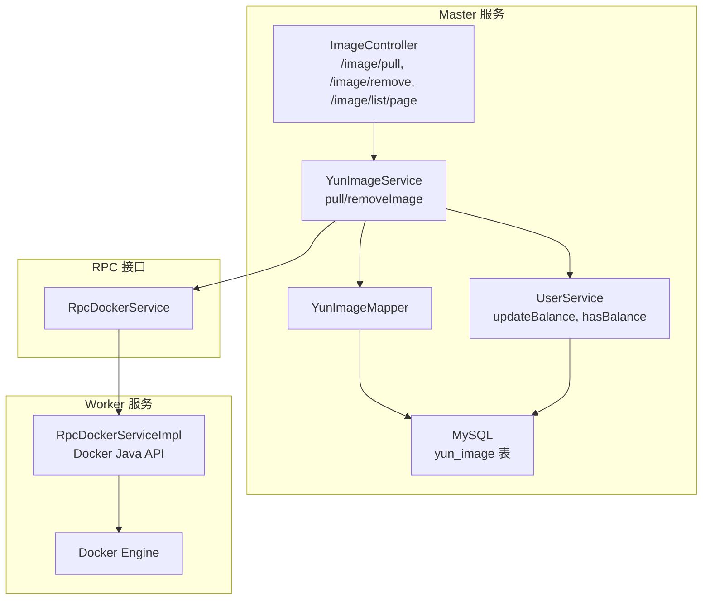
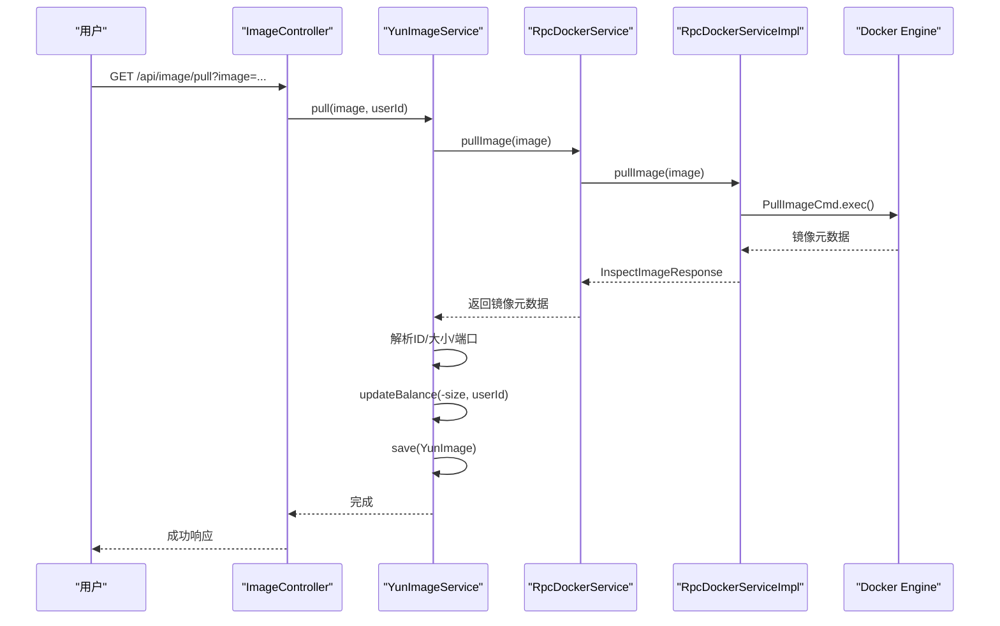
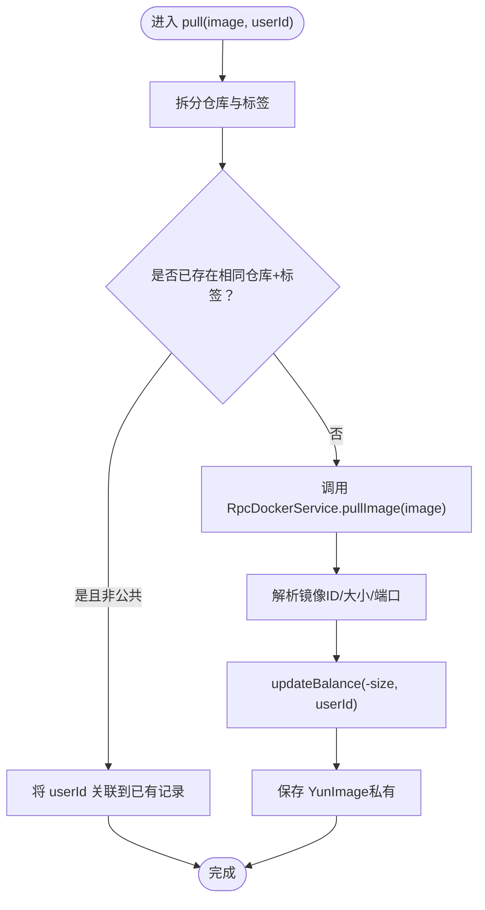
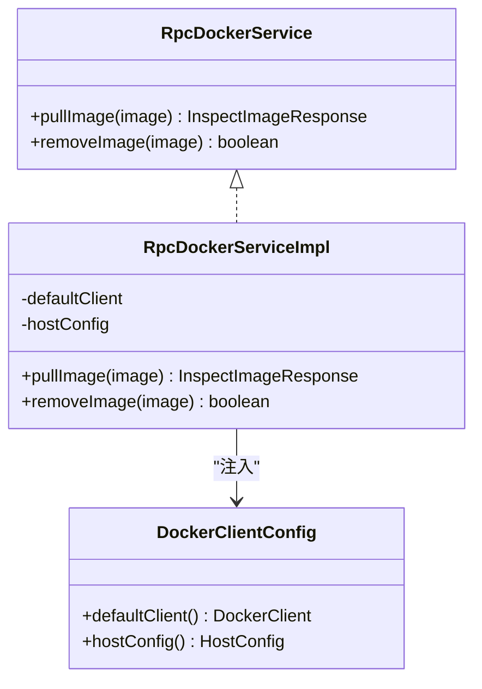
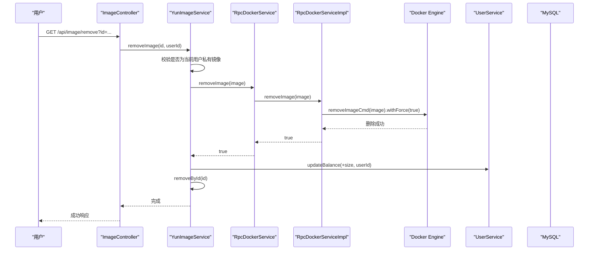
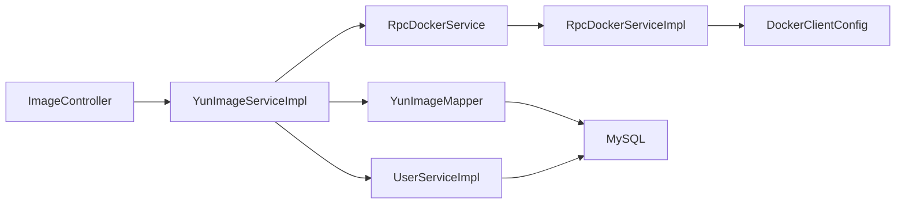

# 镜像管理

<cite>
**本文引用的文件**
- [ImageController.java](file://yun-docker-master/src/main/java/com/lfc/yundocker/controller/ImageController.java)
- [YunImageService.java](file://yun-docker-master/src/main/java/com/lfc/yundocker/service/YunImageService.java)
- [YunImageServiceImpl.java](file://yun-docker-master/src/main/java/com/lfc/yundocker/service/impl/YunImageServiceImpl.java)
- [RpcDockerService.java](file://yun-docker-api/src/main/java/com/lfc/yundocker/service/RpcDockerService.java)
- [RpcDockerServiceImpl.java](file://yun-docker-worker/src/main/java/com/lfc/yundocker/worker/rpc/RpcDockerServiceImpl.java)
- [YunImage.java](file://yun-docker-master/src/main/java/com/lfc/yundocker/common/model/entity/YunImage.java)
- [YunImageMapper.java](file://yun-docker-master/src/main/java/com/lfc/yundocker/mapper/YunImageMapper.java)
- [UserService.java](file://yun-docker-master/src/main/java/com/lfc/yundocker/service/UserService.java)
- [UserServiceImpl.java](file://yun-docker-master/src/main/java/com/lfc/yundocker/service/impl/UserServiceImpl.java)
- [application.yml](file://yun-docker-master/src/main/resources/application.yml)
- [application-dev.yml](file://yun-docker-master/src/main/resources/application-dev.yml)
- [DockerClientConfig.java](file://yun-docker-worker/src/main/java/com/lfc/yundocker/worker/config/DockerClientConfig.java)
- [create_table.sql](file://sql/create_table.sql)
- [GlobalExceptionHandler.java](file://yun-docker-common/src/main/java/com/lfc/yundocker/common/exception/GlobalExceptionHandler.java)
- [ThrowUtils.java](file://yun-docker-common/src/main/java/com/lfc/yundocker/common/exception/ThrowUtils.java)
- [ResultUtils.java](file://yun-docker-common/src/main/java/com/lfc/yundocker/common/util/ResultUtils.java)
- [MetricsCollector.java](file://yun-docker-master/src/main/java/com/lfc/yundocker/monitor/MetricsCollector.java)
</cite>

## 目录
1. [简介](#简介)
2. [项目结构](#项目结构)
3. [核心组件](#核心组件)
4. [架构总览](#架构总览)
5. [详细组件分析](#详细组件分析)
6. [依赖关系分析](#依赖关系分析)
7. [性能与资源配额](#性能与资源配额)
8. [故障排查指南](#故障排查指南)
9. [结论](#结论)

## 简介
本文件面向“镜像管理”功能，围绕用户发起拉取镜像请求到镜像在本地存储的完整链路进行技术解析，涵盖：
- ImageController 接收 /pull 请求，调用 YunImageService.pull()
- YunImageService 通过 Dubbo RPC 调用 Worker 节点的 pullImage() 接口
- Worker 使用 Docker Java API 的 PullImageCmd 执行拉取，成功后返回镜像元数据
- Master 侧持久化镜像信息（用户ID、仓库名、标签、大小），并根据镜像大小扣减用户余额
- 区分公共镜像（image_type=0）与私有镜像（image_type=1）
- 删除镜像的逆向流程：removeImage()、释放余额、同步删除数据库记录
- 流式响应与异常中断处理
- 提供镜像拉取与删除的时序图
- 资源配额控制策略说明

## 项目结构
- 控制层：ImageController 提供 /image/pull、/image/remove、/image/list/page 等接口
- 业务层：YunImageService 接口及其实现 YunImageServiceImpl，负责镜像拉取、删除、余额扣减与持久化
- RPC 层：RpcDockerService 接口与 RpcDockerServiceImpl 实现，封装 Worker 节点的 Docker 操作
- Worker 节点：基于 Docker Java API 执行实际的镜像拉取与删除
- 数据模型：YunImage 实体映射 yun_image 表，包含镜像类型、大小、端口等字段
- 配置：application.yml、application-dev.yml、DockerClientConfig 等
- 异常与返回：GlobalExceptionHandler、ThrowUtils、ResultUtils 统一异常与响应处理

图表来源
- [ImageController.java](file://yun-docker-master/src/main/java/com/lfc/yundocker/controller/ImageController.java#L1-L116)
- [YunImageService.java](file://yun-docker-master/src/main/java/com/lfc/yundocker/service/YunImageService.java#L1-L19)
- [YunImageServiceImpl.java](file://yun-docker-master/src/main/java/com/lfc/yundocker/service/impl/YunImageServiceImpl.java#L1-L145)
- [RpcDockerService.java](file://yun-docker-api/src/main/java/com/lfc/yundocker/service/RpcDockerService.java#L1-L143)
- [RpcDockerServiceImpl.java](file://yun-docker-worker/src/main/java/com/lfc/yundocker/worker/rpc/RpcDockerServiceImpl.java#L1-L440)
- [YunImage.java](file://yun-docker-master/src/main/java/com/lfc/yundocker/common/model/entity/YunImage.java#L1-L79)
- [YunImageMapper.java](file://yun-docker-master/src/main/java/com/lfc/yundocker/mapper/YunImageMapper.java#L1-L19)
- [UserService.java](file://yun-docker-master/src/main/java/com/lfc/yundocker/service/UserService.java#L100-L123)
- [UserServiceImpl.java](file://yun-docker-master/src/main/java/com/lfc/yundocker/service/impl/UserServiceImpl.java#L90-L103)

章节来源
- [ImageController.java](file://yun-docker-master/src/main/java/com/lfc/yundocker/controller/ImageController.java#L1-L116)
- [application.yml](file://yun-docker-master/src/main/resources/application.yml#L1-L60)
- [application-dev.yml](file://yun-docker-master/src/main/resources/application-dev.yml#L1-L81)

## 核心组件
- ImageController：接收 HTTP 请求，校验参数，调用业务层执行拉取或删除，并返回统一响应
- YunImageService/YunImageServiceImpl：核心业务逻辑，包含镜像去重、拉取、删除、余额扣减与持久化
- RpcDockerService/RpcDockerServiceImpl：Dubbo 接口与 Worker 实现，封装 Docker Java API 的镜像拉取与删除
- UserService/UserServiceImpl：余额扣增与余额校验
- YunImage 实体与 Mapper：映射 yun_image 表，支持镜像类型、大小、端口等字段
- 异常与返回：统一异常处理与返回封装

章节来源
- [YunImageService.java](file://yun-docker-master/src/main/java/com/lfc/yundocker/service/YunImageService.java#L1-L19)
- [YunImageServiceImpl.java](file://yun-docker-master/src/main/java/com/lfc/yundocker/service/impl/YunImageServiceImpl.java#L1-L145)
- [RpcDockerService.java](file://yun-docker-api/src/main/java/com/lfc/yundocker/service/RpcDockerService.java#L1-L143)
- [RpcDockerServiceImpl.java](file://yun-docker-worker/src/main/java/com/lfc/yundocker/worker/rpc/RpcDockerServiceImpl.java#L1-L440)
- [YunImage.java](file://yun-docker-master/src/main/java/com/lfc/yundocker/common/model/entity/YunImage.java#L1-L79)
- [YunImageMapper.java](file://yun-docker-master/src/main/java/com/lfc/yundocker/mapper/YunImageMapper.java#L1-L19)
- [UserService.java](file://yun-docker-master/src/main/java/com/lfc/yundocker/service/UserService.java#L100-L123)
- [UserServiceImpl.java](file://yun-docker-master/src/main/java/com/lfc/yundocker/service/impl/UserServiceImpl.java#L90-L103)

## 架构总览
镜像管理采用“Master-Worker + Dubbo RPC”的分布式架构：
- Master 负责业务编排、鉴权、余额与持久化
- Worker 负责与 Docker Engine 交互，执行实际的镜像拉取/删除
- 通过 RpcDockerService 接口解耦 Master 与 Worker，便于扩展与测试

图表来源
- [ImageController.java](file://yun-docker-master/src/main/java/com/lfc/yundocker/controller/ImageController.java#L46-L62)
- [YunImageServiceImpl.java](file://yun-docker-master/src/main/java/com/lfc/yundocker/service/impl/YunImageServiceImpl.java#L41-L84)
- [RpcDockerService.java](file://yun-docker-api/src/main/java/com/lfc/yundocker/service/RpcDockerService.java#L11-L17)
- [RpcDockerServiceImpl.java](file://yun-docker-worker/src/main/java/com/lfc/yundocker/worker/rpc/RpcDockerServiceImpl.java#L52-L72)

## 详细组件分析

### ImageController：镜像接口入口
- /image/pull：校验参数，确保镜像名包含标签；若缺失则补为 latest；调用 YunImageService.pull()
- /image/remove：校验 id 参数，获取登录用户，调用 YunImageService.removeImage()
- /image/list/page：分页查询当前用户私有镜像与公共镜像（image_type=0）

章节来源
- [ImageController.java](file://yun-docker-master/src/main/java/com/lfc/yundocker/controller/ImageController.java#L46-L112)

### YunImageService/YunImageServiceImpl：镜像拉取与删除
- 拉取流程要点
  - 去重：若同仓库+标签已存在且非公共镜像，则仅将用户ID关联到已有记录
  - RPC 调用：通过 RpcDockerService.pullImage(image) 获取镜像元数据
  - 元数据解析：提取镜像ID（去除前缀）、镜像大小（字节转MB）、暴露端口
  - 余额扣减：调用 UserService.updateBalance(-size, userId)
  - 持久化：保存 YunImage（image_type=1，私有），并记录端口
- 删除流程要点
  - 权限校验：仅允许删除当前用户私有镜像（image_type=1）
  - RPC 调用：通过 RpcDockerService.removeImage(image) 删除镜像
  - 余额返还：调用 UserService.updateBalance(+size, userId)
  - 数据库删除：removeById(id)

图表来源
- [YunImageServiceImpl.java](file://yun-docker-master/src/main/java/com/lfc/yundocker/service/impl/YunImageServiceImpl.java#L41-L84)

章节来源
- [YunImageServiceImpl.java](file://yun-docker-master/src/main/java/com/lfc/yundocker/service/impl/YunImageServiceImpl.java#L41-L103)
- [YunImage.java](file://yun-docker-master/src/main/java/com/lfc/yundocker/common/model/entity/YunImage.java#L1-L79)

### RpcDockerService/RpcDockerServiceImpl：Worker 镜像操作
- pullImage：构建 PullImageCmd，使用 PullImageResultCallback 接收流式进度；完成后 inspect 镜像获取元数据
- removeImage：调用 removeImageCmd 并强制删除
- Docker 客户端：通过 DockerClientConfig 注入，默认连接本地 Docker Engine

图表来源
- [RpcDockerService.java](file://yun-docker-api/src/main/java/com/lfc/yundocker/service/RpcDockerService.java#L1-L143)
- [RpcDockerServiceImpl.java](file://yun-docker-worker/src/main/java/com/lfc/yundocker/worker/rpc/RpcDockerServiceImpl.java#L1-L440)
- [DockerClientConfig.java](file://yun-docker-worker/src/main/java/com/lfc/yundocker/worker/config/DockerClientConfig.java#L1-L32)

章节来源
- [RpcDockerService.java](file://yun-docker-api/src/main/java/com/lfc/yundocker/service/RpcDockerService.java#L11-L27)
- [RpcDockerServiceImpl.java](file://yun-docker-worker/src/main/java/com/lfc/yundocker/worker/rpc/RpcDockerServiceImpl.java#L52-L78)
- [DockerClientConfig.java](file://yun-docker-worker/src/main/java/com/lfc/yundocker/worker/config/DockerClientConfig.java#L1-L32)

### UserService/UserServiceImpl：余额与配额
- updateBalance：通过原生 SQL 表达式原子性更新余额（支持正负）
- hasBalance：余额阈值校验（示例阈值为 300，可作为配额控制依据）

章节来源
- [UserServiceImpl.java](file://yun-docker-master/src/main/java/com/lfc/yundocker/service/impl/UserServiceImpl.java#L90-L103)
- [UserService.java](file://yun-docker-master/src/main/java/com/lfc/yundocker/service/UserService.java#L120-L123)

### 数据模型与持久化
- YunImage 实体映射 yun_image 表，包含 repository、tag、image_id、image_size、image_type、user_id、port、逻辑删除字段等
- Mapper 与 ServiceImpl 组合完成查询、保存、删除等操作

章节来源
- [YunImage.java](file://yun-docker-master/src/main/java/com/lfc/yundocker/common/model/entity/YunImage.java#L1-L79)
- [YunImageMapper.java](file://yun-docker-master/src/main/java/com/lfc/yundocker/mapper/YunImageMapper.java#L1-L19)
- [create_table.sql](file://sql/create_table.sql#L25-L41)

### 删除镜像逆向流程

图表来源
- [ImageController.java](file://yun-docker-master/src/main/java/com/lfc/yundocker/controller/ImageController.java#L71-L83)
- [YunImageServiceImpl.java](file://yun-docker-master/src/main/java/com/lfc/yundocker/service/impl/YunImageServiceImpl.java#L86-L103)
- [RpcDockerServiceImpl.java](file://yun-docker-worker/src/main/java/com/lfc/yundocker/worker/rpc/RpcDockerServiceImpl.java#L74-L78)

## 依赖关系分析
- 控制层依赖业务层与用户服务
- 业务层依赖 RPC 接口、Mapper 与用户服务
- RPC 接口由 Worker 实现，依赖 Docker Java API
- 配置层面依赖 Dubbo、Spring Boot、MyBatis Plus、Prometheus 等

图表来源
- [ImageController.java](file://yun-docker-master/src/main/java/com/lfc/yundocker/controller/ImageController.java#L1-L116)
- [YunImageServiceImpl.java](file://yun-docker-master/src/main/java/com/lfc/yundocker/service/impl/YunImageServiceImpl.java#L1-L145)
- [RpcDockerServiceImpl.java](file://yun-docker-worker/src/main/java/com/lfc/yundocker/worker/rpc/RpcDockerServiceImpl.java#L1-L440)
- [DockerClientConfig.java](file://yun-docker-worker/src/main/java/com/lfc/yundocker/worker/config/DockerClientConfig.java#L1-L32)
- [YunImageMapper.java](file://yun-docker-master/src/main/java/com/lfc/yundocker/mapper/YunImageMapper.java#L1-L19)
- [UserServiceImpl.java](file://yun-docker-master/src/main/java/com/lfc/yundocker/service/impl/UserServiceImpl.java#L90-L103)

章节来源
- [application.yml](file://yun-docker-master/src/main/resources/application.yml#L1-L60)
- [application-dev.yml](file://yun-docker-master/src/main/resources/application-dev.yml#L1-L81)

## 性能与资源配额
- 拉取性能
  - Worker 使用 Docker Java API 的 PullImageCmd 执行拉取，内部通过 ResultCallback 接收流式进度，适合大镜像场景
  - Master 侧仅做元数据解析与余额扣减，避免阻塞
- 资源配额控制策略
  - 余额阈值：hasBalance 示例阈值为 300，可用于限制用户可用额度
  - 余额扣减：pull 时按镜像大小（MB）扣减，删除时等额返还
  - 建议：可在业务层增加余额校验（如 hasBalance）在 pull 前执行，避免余额不足导致失败
- 指标采集
  - MetricsCollector 提供镜像请求计数、错误计数与响应时间指标，便于监控与告警

章节来源
- [YunImageServiceImpl.java](file://yun-docker-master/src/main/java/com/lfc/yundocker/service/impl/YunImageServiceImpl.java#L72-L84)
- [UserServiceImpl.java](file://yun-docker-master/src/main/java/com/lfc/yundocker/service/impl/UserServiceImpl.java#L295-L300)
- [MetricsCollector.java](file://yun-docker-master/src/main/java/com/lfc/yundocker/monitor/MetricsCollector.java#L1-L75)

## 故障排查指南
- 参数校验与异常
  - ImageController 对空参数抛出业务异常，统一由 GlobalExceptionHandler 捕获并返回 BaseResponse
  - ThrowUtils 提供便捷的条件抛异常工具
- RPC 超时与重试
  - application.yml 中设置 Dubbo consumer 超时与重试策略，可根据环境调整
- Docker 操作异常
  - RpcDockerServiceImpl 在 pull/remove 过程中捕获异常并记录日志，必要时可抛出业务异常
- 日志与监控
  - Worker 侧日志写入本地临时文件，便于定位拉取/删除问题
  - Prometheus 指标暴露，结合 MetricsCollector 观察镜像相关指标

章节来源
- [ImageController.java](file://yun-docker-master/src/main/java/com/lfc/yundocker/controller/ImageController.java#L46-L62)
- [GlobalExceptionHandler.java](file://yun-docker-common/src/main/java/com/lfc/yundocker/common/exception/GlobalExceptionHandler.java#L1-L31)
- [ThrowUtils.java](file://yun-docker-common/src/main/java/com/lfc/yundocker/common/exception/ThrowUtils.java#L1-L45)
- [application.yml](file://yun-docker-master/src/main/resources/application.yml#L1-L60)
- [RpcDockerServiceImpl.java](file://yun-docker-worker/src/main/java/com/lfc/yundocker/worker/rpc/RpcDockerServiceImpl.java#L345-L413)

## 结论
- 本实现以清晰的分层与接口解耦实现了镜像拉取与删除的完整闭环
- Master 侧专注业务编排与账务，Worker 侧专注 Docker 操作，配合 Dubbo RPC 达成高内聚低耦合
- 通过余额与阈值控制实现资源配额，结合指标采集与异常处理保障稳定性
- 建议后续增强点：在 pull 前增加余额校验、完善流式进度上报与断点续传能力、优化镜像去重策略（考虑多标签场景）