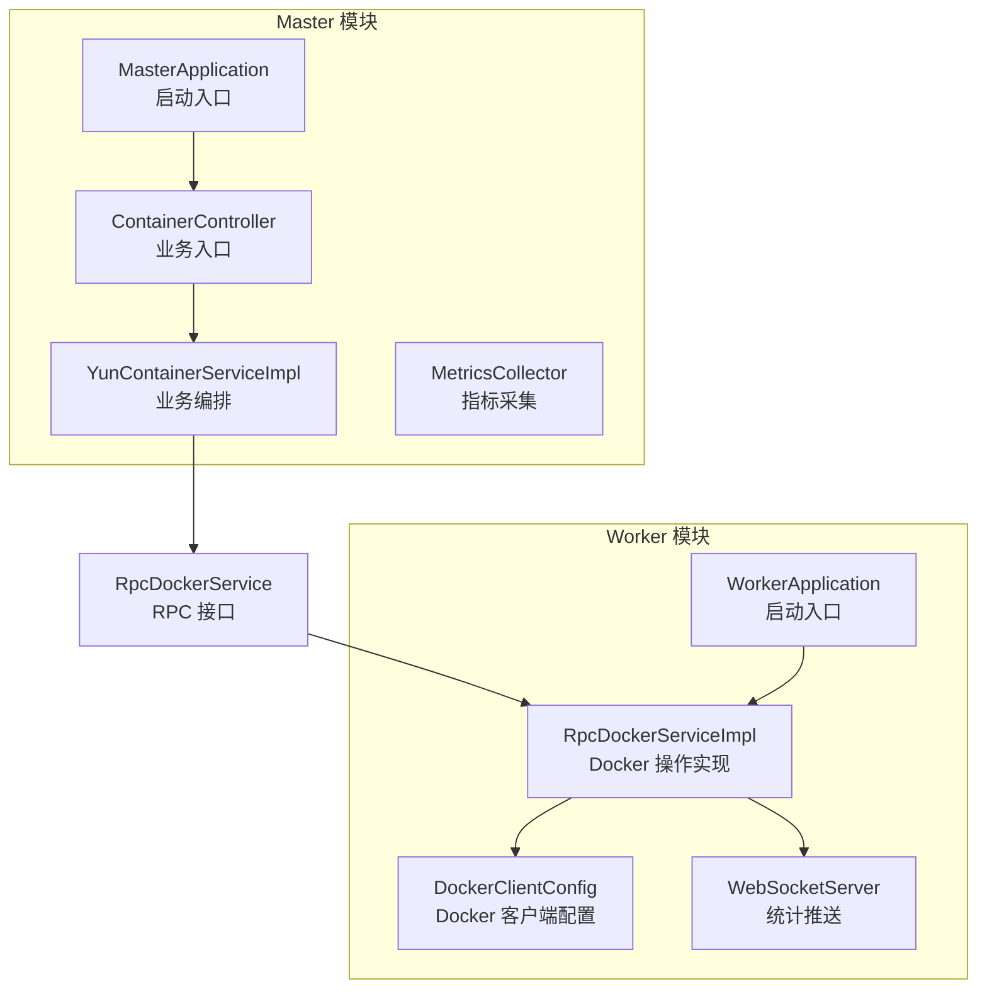
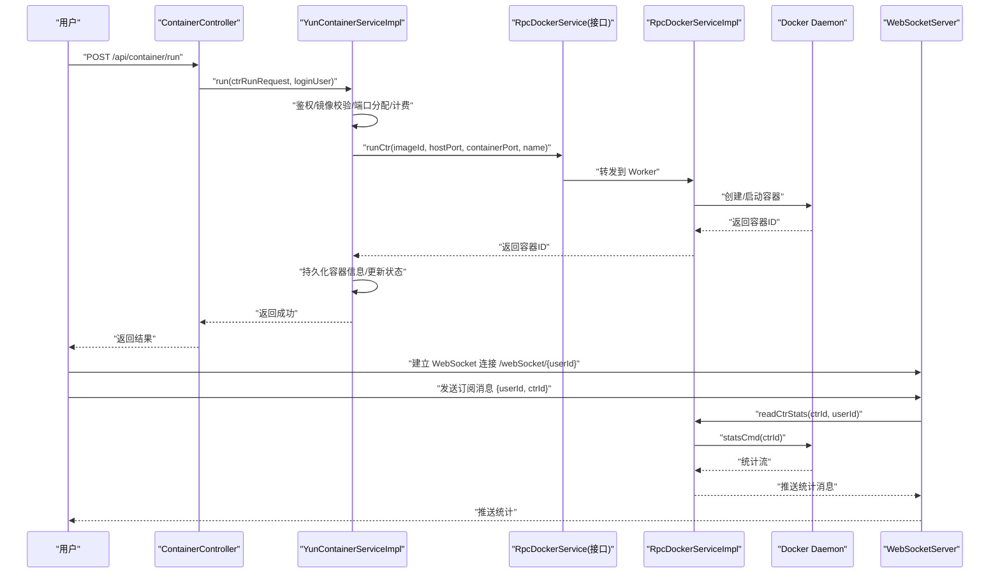
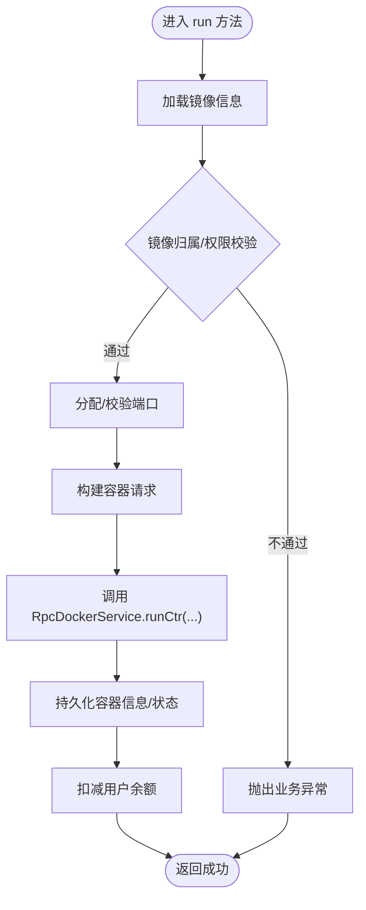
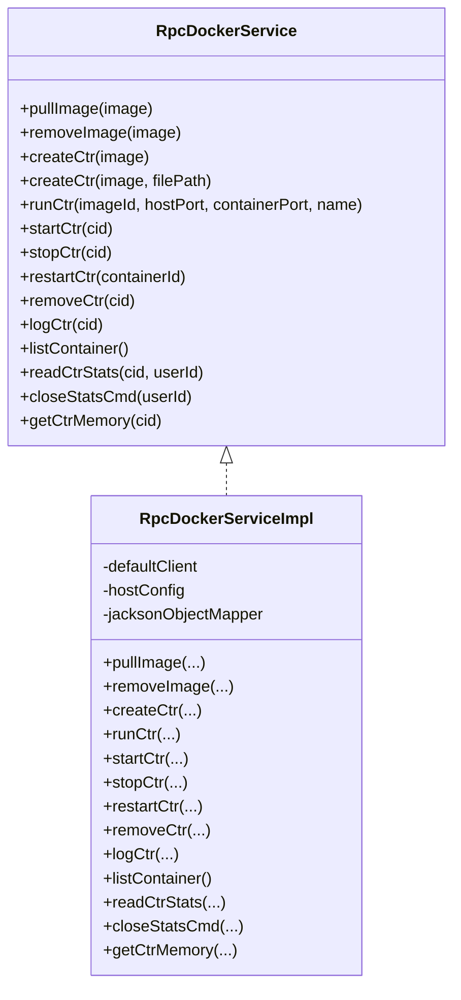
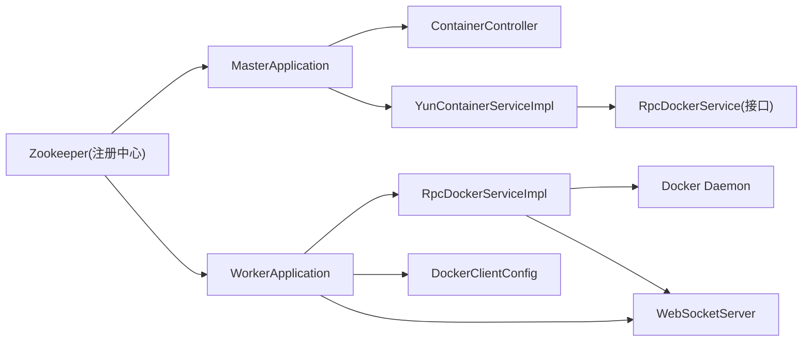
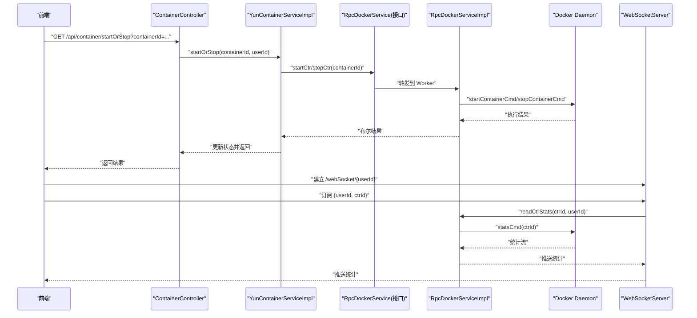

# 主从模式

<cite>
**本文引用的文件**
- [RpcDockerService.java](file://yun-docker-api/src/main/java/com/lfc/yundocker/service/RpcDockerService.java)
- [YunContainerServiceImpl.java](file://yun-docker-master/src/main/java/com/lfc/yundocker/service/impl/YunContainerServiceImpl.java)
- [RpcDockerServiceImpl.java](file://yun-docker-worker/src/main/java/com/lfc/yundocker/worker/rpc/RpcDockerServiceImpl.java)
- [ContainerController.java](file://yun-docker-master/src/main/java/com/lfc/yundocker/controller/ContainerController.java)
- [DockerClientConfig.java](file://yun-docker-worker/src/main/java/com/lfc/yundocker/worker/config/DockerClientConfig.java)
- [WebSocketServer.java](file://yun-docker-worker/src/main/java/com/lfc/yundocker/worker/websocket/WebSocketServer.java)
- [MetricsCollector.java](file://yun-docker-master/src/main/java/com/lfc/yundocker/monitor/MetricsCollector.java)
- [application.yml（Master）](file://yun-docker-master/src/main/resources/application.yml)
- [application.yml（Worker）](file://yun-docker-worker/src/main/resources/application.yml)
- [application-dev.yml（Worker）](file://yun-docker-worker/src/main/resources/application-dev.yml)
- [application-prod.yml（Worker）](file://yun-docker-worker/src/main/resources/application-prod.yml)
- [MasterApplication.java](file://yun-docker-master/src/main/java/com/lfc/yundocker/MasterApplication.java)
- [WorkerApplication.java](file://yun-docker-worker/src/main/java/com/lfc/yundocker/worker/WorkerApplication.java)
- [CtrRunRequest.java](file://yun-docker-common/src/main/java/com/lfc/yundocker/common/model/dto/CtrRunRequest.java)
- [ResultUtils.java](file://yun-docker-common/src/main/java/com/lfc/yundocker/common/util/ResultUtils.java)
- [pom.xml（父工程）](file://pom.xml)
- [pom.xml（Master）](file://yun-docker-master/pom.xml)
- [pom.xml（Worker）](file://yun-docker-worker/pom.xml)
</cite>

## 目录
1. [引言](#引言)
2. [项目结构](#项目结构)
3. [核心组件](#核心组件)
4. [架构总览](#架构总览)
5. [详细组件分析](#详细组件分析)
6. [依赖关系分析](#依赖关系分析)
7. [性能考量](#性能考量)
8. [故障排查指南](#故障排查指南)
9. [结论](#结论)
10. [附录](#附录)

## 引言
本文件围绕 yun-docker-backend 的“主从”架构设计进行深入剖析，重点说明：
- Master 节点负责业务逻辑处理（用户鉴权、订单/计费、容器状态管理、API 暴露）；
- Worker 节点专注执行 Docker 操作（拉取镜像、创建/启动/停止/重启/删除容器、日志采集、资源统计等）；
- 通过 YunContainerServiceImpl 调用 RpcDockerService 接口，由 RpcDockerServiceImpl 具体执行 Docker Java API，形成清晰的任务分发与结果返回链路；
- 该模式如何提升系统安全性（隔离 Docker 操作风险）与可维护性（关注点分离）；
- 提供主从通信时序图，覆盖从 HTTP 请求进入 Master，到 Worker 执行命令并返回结果的全过程；
- 讨论主从节点部署策略、故障转移方案及多 Worker 扩展可能性。

## 项目结构
项目采用多模块聚合结构，核心模块包括：
- yun-docker-api：定义 RPC 接口 RpcDockerService；
- yun-docker-common：通用模型、工具与异常；
- yun-docker-master：业务层、控制器、监控与配置；
- yun-docker-worker：RPC 实现、Docker 客户端配置、WebSocket 统计推送；
- embedded-zookeeper：嵌入式 Zookeeper（Dubbo 注册中心）。

图表来源
- [ContainerController.java](file://yun-docker-master/src/main/java/com/lfc/yundocker/controller/ContainerController.java#L1-L173)
- [YunContainerServiceImpl.java](file://yun-docker-master/src/main/java/com/lfc/yundocker/service/impl/YunContainerServiceImpl.java#L1-L318)
- [RpcDockerService.java](file://yun-docker-api/src/main/java/com/lfc/yundocker/service/RpcDockerService.java#L1-L143)
- [RpcDockerServiceImpl.java](file://yun-docker-worker/src/main/java/com/lfc/yundocker/worker/rpc/RpcDockerServiceImpl.java#L1-L440)
- [DockerClientConfig.java](file://yun-docker-worker/src/main/java/com/lfc/yundocker/worker/config/DockerClientConfig.java#L1-L32)
- [WebSocketServer.java](file://yun-docker-worker/src/main/java/com/lfc/yundocker/worker/websocket/WebSocketServer.java#L1-L175)
- [MasterApplication.java](file://yun-docker-master/src/main/java/com/lfc/yundocker/MasterApplication.java#L1-L25)
- [WorkerApplication.java](file://yun-docker-worker/src/main/java/com/lfc/yundocker/worker/WorkerApplication.java#L1-L23)

章节来源
- [pom.xml（父工程）](file://pom.xml#L1-L166)
- [pom.xml（Master）](file://yun-docker-master/pom.xml#L1-L194)
- [pom.xml（Worker）](file://yun-docker-worker/pom.xml#L1-L60)

## 核心组件
- RpcDockerService：定义容器与镜像操作的 RPC 接口，包括拉取镜像、创建/启动/停止/重启/删除容器、日志与资源统计等。
- YunContainerServiceImpl：Master 侧业务实现，负责鉴权、端口分配、计费、状态更新与调用 Worker 的 RpcDockerService。
- RpcDockerServiceImpl：Worker 侧 RPC 实现，封装 Docker Java API，执行实际的 Docker 操作，并通过 WebSocket 推送统计。
- ContainerController：Master 侧 HTTP 控制器，接收用户请求，调用业务层完成鉴权与编排。
- DockerClientConfig：Worker 侧 Docker 客户端与 Host 配置注入。
- WebSocketServer：Worker 侧 WebSocket 服务，接收前端订阅，触发统计采集并通过 WebSocket 推送。
- MetricsCollector：Master 侧指标采集，记录请求次数、错误次数与响应时间，便于监控与告警。

章节来源
- [RpcDockerService.java](file://yun-docker-api/src/main/java/com/lfc/yundocker/service/RpcDockerService.java#L1-L143)
- [YunContainerServiceImpl.java](file://yun-docker-master/src/main/java/com/lfc/yundocker/service/impl/YunContainerServiceImpl.java#L1-L318)
- [RpcDockerServiceImpl.java](file://yun-docker-worker/src/main/java/com/lfc/yundocker/worker/rpc/RpcDockerServiceImpl.java#L1-L440)
- [ContainerController.java](file://yun-docker-master/src/main/java/com/lfc/yundocker/controller/ContainerController.java#L1-L173)
- [DockerClientConfig.java](file://yun-docker-worker/src/main/java/com/lfc/yundocker/worker/config/DockerClientConfig.java#L1-L32)
- [WebSocketServer.java](file://yun-docker-worker/src/main/java/com/lfc/yundocker/worker/websocket/WebSocketServer.java#L1-L175)
- [MetricsCollector.java](file://yun-docker-master/src/main/java/com/lfc/yundocker/monitor/MetricsCollector.java#L1-L76)

## 架构总览
主从架构通过 Dubbo 进行 RPC 通信，Master 负责业务与安全，Worker 负责 Docker 操作与实时统计推送。整体流程如下：
- HTTP 请求进入 Master 的 ContainerController；
- Controller 调用 YunContainerServiceImpl 进行鉴权、参数校验、端口分配与计费；
- YunContainerServiceImpl 通过 @DubboReference 调用 RpcDockerService 接口；
- Worker 端 RpcDockerServiceImpl 实现具体 Docker 操作；
- Worker 通过 WebSocket 向前端推送统计信息；
- Master 侧 MetricsCollector 记录指标，便于运维与监控。

图表来源
- [ContainerController.java](file://yun-docker-master/src/main/java/com/lfc/yundocker/controller/ContainerController.java#L117-L133)
- [YunContainerServiceImpl.java](file://yun-docker-master/src/main/java/com/lfc/yundocker/service/impl/YunContainerServiceImpl.java#L136-L215)
- [RpcDockerService.java](file://yun-docker-api/src/main/java/com/lfc/yundocker/service/RpcDockerService.java#L1-L143)
- [RpcDockerServiceImpl.java](file://yun-docker-worker/src/main/java/com/lfc/yundocker/worker/rpc/RpcDockerServiceImpl.java#L82-L107)
- [WebSocketServer.java](file://yun-docker-worker/src/main/java/com/lfc/yundocker/worker/websocket/WebSocketServer.java#L109-L115)

## 详细组件分析

### 业务编排：YunContainerServiceImpl
- 职责边界清晰：仅做业务编排与鉴权，不直接操作 Docker；
- 关键流程：
  - 镜像校验与权限校验；
  - 端口合法性与分配；
  - 调用 RpcDockerService 执行容器生命周期操作；
  - 更新数据库状态与计费；
  - 统一异常处理与指标采集。

图表来源
- [YunContainerServiceImpl.java](file://yun-docker-master/src/main/java/com/lfc/yundocker/service/impl/YunContainerServiceImpl.java#L136-L215)

章节来源
- [YunContainerServiceImpl.java](file://yun-docker-master/src/main/java/com/lfc/yundocker/service/impl/YunContainerServiceImpl.java#L1-L318)
- [CtrRunRequest.java](file://yun-docker-common/src/main/java/com/lfc/yundocker/common/model/dto/CtrRunRequest.java#L1-L35)
- [ResultUtils.java](file://yun-docker-common/src/main/java/com/lfc/yundocker/common/util/ResultUtils.java#L1-L56)

### RPC 接口与实现：RpcDockerService 与 RpcDockerServiceImpl
- 接口能力覆盖：镜像拉取/删除、容器创建/启动/停止/重启/删除、日志导出、资源统计；
- 实现细节：
  - 使用 DockerClient 执行命令；
  - 通过 HostConfig 限制内存/CPU 等资源；
  - 通过 WebSocket 推送统计信息；
  - 文件落盘方式导出日志。

图表来源
- [RpcDockerService.java](file://yun-docker-api/src/main/java/com/lfc/yundocker/service/RpcDockerService.java#L1-L143)
- [RpcDockerServiceImpl.java](file://yun-docker-worker/src/main/java/com/lfc/yundocker/worker/rpc/RpcDockerServiceImpl.java#L1-L440)

章节来源
- [RpcDockerService.java](file://yun-docker-api/src/main/java/com/lfc/yundocker/service/RpcDockerService.java#L1-L143)
- [RpcDockerServiceImpl.java](file://yun-docker-worker/src/main/java/com/lfc/yundocker/worker/rpc/RpcDockerServiceImpl.java#L1-L440)
- [DockerClientConfig.java](file://yun-docker-worker/src/main/java/com/lfc/yundocker/worker/config/DockerClientConfig.java#L1-L32)

### 控制器与鉴权：ContainerController
- 负责接收 HTTP 请求，完成登录态校验与参数校验；
- 将业务请求委派给 YunContainerServiceImpl；
- 对外统一返回格式。

章节来源
- [ContainerController.java](file://yun-docker-master/src/main/java/com/lfc/yundocker/controller/ContainerController.java#L1-L173)

### WebSocket 统计推送：WebSocketServer
- 建立 /webSocket/{userId} 连接；
- 接收前端订阅消息，触发 RpcDockerServiceImpl.readCtrStats；
- 将统计结果序列化后通过 WebSocket 推送至前端；
- 连接关闭时清理统计回调。

章节来源
- [WebSocketServer.java](file://yun-docker-worker/src/main/java/com/lfc/yundocker/worker/websocket/WebSocketServer.java#L1-L175)
- [RpcDockerServiceImpl.java](file://yun-docker-worker/src/main/java/com/lfc/yundocker/worker/rpc/RpcDockerServiceImpl.java#L196-L278)

### 指标采集：MetricsCollector
- 记录镜像创建请求次数、错误次数与响应时间；
- 通过 Micrometer + Prometheus 暴露指标，便于监控与告警。

章节来源
- [MetricsCollector.java](file://yun-docker-master/src/main/java/com/lfc/yundocker/monitor/MetricsCollector.java#L1-L76)
- [application.yml（Master）](file://yun-docker-master/src/main/resources/application.yml#L51-L60)

## 依赖关系分析
- Dubbo 与 Zookeeper：Master 与 Worker 通过 Dubbo 注册中心（Zookeeper）发现彼此；Worker 以 @DubboService 暴露服务，Master 以 @DubboReference 引用；
- Docker 客户端：Worker 通过 DockerClientConfig 注入 DockerClient 与 HostConfig；
- WebSocket：Worker 端启用 WebSocket，Master 端未直接使用 WebSocket，但可通过 Worker 推送统计；
- 监控：Master 侧启用 Actuator 与 Prometheus 指标暴露。

图表来源
- [MasterApplication.java](file://yun-docker-master/src/main/java/com/lfc/yundocker/MasterApplication.java#L1-L25)
- [WorkerApplication.java](file://yun-docker-worker/src/main/java/com/lfc/yundocker/worker/WorkerApplication.java#L1-L23)
- [application.yml（Master）](file://yun-docker-master/src/main/resources/application.yml#L1-L60)
- [application.yml（Worker）](file://yun-docker-worker/src/main/resources/application.yml#L1-L51)
- [application-dev.yml（Worker）](file://yun-docker-worker/src/main/resources/application-dev.yml#L1-L64)
- [application-prod.yml（Worker）](file://yun-docker-worker/src/main/resources/application-prod.yml#L1-L64)

章节来源
- [pom.xml（Master）](file://yun-docker-master/pom.xml#L146-L194)
- [pom.xml（Worker）](file://yun-docker-worker/pom.xml#L29-L60)

## 性能考量
- 资源限制：Worker 侧通过 HostConfig 限制容器内存/CPU，避免资源滥用；
- 统计推送：使用异步 ResultCallback 推送统计，避免阻塞；
- 指标采集：使用 Micrometer 计数器与计时器，低开销地记录关键指标；
- 日志导出：采用临时文件落盘方式，避免长时间阻塞 HTTP 响应；
- 并发与稳定性：建议 Worker 多实例部署，结合负载均衡与健康检查。

[本节为通用指导，无需列出具体文件来源]

## 故障排查指南
- Docker 连接失败
  - 检查 Worker 配置中的 docker.server.url 是否正确；
  - 确认 Docker Daemon 已开启且监听地址可达；
  - 参考路径：[application-dev.yml（Worker）](file://yun-docker-worker/src/main/resources/application-dev.yml#L1-L64)、[application-prod.yml（Worker）](file://yun-docker-worker/src/main/resources/application-prod.yml#L1-L64)、[DockerClientConfig.java](file://yun-docker-worker/src/main/java/com/lfc/yundocker/worker/config/DockerClientConfig.java#L1-L32)
- RPC 调用超时或失败
  - 检查 Zookeeper 地址与连通性；
  - 确认 Worker 已启动并注册成功；
  - 参考路径：[application.yml（Master）](file://yun-docker-master/src/main/resources/application.yml#L1-L60)、[application.yml（Worker）](file://yun-docker-worker/src/main/resources/application.yml#L1-L51)
- 统计推送异常
  - 检查 WebSocket 连接是否建立；
  - 确认 RpcDockerServiceImpl.readCtrStats 正常执行；
  - 参考路径：[WebSocketServer.java](file://yun-docker-worker/src/main/java/com/lfc/yundocker/worker/websocket/WebSocketServer.java#L109-L115)、[RpcDockerServiceImpl.java](file://yun-docker-worker/src/main/java/com/lfc/yundocker/worker/rpc/RpcDockerServiceImpl.java#L196-L278)
- 日志导出异常
  - 检查临时目录权限与磁盘空间；
  - 参考路径：[RpcDockerServiceImpl.java](file://yun-docker-worker/src/main/java/com/lfc/yundocker/worker/rpc/RpcDockerServiceImpl.java#L346-L413)

章节来源
- [application-dev.yml（Worker）](file://yun-docker-worker/src/main/resources/application-dev.yml#L1-L64)
- [application-prod.yml（Worker）](file://yun-docker-worker/src/main/resources/application-prod.yml#L1-L64)
- [DockerClientConfig.java](file://yun-docker-worker/src/main/java/com/lfc/yundocker/worker/config/DockerClientConfig.java#L1-L32)
- [application.yml（Master）](file://yun-docker-master/src/main/resources/application.yml#L1-L60)
- [application.yml（Worker）](file://yun-docker-worker/src/main/resources/application.yml#L1-L51)
- [WebSocketServer.java](file://yun-docker-worker/src/main/java/com/lfc/yundocker/worker/websocket/WebSocketServer.java#L109-L115)
- [RpcDockerServiceImpl.java](file://yun-docker-worker/src/main/java/com/lfc/yundocker/worker/rpc/RpcDockerServiceImpl.java#L196-L278)
- [RpcDockerServiceImpl.java](file://yun-docker-worker/src/main/java/com/lfc/yundocker/worker/rpc/RpcDockerServiceImpl.java#L346-L413)

## 结论
该主从架构通过清晰的职责划分实现了高安全性与高可维护性：
- Master 专注业务与安全，Worker 专注 Docker 操作，二者通过 Dubbo 解耦；
- 通过 RpcDockerService 接口抽象，实现任务分发与结果返回的标准化；
- WebSocket 推送统计，配合指标采集，形成完整的可观测体系；
- 部署上可横向扩展 Worker，结合注册中心与负载均衡，具备良好的弹性与容灾能力。

[本节为总结性内容，无需列出具体文件来源]

## 附录

### 主从通信时序图（细化）

图表来源
- [ContainerController.java](file://yun-docker-master/src/main/java/com/lfc/yundocker/controller/ContainerController.java#L71-L107)
- [YunContainerServiceImpl.java](file://yun-docker-master/src/main/java/com/lfc/yundocker/service/impl/YunContainerServiceImpl.java#L108-L134)
- [RpcDockerService.java](file://yun-docker-api/src/main/java/com/lfc/yundocker/service/RpcDockerService.java#L1-L143)
- [RpcDockerServiceImpl.java](file://yun-docker-worker/src/main/java/com/lfc/yundocker/worker/rpc/RpcDockerServiceImpl.java#L314-L337)
- [WebSocketServer.java](file://yun-docker-worker/src/main/java/com/lfc/yundocker/worker/websocket/WebSocketServer.java#L109-L115)

### 主从节点部署策略与扩展
- 单 Master + 多 Worker：Worker 通过 Dubbo 注册中心自动发现，Master 侧无需感知具体 Worker 实例；
- 负载均衡：在网关或 Dubbo 层面实现多 Worker 负载均衡；
- 故障转移：Worker 宕机时，注册中心剔除实例，Master 重试或降级；
- 多 Worker 扩展：按资源压力动态扩容 Worker，保持 Docker Daemon 与网络配置一致；
- 安全加固：Worker 仅暴露 Docker API，Master 侧集中鉴权与审计。

[本节为通用指导，无需列出具体文件来源]