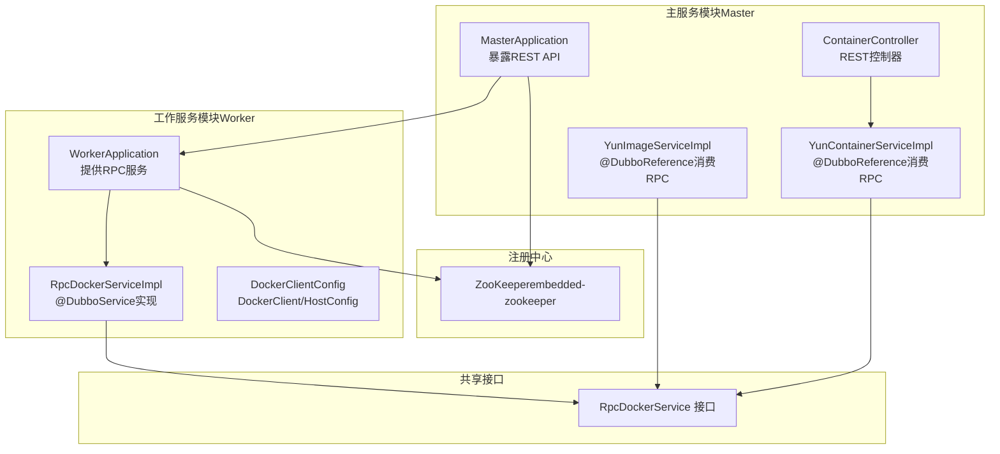
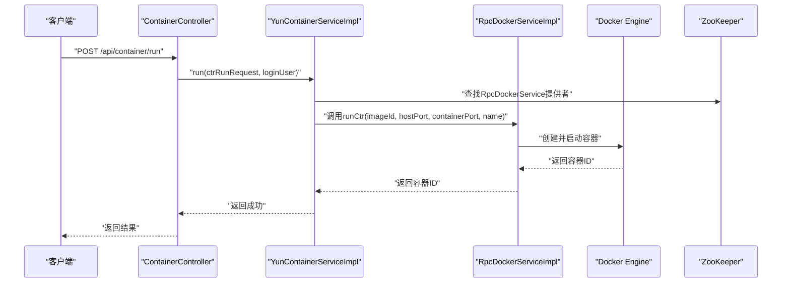
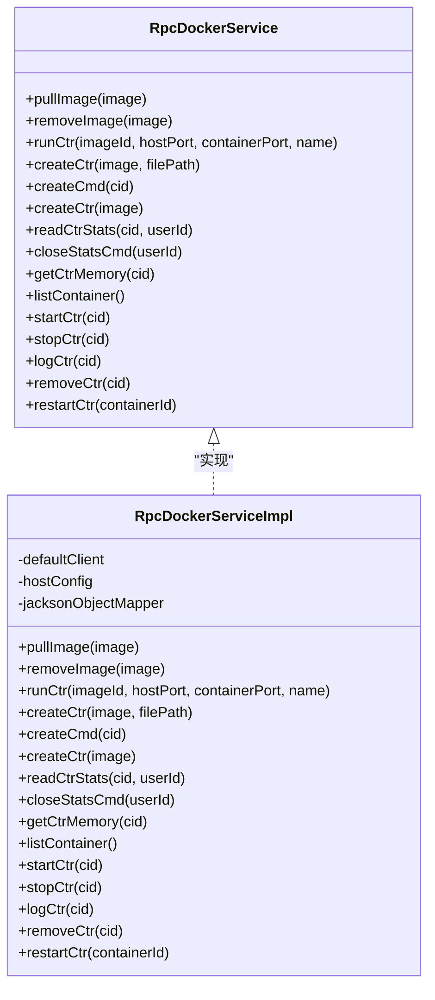
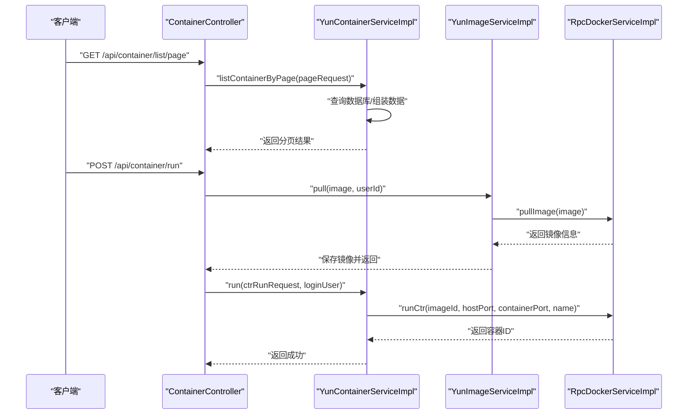
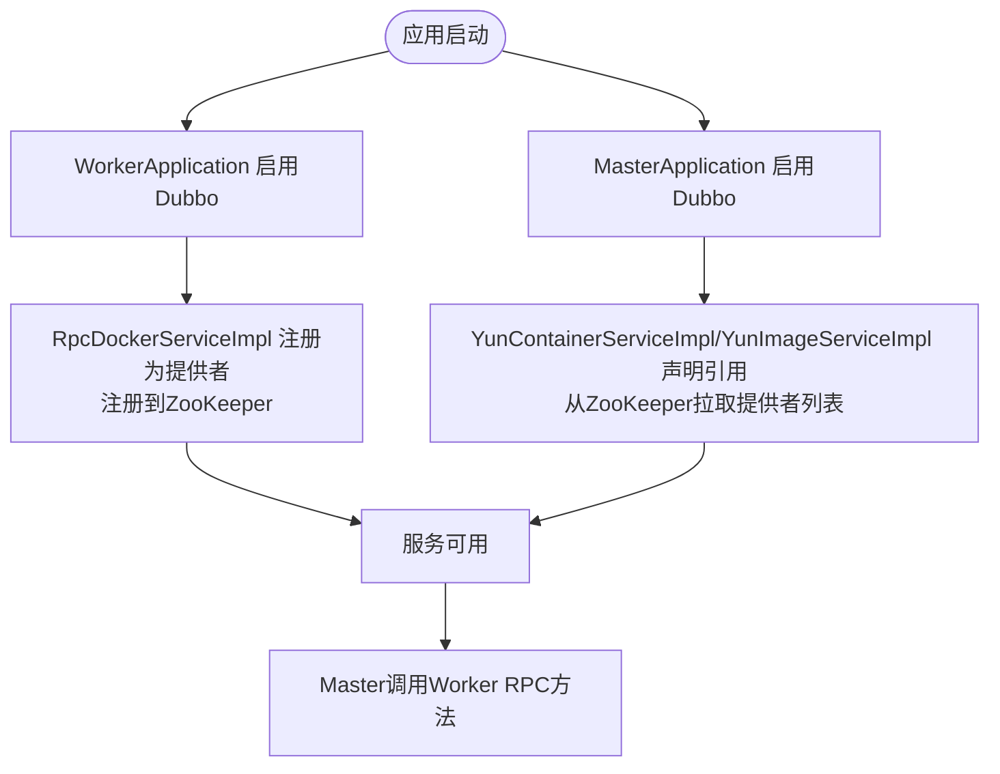
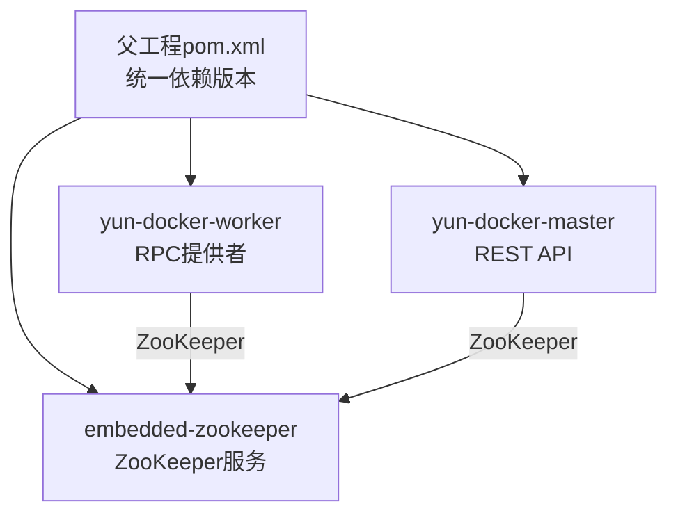

# 微服务架构

<cite>
**本文引用的文件**
- [MasterApplication.java](file://yun-docker-master/src/main/java/com/lfc/yundocker/MasterApplication.java)
- [WorkerApplication.java](file://yun-docker-worker/src/main/java/com/lfc/yundocker/worker/WorkerApplication.java)
- [RpcDockerService.java](file://yun-docker-api/src/main/java/com/lfc/yundocker/service/RpcDockerService.java)
- [RpcDockerServiceImpl.java](file://yun-docker-worker/src/main/java/com/lfc/yundocker/worker/rpc/RpcDockerServiceImpl.java)
- [YunContainerServiceImpl.java](file://yun-docker-master/src/main/java/com/lfc/yundocker/service/impl/YunContainerServiceImpl.java)
- [YunImageServiceImpl.java](file://yun-docker-master/src/main/java/com/lfc/yundocker/service/impl/YunImageServiceImpl.java)
- [ContainerController.java](file://yun-docker-master/src/main/java/com/lfc/yundocker/controller/ContainerController.java)
- [application.yml（Master）](file://yun-docker-master/src/main/resources/application.yml)
- [application.yml（Worker）](file://yun-docker-worker/src/main/resources/application.yml)
- [application-dev.yml（Master）](file://yun-docker-master/src/main/resources/application-dev.yml)
- [application-dev.yml（Worker）](file://yun-docker-worker/src/main/resources/application-dev.yml)
- [DockerClientConfig.java](file://yun-docker-worker/src/main/java/com/lfc/yundocker/worker/config/DockerClientConfig.java)
- [EmbeddedZooKeeper.java](file://embedded-zookeeper/src/main/java/com/lfc/zookeeper/EmbeddedZooKeeper.java)
- [pom.xml（父工程）](file://pom.xml)
- [pom.xml（Worker模块）](file://yun-docker-worker/pom.xml)
- [EmbeddedZooKeeper.java（embedded-zookeeper）](file://embedded-zookeeper/src/main/java/com/lfc/zookeeper/EmbeddedZooKeeper.java)
- [EmbeddedZooKeeper.pom.xml](file://embedded-zookeeper/pom.xml)
</cite>

## 目录
1. [引言](#引言)
2. [项目结构](#项目结构)
3. [核心组件](#核心组件)
4. [架构总览](#架构总览)
5. [详细组件分析](#详细组件分析)
6. [依赖分析](#依赖分析)
7. [性能考虑](#性能考虑)
8. [故障排查指南](#故障排查指南)
9. [结论](#结论)
10. [附录](#附录)

## 引言
本文件深入解析 yun-docker-backend 的微服务架构设计，重点围绕基于 Apache Dubbo 的 RPC 服务治理与 ZooKeeper 注册中心的协同工作。文档说明 MasterApplication 与 WorkerApplication 如何通过 @EnableDubbo 注解启用 Dubbo，实现服务提供者与消费者的双向通信；详解 application.yml 中 dubbo 配置项（如 application name、protocol port、consumer timeout）对服务调用行为的影响；并结合代码说明主服务暴露 REST API 并消费 Worker 的 RPC 服务，Worker 作为 Dubbo 服务提供者注册自身服务到 ZooKeeper 的过程。最后给出服务注册发现流程图、服务调用链路（Master 通过 RpcDockerService 接口调用 Worker 的 RpcDockerServiceImpl 实现），讨论该架构在服务解耦、可扩展性方面的优势，并给出服务版本管理、超时重试等 Dubbo 高级配置的最佳实践建议。

## 项目结构
该项目采用多模块 Maven 结构，包含通用模块、API 接口模块、主服务模块（Master）、工作服务模块（Worker）以及嵌入式 ZooKeeper 模块。核心关系如下：
- yun-docker-api：定义 RpcDockerService 接口，供 Master 与 Worker 共享。
- yun-docker-master：提供 REST API，内部通过 @DubboReference 消费 Worker 的 RPC 服务。
- yun-docker-worker：实现 RpcDockerService，作为 Dubbo 服务提供者，同时注入 DockerClient 与 HostConfig。
- embedded-zookeeper：提供嵌入式 ZooKeeper 服务，便于开发测试环境快速启动。

图表来源
- [MasterApplication.java](file://yun-docker-master/src/main/java/com/lfc/yundocker/MasterApplication.java#L1-L25)
- [WorkerApplication.java](file://yun-docker-worker/src/main/java/com/lfc/yundocker/worker/WorkerApplication.java#L1-L23)
- [RpcDockerService.java](file://yun-docker-api/src/main/java/com/lfc/yundocker/service/RpcDockerService.java#L1-L143)
- [RpcDockerServiceImpl.java](file://yun-docker-worker/src/main/java/com/lfc/yundocker/worker/rpc/RpcDockerServiceImpl.java#L1-L120)
- [YunContainerServiceImpl.java](file://yun-docker-master/src/main/java/com/lfc/yundocker/service/impl/YunContainerServiceImpl.java#L40-L70)
- [YunImageServiceImpl.java](file://yun-docker-master/src/main/java/com/lfc/yundocker/service/impl/YunImageServiceImpl.java#L1-L40)
- [DockerClientConfig.java](file://yun-docker-worker/src/main/java/com/lfc/yundocker/worker/config/DockerClientConfig.java#L1-L31)
- [EmbeddedZooKeeper.java](file://embedded-zookeeper/src/main/java/com/lfc/zookeeper/EmbeddedZooKeeper.java#L1-L41)

章节来源
- [MasterApplication.java](file://yun-docker-master/src/main/java/com/lfc/yundocker/MasterApplication.java#L1-L25)
- [WorkerApplication.java](file://yun-docker-worker/src/main/java/com/lfc/yundocker/worker/WorkerApplication.java#L1-L23)
- [pom.xml（父工程）](file://pom.xml#L1-L166)

## 核心组件
- MasterApplication：启用 Dubbo、MyBatis、WebSocket、定时任务等能力，作为 REST API 提供者。
- WorkerApplication：启用 Dubbo、WebSocket、AOP 等能力，作为 RPC 服务提供者。
- RpcDockerService：定义容器与镜像操作的 RPC 接口契约。
- RpcDockerServiceImpl：在 Worker 中实现 RpcDockerService，对接 Docker Java 客户端。
- YunContainerServiceImpl / YunImageServiceImpl：在 Master 中消费 RpcDockerService，完成容器运行、镜像拉取等业务编排。
- ContainerController：对外暴露 REST API，处理用户请求并调用 Master 侧服务。
- application.yml 与 application-dev.yml：配置 Dubbo 应用名、协议端口、消费者超时、注册中心地址等。
- DockerClientConfig：在 Worker 中装配 DockerClient 与 HostConfig。
- EmbeddedZooKeeper：嵌入式 ZooKeeper，便于本地开发测试。

章节来源
- [MasterApplication.java](file://yun-docker-master/src/main/java/com/lfc/yundocker/MasterApplication.java#L1-L25)
- [WorkerApplication.java](file://yun-docker-worker/src/main/java/com/lfc/yundocker/worker/WorkerApplication.java#L1-L23)
- [RpcDockerService.java](file://yun-docker-api/src/main/java/com/lfc/yundocker/service/RpcDockerService.java#L1-L143)
- [RpcDockerServiceImpl.java](file://yun-docker-worker/src/main/java/com/lfc/yundocker/worker/rpc/RpcDockerServiceImpl.java#L1-L120)
- [YunContainerServiceImpl.java](file://yun-docker-master/src/main/java/com/lfc/yundocker/service/impl/YunContainerServiceImpl.java#L40-L70)
- [YunImageServiceImpl.java](file://yun-docker-master/src/main/java/com/lfc/yundocker/service/impl/YunImageServiceImpl.java#L1-L40)
- [ContainerController.java](file://yun-docker-master/src/main/java/com/lfc/yundocker/controller/ContainerController.java#L1-L173)
- [application.yml（Master）](file://yun-docker-master/src/main/resources/application.yml#L1-L60)
- [application.yml（Worker）](file://yun-docker-worker/src/main/resources/application.yml#L1-L51)
- [application-dev.yml（Master）](file://yun-docker-master/src/main/resources/application-dev.yml#L1-L81)
- [application-dev.yml（Worker）](file://yun-docker-worker/src/main/resources/application-dev.yml#L1-L65)
- [DockerClientConfig.java](file://yun-docker-worker/src/main/java/com/lfc/yundocker/worker/config/DockerClientConfig.java#L1-L31)
- [EmbeddedZooKeeper.java](file://embedded-zookeeper/src/main/java/com/lfc/zookeeper/EmbeddedZooKeeper.java#L1-L41)

## 架构总览
该系统采用“主服务（Master）+ 工作服务（Worker）+ 注册中心（ZooKeeper）”的微服务架构：
- Master 暴露 REST API，负责用户交互与业务编排；通过 @DubboReference 消费 Worker 的 RpcDockerService。
- Worker 作为 Dubbo 服务提供者，实现容器生命周期管理、镜像拉取、日志与统计等 Docker 操作；通过 @DubboService 暴露服务。
- 注册中心使用 ZooKeeper，地址在 application-dev.yml 中通过占位符指向本地或外部 ZooKeeper。
- Docker 操作通过 DockerClientConfig 注入 DockerClient 与 HostConfig，Worker 侧直接调用 Docker API。

图表来源
- [ContainerController.java](file://yun-docker-master/src/main/java/com/lfc/yundocker/controller/ContainerController.java#L110-L133)
- [YunContainerServiceImpl.java](file://yun-docker-master/src/main/java/com/lfc/yundocker/service/impl/YunContainerServiceImpl.java#L136-L200)
- [RpcDockerServiceImpl.java](file://yun-docker-worker/src/main/java/com/lfc/yundocker/worker/rpc/RpcDockerServiceImpl.java#L80-L110)
- [application-dev.yml（Master）](file://yun-docker-master/src/main/resources/application-dev.yml#L9-L12)
- [application-dev.yml（Worker）](file://yun-docker-worker/src/main/resources/application-dev.yml#L7-L10)

## 详细组件分析

### 组件一：MasterApplication 与 WorkerApplication 的 Dubbo 启用
- MasterApplication 与 WorkerApplication 分别通过 @EnableDubbo 启用 Dubbo 能力，配合各自 application.yml 中的 dubbo 配置，完成服务注册与发现。
- MasterApplication 还启用了 MyBatis、WebSocket、定时任务与 AOP，作为 REST API 提供者。
- WorkerApplication 启用了 WebSocket、AOP 与组件扫描，作为 RPC 服务提供者。

章节来源
- [MasterApplication.java](file://yun-docker-master/src/main/java/com/lfc/yundocker/MasterApplication.java#L1-L25)
- [WorkerApplication.java](file://yun-docker-worker/src/main/java/com/lfc/yundocker/worker/WorkerApplication.java#L1-L23)

### 组件二：RpcDockerService 接口与 RpcDockerServiceImpl 实现
- RpcDockerService 定义了镜像与容器操作的 RPC 方法集合，包括拉取镜像、删除镜像、创建/运行/启动/停止/重启/删除容器、查看日志、读取统计等。
- RpcDockerServiceImpl 在 Worker 中实现上述方法，内部使用 DockerClient 执行具体 Docker 操作，并通过 WebSocket 推送统计信息。

图表来源
- [RpcDockerService.java](file://yun-docker-api/src/main/java/com/lfc/yundocker/service/RpcDockerService.java#L1-L143)
- [RpcDockerServiceImpl.java](file://yun-docker-worker/src/main/java/com/lfc/yundocker/worker/rpc/RpcDockerServiceImpl.java#L1-L120)

章节来源
- [RpcDockerService.java](file://yun-docker-api/src/main/java/com/lfc/yundocker/service/RpcDockerService.java#L1-L143)
- [RpcDockerServiceImpl.java](file://yun-docker-worker/src/main/java/com/lfc/yundocker/worker/rpc/RpcDockerServiceImpl.java#L1-L120)

### 组件三：Master 侧服务消费与 REST API 暴露
- ContainerController 暴露 REST API，接收用户请求并调用 Master 侧服务。
- YunContainerServiceImpl 通过 @DubboReference 消费 RpcDockerService，完成容器运行、启动/停止、重启、删除、日志下载等操作。
- YunImageServiceImpl 通过 @DubboReference 消费 RpcDockerService，完成镜像拉取与删除。

图表来源
- [ContainerController.java](file://yun-docker-master/src/main/java/com/lfc/yundocker/controller/ContainerController.java#L1-L173)
- [YunContainerServiceImpl.java](file://yun-docker-master/src/main/java/com/lfc/yundocker/service/impl/YunContainerServiceImpl.java#L136-L200)
- [YunImageServiceImpl.java](file://yun-docker-master/src/main/java/com/lfc/yundocker/service/impl/YunImageServiceImpl.java#L1-L85)
- [RpcDockerServiceImpl.java](file://yun-docker-worker/src/main/java/com/lfc/yundocker/worker/rpc/RpcDockerServiceImpl.java#L80-L110)

章节来源
- [ContainerController.java](file://yun-docker-master/src/main/java/com/lfc/yundocker/controller/ContainerController.java#L1-L173)
- [YunContainerServiceImpl.java](file://yun-docker-master/src/main/java/com/lfc/yundocker/service/impl/YunContainerServiceImpl.java#L40-L70)
- [YunImageServiceImpl.java](file://yun-docker-master/src/main/java/com/lfc/yundocker/service/impl/YunImageServiceImpl.java#L1-L85)

### 组件四：Worker 侧 Docker 客户端装配与服务提供
- DockerClientConfig 在 Worker 中装配 DockerClient 与 HostConfig，供 RpcDockerServiceImpl 使用。
- WorkerApplication 通过 @EnableDubbo 与 application.yml 中的 dubbo.registry.address 指向 ZooKeeper，完成服务注册与发现。

章节来源
- [DockerClientConfig.java](file://yun-docker-worker/src/main/java/com/lfc/yundocker/worker/config/DockerClientConfig.java#L1-L31)
- [WorkerApplication.java](file://yun-docker-worker/src/main/java/com/lfc/yundocker/worker/WorkerApplication.java#L1-L23)
- [application-dev.yml（Worker）](file://yun-docker-worker/src/main/resources/application-dev.yml#L1-L10)

### 组件五：服务注册与发现流程
- Worker 启动时，RpcDockerServiceImpl 通过 @DubboService 注册为服务提供者，注册到 ZooKeeper。
- Master 启动时，YunContainerServiceImpl 与 YunImageServiceImpl 通过 @DubboReference 声明消费 RpcDockerService，从 ZooKeeper 拉取提供者列表并建立连接。

图表来源
- [MasterApplication.java](file://yun-docker-master/src/main/java/com/lfc/yundocker/MasterApplication.java#L1-L25)
- [WorkerApplication.java](file://yun-docker-worker/src/main/java/com/lfc/yundocker/worker/WorkerApplication.java#L1-L23)
- [RpcDockerServiceImpl.java](file://yun-docker-worker/src/main/java/com/lfc/yundocker/worker/rpc/RpcDockerServiceImpl.java#L1-L40)
- [YunContainerServiceImpl.java](file://yun-docker-master/src/main/java/com/lfc/yundocker/service/impl/YunContainerServiceImpl.java#L40-L70)
- [YunImageServiceImpl.java](file://yun-docker-master/src/main/java/com/lfc/yundocker/service/impl/YunImageServiceImpl.java#L1-L40)
- [application-dev.yml（Master）](file://yun-docker-master/src/main/resources/application-dev.yml#L9-L12)
- [application-dev.yml（Worker）](file://yun-docker-worker/src/main/resources/application-dev.yml#L7-L10)

## 依赖分析
- 父工程 pom.xml 管理 Dubbo、MyBatis Plus、Docker Java 等依赖版本，确保各模块一致性。
- Worker 模块引入 dubbo-spring-boot-starter 与 dubbo-dependencies-zookeeper-curator5，启用 Dubbo 与 ZooKeeper 集成。
- embedded-zookeeper 提供嵌入式 ZooKeeper，便于本地开发测试。

图表来源
- [pom.xml（父工程）](file://pom.xml#L1-L166)
- [pom.xml（Worker模块）](file://yun-docker-worker/pom.xml#L29-L60)
- [EmbeddedZooKeeper.pom.xml](file://embedded-zookeeper/pom.xml#L1-L104)

章节来源
- [pom.xml（父工程）](file://pom.xml#L1-L166)
- [pom.xml（Worker模块）](file://yun-docker-worker/pom.xml#L29-L60)
- [EmbeddedZooKeeper.pom.xml](file://embedded-zookeeper/pom.xml#L1-L104)

## 性能考虑
- 超时与重试：Master 的 application.yml 中设置了 consumer.timeout 与 retries，影响 RPC 调用的超时与重试策略。建议根据业务场景调整，避免过短导致频繁超时，或过长导致资源占用。
- 协议端口：protocol.port 设为 -1 表示随机端口，适合多实例部署；若固定端口，需注意端口冲突与负载均衡。
- Docker 操作：Worker 侧大量 Docker API 调用可能成为性能瓶颈，建议：
  - 合理设置容器资源限制（内存、CPU）。
  - 对高频操作（如日志、统计）采用异步回调与缓存策略。
  - 对镜像拉取与容器创建进行并发控制与队列化。

章节来源
- [application.yml（Master）](file://yun-docker-master/src/main/resources/application.yml#L1-L60)
- [RpcDockerServiceImpl.java](file://yun-docker-worker/src/main/java/com/lfc/yundocker/worker/rpc/RpcDockerServiceImpl.java#L190-L278)

## 故障排查指南
- 注册中心不可用：检查 application-dev.yml 中 dubbo.registry.address 是否正确指向 ZooKeeper 地址。
- RPC 调用超时：检查 Master 的 consumer.timeout 设置，必要时在业务层增加重试与降级策略。
- Docker 连接异常：检查 Worker 的 docker.server.url 是否可达，Docker 服务状态是否正常。
- WebSocket 推送失败：关注 Worker 侧 readCtrStats 的回调与异常处理，确保消息序列化与发送路径正确。

章节来源
- [application-dev.yml（Master）](file://yun-docker-master/src/main/resources/application-dev.yml#L9-L12)
- [application-dev.yml（Worker）](file://yun-docker-worker/src/main/resources/application-dev.yml#L3-L6)
- [RpcDockerServiceImpl.java](file://yun-docker-worker/src/main/java/com/lfc/yundocker/worker/rpc/RpcDockerServiceImpl.java#L190-L278)

## 结论
该架构通过 Dubbo 与 ZooKeeper 实现了清晰的服务边界与解耦：Master 负责 REST API 与业务编排，Worker 负责底层 Docker 操作与资源调度。通过 @EnableDubbo、@DubboReference 与 @DubboService 的注解体系，系统实现了服务提供者与消费者的自动注册与发现。在可扩展性方面，模块化设计与 ZooKeeper 注册中心使得服务扩容与灰度发布具备良好基础。建议在生产环境中进一步完善服务版本管理、超时重试、熔断降级与可观测性配置，以提升系统的稳定性与可维护性。

## 附录

### Dubbo 高级配置最佳实践
- 版本管理：为 RpcDockerService 接口与实现配置版本号，便于灰度发布与平滑升级。
- 超时与重试：根据业务特性设置合理的 consumer.timeout 与 retries；对幂等操作可适当放宽重试。
- 负载均衡：在 Master 侧配置负载均衡策略（如随机、轮询、最少活跃等），提升吞吐与稳定性。
- 熔断降级：对 Docker 操作设置熔断策略，避免雪崩效应；在 Worker 侧增加限流与隔离舱。
- 监控与追踪：接入 Prometheus、Zipkin 或 SkyWalking，采集 Dubbo 调用指标与链路追踪信息。

章节来源
- [application.yml（Master）](file://yun-docker-master/src/main/resources/application.yml#L1-L60)
- [RpcDockerService.java](file://yun-docker-api/src/main/java/com/lfc/yundocker/service/RpcDockerService.java#L1-L143)
- [RpcDockerServiceImpl.java](file://yun-docker-worker/src/main/java/com/lfc/yundocker/worker/rpc/RpcDockerServiceImpl.java#L1-L120)