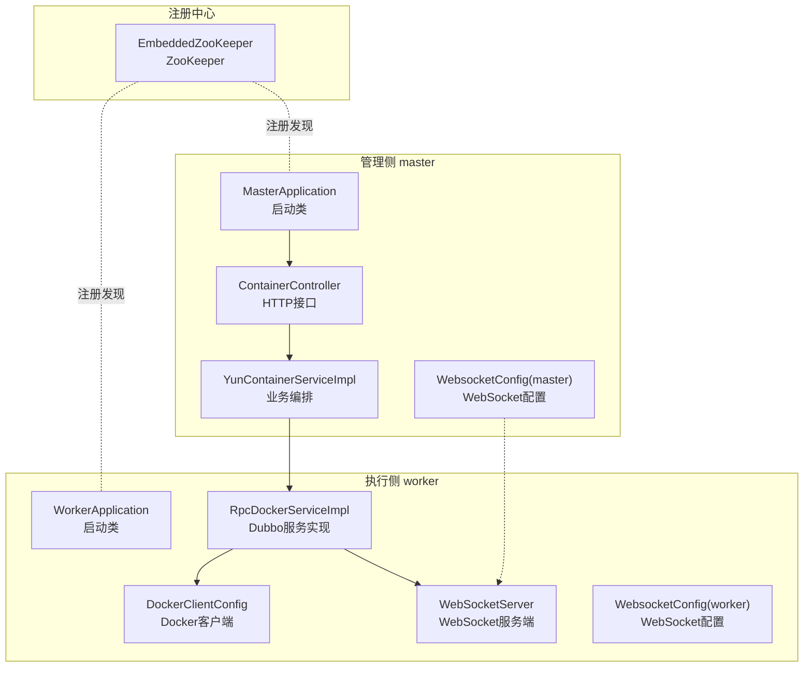
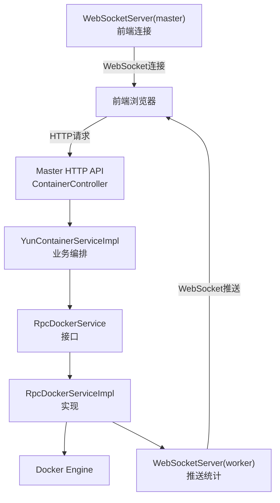
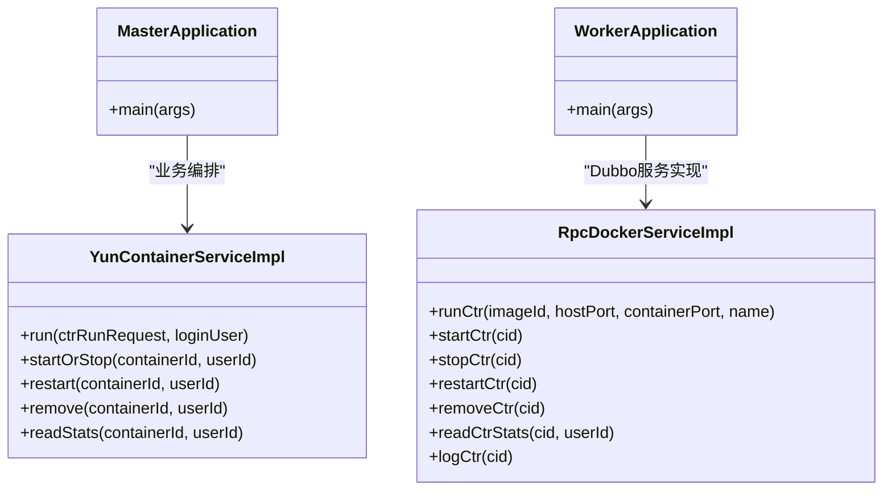
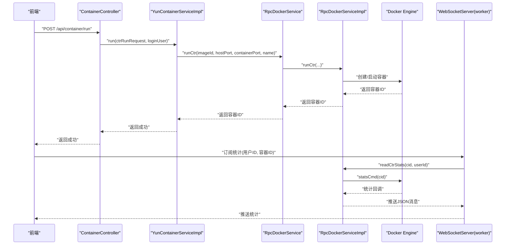
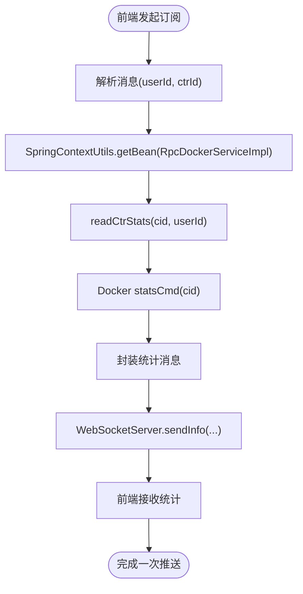
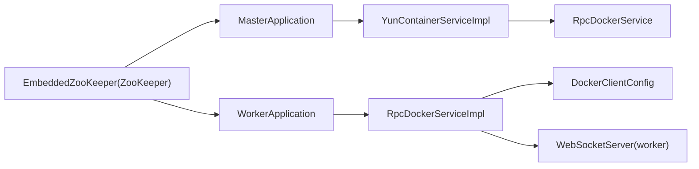

# 系统架构

<cite>
**本文引用的文件**
- [MasterApplication.java](file://yun-docker-master/src/main/java/com/lfc/yundocker/MasterApplication.java)
- [WorkerApplication.java](file://yun-docker-worker/src/main/java/com/lfc/yundocker/worker/WorkerApplication.java)
- [RpcDockerService.java](file://yun-docker-api/src/main/java/com/lfc/yundocker/service/RpcDockerService.java)
- [RpcDockerServiceImpl.java](file://yun-docker-worker/src/main/java/com/lfc/yundocker/worker/rpc/RpcDockerServiceImpl.java)
- [WebSocketServer.java](file://yun-docker-worker/src/main/java/com/lfc/yundocker/worker/websocket/WebSocketServer.java)
- [DockerClientConfig.java](file://yun-docker-worker/src/main/java/com/lfc/yundocker/worker/config/DockerClientConfig.java)
- [WebsocketConfig.java（master）](file://yun-docker-master/src/main/java/com/lfc/yundocker/config/WebsocketConfig.java)
- [WebsocketConfig.java（worker）](file://yun-docker-worker/src/main/java/com/lfc/yundocker/worker/config/WebsocketConfig.java)
- [application.yml（master）](file://yun-docker-master/src/main/resources/application.yml)
- [application.yml（worker）](file://yun-docker-worker/src/main/resources/application.yml)
- [application-dev.yml（master）](file://yun-docker-master/src/main/resources/application-dev.yml)
- [application-dev.yml（worker）](file://yun-docker-worker/src/main/resources/application-dev.yml)
- [EmbeddedZooKeeper.java](file://embedded-zookeeper/src/main/java/com/lfc/zookeeper/EmbeddedZooKeeper.java)
- [ContainerController.java](file://yun-docker-master/src/main/java/com/lfc/yundocker/controller/ContainerController.java)
- [YunContainerServiceImpl.java](file://yun-docker-master/src/main/java/com/lfc/yundocker/service/impl/YunContainerServiceImpl.java)
</cite>

## 目录
1. [引言](#引言)
2. [项目结构](#项目结构)
3. [核心组件](#核心组件)
4. [架构总览](#架构总览)
5. [详细组件分析](#详细组件分析)
6. [依赖关系分析](#依赖关系分析)
7. [性能与可扩展性](#性能与可扩展性)
8. [故障排查指南](#故障排查指南)
9. [结论](#结论)
10. [附录](#附录)

## 引言
本文件面向yun-docker-backend的微服务主从架构，系统采用Master（管理侧）与Worker（执行侧）分离设计。Master负责业务编排、鉴权与Dubbo RPC调用，Worker负责与Docker Engine交互、执行容器生命周期操作，并通过WebSocket向前端推送实时指标。本文将系统化梳理启动类初始化的关键组件、Dubbo RPC命令下发与结果返回的数据流、WebSocket全链路闭环、配置项作用与可扩展性考量，并提供可视化图示帮助理解。

## 项目结构
- 模块划分
  - yun-docker-master：管理侧，提供HTTP API、Dubbo消费端、WebSocket服务端（管理端）、业务服务与控制器。
  - yun-docker-worker：执行侧，提供Dubbo服务端、Docker客户端、WebSocket服务端（执行端）、RPC实现。
  - yun-docker-api：公共接口定义（RpcDockerService）。
  - yun-docker-common：通用常量、异常、工具与模型。
  - embedded-zookeeper：嵌入式ZooKeeper，用于开发环境注册中心。
- 关键启动类
  - MasterApplication：启用Dubbo、MyBatis Mapper扫描、定时任务、WebSocket、AOP代理。
  - WorkerApplication：启用Dubbo、组件扫描、WebSocket、AOP代理。

图表来源
- [MasterApplication.java](file://yun-docker-master/src/main/java/com/lfc/yundocker/MasterApplication.java#L1-L25)
- [WorkerApplication.java](file://yun-docker-worker/src/main/java/com/lfc/yundocker/worker/WorkerApplication.java#L1-L23)
- [YunContainerServiceImpl.java](file://yun-docker-master/src/main/java/com/lfc/yundocker/service/impl/YunContainerServiceImpl.java#L1-L60)
- [RpcDockerServiceImpl.java](file://yun-docker-worker/src/main/java/com/lfc/yundocker/worker/rpc/RpcDockerServiceImpl.java#L1-L40)
- [DockerClientConfig.java](file://yun-docker-worker/src/main/java/com/lfc/yundocker/worker/config/DockerClientConfig.java#L1-L32)
- [WebSocketServer.java](file://yun-docker-worker/src/main/java/com/lfc/yundocker/worker/websocket/WebSocketServer.java#L1-L40)
- [WebsocketConfig.java（master）](file://yun-docker-master/src/main/java/com/lfc/yundocker/config/WebsocketConfig.java#L1-L20)
- [WebsocketConfig.java（worker）](file://yun-docker-worker/src/main/java/com/lfc/yundocker/worker/config/WebsocketConfig.java#L1-L20)
- [EmbeddedZooKeeper.java](file://embedded-zookeeper/src/main/java/com/lfc/zookeeper/EmbeddedZooKeeper.java#L1-L41)

章节来源
- [MasterApplication.java](file://yun-docker-master/src/main/java/com/lfc/yundocker/MasterApplication.java#L1-L25)
- [WorkerApplication.java](file://yun-docker-worker/src/main/java/com/lfc/yundocker/worker/WorkerApplication.java#L1-L23)

## 核心组件
- MasterApplication
  - 启用Dubbo、MyBatis Mapper扫描、定时任务、WebSocket、AOP代理。
  - 提供管理侧HTTP API入口与业务编排。
- WorkerApplication
  - 启用Dubbo、组件扫描、WebSocket、AOP代理。
  - 提供Dubbo服务端与Docker客户端连接。
- RpcDockerService
  - 定义容器生命周期、镜像管理、统计与日志等RPC接口。
- RpcDockerServiceImpl
  - 实现镜像拉取/删除、容器创建/启动/停止/重启/删除、统计采集与日志导出。
  - 通过WebSocket向前端推送统计消息。
- WebSocketServer（worker）
  - 基于@ServerEndpoint接收前端统计订阅，触发统计采集并推送。
- DockerClientConfig
  - 构建DockerClient与HostConfig，连接远端Docker Engine。
- WebsocketConfig（master/worker）
  - 暴露ServerEndpointExporter，启用WebSocket端点。

章节来源
- [MasterApplication.java](file://yun-docker-master/src/main/java/com/lfc/yundocker/MasterApplication.java#L1-L25)
- [WorkerApplication.java](file://yun-docker-worker/src/main/java/com/lfc/yundocker/worker/WorkerApplication.java#L1-L23)
- [RpcDockerService.java](file://yun-docker-api/src/main/java/com/lfc/yundocker/service/RpcDockerService.java#L1-L143)
- [RpcDockerServiceImpl.java](file://yun-docker-worker/src/main/java/com/lfc/yundocker/worker/rpc/RpcDockerServiceImpl.java#L1-L120)
- [WebSocketServer.java](file://yun-docker-worker/src/main/java/com/lfc/yundocker/worker/websocket/WebSocketServer.java#L1-L60)
- [DockerClientConfig.java](file://yun-docker-worker/src/main/java/com/lfc/yundocker/worker/config/DockerClientConfig.java#L1-L32)
- [WebsocketConfig.java（master）](file://yun-docker-master/src/main/java/com/lfc/yundocker/config/WebsocketConfig.java#L1-L20)
- [WebsocketConfig.java（worker）](file://yun-docker-worker/src/main/java/com/lfc/yundocker/worker/config/WebsocketConfig.java#L1-L20)

## 架构总览
系统采用“管理侧（Master）+ 执行侧（Worker）+ 注册中心（ZooKeeper）”的主从架构：
- Master负责对外HTTP API、业务编排与鉴权，内部通过Dubbo调用Worker提供的RpcDockerService。
- Worker负责与Docker Engine交互，执行容器生命周期操作，并通过WebSocket向前端推送实时指标。
- 注册中心（ZooKeeper）用于Dubbo服务注册与发现，支持动态扩缩容与高可用。

图表来源
- [ContainerController.java](file://yun-docker-master/src/main/java/com/lfc/yundocker/controller/ContainerController.java#L1-L173)
- [YunContainerServiceImpl.java](file://yun-docker-master/src/main/java/com/lfc/yundocker/service/impl/YunContainerServiceImpl.java#L120-L216)
- [RpcDockerService.java](file://yun-docker-api/src/main/java/com/lfc/yundocker/service/RpcDockerService.java#L1-L143)
- [RpcDockerServiceImpl.java](file://yun-docker-worker/src/main/java/com/lfc/yundocker/worker/rpc/RpcDockerServiceImpl.java#L190-L278)
- [WebSocketServer.java](file://yun-docker-worker/src/main/java/com/lfc/yundocker/worker/websocket/WebSocketServer.java#L80-L120)

## 详细组件分析

### 组件A：MasterApplication与WorkerApplication启动类
- MasterApplication
  - 启用Dubbo、MyBatis Mapper扫描、定时任务、WebSocket、AOP代理。
  - 作为管理侧应用入口，承载HTTP API与业务编排。
- WorkerApplication
  - 启用Dubbo、组件扫描、WebSocket、AOP代理。
  - 作为执行侧应用入口，承载Dubbo服务与Docker客户端。

图表来源
- [MasterApplication.java](file://yun-docker-master/src/main/java/com/lfc/yundocker/MasterApplication.java#L1-L25)
- [WorkerApplication.java](file://yun-docker-worker/src/main/java/com/lfc/yundocker/worker/WorkerApplication.java#L1-L23)
- [YunContainerServiceImpl.java](file://yun-docker-master/src/main/java/com/lfc/yundocker/service/impl/YunContainerServiceImpl.java#L120-L216)
- [RpcDockerServiceImpl.java](file://yun-docker-worker/src/main/java/com/lfc/yundocker/worker/rpc/RpcDockerServiceImpl.java#L80-L120)

章节来源
- [MasterApplication.java](file://yun-docker-master/src/main/java/com/lfc/yundocker/MasterApplication.java#L1-L25)
- [WorkerApplication.java](file://yun-docker-worker/src/main/java/com/lfc/yundocker/worker/WorkerApplication.java#L1-L23)

### 组件B：Dubbo RPC命令下发与结果返回流程
- 请求路径
  - 前端 → Master HTTP API → 业务编排（YunContainerServiceImpl）→ Dubbo调用Worker RpcDockerService → Docker Engine。
- 结果路径
  - Docker Engine → Worker RpcDockerServiceImpl → WebSocket推送 → 前端。
- 关键流程序列

图表来源
- [ContainerController.java](file://yun-docker-master/src/main/java/com/lfc/yundocker/controller/ContainerController.java#L110-L133)
- [YunContainerServiceImpl.java](file://yun-docker-master/src/main/java/com/lfc/yundocker/service/impl/YunContainerServiceImpl.java#L136-L216)
- [RpcDockerService.java](file://yun-docker-api/src/main/java/com/lfc/yundocker/service/RpcDockerService.java#L1-L143)
- [RpcDockerServiceImpl.java](file://yun-docker-worker/src/main/java/com/lfc/yundocker/worker/rpc/RpcDockerServiceImpl.java#L80-L120)
- [WebSocketServer.java](file://yun-docker-worker/src/main/java/com/lfc/yundocker/worker/websocket/WebSocketServer.java#L90-L120)

章节来源
- [ContainerController.java](file://yun-docker-master/src/main/java/com/lfc/yundocker/controller/ContainerController.java#L110-L133)
- [YunContainerServiceImpl.java](file://yun-docker-master/src/main/java/com/lfc/yundocker/service/impl/YunContainerServiceImpl.java#L136-L216)
- [RpcDockerServiceImpl.java](file://yun-docker-worker/src/main/java/com/lfc/yundocker/worker/rpc/RpcDockerServiceImpl.java#L80-L120)
- [WebSocketServer.java](file://yun-docker-worker/src/main/java/com/lfc/yundocker/worker/websocket/WebSocketServer.java#L90-L120)

### 组件C：WebSocket全链路闭环
- 前端通过WebSocket连接管理端或执行端，发送订阅消息（包含用户ID与容器ID）。
- WebSocket服务端解析消息后，触发Worker的统计采集。
- Worker将统计结果通过WebSocket推送给前端。

图表来源
- [WebSocketServer.java](file://yun-docker-worker/src/main/java/com/lfc/yundocker/worker/websocket/WebSocketServer.java#L90-L120)
- [RpcDockerServiceImpl.java](file://yun-docker-worker/src/main/java/com/lfc/yundocker/worker/rpc/RpcDockerServiceImpl.java#L190-L278)

章节来源
- [WebSocketServer.java](file://yun-docker-worker/src/main/java/com/lfc/yundocker/worker/websocket/WebSocketServer.java#L90-L120)
- [RpcDockerServiceImpl.java](file://yun-docker-worker/src/main/java/com/lfc/yundocker/worker/rpc/RpcDockerServiceImpl.java#L190-L278)

### 组件D：配置文件与关键参数
- 管理侧（master）
  - application.yml：Dubbo应用名、协议端口（-1表示随机）、消费者超时与重试策略；Spring MVC路径匹配策略；Server监听地址/端口/context-path；Actuator监控端点。
  - application-dev.yml：Docker开放端口范围、Dubbo注册中心ZooKeeper地址（支持占位符zookeeper.address）。
- 执行侧（worker）
  - application.yml：Dubbo应用名、协议端口（-1）、Server监听地址/端口/context-path；Actuator监控端点。
  - application-dev.yml：Docker Engine TCP地址、Dubbo注册中心ZooKeeper地址（支持占位符zookeeper.address）。
- Docker客户端
  - DockerClientConfig：基于docker.server.url构建DockerClient与HostConfig。
- WebSocket
  - WebsocketConfig：暴露ServerEndpointExporter，启用@ServerEndpoint端点。

章节来源
- [application.yml（master）](file://yun-docker-master/src/main/resources/application.yml#L1-L60)
- [application-dev.yml（master）](file://yun-docker-master/src/main/resources/application-dev.yml#L1-L81)
- [application.yml（worker）](file://yun-docker-worker/src/main/resources/application.yml#L1-L51)
- [application-dev.yml（worker）](file://yun-docker-worker/src/main/resources/application-dev.yml#L1-L65)
- [DockerClientConfig.java](file://yun-docker-worker/src/main/java/com/lfc/yundocker/worker/config/DockerClientConfig.java#L1-L32)
- [WebsocketConfig.java（master）](file://yun-docker-master/src/main/java/com/lfc/yundocker/config/WebsocketConfig.java#L1-L20)
- [WebsocketConfig.java（worker）](file://yun-docker-worker/src/main/java/com/lfc/yundocker/worker/config/WebsocketConfig.java#L1-L20)

## 依赖关系分析
- 启动类依赖
  - MasterApplication与WorkerApplication分别启用Dubbo、WebSocket、AOP与Mapper扫描。
- 业务依赖
  - YunContainerServiceImpl通过@DubboReference注入RpcDockerService，实现对Worker的远程调用。
- 执行依赖
  - RpcDockerServiceImpl持有DockerClient与HostConfig，直接与Docker Engine交互。
- 注册中心
  - ZooKeeper作为Dubbo注册中心，通过application-dev.yml中的zookeeper.address占位符动态配置。

图表来源
- [MasterApplication.java](file://yun-docker-master/src/main/java/com/lfc/yundocker/MasterApplication.java#L1-L25)
- [WorkerApplication.java](file://yun-docker-worker/src/main/java/com/lfc/yundocker/worker/WorkerApplication.java#L1-L23)
- [YunContainerServiceImpl.java](file://yun-docker-master/src/main/java/com/lfc/yundocker/service/impl/YunContainerServiceImpl.java#L50-L60)
- [RpcDockerServiceImpl.java](file://yun-docker-worker/src/main/java/com/lfc/yundocker/worker/rpc/RpcDockerServiceImpl.java#L1-L40)
- [DockerClientConfig.java](file://yun-docker-worker/src/main/java/com/lfc/yundocker/worker/config/DockerClientConfig.java#L1-L32)
- [EmbeddedZooKeeper.java](file://embedded-zookeeper/src/main/java/com/lfc/zookeeper/EmbeddedZooKeeper.java#L1-L41)

章节来源
- [YunContainerServiceImpl.java](file://yun-docker-master/src/main/java/com/lfc/yundocker/service/impl/YunContainerServiceImpl.java#L50-L60)
- [RpcDockerServiceImpl.java](file://yun-docker-worker/src/main/java/com/lfc/yundocker/worker/rpc/RpcDockerServiceImpl.java#L1-L40)
- [EmbeddedZooKeeper.java](file://embedded-zookeeper/src/main/java/com/lfc/zookeeper/EmbeddedZooKeeper.java#L1-L41)

## 性能与可扩展性
- 可扩展性
  - Worker可水平扩展：多实例部署，共享ZooKeeper注册中心，Master通过Dubbo自动负载均衡。
  - Docker Engine可独立扩展：Worker连接远端Docker Engine，便于横向扩展与资源隔离。
- 容错性
  - Dubbo消费者超时与重试策略（master配置）可降低瞬时故障影响。
  - WebSocket连接断开时，Worker在关闭回调中清理统计命令，避免资源泄漏。
- 性能优化建议
  - 统计采集采用异步回调，避免阻塞主线程。
  - Docker日志导出采用临时文件落盘再读取，减少内存占用。
  - 建议引入限流与熔断（如Sentinel），在高并发场景保护Worker。
  - 建议对ZooKeeper与Docker Engine增加健康检查与自动重连机制。

[本节为通用指导，无需列出具体文件来源]

## 故障排查指南
- WebSocket无法推送
  - 检查WebSocket端点是否正确暴露（WebsocketConfig）。
  - 检查前端userId与WebSocket路径是否一致。
  - 检查Worker端onClose回调是否触发并调用closeStatsCmd。
- Docker Engine连接失败
  - 检查docker.server.url配置是否正确。
  - 确认Docker Engine已开启TCP监听并允许访问。
- Dubbo调用超时
  - 检查master端consumer超时与重试配置。
  - 检查ZooKeeper注册中心是否可用。
- 统计采集异常
  - 检查statsCmd回调中的异常处理与日志输出。
  - 某些容器（如Redis）可能因网络或权限导致统计失败，需单独处理。

章节来源
- [WebsocketConfig.java（worker）](file://yun-docker-worker/src/main/java/com/lfc/yundocker/worker/config/WebsocketConfig.java#L1-L20)
- [WebSocketServer.java](file://yun-docker-worker/src/main/java/com/lfc/yundocker/worker/websocket/WebSocketServer.java#L70-L120)
- [DockerClientConfig.java](file://yun-docker-worker/src/main/java/com/lfc/yundocker/worker/config/DockerClientConfig.java#L1-L32)
- [application-dev.yml（master）](file://yun-docker-master/src/main/resources/application-dev.yml#L1-L81)
- [application-dev.yml（worker）](file://yun-docker-worker/src/main/resources/application-dev.yml#L1-L65)
- [RpcDockerServiceImpl.java](file://yun-docker-worker/src/main/java/com/lfc/yundocker/worker/rpc/RpcDockerServiceImpl.java#L190-L278)

## 结论
yun-docker-backend采用清晰的主从架构：Master专注于业务编排与HTTP API，Worker专注容器生命周期与实时监控。通过Dubbo实现稳定的服务治理与注册发现，通过WebSocket实现前后端实时数据闭环。该架构具备良好的可扩展性与容错性，适合在多Worker与多容器场景下演进。

[本节为总结性内容，无需列出具体文件来源]

## 附录
- 关键配置项说明
  - docker.server.url：Docker Engine TCP地址，用于Worker连接远端Docker。
  - dubbo.registry.address：ZooKeeper地址，用于Dubbo注册与发现。
  - server.address/port/context-path：服务监听地址、端口与上下文路径。
  - dubbo.application.name：Dubbo应用名，区分master与worker。
  - dubbo.consumer.timeout/retries：消费者超时与重试策略。
- 开发与生产环境差异
  - 开发环境通过application-dev.yml覆盖默认配置，生产环境可通过application-prod.yml切换。
- 注册中心
  - embedded-zookeeper提供嵌入式ZooKeeper，便于本地开发测试。

[本节为概览性内容，无需列出具体文件来源]