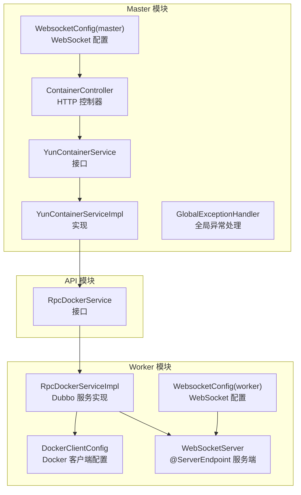
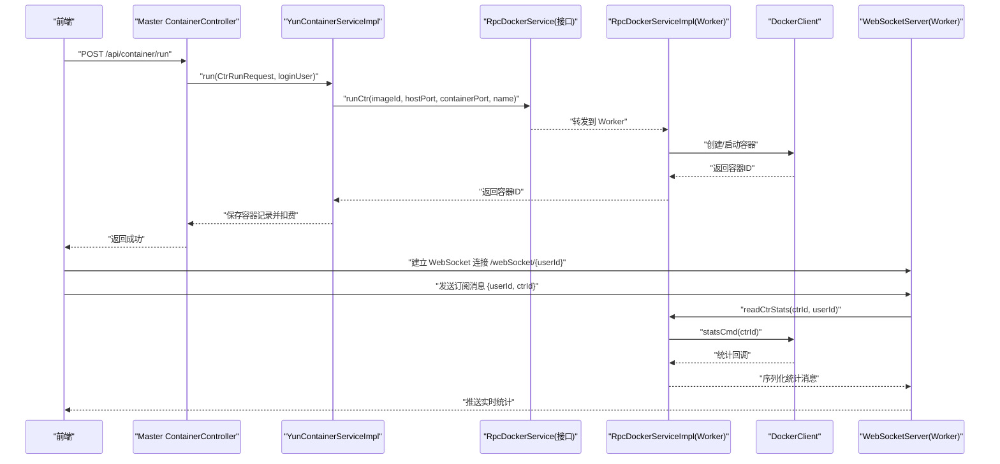
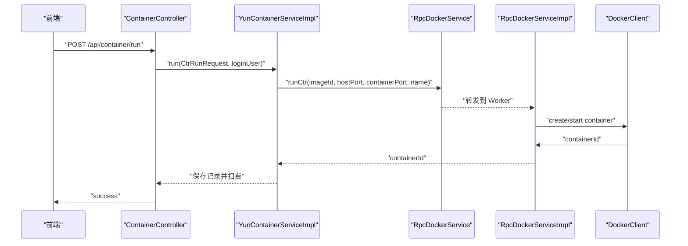
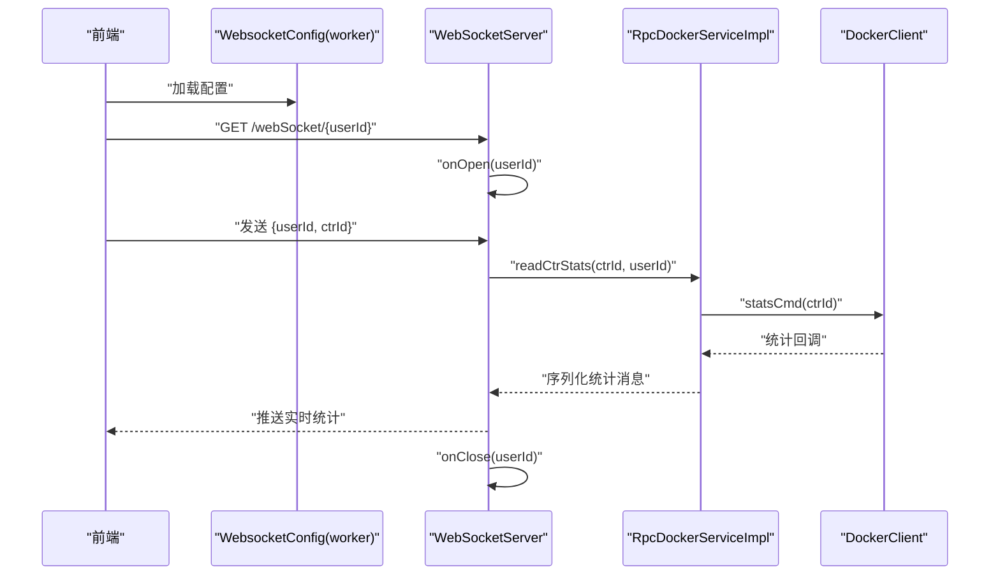
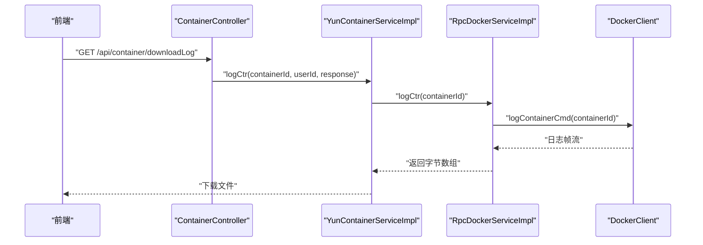
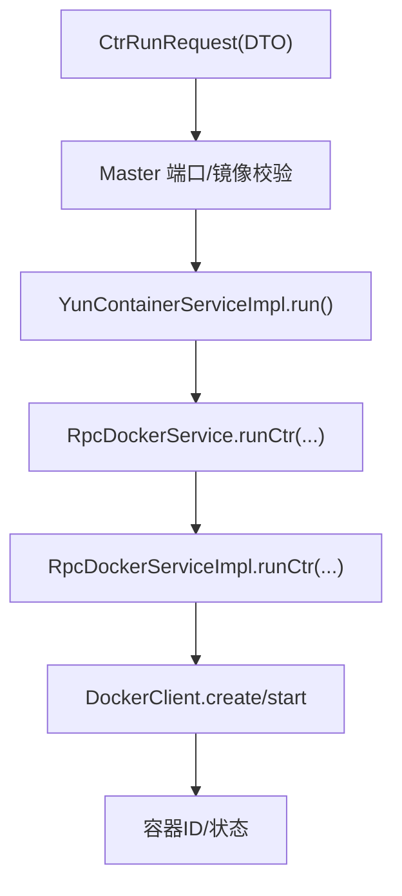
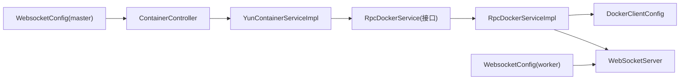

# 组件交互

<cite>
**本文引用的文件**
- [ContainerController.java](file://yun-docker-master/src/main/java/com/lfc/yundocker/controller/ContainerController.java)
- [YunContainerService.java](file://yun-docker-master/src/main/java/com/lfc/yundocker/service/YunContainerService.java)
- [YunContainerServiceImpl.java](file://yun-docker-master/src/main/java/com/lfc/yundocker/service/impl/YunContainerServiceImpl.java)
- [RpcDockerService.java](file://yun-docker-api/src/main/java/com/lfc/yundocker/service/RpcDockerService.java)
- [RpcDockerServiceImpl.java](file://yun-docker-worker/src/main/java/com/lfc/yundocker/worker/rpc/RpcDockerServiceImpl.java)
- [WebSocketServer.java](file://yun-docker-worker/src/main/java/com/lfc/yundocker/worker/websocket/WebSocketServer.java)
- [WebsocketConfig.java（master）](file://yun-docker-master/src/main/java/com/lfc/yundocker/config/WebsocketConfig.java)
- [WebsocketConfig.java（worker）](file://yun-docker-worker/src/main/java/com/lfc/yundocker/worker/config/WebsocketConfig.java)
- [DockerClientConfig.java](file://yun-docker-worker/src/main/java/com/lfc/yundocker/worker/config/DockerClientConfig.java)
- [CtrRunRequest.java](file://yun-docker-common/src/main/java/com/lfc/yundocker/common/model/dto/CtrRunRequest.java)
- [application.yml（master）](file://yun-docker-master/src/main/resources/application.yml)
- [application.yml（worker）](file://yun-docker-worker/src/main/resources/application.yml)
- [MasterApplication.java](file://yun-docker-master/src/main/java/com/lfc/yundocker/MasterApplication.java)
- [GlobalExceptionHandler.java](file://yun-docker-common/src/main/java/com/lfc/yundocker/common/exception/GlobalExceptionHandler.java)
</cite>

## 目录
1. [引言](#引言)
2. [项目结构](#项目结构)
3. [核心组件](#核心组件)
4. [架构总览](#架构总览)
5. [详细组件分析](#详细组件分析)
6. [依赖关系分析](#依赖关系分析)
7. [性能考量](#性能考量)
8. [故障排查指南](#故障排查指南)
9. [结论](#结论)
10. [附录](#附录)

## 引言
本文件围绕“yun-docker-backend”的核心组件交互进行全景式梳理，重点阐述以下闭环流程：
- 前端请求经由 Master 的 ContainerController 进入系统；
- Master 通过 Dubbo RPC 将指令发送至 Worker；
- Worker 使用 DockerClient 执行容器操作；
- Worker 通过 WebSocketServer 将实时日志与状态推送给前端；
- 结合 WebsocketConfig 配置说明 WebSocket 通信建立过程；
- 分析 WebSocketServer 的 @ServerEndpoint 注解与消息广播机制；
- 使用序列图清晰展示用户查看容器日志时的跨组件调用链；
- 解释 DTO 到 Docker 命令参数的数据格式转换；
- 提供异常情况下（RPC 超时、WebSocket 重连等）的降级策略建议。

## 项目结构
系统采用“Master-Worker”双模块架构：
- Master 模块负责 HTTP 接口、业务编排、Dubbo 消费者与异常处理；
- Worker 模块负责 Dubbo 服务提供者、Docker 操作、WebSocket 服务端；
- 通用模块提供 DTO、枚举、工具类与异常处理；
- API 模块定义跨模块共享的服务接口。

图表来源
- [ContainerController.java](file://yun-docker-master/src/main/java/com/lfc/yundocker/controller/ContainerController.java#L1-L173)
- [YunContainerService.java](file://yun-docker-master/src/main/java/com/lfc/yundocker/service/YunContainerService.java#L1-L41)
- [YunContainerServiceImpl.java](file://yun-docker-master/src/main/java/com/lfc/yundocker/service/impl/YunContainerServiceImpl.java#L1-L318)
- [RpcDockerService.java](file://yun-docker-api/src/main/java/com/lfc/yundocker/service/RpcDockerService.java#L1-L143)
- [RpcDockerServiceImpl.java](file://yun-docker-worker/src/main/java/com/lfc/yundocker/worker/rpc/RpcDockerServiceImpl.java#L1-L440)
- [DockerClientConfig.java](file://yun-docker-worker/src/main/java/com/lfc/yundocker/worker/config/DockerClientConfig.java#L1-L32)
- [WebSocketServer.java](file://yun-docker-worker/src/main/java/com/lfc/yundocker/worker/websocket/WebSocketServer.java#L1-L175)
- [WebsocketConfig.java（master）](file://yun-docker-master/src/main/java/com/lfc/yundocker/config/WebsocketConfig.java#L1-L20)
- [WebsocketConfig.java（worker）](file://yun-docker-worker/src/main/java/com/lfc/yundocker/worker/config/WebsocketConfig.java#L1-L20)

章节来源
- [MasterApplication.java](file://yun-docker-master/src/main/java/com/lfc/yundocker/MasterApplication.java#L1-L24)
- [application.yml（master）](file://yun-docker-master/src/main/resources/application.yml#L1-L60)
- [application.yml（worker）](file://yun-docker-worker/src/main/resources/application.yml#L1-L51)

## 核心组件
- ContainerController：接收前端 HTTP 请求，完成鉴权与参数校验，调用 YunContainerService 执行业务。
- YunContainerService/YunContainerServiceImpl：业务编排层，负责与 RPC 接口交互、端口分配、余额校验、状态持久化与指标采集。
- RpcDockerService/RpcDockerServiceImpl：Dubbo 服务接口与实现，封装 DockerClient 操作（拉取镜像、创建/启动/停止/重启/删除容器、读取统计、日志导出）。
- WebSocketServer：基于 JSR-356 的 @ServerEndpoint 实现，负责与前端建立 WebSocket 连接、接收订阅消息、推送实时统计与日志。
- WebsocketConfig：注册 ServerEndpointExporter，启用注解驱动的端点扫描与暴露。
- DockerClientConfig：构建 DockerClient 与 HostConfig，配置 Docker 服务地址。
- DTO/CtrRunRequest：承载前端传入的容器运行参数（镜像、端口、名称等），作为数据载体在 Master 与 Worker 之间传递。

章节来源
- [ContainerController.java](file://yun-docker-master/src/main/java/com/lfc/yundocker/controller/ContainerController.java#L1-L173)
- [YunContainerService.java](file://yun-docker-master/src/main/java/com/lfc/yundocker/service/YunContainerService.java#L1-L41)
- [YunContainerServiceImpl.java](file://yun-docker-master/src/main/java/com/lfc/yundocker/service/impl/YunContainerServiceImpl.java#L1-L318)
- [RpcDockerService.java](file://yun-docker-api/src/main/java/com/lfc/yundocker/service/RpcDockerService.java#L1-L143)
- [RpcDockerServiceImpl.java](file://yun-docker-worker/src/main/java/com/lfc/yundocker/worker/rpc/RpcDockerServiceImpl.java#L1-L440)
- [WebSocketServer.java](file://yun-docker-worker/src/main/java/com/lfc/yundocker/worker/websocket/WebSocketServer.java#L1-L175)
- [WebsocketConfig.java（master）](file://yun-docker-master/src/main/java/com/lfc/yundocker/config/WebsocketConfig.java#L1-L20)
- [WebsocketConfig.java（worker）](file://yun-docker-worker/src/main/java/com/lfc/yundocker/worker/config/WebsocketConfig.java#L1-L20)
- [DockerClientConfig.java](file://yun-docker-worker/src/main/java/com/lfc/yundocker/worker/config/DockerClientConfig.java#L1-L32)
- [CtrRunRequest.java](file://yun-docker-common/src/main/java/com/lfc/yundocker/common/model/dto/CtrRunRequest.java#L1-L35)

## 架构总览
系统采用“HTTP + RPC + WebSocket”的三层交互模式：
- HTTP 层：Master 暴露 REST 接口，统一鉴权与参数校验；
- RPC 层：Master 作为消费者，Worker 作为提供者，通过 Dubbo/Zookeeper 协议通信；
- WebSocket 层：Worker 作为服务端，向前端推送实时统计与日志；前端通过路径参数携带用户标识建立连接。

图表来源
- [ContainerController.java](file://yun-docker-master/src/main/java/com/lfc/yundocker/controller/ContainerController.java#L117-L132)
- [YunContainerServiceImpl.java](file://yun-docker-master/src/main/java/com/lfc/yundocker/service/impl/YunContainerServiceImpl.java#L136-L215)
- [RpcDockerService.java](file://yun-docker-api/src/main/java/com/lfc/yundocker/service/RpcDockerService.java#L1-L143)
- [RpcDockerServiceImpl.java](file://yun-docker-worker/src/main/java/com/lfc/yundocker/worker/rpc/RpcDockerServiceImpl.java#L189-L259)
- [WebSocketServer.java](file://yun-docker-worker/src/main/java/com/lfc/yundocker/worker/websocket/WebSocketServer.java#L90-L120)

## 详细组件分析

### HTTP 请求到容器运行的调用链
- ContainerController 接收 /container/run，校验参数与余额，调用 YunContainerService.run；
- YunContainerServiceImpl 完成镜像合法性校验、端口分配、调用 RpcDockerService.runCtr；
- RpcDockerServiceImpl 通过 DockerClient 创建并启动容器，返回容器 ID；
- Master 持久化容器记录并扣费，返回成功响应。

图表来源
- [ContainerController.java](file://yun-docker-master/src/main/java/com/lfc/yundocker/controller/ContainerController.java#L117-L132)
- [YunContainerServiceImpl.java](file://yun-docker-master/src/main/java/com/lfc/yundocker/service/impl/YunContainerServiceImpl.java#L136-L215)
- [RpcDockerServiceImpl.java](file://yun-docker-worker/src/main/java/com/lfc/yundocker/worker/rpc/RpcDockerServiceImpl.java#L82-L107)

章节来源
- [CtrRunRequest.java](file://yun-docker-common/src/main/java/com/lfc/yundocker/common/model/dto/CtrRunRequest.java#L1-L35)
- [application.yml（master）](file://yun-docker-master/src/main/resources/application.yml#L1-L60)
- [application.yml（worker）](file://yun-docker-worker/src/main/resources/application.yml#L1-L51)

### WebSocket 通信建立与消息广播
- WebsocketConfig 在 Worker 中注册 ServerEndpointExporter，使 @ServerEndpoint 注解生效；
- WebSocketServer 通过 @ServerEndpoint("/webSocket/{userId}") 建立连接，userId 作为路径参数；
- onOpen/onClose/onMessage/onError 生命周期方法分别处理连接、断开、消息与异常；
- sendInfo 静态方法根据 userId 查找会话并推送消息；
- 前端订阅消息包含 userId 与 ctrId，Worker 解析后调用 RpcDockerService.readCtrStats；
- RpcDockerServiceImpl 使用 statsCmd 异步回调推送统计，序列化为 JSON 并通过 WebSocketServer 发送。

图表来源
- [WebsocketConfig.java（worker）](file://yun-docker-worker/src/main/java/com/lfc/yundocker/worker/config/WebsocketConfig.java#L1-L20)
- [WebSocketServer.java](file://yun-docker-worker/src/main/java/com/lfc/yundocker/worker/websocket/WebSocketServer.java#L25-L120)
- [RpcDockerServiceImpl.java](file://yun-docker-worker/src/main/java/com/lfc/yundocker/worker/rpc/RpcDockerServiceImpl.java#L196-L259)

章节来源
- [WebsocketConfig.java（master）](file://yun-docker-master/src/main/java/com/lfc/yundocker/config/WebsocketConfig.java#L1-L20)
- [WebSocketServer.java](file://yun-docker-worker/src/main/java/com/lfc/yundocker/worker/websocket/WebSocketServer.java#L1-L175)

### 容器日志下载流程
- 前端发起 /container/downloadLog 请求；
- ContainerController 校验参数与权限后，委托 YunContainerServiceImpl.logCtr；
- YunContainerServiceImpl 调用 RpcDockerService.logCtr，Worker 将日志异步写入本地临时文件；
- Master 读取文件内容并通过 HttpServletResponse 输出为下载流。

图表来源
- [ContainerController.java](file://yun-docker-master/src/main/java/com/lfc/yundocker/controller/ContainerController.java#L154-L171)
- [YunContainerServiceImpl.java](file://yun-docker-master/src/main/java/com/lfc/yundocker/service/impl/YunContainerServiceImpl.java#L273-L295)
- [RpcDockerServiceImpl.java](file://yun-docker-worker/src/main/java/com/lfc/yundocker/worker/rpc/RpcDockerServiceImpl.java#L345-L413)

章节来源
- [application.yml（master）](file://yun-docker-master/src/main/resources/application.yml#L1-L60)

### 数据格式转换与 DTO 到 Docker 参数映射
- CtrRunRequest 作为输入 DTO，包含镜像 ID、宿主机端口、容器端口、容器名称；
- Master 在 YunContainerServiceImpl 中完成端口合法性校验与分配、镜像归属校验；
- Worker 在 RpcDockerServiceImpl 中将 DTO 字段映射为 DockerClient 的创建参数（镜像、端口绑定、HostConfig 等）。

图表来源
- [CtrRunRequest.java](file://yun-docker-common/src/main/java/com/lfc/yundocker/common/model/dto/CtrRunRequest.java#L1-L35)
- [YunContainerServiceImpl.java](file://yun-docker-master/src/main/java/com/lfc/yundocker/service/impl/YunContainerServiceImpl.java#L136-L215)
- [RpcDockerServiceImpl.java](file://yun-docker-worker/src/main/java/com/lfc/yundocker/worker/rpc/RpcDockerServiceImpl.java#L82-L107)

章节来源
- [CtrRunRequest.java](file://yun-docker-common/src/main/java/com/lfc/yundocker/common/model/dto/CtrRunRequest.java#L1-L35)

### 异常处理与降级策略
- 全局异常处理：GlobalExceptionHandler 统一捕获 BusinessException 与 RuntimeException，返回 BaseResponse；
- RPC 超时与重试：Master 端 consumer.timeout 与 retries 已配置，可按需调整；
- WebSocket 重连：前端应监听连接断开事件并按指数退避策略重连；
- Docker 操作异常：RpcDockerServiceImpl 对 Docker 操作抛出 BusinessException，上层统一处理；
- 日志导出降级：若日志过大或超时，可改为分段推送或提示用户稍后再试。

章节来源
- [GlobalExceptionHandler.java](file://yun-docker-common/src/main/java/com/lfc/yundocker/common/exception/GlobalExceptionHandler.java#L1-L31)
- [application.yml（master）](file://yun-docker-master/src/main/resources/application.yml#L1-L60)
- [RpcDockerServiceImpl.java](file://yun-docker-worker/src/main/java/com/lfc/yundocker/worker/rpc/RpcDockerServiceImpl.java#L345-L413)

## 依赖关系分析
- 组件耦合与职责分离：
  - Master 仅负责 HTTP 与业务编排，不直接操作 Docker；
  - Worker 负责 Docker 操作与 WebSocket 推送；
  - API 模块提供跨模块共享接口，避免循环依赖。
- 外部依赖：
  - Dubbo/Zookeeper：服务发现与 RPC 通信；
  - Docker Engine：通过 DockerClient 进行容器生命周期管理；
  - WebSocket：JSR-356 注解驱动的端点暴露。

图表来源
- [ContainerController.java](file://yun-docker-master/src/main/java/com/lfc/yundocker/controller/ContainerController.java#L1-L173)
- [YunContainerServiceImpl.java](file://yun-docker-master/src/main/java/com/lfc/yundocker/service/impl/YunContainerServiceImpl.java#L1-L318)
- [RpcDockerService.java](file://yun-docker-api/src/main/java/com/lfc/yundocker/service/RpcDockerService.java#L1-L143)
- [RpcDockerServiceImpl.java](file://yun-docker-worker/src/main/java/com/lfc/yundocker/worker/rpc/RpcDockerServiceImpl.java#L1-L440)
- [DockerClientConfig.java](file://yun-docker-worker/src/main/java/com/lfc/yundocker/worker/config/DockerClientConfig.java#L1-L32)
- [WebsocketConfig.java（master）](file://yun-docker-master/src/main/java/com/lfc/yundocker/config/WebsocketConfig.java#L1-L20)
- [WebsocketConfig.java（worker）](file://yun-docker-worker/src/main/java/com/lfc/yundocker/worker/config/WebsocketConfig.java#L1-L20)

## 性能考量
- RPC 调用：
  - Master 端 consumer.timeout 与 retries 已配置，建议根据实际网络与 Docker 调用耗时优化；
  - 对高频操作（如统计推送）建议批量合并或限频，避免前端压力过大。
- WebSocket 推送：
  - 统计数据采用异步回调推送，注意序列化开销与消息体积；
  - 前端应实现节流与去抖，避免频繁订阅导致资源浪费。
- Docker 操作：
  - 端口绑定与 HostConfig 需合理配置，避免资源争用；
  - 日志导出采用临时文件落盘，注意磁盘 IO 与清理策略。

## 故障排查指南
- WebSocket 无法连接：
  - 检查 WebsocketConfig 是否正确注册 ServerEndpointExporter；
  - 确认 @ServerEndpoint 路径与前端连接一致；
  - 观察 onOpen/onError 日志定位问题。
- RPC 调用失败：
  - 检查 Zookeeper 地址与 Dubbo 注册中心连通性；
  - 核对 Master/Worker 端口与协议配置；
  - 关注 BusinessException 与系统错误日志。
- Docker 操作异常：
  - 检查 DockerClientConfig 中 docker.server.url；
  - 确认 Docker Engine 可用且具备必要权限；
  - 关注 RpcDockerServiceImpl 的异常分支与日志。
- 日志下载失败：
  - 检查临时目录权限与磁盘空间；
  - 关注 RpcDockerServiceImpl 的日志导出流程与异常处理。

章节来源
- [WebsocketConfig.java（worker）](file://yun-docker-worker/src/main/java/com/lfc/yundocker/worker/config/WebsocketConfig.java#L1-L20)
- [WebSocketServer.java](file://yun-docker-worker/src/main/java/com/lfc/yundocker/worker/websocket/WebSocketServer.java#L50-L120)
- [application.yml（worker）](file://yun-docker-worker/src/main/resources/application.yml#L1-L51)
- [DockerClientConfig.java](file://yun-docker-worker/src/main/java/com/lfc/yundocker/worker/config/DockerClientConfig.java#L1-L32)
- [RpcDockerServiceImpl.java](file://yun-docker-worker/src/main/java/com/lfc/yundocker/worker/rpc/RpcDockerServiceImpl.java#L345-L413)

## 结论
本系统通过“HTTP + RPC + WebSocket”的分层设计，实现了从前端请求到容器生命周期管理与实时监控的完整闭环。Master 负责业务编排与鉴权，Worker 负责 Docker 操作与实时推送，WebSocket 提供低延迟的双向通信通道。通过合理的配置与异常处理策略，系统在可用性与性能之间取得平衡。

## 附录
- 关键配置项参考：
  - Master Dubbo consumer.timeout/retries、端口与上下文路径；
  - Worker Dubbo 注册中心地址、Docker 服务 URL、WebSocket 端点暴露；
  - DockerClientConfig 中 docker.server.url。

章节来源
- [application.yml（master）](file://yun-docker-master/src/main/resources/application.yml#L1-L60)
- [application.yml（worker）](file://yun-docker-worker/src/main/resources/application.yml#L1-L51)
- [DockerClientConfig.java](file://yun-docker-worker/src/main/java/com/lfc/yundocker/worker/config/DockerClientConfig.java#L1-L32)