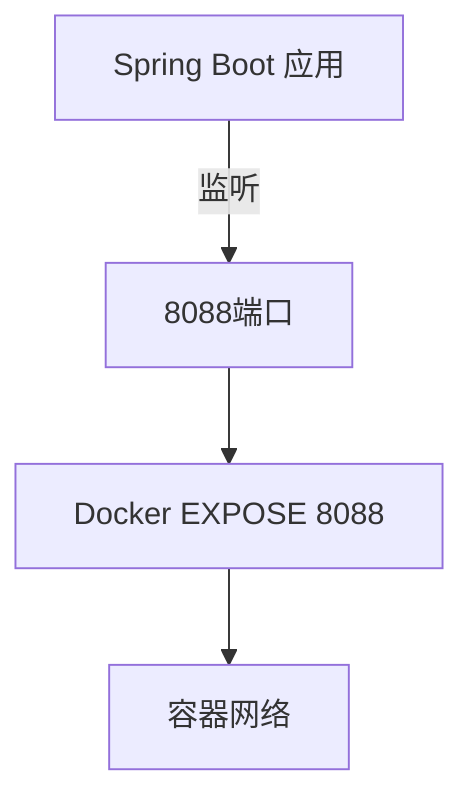
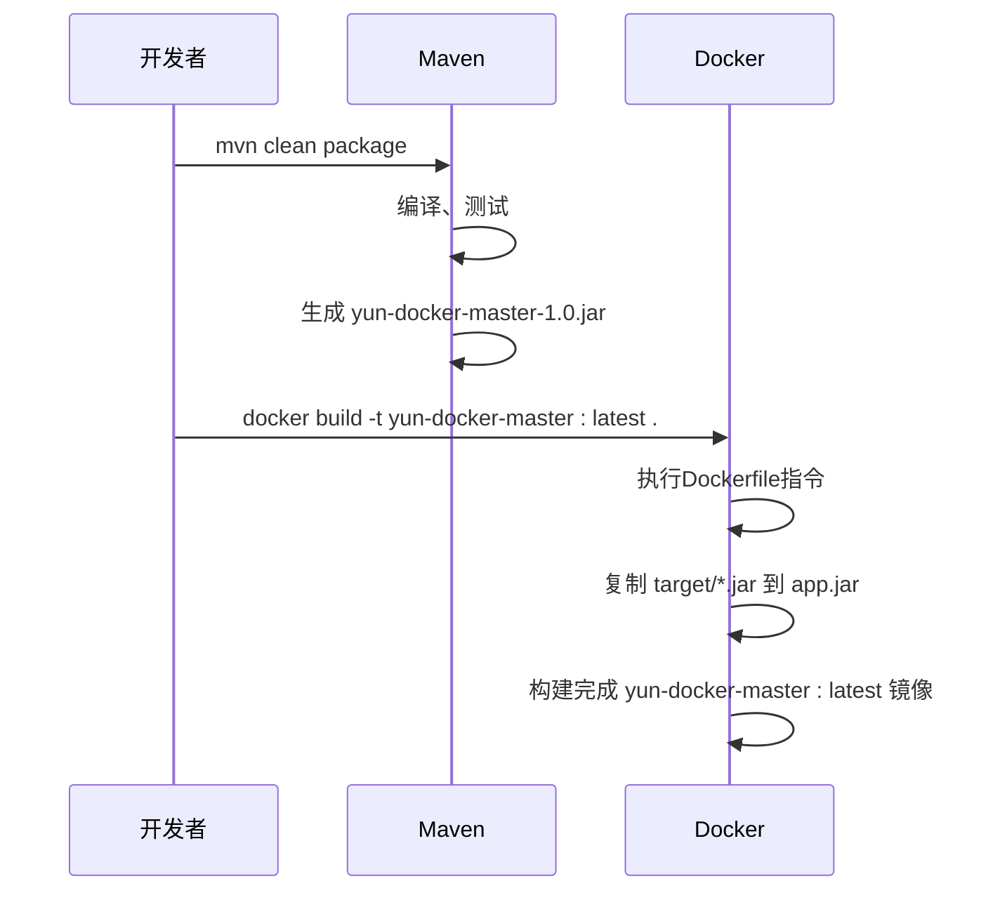
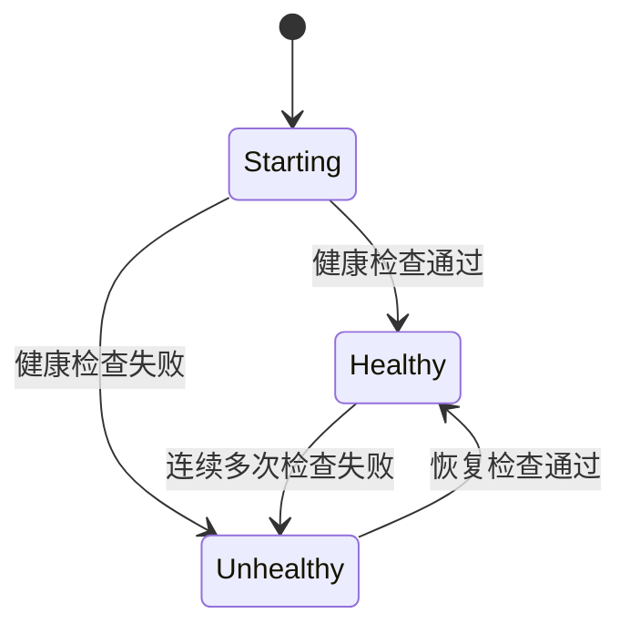
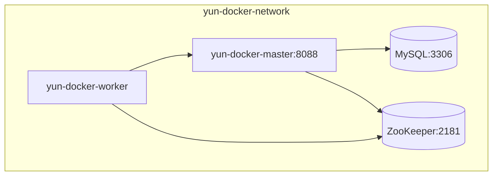

# 容器化部署

<cite>
**本文档引用文件**  
- [Dockerfile](file://Dockerfile)
- [README.md](file://README.md)
- [yun-docker-master\src\main\resources\application.yml](file://yun-docker-master/src/main/resources/application.yml)
- [yun-docker-worker\src\main\resources\application.yml](file://yun-docker-worker/src/main/resources/application.yml)
- [yun-docker-master\src\main\resources\application-dev.yml](file://yun-docker-master/src/main/resources/application-dev.yml)
- [yun-docker-worker\src\main\resources\application-dev.yml](file://yun-docker-worker/src/main/resources/application-dev.yml)
- [pom.xml](file://pom.xml)
- [yun-docker-master\pom.xml](file://yun-docker-master/pom.xml)
- [yun-docker-worker\pom.xml](file://yun-docker-worker/pom.xml)
- [doc\云Docker项目笔记.md](file://doc/云Docker项目笔记.md)
- [sql\create_table.sql](file://sql/create_table.sql)
</cite>

## 目录
1. [简介](#简介)
2. [Dockerfile 指令详解](#dockerfile-指令详解)
3. [Maven 构建与镜像生成](#maven-构建与镜像生成)
4. [Docker 容器运行示例](#docker-容器运行示例)
5. [健康检查建议](#健康检查建议)
6. [Docker Compose 服务编排](#docker-compose-服务编排)
7. [总结](#总结)

## 简介
本项目为一个基于Spring Boot的云托管平台，旨在帮助开发者快速部署Web项目。系统包含master（主控节点）、worker（工作节点）、ZooKeeper（服务注册与发现）和MySQL（数据存储）等多个组件。通过Docker容器化部署，实现服务的隔离、可移植与高效管理。本文档深入讲解基于Dockerfile的完整容器化部署流程。

**Section sources**
- [README.md](file://README.md)

## Dockerfile 指令详解

### FROM 指令：选择基础镜像
```dockerfile
FROM openjdk:8-jdk-alpine
```
使用 `openjdk:8-jdk-alpine` 作为基础镜像是出于轻量化和安全性的考虑。Alpine Linux 是一个极简的Linux发行版，其镜像体积小（通常几十MB），能显著减少最终镜像的大小，加快传输和启动速度。同时，较小的攻击面也提升了容器的安全性。JDK 8 是当前广泛支持的稳定版本，兼容本项目使用的Spring Boot 2.7.2框架。

**Section sources**
- [Dockerfile](file://Dockerfile#L2)

### RUN 指令：创建应用目录
```dockerfile
RUN mkdir "/home/app"
```
该指令在构建镜像时在容器内部创建 `/home/app` 目录，作为应用的专用工作空间。这有助于组织文件结构，将应用文件与系统文件分离，便于管理和维护。

**Section sources**
- [Dockerfile](file://Dockerfile#L5)

### WORKDIR 指令：设置工作目录
```dockerfile
WORKDIR /home/app
```
`WORKDIR` 指令将 `/home/app` 设置为后续所有Docker指令（如 `COPY`, `ENTRYPOINT`）的工作目录。这确保了所有操作都在正确的上下文中执行，避免了路径错误。

**Section sources**
- [Dockerfile](file://Dockerfile#L8)

### COPY 指令：复制JAR包
```dockerfile
ARG JAR_FILE=target/*.jar
COPY ${JAR_FILE} app.jar
```
`ARG` 指令定义了一个构建时变量 `JAR_FILE`，默认值为 `target/*.jar`，指向Maven构建后生成的JAR包。`COPY` 指令则将宿主机上匹配该路径的JAR包复制到容器内的当前工作目录，并重命名为 `app.jar`。这是实现Maven构建产物与Docker镜像集成的关键步骤。

**Section sources**
- [Dockerfile](file://Dockerfile#L11-L12)

### EXPOSE 指令：暴露端口
```dockerfile
EXPOSE 8088
```
`EXPOSE` 指令声明容器在运行时会监听8088端口。此端口与 `yun-docker-master` 服务在 `application.yml` 中配置的 `server.port: 8088` 完全一致，确保了Spring Boot应用的HTTP服务能够通过该端口对外提供访问。



**Diagram sources**
- [Dockerfile](file://Dockerfile#L15)
- [yun-docker-master\src\main\resources\application.yml](file://yun-docker-master/src/main/resources/application.yml#L35)

**Section sources**
- [Dockerfile](file://Dockerfile#L15)
- [yun-docker-master\src\main\resources\application.yml](file://yun-docker-master/src/main/resources/application.yml#L35)

### ENTRYPOINT 指令：启动命令
```dockerfile
ENTRYPOINT ["java", "-jar", "app.jar"]
```
`ENTRYPOINT` 指定了容器启动时执行的命令。它使用exec格式（JSON数组）直接运行 `java -jar app.jar`，启动复制进容器的Spring Boot应用。这种方式确保了Java进程作为容器的主进程（PID 1），能够正确接收和处理操作系统信号（如SIGTERM），实现优雅关闭。

**Section sources**
- [Dockerfile](file://Dockerfile#L18)

## Maven 构建与镜像生成

项目采用Maven进行依赖管理和构建。根目录的 `pom.xml` 文件定义了多模块结构，包含 `yun-docker-master`、`yun-docker-worker` 等子模块。每个子模块都有自己的 `pom.xml`，继承父POM并声明特定依赖。

构建流程如下：
1.  **清理与打包**：在项目根目录执行 `mvn clean package` 命令。
    -   `clean`：清除 `target` 目录下的旧构建产物。
    -   `package`：编译源代码，运行测试，并将 `yun-docker-master` 模块打包成一个可执行的JAR文件（如 `yun-docker-master-1.0.jar`），存放于 `yun-docker-master/target/` 目录下。
2.  **构建Docker镜像**：在项目根目录（Dockerfile所在目录）执行 `docker build -t yun-docker-master:latest .`。
    -   Docker构建过程会自动匹配 `target/*.jar` 模式，将生成的JAR包复制到镜像中。
    -   最终生成名为 `yun-docker-master` 且标签为 `latest` 的Docker镜像。



**Diagram sources**
- [pom.xml](file://pom.xml)
- [yun-docker-master\pom.xml](file://yun-docker-master/pom.xml)
- [Dockerfile](file://Dockerfile)

**Section sources**
- [pom.xml](file://pom.xml)
- [yun-docker-master\pom.xml](file://yun-docker-master/pom.xml)
- [Dockerfile](file://Dockerfile)

## Docker 容器运行示例

构建好镜像后，可以使用 `docker run` 命令启动容器。以下是一个运行 `yun-docker-master` 服务的示例：

```bash
docker run -d \
  --name yun-docker-master \
  -p 8088:8088 \
  -e SPRING_PROFILES_ACTIVE=prod \
  -e zookeeper.address=zookeeper_host \
  -v /path/to/logs:/home/app/logs \
  yun-docker-master:latest
```

-   `-d`：以后台守护进程模式运行容器。
-   `--name`：为容器指定一个易于识别的名称。
-   `-p 8088:8088`：将宿主机的8088端口映射到容器的8088端口，使外部网络可以访问应用。
-   `-e KEY=VALUE`：设置环境变量。
    -   `SPRING_PROFILES_ACTIVE=prod`：指定Spring Boot使用生产环境配置。
    -   `zookeeper.address=zookeeper_host`：指定ZooKeeper服务的地址，实现服务发现。
-   `-v /path/to/logs:/home/app/logs`：将宿主机的 `/path/to/logs` 目录挂载到容器内的 `/home/app/logs`，实现日志的持久化存储，便于后续查看和分析。

**Section sources**
- [doc\云Docker项目笔记.md](file://doc/云Docker项目笔记.md#L6)
- [yun-docker-master\src\main\resources\application-dev.yml](file://yun-docker-master/src/main/resources/application-dev.yml#L11)

## 健康检查建议

为了提高服务的可靠性和可维护性，强烈建议在Dockerfile中添加 `HEALTHCHECK` 指令，以实现容器的健康状态自动检测。

```dockerfile
HEALTHCHECK --interval=30s --timeout=3s --start-period=5s --retries=3 \
  CMD curl -f http://localhost:8088/api/actuator/health || exit 1
```

该指令通过调用Spring Boot Actuator的 `/actuator/health` 端点来检查应用的健康状况。根据配置，Docker会定期（每30秒）执行此检查。如果应用启动成功并能正常响应健康检查，则容器状态为 `healthy`；否则为 `unhealthy`。这对于容器编排工具（如Kubernetes或Docker Swarm）自动重启故障容器至关重要。



**Diagram sources**
- [yun-docker-master\src\main\resources\application.yml](file://yun-docker-master/src/main/resources/application.yml#L51)

## Docker Compose 服务编排

对于包含多个相互依赖服务的复杂应用，使用 `docker-compose.yml` 文件进行编排是最佳实践。它可以一键启动、停止和管理所有服务。

以下是一个编排 `master`、`worker`、`zookeeper` 和 `mysql` 服务的 `docker-compose.yml` 示例：

```yaml
version: '3.8'

services:
  mysql:
    image: mysql:8.0
    container_name: yun-docker-mysql
    environment:
      MYSQL_ROOT_PASSWORD: 123456
      MYSQL_DATABASE: yun_docker
    ports:
      - "3306:3306"
    volumes:
      - mysql_data:/var/lib/mysql
    networks:
      - yun-docker-network

  zookeeper:
    image: zookeeper:3.8
    container_name: yun-docker-zookeeper
    ports:
      - "2181:2181"
    networks:
      - yun-docker-network

  master:
    build: .
    container_name: yun-docker-master
    depends_on:
      - mysql
      - zookeeper
    environment:
      SPRING_PROFILES_ACTIVE: prod
      zookeeper.address: zookeeper
    ports:
      - "8088:8088"
    networks:
      - yun-docker-network

  worker:
    build: ./yun-docker-worker
    container_name: yun-docker-worker
    depends_on:
      - master
      - zookeeper
    environment:
      zookeeper.address: zookeeper
    networks:
      - yun-docker-network

volumes:
  mysql_data:

networks:
  yun-docker-network:
    driver: bridge
```

**关键点说明：**
-   **网络互通**：所有服务都连接到名为 `yun-docker-network` 的自定义桥接网络，确保它们可以通过服务名称（如 `zookeeper`）相互解析和通信。
-   **依赖关系**：`depends_on` 指令确保 `master` 服务在 `mysql` 和 `zookeeper` 启动后再启动，`worker` 服务在 `master` 和 `zookeeper` 启动后再启动，保证了正确的启动顺序。
-   **配置覆盖**：`worker` 服务通过 `zookeeper.address: zookeeper` 环境变量，覆盖了其 `application-dev.yml` 中的默认配置，指向Docker网络内的ZooKeeper服务。



**Diagram sources**
- [yun-docker-master\src\main\resources\application-dev.yml](file://yun-docker-master/src/main/resources/application-dev.yml#L19)
- [yun-docker-worker\src\main\resources\application-dev.yml](file://yun-docker-worker/src/main/resources/application-dev.yml#L9)

## 总结
本文档详细解析了基于Dockerfile的容器化部署流程。从Dockerfile中各指令的深层含义，到Maven构建JAR包并生成镜像的完整过程，再到实际运行容器的参数配置，最后提供了通过Docker Compose进行多服务编排的最佳实践。通过遵循这些步骤，可以确保 `yun-docker-backend` 项目的各个组件（master、worker、zookeeper、mysql）能够被高效、可靠地部署和管理，实现服务间的网络互通与正确的依赖启动顺序。