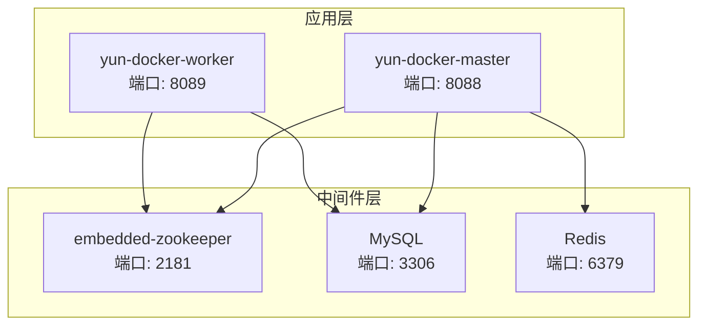
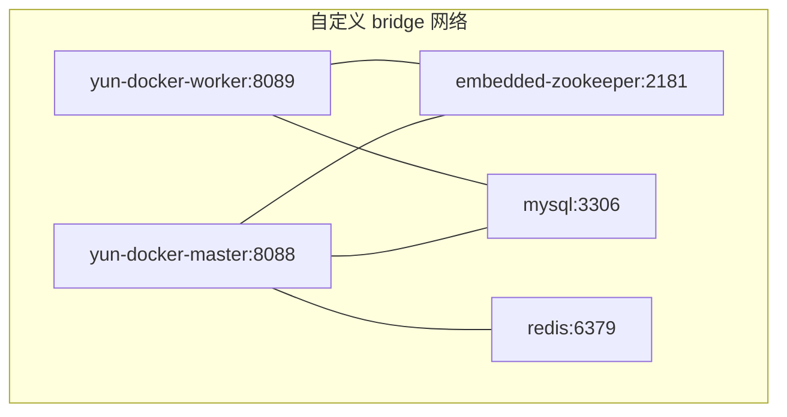
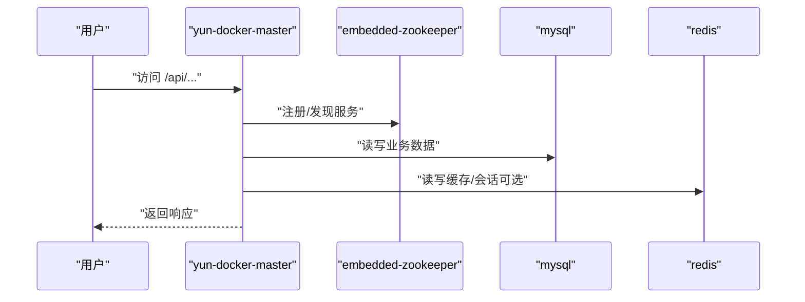
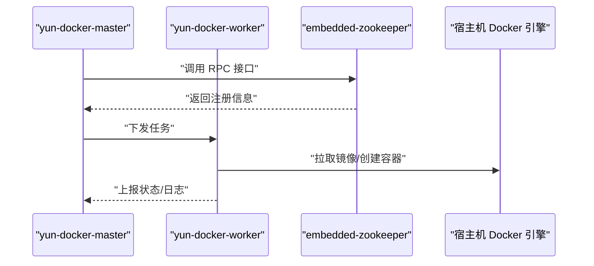
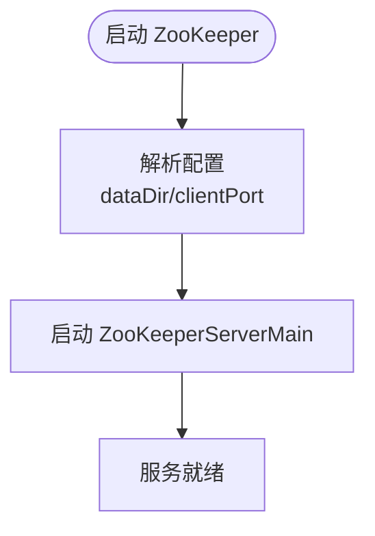
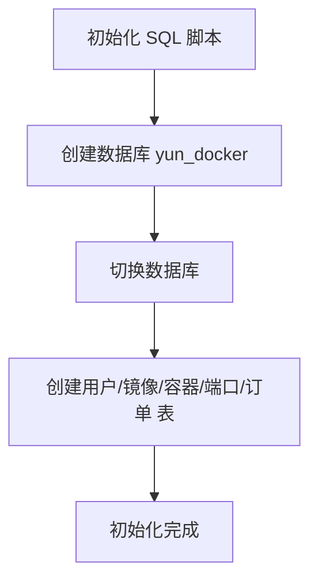
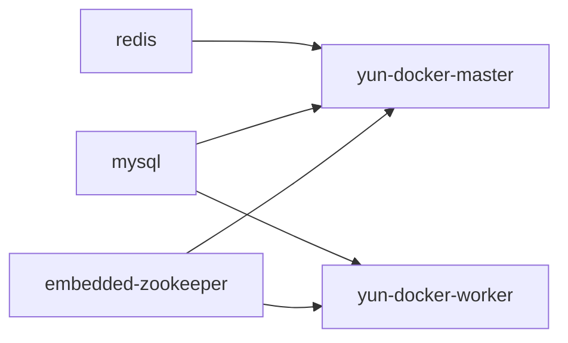

# 服务编排部署

<cite>
**本文引用的文件**
- [Dockerfile](file://Dockerfile)
- [yun-docker-master/src/main/resources/application.yml](file://yun-docker-master/src/main/resources/application.yml)
- [yun-docker-worker/src/main/resources/application.yml](file://yun-docker-worker/src/main/resources/application.yml)
- [yun-docker-master/src/main/resources/application-dev.yml](file://yun-docker-master/src/main/resources/application-dev.yml)
- [yun-docker-worker/src/main/resources/application-dev.yml](file://yun-docker-worker/src/main/resources/application-dev.yml)
- [yun-docker-master/src/main/resources/prometheus.yml](file://yun-docker-master/src/main/resources/prometheus.yml)
- [yun-docker-master/src/main/java/com/lfc/yundocker/MasterApplication.java](file://yun-docker-master/src/main/java/com/lfc/yundocker/MasterApplication.java)
- [yun-docker-worker/src/main/java/com/lfc/yundocker/worker/WorkerApplication.java](file://yun-docker-worker/src/main/java/com/lfc/yundocker/worker/WorkerApplication.java)
- [yun-docker-worker/src/main/java/com/lfc/yundocker/worker/config/DockerClientConfig.java](file://yun-docker-worker/src/main/java/com/lfc/yundocker/worker/config/DockerClientConfig.java)
- [embedded-zookeeper/src/main/java/com/lfc/zookeeper/EmbeddedZooKeeper.java](file://embedded-zookeeper/src/main/java/com/lfc/zookeeper/EmbeddedZooKeeper.java)
- [sql/create_table.sql](file://sql/create_table.sql)
</cite>

## 目录
1. [简介](#简介)
2. [项目结构](#项目结构)
3. [核心组件](#核心组件)
4. [架构总览](#架构总览)
5. [详细组件分析](#详细组件分析)
6. [依赖关系分析](#依赖关系分析)
7. [性能与监控](#性能与监控)
8. [故障排查指南](#故障排查指南)
9. [结论](#结论)
10. [附录](#附录)

## 简介
本文件面向希望使用 docker-compose 进行多服务编排部署的用户，围绕以下服务进行完整说明：
- yun-docker-master：主服务，提供 API、调度与管理能力，端口 8088
- yun-docker-worker：工作节点，负责与 Docker 引擎交互，端口 8089
- embedded-zookeeper：内置 ZooKeeper，提供 Dubbo 注册中心，端口 2181
- mysql：数据库，端口 3306
- redis：缓存/会话存储（可选），端口 6379

文档将给出服务镜像来源、端口映射、环境变量、依赖关系、网络配置、持久化卷、日志记录、健康检查、Prometheus 监控集成以及常见问题排查方法。同时提供 application.yml 的关键参数配置指引，确保容器网络互通。

## 项目结构
- 顶层使用单模块 Maven 结构，包含多个子模块：yun-docker-master、yun-docker-worker、yun-docker-common、embedded-zookeeper、sql 等
- 主服务与工作节点分别有独立的 Spring Boot 应用入口类，均启用 Dubbo 注解
- Dockerfile 提供基于 OpenJDK 8 的镜像构建模板，暴露 8088 端口
- embedded-zookeeper 提供内嵌 ZooKeeper 启动逻辑，监听 2181 端口
- sql 目录包含数据库初始化脚本

图表来源
- [yun-docker-master/src/main/resources/application.yml](file://yun-docker-master/src/main/resources/application.yml#L1-L60)
- [yun-docker-worker/src/main/resources/application.yml](file://yun-docker-worker/src/main/resources/application.yml#L1-L51)
- [embedded-zookeeper/src/main/java/com/lfc/zookeeper/EmbeddedZooKeeper.java](file://embedded-zookeeper/src/main/java/com/lfc/zookeeper/EmbeddedZooKeeper.java#L1-L41)
- [Dockerfile](file://Dockerfile#L1-L18)

章节来源
- [yun-docker-master/src/main/java/com/lfc/yundocker/MasterApplication.java](file://yun-docker-master/src/main/java/com/lfc/yundocker/MasterApplication.java#L1-L25)
- [yun-docker-worker/src/main/java/com/lfc/yundocker/worker/WorkerApplication.java](file://yun-docker-worker/src/main/java/com/lfc/yundocker/worker/WorkerApplication.java#L1-L23)
- [Dockerfile](file://Dockerfile#L1-L18)

## 核心组件
- yun-docker-master
  - 端口：8088
  - 暴露监控端点：health、info、prometheus
  - Dubbo 协议端口：由 Dubbo 自动分配（port=-1）
  - 依赖：MySQL、ZooKeeper、Redis（可选）
- yun-docker-worker
  - 端口：8089
  - 暴露监控端点：health、info、prometheus
  - 通过 DockerClientConfig 连接宿主机 Docker 引擎（tcp://宿主机IP:2375）
  - 依赖：ZooKeeper、MySQL（可选）
- embedded-zookeeper
  - 端口：2181
  - 内嵌 ZooKeeper，用于 Dubbo 注册中心
- MySQL
  - 端口：3306
  - 初始化脚本：sql/create_table.sql
- Redis
  - 端口：6379
  - 作为可选缓存/会话存储

章节来源
- [yun-docker-master/src/main/resources/application.yml](file://yun-docker-master/src/main/resources/application.yml#L1-L60)
- [yun-docker-worker/src/main/resources/application.yml](file://yun-docker-worker/src/main/resources/application.yml#L1-L51)
- [yun-docker-worker/src/main/java/com/lfc/yundocker/worker/config/DockerClientConfig.java](file://yun-docker-worker/src/main/java/com/lfc/yundocker/worker/config/DockerClientConfig.java#L1-L31)
- [embedded-zookeeper/src/main/java/com/lfc/zookeeper/EmbeddedZooKeeper.java](file://embedded-zookeeper/src/main/java/com/lfc/zookeeper/EmbeddedZooKeeper.java#L1-L41)
- [sql/create_table.sql](file://sql/create_table.sql#L1-L87)

## 架构总览
下图展示容器间的依赖与通信关系，所有服务运行在同一自定义 bridge 网络中，确保服务名即主机名可用。

图表来源
- [yun-docker-master/src/main/resources/application.yml](file://yun-docker-master/src/main/resources/application.yml#L1-L60)
- [yun-docker-worker/src/main/resources/application.yml](file://yun-docker-worker/src/main/resources/application.yml#L1-L51)
- [embedded-zookeeper/src/main/java/com/lfc/zookeeper/EmbeddedZooKeeper.java](file://embedded-zookeeper/src/main/java/com/lfc/zookeeper/EmbeddedZooKeeper.java#L1-L41)

## 详细组件分析

### yun-docker-master 组件
- 启动入口：MasterApplication
- 关键配置
  - 服务器端口：8088
  - Dubbo 注册中心地址：zookeeper://zookeeper:2181
  - 数据源 URL：jdbc:mysql://mysql:3306/yun_docker
  - Redis 地址：redis://redis:6379（可选）
  - Actuator 暴露端点：health、info、prometheus
- 依赖关系
  - depends_on: mysql、embedded-zookeeper
  - 网络：与 mysql、redis、embedded-zookeeper 共享同一 bridge 网络

图表来源
- [yun-docker-master/src/main/java/com/lfc/yundocker/MasterApplication.java](file://yun-docker-master/src/main/java/com/lfc/yundocker/MasterApplication.java#L1-L25)
- [yun-docker-master/src/main/resources/application.yml](file://yun-docker-master/src/main/resources/application.yml#L1-L60)
- [yun-docker-master/src/main/resources/application-dev.yml](file://yun-docker-master/src/main/resources/application-dev.yml#L1-L81)

章节来源
- [yun-docker-master/src/main/java/com/lfc/yundocker/MasterApplication.java](file://yun-docker-master/src/main/java/com/lfc/yundocker/MasterApplication.java#L1-L25)
- [yun-docker-master/src/main/resources/application.yml](file://yun-docker-master/src/main/resources/application.yml#L1-L60)
- [yun-docker-master/src/main/resources/application-dev.yml](file://yun-docker-master/src/main/resources/application-dev.yml#L1-L81)

### yun-docker-worker 组件
- 启动入口：WorkerApplication
- 关键配置
  - 服务器端口：8089
  - Dubbo 注册中心地址：zookeeper://zookeeper:2181
  - Docker 引擎地址：tcp://宿主机IP:2375（通过环境变量注入）
  - Actuator 暴露端点：health、info、prometheus
- 依赖关系
  - depends_on: embedded-zookeeper
  - 网络：与 embedded-zookeeper、mysql 共享同一 bridge 网络

图表来源
- [yun-docker-worker/src/main/java/com/lfc/yundocker/worker/WorkerApplication.java](file://yun-docker-worker/src/main/java/com/lfc/yundocker/worker/WorkerApplication.java#L1-L23)
- [yun-docker-worker/src/main/java/com/lfc/yundocker/worker/config/DockerClientConfig.java](file://yun-docker-worker/src/main/java/com/lfc/yundocker/worker/config/DockerClientConfig.java#L1-L31)
- [yun-docker-worker/src/main/resources/application.yml](file://yun-docker-worker/src/main/resources/application.yml#L1-L51)

章节来源
- [yun-docker-worker/src/main/java/com/lfc/yundocker/worker/WorkerApplication.java](file://yun-docker-worker/src/main/java/com/lfc/yundocker/worker/WorkerApplication.java#L1-L23)
- [yun-docker-worker/src/main/java/com/lfc/yundocker/worker/config/DockerClientConfig.java](file://yun-docker-worker/src/main/java/com/lfc/yundocker/worker/config/DockerClientConfig.java#L1-L31)
- [yun-docker-worker/src/main/resources/application.yml](file://yun-docker-worker/src/main/resources/application.yml#L1-L51)

### embedded-zookeeper 组件
- 端口：2181
- 作用：为 Dubbo 提供注册中心
- 启动方式：EmbeddedZooKeeper.main()

图表来源
- [embedded-zookeeper/src/main/java/com/lfc/zookeeper/EmbeddedZooKeeper.java](file://embedded-zookeeper/src/main/java/com/lfc/zookeeper/EmbeddedZooKeeper.java#L1-L41)

章节来源
- [embedded-zookeeper/src/main/java/com/lfc/zookeeper/EmbeddedZooKeeper.java](file://embedded-zookeeper/src/main/java/com/lfc/zookeeper/EmbeddedZooKeeper.java#L1-L41)

### MySQL 组件
- 端口：3306
- 初始化：使用 sql/create_table.sql 创建数据库与表
- 持久化：挂载卷至 /var/lib/mysql

图表来源
- [sql/create_table.sql](file://sql/create_table.sql#L1-L87)

章节来源
- [sql/create_table.sql](file://sql/create_table.sql#L1-L87)

### Redis 组件
- 端口：6379
- 用途：可选的缓存/会话存储
- 配置：在 application.yml 中按需启用

章节来源
- [yun-docker-master/src/main/resources/application.yml](file://yun-docker-master/src/main/resources/application.yml#L1-L60)

## 依赖关系分析
- 启动顺序
  - embedded-zookeeper → mysql → yun-docker-master → yun-docker-worker
- 服务间通信
  - 通过自定义 bridge 网络，使用服务名作为主机名访问
  - master 与 worker 均依赖 zookeeper:2181
  - master 依赖 mysql:3306 与 redis:6379（可选）

图表来源
- [yun-docker-master/src/main/resources/application.yml](file://yun-docker-master/src/main/resources/application.yml#L1-L60)
- [yun-docker-worker/src/main/resources/application.yml](file://yun-docker-worker/src/main/resources/application.yml#L1-L51)

章节来源
- [yun-docker-master/src/main/resources/application.yml](file://yun-docker-master/src/main/resources/application.yml#L1-L60)
- [yun-docker-worker/src/main/resources/application.yml](file://yun-docker-worker/src/main/resources/application.yml#L1-L51)

## 性能与监控
- 监控端点
  - master 与 worker 均暴露 health、info、prometheus 端点
- Prometheus 配置
  - 采集 master 的 /api/actuator/prometheus
  - 采集间隔与超时可按需调整
- 建议
  - 在生产环境为 master/worker 添加 HEALTHCHECK
  - 配置日志聚合（如 stdout + 日志驱动）以便集中收集

章节来源
- [yun-docker-master/src/main/resources/application.yml](file://yun-docker-master/src/main/resources/application.yml#L1-L60)
- [yun-docker-worker/src/main/resources/application.yml](file://yun-docker-worker/src/main/resources/application.yml#L1-L51)
- [yun-docker-master/src/main/resources/prometheus.yml](file://yun-docker-master/src/main/resources/prometheus.yml#L1-L38)

## 故障排查指南
- 服务启动顺序错误
  - 确保 embedded-zookeeper 先启动，再启动 mysql，最后启动 master/worker
  - 使用 depends_on 并结合健康检查
- 数据库初始化失败
  - 检查 mysql 初始化脚本路径与权限
  - 确认 application.yml 中的 spring.datasource.url 指向 mysql:3306
- Dubbo 注册失败
  - 确认 zookeeper 地址为 zookeeper:2181
  - 检查 master/worker 的 dubbo.registry.address 配置
- Docker 引擎连接失败
  - 确认 worker 的 docker.server.url 指向宿主机 IP:2375
  - 检查宿主机 Docker TCP 端口是否开启
- 端口冲突
  - 确认宿主机 8088、8089、3306、2181、6379 未被占用

章节来源
- [yun-docker-master/src/main/resources/application-dev.yml](file://yun-docker-master/src/main/resources/application-dev.yml#L1-L81)
- [yun-docker-worker/src/main/resources/application-dev.yml](file://yun-docker-worker/src/main/resources/application-dev.yml#L1-L65)
- [yun-docker-worker/src/main/java/com/lfc/yundocker/worker/config/DockerClientConfig.java](file://yun-docker-worker/src/main/java/com/lfc/yundocker/worker/config/DockerClientConfig.java#L1-L31)

## 结论
通过 docker-compose 编排上述服务，可以快速搭建一个包含主服务、工作节点、注册中心、数据库与缓存的完整云托管平台。关键在于正确的启动顺序、网络互通、持久化卷与监控配置。建议在生产环境中增加健康检查与日志聚合，并按需启用 Redis 与 Elasticsearch。

## 附录

### docker-compose.yml 示例（结构化说明）
- 服务定义
  - yun-docker-master
    - 镜像来源：本地构建（基于 Dockerfile）
    - 端口映射：8088:8088
    - 环境变量：spring.profiles.active=dev；dubbo.registry.address=zookeeper://zookeeper:2181；spring.datasource.url=jdbc:mysql://mysql:3306/yun_docker
    - 依赖：depends_on: [embedded-zookeeper, mysql]
    - 网络：与 mysql、embedded-zookeeper、redis 共享 bridge 网络
    - 健康检查：HTTP GET /api/actuator/health
    - 日志：标准输出
  - yun-docker-worker
    - 镜像来源：本地构建（基于 Dockerfile）
    - 端口映射：8089:8089
    - 环境变量：dubbo.registry.address=zookeeper://zookeeper:2181；docker.server.url=tcp://宿主机IP:2375
    - 依赖：depends_on: [embedded-zookeeper]
    - 网络：与 embedded-zookeeper、mysql 共享 bridge 网络
    - 健康检查：HTTP GET /actuator/health
    - 日志：标准输出
  - embedded-zookeeper
    - 镜像来源：官方 ZooKeeper 镜像或自定义镜像
    - 端口映射：2181:2181
    - 环境变量：无（默认即可）
    - 依赖：无
    - 网络：与 master/worker 共享 bridge 网络
    - 健康检查：TCP 2181
    - 日志：标准输出
  - mysql
    - 镜像来源：官方 MySQL 镜像
    - 端口映射：3306:3306
    - 环境变量：MYSQL_ROOT_PASSWORD、MYSQL_DATABASE=yun_docker
    - 挂载：/var/lib/mysql
    - 依赖：无
    - 网络：与 master/worker 共享 bridge 网络
    - 健康检查：TCP 3306
    - 日志：标准输出
  - redis
    - 镜像来源：官方 Redis 镜像
    - 端口映射：6379:6379
    - 环境变量：无（默认即可）
    - 挂载：/data
    - 依赖：无
    - 网络：与 master 共享 bridge 网络
    - 健康检查：TCP 6379
    - 日志：标准输出
- 网络
  - 使用自定义 bridge 网络，服务名即主机名
- 卷
  - mysql：持久化 /var/lib/mysql
  - redis：持久化 /data
- 日志
  - 所有服务使用标准输出，便于 docker logs 收集

### 启动与运维命令
- 启动：docker-compose up -d
- 查看日志：docker-compose logs -f
- 清理：docker-compose down

### application.yml 参数配置建议（容器网络）
- yun-docker-master
  - spring.datasource.url：指向 mysql:3306
  - dubbo.registry.address：指向 zookeeper:2181
  - spring.redis.host：指向 redis:6379（如启用）
- yun-docker-worker
  - dubbo.registry.address：指向 zookeeper:2181
  - docker.server.url：指向宿主机 IP:2375

章节来源
- [yun-docker-master/src/main/resources/application.yml](file://yun-docker-master/src/main/resources/application.yml#L1-L60)
- [yun-docker-worker/src/main/resources/application.yml](file://yun-docker-worker/src/main/resources/application.yml#L1-L51)
- [yun-docker-master/src/main/resources/application-dev.yml](file://yun-docker-master/src/main/resources/application-dev.yml#L1-L81)
- [yun-docker-worker/src/main/resources/application-dev.yml](file://yun-docker-worker/src/main/resources/application-dev.yml#L1-L65)