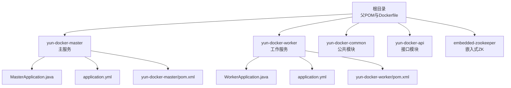
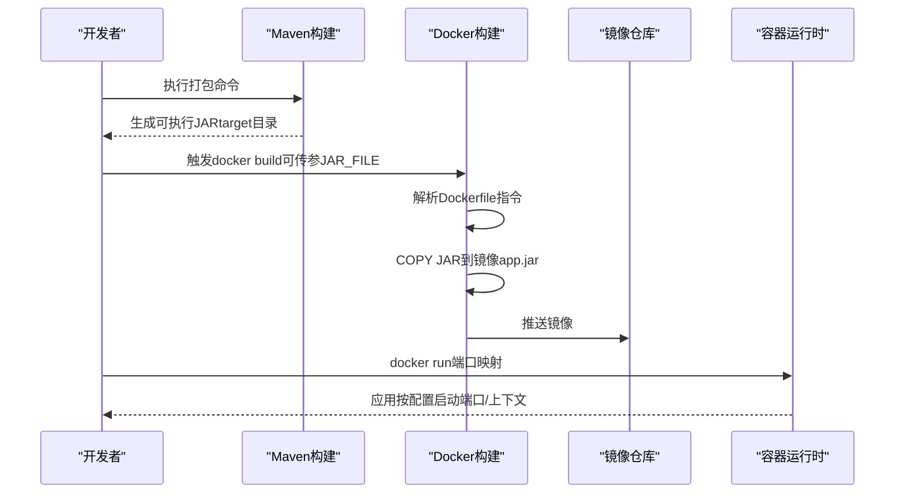
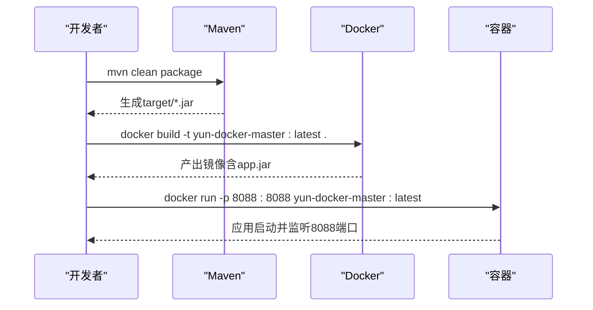
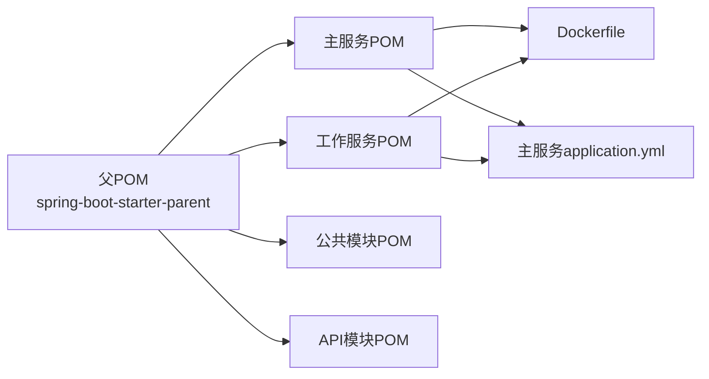

# 镜像构建

<cite>
**本文引用的文件**
- [Dockerfile](file://Dockerfile)
- [yun-docker-master/pom.xml](file://yun-docker-master/pom.xml)
- [yun-docker-worker/pom.xml](file://yun-docker-worker/pom.xml)
- [yun-docker-master/src/main/resources/application.yml](file://yun-docker-master/src/main/resources/application.yml)
- [yun-docker-worker/src/main/resources/application.yml](file://yun-docker-worker/src/main/resources/application.yml)
- [yun-docker-master/src/main/java/com/lfc/yundocker/MasterApplication.java](file://yun-docker-master/src/main/java/com/lfc/yundocker/MasterApplication.java)
- [yun-docker-worker/src/main/java/com/lfc/yundocker/worker/WorkerApplication.java](file://yun-docker-worker/src/main/java/com/lfc/yundocker/worker/WorkerApplication.java)
- [pom.xml](file://pom.xml)
- [doc/云Docker项目笔记.md](file://doc/云Docker项目笔记.md)
</cite>

## 目录
1. [简介](#简介)
2. [项目结构](#项目结构)
3. [核心组件](#核心组件)
4. [架构总览](#架构总览)
5. [详细组件分析](#详细组件分析)
6. [依赖关系分析](#依赖关系分析)
7. [性能考量](#性能考量)
8. [故障排查指南](#故障排查指南)
9. [结论](#结论)
10. [附录](#附录)

## 简介
本文件围绕基于Dockerfile的镜像构建流程进行系统化讲解，重点覆盖以下方面：
- Dockerfile各指令的技术细节与设计意图
- Maven打包产物与镜像复制策略的衔接
- 主服务与工作服务镜像的差异化构建要点
- 构建参数传递与.dockerignore最佳实践
- 常见构建问题的定位与解决思路

## 项目结构
该仓库采用多模块Maven工程组织，包含公共模块、API模块、主服务模块与工作服务模块。根目录提供统一的父POM与Dockerfile，用于支撑主服务与工作服务的镜像构建。

图表来源
- [pom.xml](file://pom.xml#L1-L40)
- [yun-docker-master/src/main/java/com/lfc/yundocker/MasterApplication.java](file://yun-docker-master/src/main/java/com/lfc/yundocker/MasterApplication.java#L1-L25)
- [yun-docker-worker/src/main/java/com/lfc/yundocker/worker/WorkerApplication.java](file://yun-docker-worker/src/main/java/com/lfc/yundocker/worker/WorkerApplication.java#L1-L23)
- [yun-docker-master/src/main/resources/application.yml](file://yun-docker-master/src/main/resources/application.yml#L1-L60)
- [yun-docker-worker/src/main/resources/application.yml](file://yun-docker-worker/src/main/resources/application.yml#L1-L51)

章节来源
- [pom.xml](file://pom.xml#L1-L40)

## 核心组件
- Dockerfile：定义了镜像构建的完整流水线，包括基础镜像选择、工作目录准备、JAR复制、端口暴露与启动命令。
- Maven子模块：主服务与工作服务各自维护独立的pom.xml，负责依赖管理与打包插件配置。
- Spring Boot配置：主服务与工作服务分别在application.yml中声明端口、上下文路径与监控端点，确保与Dockerfile EXPOSE一致。

章节来源
- [Dockerfile](file://Dockerfile#L1-L18)
- [yun-docker-master/pom.xml](file://yun-docker-master/pom.xml#L185-L194)
- [yun-docker-worker/pom.xml](file://yun-docker-worker/pom.xml#L1-L60)
- [yun-docker-master/src/main/resources/application.yml](file://yun-docker-master/src/main/resources/application.yml#L31-L42)
- [yun-docker-worker/src/main/resources/application.yml](file://yun-docker-worker/src/main/resources/application.yml#L31-L40)

## 架构总览
下图展示了从源码到镜像再到容器运行的整体流程，以及主服务与工作服务的差异点。

图表来源
- [Dockerfile](file://Dockerfile#L1-L18)
- [yun-docker-master/pom.xml](file://yun-docker-master/pom.xml#L185-L194)
- [yun-docker-worker/pom.xml](file://yun-docker-worker/pom.xml#L1-L60)
- [yun-docker-master/src/main/resources/application.yml](file://yun-docker-master/src/main/resources/application.yml#L31-L42)
- [yun-docker-worker/src/main/resources/application.yml](file://yun-docker-worker/src/main/resources/application.yml#L31-L40)

## 详细组件分析

### Dockerfile指令逐条解析
- FROM openjdk:8-jdk-alpine
  - 选择原因：基于Alpine Linux的精简镜像，体积小、安全基线高，同时保留OpenJDK 8运行时，满足Java 8应用的兼容性需求。
- RUN mkdir "/home/app"
  - 在容器内创建工作目录，提供隔离且干净的构建与运行空间，避免权限与路径问题。
- WORKDIR /home/app
  - 设定后续RUN/COPY/ENTRYPOINT等指令的相对路径基准，保证一致性与可读性。
- ARG JAR_FILE=target/*.jar
  - 定义构建参数JAR_FILE，默认指向Maven打包输出目录下的JAR文件模式，便于灵活指定不同产物。
- COPY ${JAR_FILE} app.jar
  - 将打包好的JAR复制到镜像中的app.jar，命名固定以便ENTRYPOINT直接引用。
- EXPOSE 8088
  - 声明容器对外暴露的端口，需与Spring Boot配置的server.port保持一致，避免运行时端口不匹配。
- ENTRYPOINT ["java", "-jar", "app.jar"]
  - 定义容器启动时的入口命令，确保应用以可执行JAR方式运行。

章节来源
- [Dockerfile](file://Dockerfile#L1-L18)

### Maven打包与镜像复制的衔接
- 主服务与工作服务均通过spring-boot-maven-plugin完成打包，生成可执行JAR。
- Dockerfile使用ARG JAR_FILE配合COPY指令，将target目录下的JAR复制为app.jar，确保镜像内文件名稳定。
- 若JAR未生成或路径不匹配，将导致COPY失败或容器启动异常。

章节来源
- [yun-docker-master/pom.xml](file://yun-docker-master/pom.xml#L185-L194)
- [yun-docker-worker/pom.xml](file://yun-docker-worker/pom.xml#L1-L60)
- [Dockerfile](file://Dockerfile#L11-L12)

### 主服务与工作服务镜像差异
- 端口配置
  - 主服务：server.port=8088
  - 工作服务：server.port=8089
- 应用入口类
  - 主服务：MasterApplication.java
  - 工作服务：WorkerApplication.java
- 依赖侧重点
  - 主服务：包含Web、WebSocket、Actuator、Prometheus等监控与业务依赖
  - 工作服务：侧重WebSocket与Dubbo相关依赖
- Dockerfile保持一致的复制与启动策略，仅通过不同JAR_FILE参数区分产物。

章节来源
- [yun-docker-master/src/main/resources/application.yml](file://yun-docker-master/src/main/resources/application.yml#L31-L42)
- [yun-docker-worker/src/main/resources/application.yml](file://yun-docker-worker/src/main/resources/application.yml#L31-L40)
- [yun-docker-master/src/main/java/com/lfc/yundocker/MasterApplication.java](file://yun-docker-master/src/main/java/com/lfc/yundocker/MasterApplication.java#L1-L25)
- [yun-docker-worker/src/main/java/com/lfc/yundocker/worker/WorkerApplication.java](file://yun-docker-worker/src/main/java/com/lfc/yundocker/worker/WorkerApplication.java#L1-L23)
- [Dockerfile](file://Dockerfile#L11-L18)

### 构建参数传递与.dockerignore建议
- 构建参数传递
  - 使用docker build的--build-arg JAR_FILE=...指定具体JAR路径，覆盖Dockerfile中的默认模式，提升灵活性。
- .dockerignore建议
  - 排除target/、*.log、.git、node_modules/、logs/等非必要文件，减少镜像体积与构建时间。
  - 保留必要的资源文件（如application.yml）以便复制到镜像中。

章节来源
- [Dockerfile](file://Dockerfile#L11-L12)
- [doc/云Docker项目笔记.md](file://doc/云Docker项目笔记.md#L1-L10)

### 构建流程与启动序列

图表来源
- [yun-docker-master/pom.xml](file://yun-docker-master/pom.xml#L185-L194)
- [Dockerfile](file://Dockerfile#L11-L18)
- [yun-docker-master/src/main/resources/application.yml](file://yun-docker-master/src/main/resources/application.yml#L31-L42)

## 依赖关系分析
- 父POM统一管理Spring Boot版本与常用依赖版本，子模块按需引入。
- 主服务与工作服务共享公共模块与API模块，降低重复依赖。
- Dockerfile依赖Maven打包产物，端口与配置需与application.yml保持一致。

图表来源
- [pom.xml](file://pom.xml#L1-L40)
- [yun-docker-master/pom.xml](file://yun-docker-master/pom.xml#L1-L40)
- [yun-docker-worker/pom.xml](file://yun-docker-worker/pom.xml#L1-L40)
- [Dockerfile](file://Dockerfile#L1-L18)
- [yun-docker-master/src/main/resources/application.yml](file://yun-docker-master/src/main/resources/application.yml#L31-L42)
- [yun-docker-worker/src/main/resources/application.yml](file://yun-docker-worker/src/main/resources/application.yml#L31-L40)

章节来源
- [pom.xml](file://pom.xml#L1-L40)
- [yun-docker-master/pom.xml](file://yun-docker-master/pom.xml#L1-L40)
- [yun-docker-worker/pom.xml](file://yun-docker-worker/pom.xml#L1-L40)

## 性能考量
- 基础镜像选择：openjdk:8-jdk-alpine体积小、启动快，适合CI/CD与生产部署。
- 分层缓存：合理安排COPY顺序（先复制依赖再复制源码）可提升构建缓存命中率。
- 多阶段构建：若需要更小镜像，可在Dockerfile中引入多阶段构建以剔除构建期依赖。
- 端口与上下文：保持EXPOSE与application.yml端口一致，避免容器启动后端口不一致导致的网络问题。

## 故障排查指南
- 依赖未下载/构建失败
  - 症状：Maven阶段报依赖拉取失败或编译错误
  - 排查：检查网络与镜像源配置；确认父POM中依赖版本管理是否生效
- JAR包未生成
  - 症状：COPY阶段找不到JAR或容器启动报错
  - 排查：确认已执行mvn clean package；核对JAR_FILE参数是否指向正确产物路径
- 端口冲突
  - 症状：docker run提示端口占用
  - 排查：更换宿主机映射端口或停止占用容器；确保EXPOSE与application.yml端口一致
- 容器无法访问
  - 症状：端口映射后仍无法访问
  - 排查：检查server.address与context-path；确认防火墙与SELinux策略；参考项目文档中的容器访问问题链接
- 监控与指标
  - 症状：访问/actuator/prometheus失败
  - 排查：确认Actuator与Prometheus依赖已引入，端点已暴露

章节来源
- [yun-docker-master/pom.xml](file://yun-docker-master/pom.xml#L185-L194)
- [yun-docker-worker/pom.xml](file://yun-docker-worker/pom.xml#L1-L60)
- [yun-docker-master/src/main/resources/application.yml](file://yun-docker-master/src/main/resources/application.yml#L51-L60)
- [yun-docker-worker/src/main/resources/application.yml](file://yun-docker-worker/src/main/resources/application.yml#L41-L51)
- [doc/云Docker项目笔记.md](file://doc/云Docker项目笔记.md#L1-L10)
- [doc/云Docker项目笔记.md](file://doc/云Docker项目笔记.md#L30-L35)

## 结论
本项目的Dockerfile遵循“轻量基础镜像 + 固定JAR命名 + 显式端口暴露”的最佳实践，结合Maven的spring-boot-maven-plugin实现一键打包与镜像构建。通过参数化JAR_FILE与.dockerignore优化，可进一步提升构建效率与镜像质量。主服务与工作服务在端口与依赖上有所差异，但镜像构建流程保持一致，便于统一运维与发布。

## 附录
- 常用命令参考
  - 构建主服务镜像：docker build -t yun-docker-master:latest .
  - 构建工作服务镜像：docker build -t yun-docker-worker:latest .
  - 传递JAR_FILE参数：docker build --build-arg JAR_FILE=target/*.jar -t yun-docker-master:latest .
  - 运行容器并映射端口：docker run -d -p 8088:8088 yun-docker-master:latest

章节来源
- [Dockerfile](file://Dockerfile#L11-L18)
- [doc/云Docker项目笔记.md](file://doc/云Docker项目笔记.md#L1-L10)