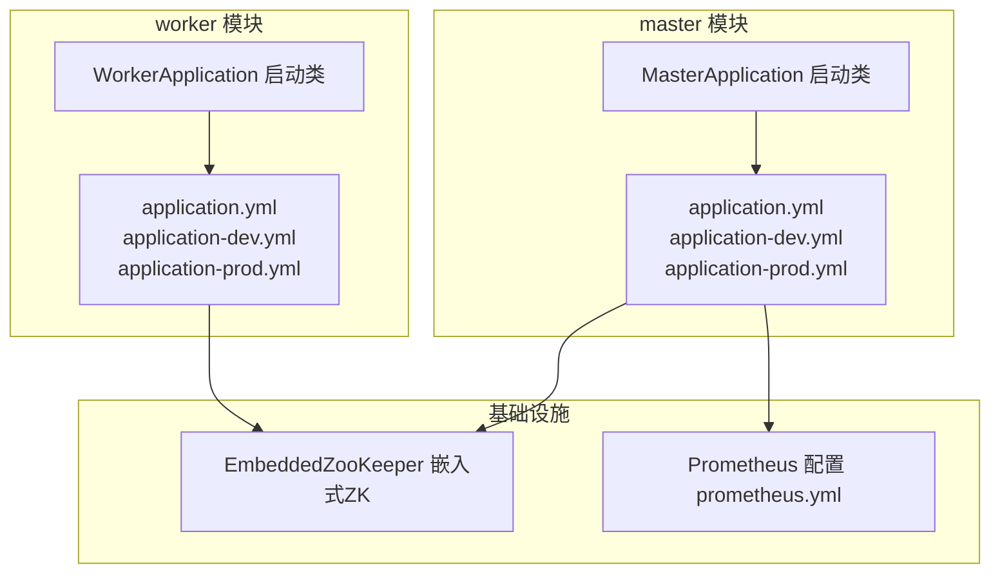
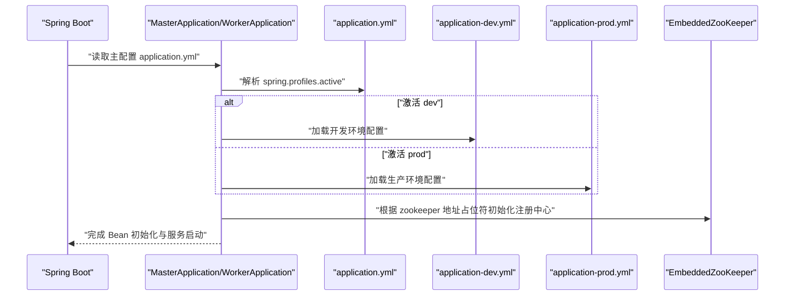
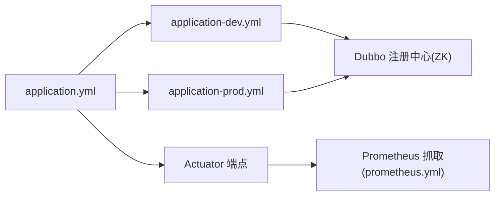

# 环境配置

<cite>
**本文引用的文件**
- [yun-docker-master/src/main/resources/application.yml](file://yun-docker-master/src/main/resources/application.yml)
- [yun-docker-master/src/main/resources/application-dev.yml](file://yun-docker-master/src/main/resources/application-dev.yml)
- [yun-docker-master/src/main/resources/application-prod.yml](file://yun-docker-master/src/main/resources/application-prod.yml)
- [yun-docker-worker/src/main/resources/application.yml](file://yun-docker-worker/src/main/resources/application.yml)
- [yun-docker-worker/src/main/resources/application-dev.yml](file://yun-docker-worker/src/main/resources/application-dev.yml)
- [yun-docker-worker/src/main/resources/application-prod.yml](file://yun-docker-worker/src/main/resources/application-prod.yml)
- [yun-docker-master/src/main/java/com/lfc/yundocker/MasterApplication.java](file://yun-docker-master/src/main/java/com/lfc/yundocker/MasterApplication.java)
- [yun-docker-worker/src/main/java/com/lfc/yundocker/worker/WorkerApplication.java](file://yun-docker-worker/src/main/java/com/lfc/yundocker/worker/WorkerApplication.java)
- [yun-docker-master/src/main/resources/prometheus.yml](file://yun-docker-master/src/main/resources/prometheus.yml)
- [embedded-zookeeper/src/main/java/com/lfc/zookeeper/EmbeddedZooKeeper.java](file://embedded-zookeeper/src/main/java/com/lfc/zookeeper/EmbeddedZooKeeper.java)
</cite>

## 目录
1. [引言](#引言)
2. [项目结构](#项目结构)
3. [核心组件](#核心组件)
4. [架构总览](#架构总览)
5. [详细组件分析](#详细组件分析)
6. [依赖关系分析](#依赖关系分析)
7. [性能考量](#性能考量)
8. [故障排查指南](#故障排查指南)
9. [结论](#结论)
10. [附录](#附录)

## 引言
本文件系统性解析 yun-docker-backend 项目的多环境配置机制，重点围绕 application.yml 中通过 spring.profiles.active 激活不同环境配置的原理，对比 application-dev.yml 与 application-prod.yml 在数据库连接池、日志级别（开发/生产）、Dubbo 注册中心地址（本地 ZooKeeper vs 生产集群）、Redis 连接、安全密钥等方面的具体差异；并说明 master、worker 两个模块如何加载对应配置文件，以及这些配置项如何影响服务启动行为。最后给出配置修改建议，包括生产环境关闭敏感接口、调整 JVM 堆大小、启用 Prometheus 监控等，并结合实际配置文件说明如何自定义端口、上下文路径、文件上传路径等常用参数。

## 项目结构
- 项目采用多模块结构，包含公共模块、master 主服务、worker 工作节点、API 接口、嵌入式 ZooKeeper 等。
- master 和 worker 模块各自维护独立的 application.yml、application-dev.yml、application-prod.yml，用于按环境加载差异化配置。
- master 模块暴露 Actuator 监控端点，集成 Prometheus；worker 模块同样暴露健康检查与 Prometheus 端点。

图表来源
- [yun-docker-master/src/main/java/com/lfc/yundocker/MasterApplication.java](file://yun-docker-master/src/main/java/com/lfc/yundocker/MasterApplication.java#L1-L25)
- [yun-docker-worker/src/main/java/com/lfc/yundocker/worker/WorkerApplication.java](file://yun-docker-worker/src/main/java/com/lfc/yundocker/worker/WorkerApplication.java#L1-L23)
- [yun-docker-master/src/main/resources/application.yml](file://yun-docker-master/src/main/resources/application.yml#L1-L60)
- [yun-docker-worker/src/main/resources/application.yml](file://yun-docker-worker/src/main/resources/application.yml#L1-L51)
- [embedded-zookeeper/src/main/java/com/lfc/zookeeper/EmbeddedZooKeeper.java](file://embedded-zookeeper/src/main/java/com/lfc/zookeeper/EmbeddedZooKeeper.java#L1-L41)
- [yun-docker-master/src/main/resources/prometheus.yml](file://yun-docker-master/src/main/resources/prometheus.yml#L1-L38)

章节来源
- [yun-docker-master/src/main/resources/application.yml](file://yun-docker-master/src/main/resources/application.yml#L1-L60)
- [yun-docker-worker/src/main/resources/application.yml](file://yun-docker-worker/src/main/resources/application.yml#L1-L51)

## 核心组件
- 配置加载机制：Spring Boot 通过 spring.profiles.active 指定当前激活的配置文件后缀（如 dev/prod），框架会合并主配置与对应环境配置，实现“主配置 + 环境配置”的叠加。
- master/worker 启动类：均使用 @SpringBootApplication 启动，不自动引入 Redis 自动配置（通过排除 RedisAutoConfiguration），需要显式启用 Redis 时再移除排除。
- Dubbo 注册中心：通过 zookeeper 地址占位符 ${zookeeper.address:127.0.0.1} 实现本地回环默认值，便于开发环境直接使用本地 ZooKeeper。
- Actuator/监控：master 暴露 health、info、prometheus 端点，便于 Prometheus 抓取指标。

章节来源
- [yun-docker-master/src/main/java/com/lfc/yundocker/MasterApplication.java](file://yun-docker-master/src/main/java/com/lfc/yundocker/MasterApplication.java#L1-L25)
- [yun-docker-worker/src/main/java/com/lfc/yundocker/worker/WorkerApplication.java](file://yun-docker-worker/src/main/java/com/lfc/yundocker/worker/WorkerApplication.java#L1-L23)
- [yun-docker-master/src/main/resources/application.yml](file://yun-docker-master/src/main/resources/application.yml#L1-L60)
- [yun-docker-worker/src/main/resources/application.yml](file://yun-docker-worker/src/main/resources/application.yml#L1-L51)

## 架构总览
下面以序列图展示 master/worker 启动时的配置加载与 Dubbo 注册中心初始化流程。

图表来源
- [yun-docker-master/src/main/resources/application.yml](file://yun-docker-master/src/main/resources/application.yml#L1-L60)
- [yun-docker-worker/src/main/resources/application.yml](file://yun-docker-worker/src/main/resources/application.yml#L1-L51)
- [yun-docker-master/src/main/resources/application-dev.yml](file://yun-docker-master/src/main/resources/application-dev.yml#L1-L81)
- [yun-docker-master/src/main/resources/application-prod.yml](file://yun-docker-master/src/main/resources/application-prod.yml#L1-L82)
- [embedded-zookeeper/src/main/java/com/lfc/zookeeper/EmbeddedZooKeeper.java](file://embedded-zookeeper/src/main/java/com/lfc/zookeeper/EmbeddedZooKeeper.java#L1-L41)

## 详细组件分析

### application.yml 中的 spring.profiles.active 激活机制
- master/worker 的 application.yml 中均设置 spring.profiles.active: dev，表示默认激活开发环境配置。
- 当切换到生产环境时，可通过外部方式（如 JVM 参数或环境变量）覆盖该值，从而加载 application-prod.yml。
- Spring Boot 的配置优先级遵循“主配置 + 环境配置”的叠加策略，后者会覆盖前者同名键值。

章节来源
- [yun-docker-master/src/main/resources/application.yml](file://yun-docker-master/src/main/resources/application.yml#L16-L18)
- [yun-docker-worker/src/main/resources/application.yml](file://yun-docker-worker/src/main/resources/application.yml#L13-L15)

### master 模块配置差异对比（dev vs prod）
- 数据库连接池
  - 两者均保留了数据库连接参数占位，但未启用具体连接池配置（未见 HikariCP 或 Druid 相关键）。生产环境应补充连接池参数以提升稳定性与性能。
- 日志级别
  - 开发环境：MyBatis SQL 日志开启（StdOutImpl），便于调试。
  - 生产环境：MyBatis SQL 日志关闭（NoLoggingImpl），降低日志开销与敏感信息泄露风险。
- Dubbo 注册中心
  - 两者均使用 zookeeper 地址占位符 ${zookeeper.address:127.0.0.1}，默认指向本地回环地址。生产环境应替换为真实集群地址。
- Redis 连接
  - 两者均保留了 Redis 配置注释与占位，未启用。生产环境启用分布式会话或缓存时，需取消注释并填写正确地址与认证信息。
- 安全密钥
  - 两者均保留了第三方支付与微信配置的占位，未启用。生产环境务必替换为真实密钥与回调地址。

章节来源
- [yun-docker-master/src/main/resources/application-dev.yml](file://yun-docker-master/src/main/resources/application-dev.yml#L10-L12)
- [yun-docker-master/src/main/resources/application-prod.yml](file://yun-docker-master/src/main/resources/application-prod.yml#L10-L12)
- [yun-docker-master/src/main/resources/application-dev.yml](file://yun-docker-master/src/main/resources/application-dev.yml#L36-L38)
- [yun-docker-master/src/main/resources/application-prod.yml](file://yun-docker-master/src/main/resources/application-prod.yml#L36-L39)

### worker 模块配置差异对比（dev vs prod）
- Docker 服务端 URL
  - 开发环境：指向本地 Docker TCP 端口（tcp://192.168.254.128:2375），便于本地容器操作。
  - 生产环境：同样保留占位，需替换为生产 Docker 主机地址。
- Dubbo 注册中心
  - 与 master 类似，使用 zookeeper 地址占位符，默认本地回环。
- Redis/Elasticsearch
  - 两者均保留注释与占位，未启用。生产环境启用缓存或搜索引擎时，需取消注释并填写正确地址与认证信息。

章节来源
- [yun-docker-worker/src/main/resources/application-dev.yml](file://yun-docker-worker/src/main/resources/application-dev.yml#L3-L6)
- [yun-docker-worker/src/main/resources/application-prod.yml](file://yun-docker-worker/src/main/resources/application-prod.yml#L3-L6)
- [yun-docker-worker/src/main/resources/application-dev.yml](file://yun-docker-worker/src/main/resources/application-dev.yml#L8-L10)
- [yun-docker-worker/src/main/resources/application-prod.yml](file://yun-docker-worker/src/main/resources/application-prod.yml#L8-L10)

### 配置项对服务启动行为的影响
- 端口与上下文路径
  - master：server.port=8088，server.servlet.context-path=/api。
  - worker：server.port=8089，server.servlet.context-path=/api。
  - 这些配置直接影响服务监听端口与请求前缀，便于反向代理与多实例部署。
- 文件上传路径
  - 两者均通过 spring.servlet.multipart.max-file-size 控制上传大小，未显式配置上传目录。若需自定义上传目录，可在 application.yml 中新增 multipart 上传路径相关键。
- Actuator/监控
  - master 暴露 health、info、prometheus 端点，便于 Prometheus 抓取指标；worker 同样暴露 health、info、prometheus 端点。
- Dubbo 协议与注册中心
  - 两者均使用 Dubbo 协议，端口设为 -1（由服务端动态分配），注册中心地址通过占位符指向本地 ZooKeeper。生产环境需替换为集群地址。

章节来源
- [yun-docker-master/src/main/resources/application.yml](file://yun-docker-master/src/main/resources/application.yml#L34-L41)
- [yun-docker-worker/src/main/resources/application.yml](file://yun-docker-worker/src/main/resources/application.yml#L31-L40)
- [yun-docker-master/src/main/resources/application.yml](file://yun-docker-master/src/main/resources/application.yml#L51-L59)
- [yun-docker-worker/src/main/resources/application.yml](file://yun-docker-worker/src/main/resources/application.yml#L41-L50)

### 配置加载顺序与覆盖规则
- 加载顺序：application.yml（主配置） + application-{profile}.yml（环境配置）。
- 覆盖规则：环境配置中的同名键会覆盖主配置中的同名键。
- 示例：spring.profiles.active=prod 时，application-prod.yml 中的 mybatis-plus.configuration.log-impl 会覆盖 application.yml 中的驼峰映射等配置。

章节来源
- [yun-docker-master/src/main/resources/application.yml](file://yun-docker-master/src/main/resources/application.yml#L16-L18)
- [yun-docker-master/src/main/resources/application-dev.yml](file://yun-docker-master/src/main/resources/application-dev.yml#L36-L38)
- [yun-docker-master/src/main/resources/application-prod.yml](file://yun-docker-master/src/main/resources/application-prod.yml#L36-L39)

### 启动类与配置加载的关系
- 启动类通过 @SpringBootApplication 启动，不自动引入 Redis 自动配置（排除了 RedisAutoConfiguration），需要启用 Redis 时再移除排除。
- 启动类同时启用 Dubbo、WebSocket、定时任务与 AOP，确保配置加载后能正确初始化相关 Bean。

章节来源
- [yun-docker-master/src/main/java/com/lfc/yundocker/MasterApplication.java](file://yun-docker-master/src/main/java/com/lfc/yundocker/MasterApplication.java#L1-L25)
- [yun-docker-worker/src/main/java/com/lfc/yundocker/worker/WorkerApplication.java](file://yun-docker-worker/src/main/java/com/lfc/yundocker/worker/WorkerApplication.java#L1-L23)

## 依赖关系分析
- master/worker 通过 application.yml 的 spring.profiles.active 决定加载 dev 或 prod 配置。
- Dubbo 注册中心地址通过 zookeeper 地址占位符实现本地默认值与生产替换。
- Prometheus 监控通过 application.yml 的 management 暴露端点，prometheus.yml 配置抓取目标与标签。

图表来源
- [yun-docker-master/src/main/resources/application.yml](file://yun-docker-master/src/main/resources/application.yml#L1-L60)
- [yun-docker-worker/src/main/resources/application.yml](file://yun-docker-worker/src/main/resources/application.yml#L1-L51)
- [yun-docker-master/src/main/resources/application-dev.yml](file://yun-docker-master/src/main/resources/application-dev.yml#L10-L12)
- [yun-docker-master/src/main/resources/application-prod.yml](file://yun-docker-master/src/main/resources/application-prod.yml#L10-L12)
- [yun-docker-master/src/main/resources/prometheus.yml](file://yun-docker-master/src/main/resources/prometheus.yml#L1-L38)

## 性能考量
- 生产环境建议：
  - 启用连接池（如 HikariCP）并合理设置连接数、超时与空闲回收策略。
  - 关闭 MyBatis SQL 日志，避免生产环境日志风暴。
  - 使用生产级 Redis 集群与持久化策略，启用分布式会话时需配置 Redis。
  - 合理设置 JVM 堆大小与 GC 参数，结合容器资源限制进行调优。
  - 启用 Prometheus 监控并配置告警规则，定期巡检关键指标。

[本节为通用建议，无需引用具体文件]

## 故障排查指南
- 端口冲突
  - master/worker 分别监听 8088/8089，若宿主机端口被占用，需调整 server.port。
- 上下文路径不一致
  - 若反向代理或网关未匹配 /api 前缀，会导致接口 404。请核对 server.servlet.context-path。
- Dubbo 注册中心不可达
  - 检查 zookeeper 地址占位符是否被正确替换为生产集群地址；确认网络连通性与防火墙策略。
- Redis 未启用导致功能异常
  - 若业务依赖 Redis（如分布式会话、缓存），需取消注释并填写正确的 host/port/password。
- Actuator/监控无法访问
  - 确认 management.endpoints.web.exposure.include 包含 prometheus；核对 Prometheus 抓取地址与端口。

章节来源
- [yun-docker-master/src/main/resources/application.yml](file://yun-docker-master/src/main/resources/application.yml#L34-L41)
- [yun-docker-worker/src/main/resources/application.yml](file://yun-docker-worker/src/main/resources/application.yml#L31-L40)
- [yun-docker-master/src/main/resources/application.yml](file://yun-docker-master/src/main/resources/application.yml#L51-L59)
- [yun-docker-worker/src/main/resources/application.yml](file://yun-docker-worker/src/main/resources/application.yml#L41-L50)

## 结论
- 本项目通过 spring.profiles.active 实现多环境配置的灵活切换，master/worker 各自维护 dev/prod 两套配置，满足开发与生产的差异化需求。
- 开发环境强调可观测性与调试便利（SQL 日志、Swagger），生产环境强调安全性与性能（关闭 SQL 日志、启用连接池与 Redis）。
- Dubbo 注册中心地址通过占位符实现本地默认值与生产替换，Prometheus 监控通过 Actuator 端点与独立配置文件协同工作。
- 建议在生产环境中补齐连接池、Redis、注册中心集群地址与安全密钥，并启用必要的监控与告警。

[本节为总结性内容，无需引用具体文件]

## 附录

### 常用参数自定义指南（基于现有配置文件）
- 自定义端口
  - master：server.port=8088；worker：server.port=8089。
- 自定义上下文路径
  - master：server.servlet.context-path=/api；worker：server.servlet.context-path=/api。
- 自定义文件上传路径
  - 两者均通过 spring.servlet.multipart.max-file-size 控制大小，未显式配置上传目录。可在 application.yml 中新增 multipart 上传路径相关键（例如 spring.servlet.multipart.location）以自定义上传目录。
- 自定义 Dubbo 注册中心地址
  - 将 zookeeper 地址占位符替换为生产集群地址，确保网络可达与权限配置正确。
- 启用 Redis
  - 取消注释 Redis 配置并填写 host/port/password；同时在启动类中移除 Redis 自动配置排除，以启用 Redis 相关 Bean。
- 启用 Prometheus 监控
  - 确认 management.endpoints.web.exposure.include 包含 prometheus；核对 prometheus.yml 中抓取目标与标签，确保 Prometheus 能成功抓取指标。

章节来源
- [yun-docker-master/src/main/resources/application.yml](file://yun-docker-master/src/main/resources/application.yml#L34-L41)
- [yun-docker-worker/src/main/resources/application.yml](file://yun-docker-worker/src/main/resources/application.yml#L31-L40)
- [yun-docker-master/src/main/resources/application-dev.yml](file://yun-docker-master/src/main/resources/application-dev.yml#L10-L12)
- [yun-docker-master/src/main/resources/application-prod.yml](file://yun-docker-master/src/main/resources/application-prod.yml#L10-L12)
- [yun-docker-master/src/main/resources/application.yml](file://yun-docker-master/src/main/resources/application.yml#L51-L59)
- [yun-docker-worker/src/main/resources/application.yml](file://yun-docker-worker/src/main/resources/application.yml#L41-L50)
- [yun-docker-master/src/main/java/com/lfc/yundocker/MasterApplication.java](file://yun-docker-master/src/main/java/com/lfc/yundocker/MasterApplication.java#L1-L25)
- [yun-docker-worker/src/main/java/com/lfc/yundocker/worker/WorkerApplication.java](file://yun-docker-worker/src/main/java/com/lfc/yundocker/worker/WorkerApplication.java#L1-L23)
- [yun-docker-master/src/main/resources/prometheus.yml](file://yun-docker-master/src/main/resources/prometheus.yml#L1-L38)