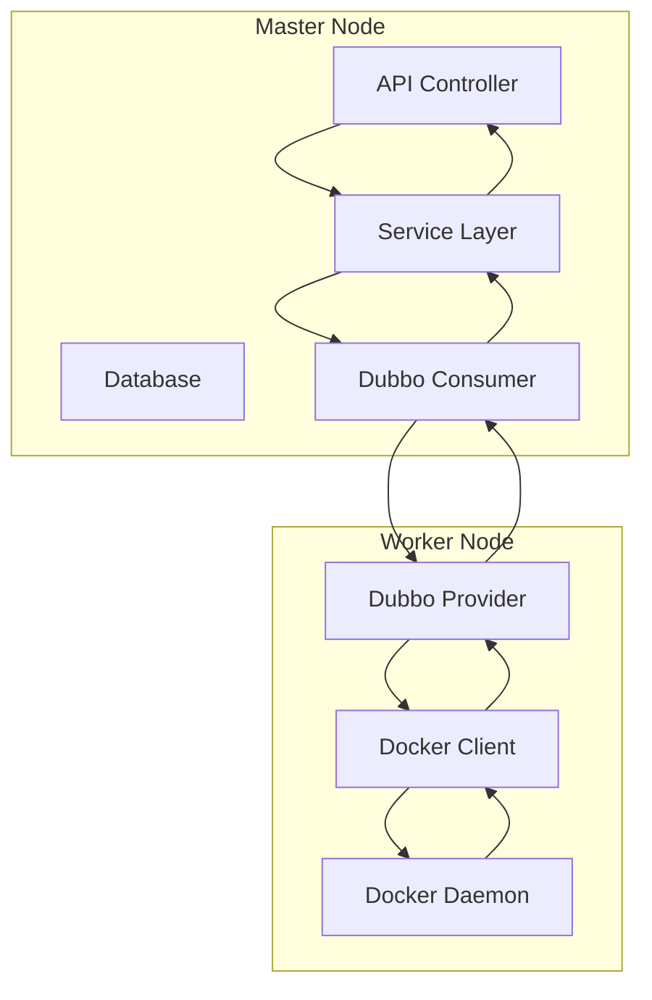
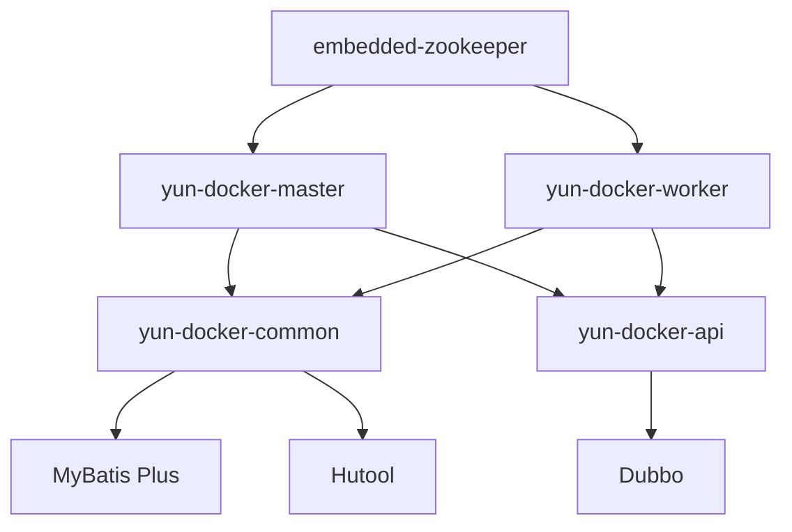
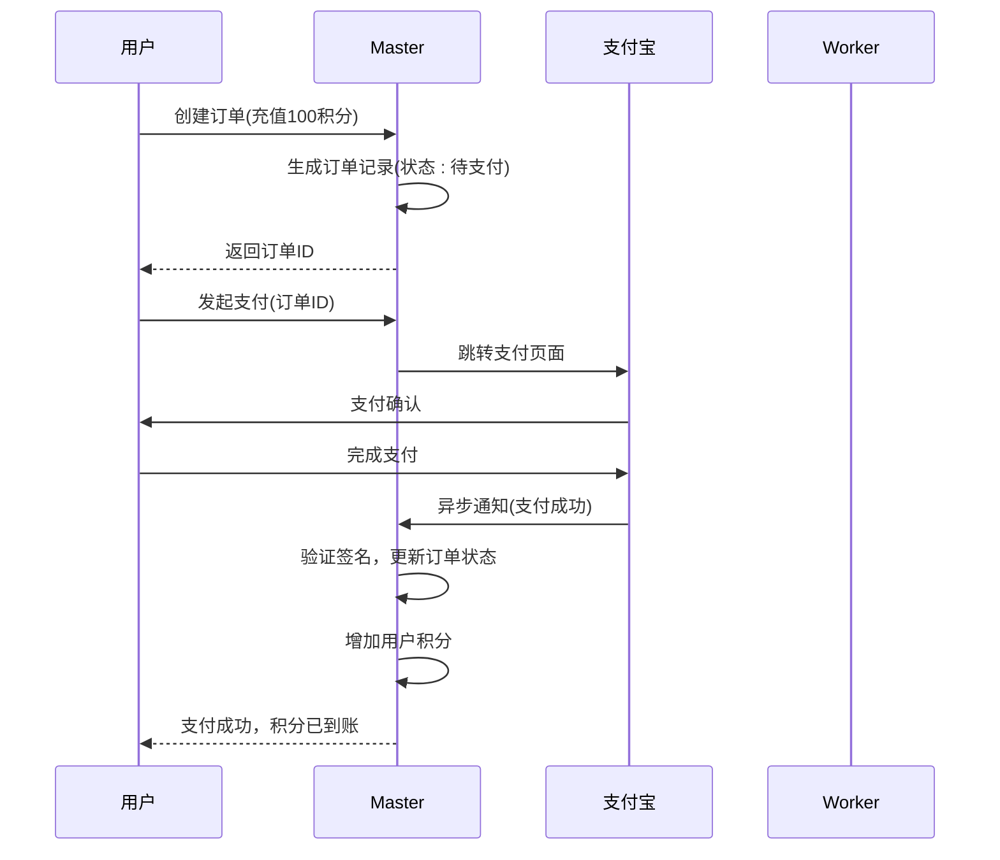
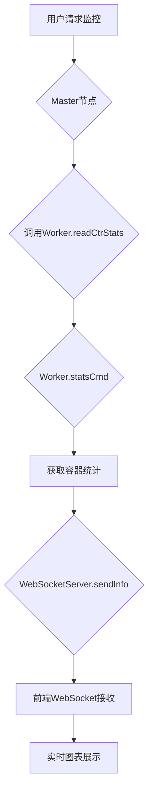

# 项目概述

<cite>
**本文档引用的文件**  
- [README.md](file://README.md)
- [doc/云Docker项目笔记.md](file://doc/云Docker项目笔记.md)
- [pom.xml](file://pom.xml)
- [yun-docker-master/src/main/java/com/lfc/yundocker/MasterApplication.java](file://yun-docker-master/src/main/java/com/lfc/yundocker/MasterApplication.java)
- [yun-docker-worker/src/main/java/com/lfc/yundocker/worker/WorkerApplication.java](file://yun-docker-worker/src/main/java/com/lfc/yundocker/worker/WorkerApplication.java)
- [yun-docker-common/src/main/java/com/lfc/yundocker/common/constant/CommonConstant.java](file://yun-docker-common/src/main/java/com/lfc/yundocker/common/constant/CommonConstant.java)
- [yun-docker-api/src/main/java/com/lfc/yundocker/service/RpcDockerService.java](file://yun-docker-api/src/main/java/com/lfc/yundocker/service/RpcDockerService.java)
- [yun-docker-master/src/main/java/com/lfc/yundocker/controller/ContainerController.java](file://yun-docker-master/src/main/java/com/lfc/yundocker/controller/ContainerController.java)
- [yun-docker-worker/src/main/java/com/lfc/yundocker/worker/rpc/RpcDockerServiceImpl.java](file://yun-docker-worker/src/main/java/com/lfc/yundocker/worker/rpc/RpcDockerServiceImpl.java)
- [sql/create_table.sql](file://sql/create_table.sql)
- [yun-docker-master/src/main/resources/application.yml](file://yun-docker-master/src/main/resources/application.yml)
- [yun-docker-worker/src/main/resources/application.yml](file://yun-docker-worker/src/main/resources/application.yml)
- [yun-docker-master/src/main/java/com/lfc/yundocker/manager/AlipayTemplate.java](file://yun-docker-master/src/main/java/com/lfc/yundocker/manager/AlipayTemplate.java)
- [yun-docker-master/src/main/java/com/lfc/yundocker/controller/AliPayController.java](file://yun-docker-master/src/main/java/com/lfc/yundocker/controller/AliPayController.java)
- [yun-docker-master/src/main/java/com/lfc/yundocker/service/impl/YunOrderServiceImpl.java](file://yun-docker-master/src/main/java/com/lfc/yundocker/service/impl/YunOrderServiceImpl.java)
- [yun-docker-master/src/main/java/com/lfc/yundocker/service/impl/UserServiceImpl.java](file://yun-docker-master/src/main/java/com/lfc/yundocker/service/impl/UserServiceImpl.java)
- [yun-docker-master/src/main/java/com/lfc/yundocker/common/model/dto/CtrRunRequest.java](file://yun-docker-master/src/main/java/com/lfc/yundocker/common/model/dto/CtrRunRequest.java)
- [yun-docker-master/src/main/java/com/lfc/yundocker/common/model/entity/YunOrder.java](file://yun-docker-master/src/main/java/com/lfc/yundocker/common/model/entity/YunOrder.java)
- [yun-docker-master/src/main/java/com/lfc/yundocker/controller/UserController.java](file://yun-docker-master/src/main/java/com/lfc/yundocker/controller/UserController.java)
- [yun-docker-master/src/main/java/com/lfc/yundocker/config/WebsocketConfig.java](file://yun-docker-master/src/main/java/com/lfc/yundocker/config/WebsocketConfig.java)
- [yun-docker-worker/src/main/java/com/lfc/yundocker/worker/websocket/WebSocketServer.java](file://yun-docker-worker/src/main/java/com/lfc/yundocker/worker/websocket/WebSocketServer.java)
</cite>

## 目录

1. [项目背景与核心目标](#项目背景与核心目标)  
2. [系统架构设计](#系统架构设计)  
3. [功能边界与核心用例](#功能边界与核心用例)  
4. [模块职责划分与协作关系](#模块职责划分与协作关系)  
5. [主从节点通信机制](#主从节点通信机制)  
6. [用户积分与商业化运营](#用户积分与商业化运营)  
7. [实时日志监控实现](#实时日志监控实现)  
8. [数据库设计](#数据库设计)  
9. [启动与验证流程](#启动与验证流程)  
10. [关键设计思考](#关键设计思考)

## 项目背景与核心目标

yun-docker-backend项目起源于华南农业大学的虚拟云实验平台，旨在为开发者提供一个基于Docker的Web应用部署平台。该项目解决了传统服务器部署中资源消耗大、配置复杂的问题，允许用户通过简单的操作快速部署自己的Web项目。

其核心目标是构建一个支持容器全生命周期管理的微服务后端系统，用户可以将自己的项目打包成Docker镜像，并在平台上拉取镜像、创建容器。创建和运行容器会消耗用户的积分，当积分耗尽时，用户可通过平台进行充值，从而实现商业化运营能力。

该平台主要功能包括：拉取/查看/删除镜像，创建/重启/停止/启动/删除/查看容器，查看容器日志，监控容器实时参数，积分充值，订单管理以及支付宝沙箱支付等。

**Section sources**  
- [README.md](file://README.md#L1-L7)  
- [doc/云Docker项目笔记.md](file://doc/云Docker项目笔记.md#L1-L7)

## 系统架构设计

yun-docker-backend采用主从（Master-Worker）架构设计，基于Spring Boot构建的微服务系统。整个系统分为两个核心节点：master节点和worker节点，通过Dubbo RPC框架实现远程通信。

- **Master节点**：负责处理所有业务逻辑、用户认证、API暴露、订单管理、数据库操作等。它不直接执行Docker命令，而是作为控制中心协调worker节点完成具体任务。
- **Worker节点**：负责执行实际的Docker操作，如拉取镜像、创建容器、启动/停止容器、查看日志等。它通过Docker Java客户端与Docker守护进程交互，并将结果返回给master节点。

这种架构设计实现了职责分离，master节点专注于业务逻辑和安全性，而worker节点专注于资源操作，提高了系统的可维护性和安全性。

**Diagram sources**  
- [yun-docker-master/src/main/java/com/lfc/yundocker/MasterApplication.java](file://yun-docker-master/src/main/java/com/lfc/yundocker/MasterApplication.java#L1-L25)  
- [yun-docker-worker/src/main/java/com/lfc/yundocker/worker/WorkerApplication.java](file://yun-docker-worker/src/main/java/com/lfc/yundocker/worker/WorkerApplication.java#L1-L23)  
- [pom.xml](file://pom.xml#L37-L42)

## 功能边界与核心用例

系统定义了清晰的功能边界，涵盖用户管理、容器/镜像操作、支付集成、日志监控等多个核心用例。

### 用户管理
- 用户注册与登录
- 用户信息查询与更新
- 获取用户积分余额

### 容器与镜像操作
- 拉取Docker镜像（pullImage）
- 删除镜像（removeImage）
- 创建并运行容器（runCtr）
- 启动/停止/重启/删除容器
- 查看所有容器列表
- 查看容器实时资源使用情况（CPU、内存、网络）

### 支付与订单管理
- 创建充值订单
- 支付宝沙箱支付
- 订单状态查询
- 支付结果异步通知处理

### 日志与监控
- 实时查看容器日志
- 通过WebSocket推送容器资源监控数据
- Prometheus指标暴露用于系统监控

这些功能通过RESTful API暴露给前端，同时利用WebSocket实现服务端主动推送能力，提升用户体验。

**Section sources**  
- [README.md](file://README.md#L4-L6)  
- [yun-docker-master/src/main/java/com/lfc/yundocker/controller/ContainerController.java](file://yun-docker-master/src/main/java/com/lfc/yundocker/controller/ContainerController.java#L1-L173)  
- [yun-docker-api/src/main/java/com/lfc/yundocker/service/RpcDockerService.java](file://yun-docker-api/src/main/java/com/lfc/yundocker/service/RpcDockerService.java#L1-L143)

## 模块职责划分与协作关系

项目采用Maven多模块结构，各模块职责明确，协同工作。

### yun-docker-master
主节点应用，包含：
- **Controller层**：接收HTTP请求，如`ContainerController`处理容器相关API
- **Service层**：实现业务逻辑，如`YunContainerServiceImpl`调用RPC服务操作容器
- **Mapper层**：MyBatis Plus数据访问接口
- **配置类**：包括Dubbo、WebSocket、跨域等配置

### yun-docker-worker
工作节点应用，包含：
- **Rpc服务实现**：`RpcDockerServiceImpl`实现`RpcDockerService`接口，执行Docker操作
- **WebSocket服务**：`WebSocketServer`用于向客户端推送容器监控数据
- **Docker客户端配置**：`DockerClientConfig`初始化Docker连接

### yun-docker-api
定义Dubbo RPC远程调用接口，如`RpcDockerService`，供master调用worker。

### yun-docker-common
公共模块，包含：
- 常量定义（如`CommonConstant`）
- 通用异常处理（`BusinessException`）
- 数据传输对象DTO（如`CtrRunRequest`）
- 工具类（如`ResultUtils`）

### embedded-zookeeper
内嵌ZooKeeper服务，作为Dubbo的注册中心，管理服务发现。

各模块通过Maven依赖关系组织，master和worker依赖common和api模块，确保代码复用和接口一致性。

**Diagram sources**  
- [pom.xml](file://pom.xml#L18-L24)  
- [yun-docker-common/src/main/java/com/lfc/yundocker/common/constant/CommonConstant.java](file://yun-docker-common/src/main/java/com/lfc/yundocker/common/constant/CommonConstant.java#L1-L364)  
- [yun-docker-api/src/main/java/com/lfc/yundocker/service/RpcDockerService.java](file://yun-docker-api/src/main/java/com/lfc/yundocker/service/RpcDockerService.java#L1-L143)

## 主从节点通信机制

系统采用Dubbo作为RPC框架，实现master与worker之间的高效通信。

### 通信流程
1. Master节点通过Dubbo Consumer调用`RpcDockerService`接口
2. Dubbo通过ZooKeeper注册中心发现Worker节点的服务提供者
3. Worker节点的`RpcDockerServiceImpl`接收请求并执行Docker操作
4. 执行结果通过Dubbo返回给Master节点

### 配置说明
- Master配置：`dubbo.application.name=yun-docker-master`
- Worker配置：`dubbo.application.name=yun-docker-worker`
- 两者均连接同一ZooKeeper实例进行服务注册与发现

### 接口定义
`RpcDockerService`接口定义了所有Docker操作方法，如`pullImage`、`runCtr`、`logCtr`等，确保master与worker之间的契约清晰。

这种设计使得master无需关心Docker环境的具体实现，只需调用标准化接口，提升了系统的可扩展性和安全性。

**Section sources**  
- [pom.xml](file://pom.xml#L37-L42)  
- [yun-docker-master/src/main/resources/application.yml](file://yun-docker-master/src/main/resources/application.yml#L3-L12)  
- [yun-docker-worker/src/main/resources/application.yml](file://yun-docker-worker/src/main/resources/application.yml#L3-L9)  
- [yun-docker-api/src/main/java/com/lfc/yundocker/service/RpcDockerService.java](file://yun-docker-api/src/main/java/com/lfc/yundocker/service/RpcDockerService.java#L1-L143)

## 用户积分与商业化运营

系统通过用户积分机制实现商业化运营，积分与容器资源消耗直接关联。

### 积分模型
- 新用户注册赠送1000积分
- 创建容器消耗积分（具体消耗逻辑在业务层控制）
- 积分不足时无法创建新容器
- 用户可通过支付宝充值购买积分

### 订单系统
- `YunOrder`实体表示充值订单，包含订单ID、积分数量、支付金额、状态等字段
- 订单状态：0-待支付，1-支付成功，2-支付失败，3-已取消
- 使用雪花算法生成唯一订单ID，避免冲突

### 支付集成
- 集成支付宝沙箱支付，使用`AlipayTemplate`封装支付逻辑
- `AliPayController`提供`/alipay/pay`接口发起支付
- `/alipay/notify`接收支付宝异步通知，更新订单状态并增加用户积分

### 余额更新
- `UserServiceImpl.updateBalance`方法用于更新用户余额
- 支付成功后，系统自动为用户增加相应积分

该机制实现了完整的商业化闭环，从订单创建、支付到资源发放的全流程自动化。

**Diagram sources**  
- [yun-docker-master/src/main/java/com/lfc/yundocker/manager/AlipayTemplate.java](file://yun-docker-master/src/main/java/com/lfc/yundocker/manager/AlipayTemplate.java#L1-L107)  
- [yun-docker-master/src/main/java/com/lfc/yundocker/controller/AliPayController.java](file://yun-docker-master/src/main/java/com/lfc/yundocker/controller/AliPayController.java#L1-L79)  
- [yun-docker-master/src/main/java/com/lfc/yundocker/service/impl/YunOrderServiceImpl.java](file://yun-docker-master/src/main/java/com/lfc/yundocker/service/impl/YunOrderServiceImpl.java#L32-L73)  
- [yun-docker-master/src/main/java/com/lfc/yundocker/service/impl/UserServiceImpl.java](file://yun-docker-master/src/main/java/com/lfc/yundocker/service/impl/UserServiceImpl.java#L64-L96)

## 实时日志监控实现

系统通过WebSocket实现实时日志和容器监控数据的推送。

### 日志查看流程
1. 用户请求查看某容器日志
2. Master调用Worker的`logCtr`方法
3. Worker通过Docker Java Client获取日志流
4. 日志内容写入临时文件
5. 文件内容以字节数组形式返回给Master
6. Master将日志内容返回给前端

### 实时监控
- Worker的`readCtrStats`方法持续读取容器的统计信息（CPU、内存、网络等）
- 数据通过`WebSocketServer.sendInfo`推送给指定用户
- 前端通过WebSocket连接实时接收并展示监控图表

### 配置
- Master和Worker均启用WebSocket支持（`@EnableWebSocket`）
- 使用`WebSocketServer`作为服务端点处理连接和消息推送

该设计避免了前端频繁轮询，降低了服务器压力，提升了实时性。

**Diagram sources**  
- [yun-docker-worker/src/main/java/com/lfc/yundocker/worker/rpc/RpcDockerServiceImpl.java](file://yun-docker-worker/src/main/java/com/lfc/yundocker/worker/rpc/RpcDockerServiceImpl.java#L195-L259)  
- [yun-docker-worker/src/main/java/com/lfc/yundocker/worker/websocket/WebSocketServer.java](file://yun-docker-worker/src/main/java/com/lfc/yundocker/worker/websocket/WebSocketServer.java)  
- [yun-docker-master/src/main/java/com/lfc/yundocker/config/WebsocketConfig.java](file://yun-docker-master/src/main/java/com/lfc/yundocker/config/WebsocketConfig.java)

## 数据库设计

系统使用MySQL数据库，主要包含以下数据表：

### 用户表 (user)
- id: 主键
- user_account: 账号（唯一）
- user_password: 加密密码
- balance: 积分余额（默认1000）
- user_role: 角色（user/admin/ban）

### 镜像表 (yun_image)
- repository: 镜像名称
- tag: 版本标签
- image_id: 镜像ID
- user_id: 创建者ID
- port: 对外端口

### 容器表 (yun_container)
- image_id: 镜像ID
- user_id: 创建者ID
- container_id: 容器ID
- status: 容器状态
- ports: 端口映射

### 订单表 (yun_order)
- buyer_id: 用户ID
- order_id: 订单ID（雪花算法生成）
- credit: 充值积分
- money: 支付金额
- status: 订单状态

所有表均包含`create_time`和`update_time`字段，容器和镜像表支持逻辑删除。

**Section sources**  
- [sql/create_table.sql](file://sql/create_table.sql#L1-L87)  
- [yun-docker-master/src/main/java/com/lfc/yundocker/common/model/entity/YunOrder.java](file://yun-docker-master/src/main/java/com/lfc/yundocker/common/model/entity/YunOrder.java#L1-L76)

## 启动与验证流程

### 启动步骤
1. 启动内嵌ZooKeeper：`EmbeddedZooKeeper.main()`
2. 启动Worker节点：`WorkerApplication.main()`
3. 启动Master节点：`MasterApplication.main()`

### 功能验证示例
1. **用户注册**：调用`/user/register`创建新用户
2. **创建订单**：调用`/order/create`生成充值订单
3. **支付订单**：访问`/alipay/pay?orderId=xxx`跳转支付宝支付
4. **拉取镜像**：调用`/image/pull`拉取指定镜像
5. **创建容器**：调用`/container/run`创建容器（消耗积分）
6. **查看日志**：访问`/container/downloadLog?containerId=xxx`下载日志

### 配置说明
- Master默认端口：8088
- Worker默认端口：8089
- API路径：`/api`
- 支付宝回调地址：`http://127.0.0.1:8088/api/alipay/notify`

**Section sources**  
- [yun-docker-master/src/main/resources/application.yml](file://yun-docker-master/src/main/resources/application.yml#L33-L37)  
- [yun-docker-worker/src/main/resources/application.yml](file://yun-docker-worker/src/main/resources/application.yml#L31-L35)  
- [yun-docker-master/src/main/java/com/lfc/yundocker/controller/OrderController.java](file://yun-docker-master/src/main/java/com/lfc/yundocker/controller/OrderController.java#L66-L105)  
- [yun-docker-master/src/main/java/com/lfc/yundocker/controller/ContainerController.java](file://yun-docker-master/src/main/java/com/lfc/yundocker/controller/ContainerController.java#L117-L132)

## 关键设计思考

根据项目笔记和代码实现，系统包含以下关键设计决策：

1. **主从分离架构**：将业务逻辑与Docker操作分离，提高安全性和可维护性，避免master节点直接暴露Docker守护进程。
2. **Dubbo RPC通信**：选择Dubbo作为微服务框架，利用其成熟的服务注册、负载均衡和容错机制。
3. **WebSocket实时推送**：使用WebSocket替代轮询，实现实时监控数据推送，降低网络开销。
4. **积分消耗模型**：通过积分机制控制资源使用，实现商业化运营，同时防止资源滥用。
5. **支付宝沙箱集成**：使用沙箱环境进行支付测试，确保生产环境支付安全可靠。
6. **内嵌ZooKeeper**：简化部署，避免外部依赖，便于开发和测试。
7. **临时日志文件**：Worker将容器日志写入临时文件再返回，避免内存溢出，支持大日志文件传输。

这些设计体现了对系统性能、安全性、可维护性和商业价值的综合考量。

**Section sources**  
- [doc/云Docker项目笔记.md](file://doc/云Docker项目笔记.md#L1-L35)  
- [pom.xml](file://pom.xml)  
- [yun-docker-master/src/main/resources/prometheus.yml](file://yun-docker-master/src/main/resources/prometheus.yml)  
- [yun-docker-worker/src/main/java/com/lfc/yundocker/worker/rpc/RpcDockerServiceImpl.java](file://yun-docker-worker/src/main/java/com/lfc/yundocker/worker/rpc/RpcDockerServiceImpl.java#L347-L412)